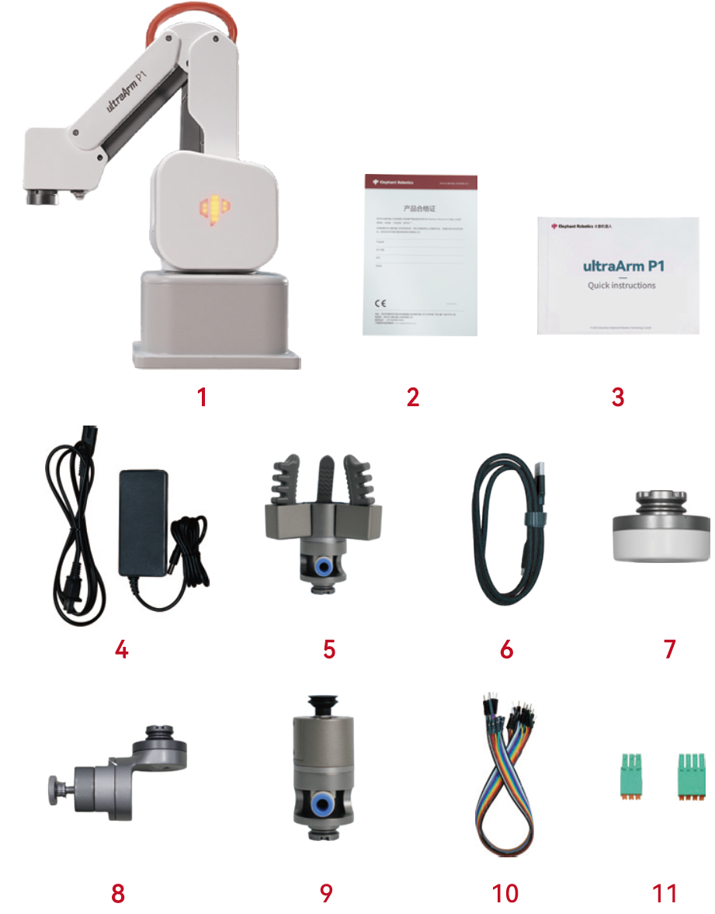

# 产品标准清单

> 感谢您选择大象机器人 ultraArm P1 机械臂，本章节内容旨在帮助您轻松上手大象机器人产品，享受产品带来的每一个精彩瞬间。

## 1. 产品列表图片

## 2. 装箱清单

| 序号 | 名称 | 数量 |
| :--: | :--- | :--: |
| 1 | ultraArm P1 机械臂 | 1 |
| 2 | ultraArm 快换接头 | 1 |
| 3 | ultraArm 气动夹爪 | 1 |
| 4 | ultraArm 垂直吸泵 | 1 |
| 5 | ultraArm 笔夹持器 | 1 |
| 6 | 电源适配器 DC 12V | 1 |
| 7 | USB 连接线 | 1 |
| 8 | 产品合格证 | 1 |
| 9 | 产品画册 | 1 |
| 10 | 杜邦线 | 2 |
| 11 | 3Pin、4Pin 快接端子 | 1 |

**注：** 包装箱到位后，请确认机器人包装完好无损。如有损坏，请及时联系物流公司和您所在地区的供应商。开箱后，请根据物品清单检查箱内的实际物品。

---

[← 上一章](README.md) | [下一章 →](4.2-ProductUnboxingGuide.md)
