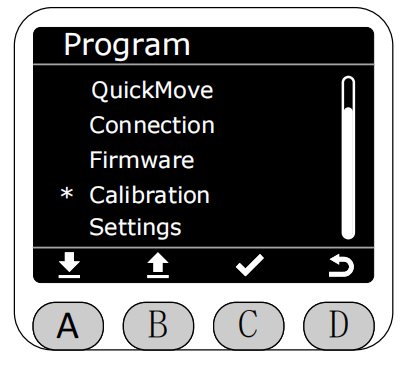
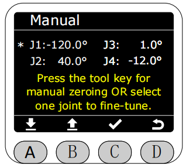
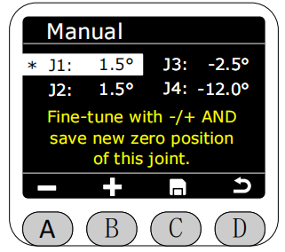

# 零位校准(Calibration)

在Program界面将星号选择为Calibration功能，按下C键进入Calibration功能。

选择Manual进入后，通过A、B键可选择想要校准的关节或者按住末端按钮拖动关节。

选中后,该区域颜色会反转高亮。随后可通过A、B键对选中的关节进行转动操作或者按住末端按钮拖动关节，短按时步距角为0.1°。
运动至想要校准的零位位置后，按下C键进行保存,此时对应的关节会进行自动校准运动，校准完成角度数据会直接变为0°。

[← 上一页](./5.2.6-firmware.md) |[下一页 →](./5.2.8-settings.md)
