# 拖动示教(DragTeach)

在Program界面将星号选择为拖动示教功能。

按下C键进入拖动示教功能。

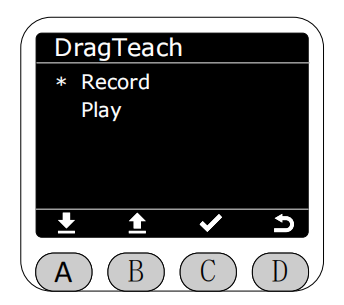

**myStudio Pro中的生产文件夹中是已经发布的轨迹文件，而测试文件夹中的是还未发布的轨迹文件。**

选择Record功能，按下C键进入录制界面，进入时默认为停止状态，此时可以直接退出界面，按下A键即可开始录制，录制时末端灯带为黄色常亮。录制和暂停时不允许保存。**最长的录制时间为120s。**

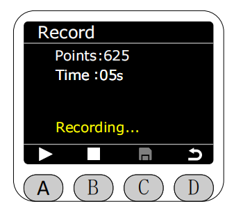

可在录制过程中按下A键暂停录制，此时末端灯带为蓝色常亮。

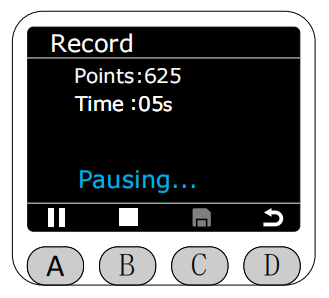

按下B键停止录制，此时末端灯带为绿色常亮。停止录制下后可以按下C键进行保存。

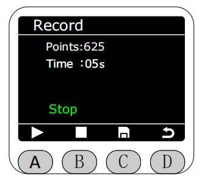

随后界面跳转至保存界面,保存方式可以选保存在RAM或者保存在Flash中。
若保存在RAM中，则机器重启后录制的轨迹文件会丢失。

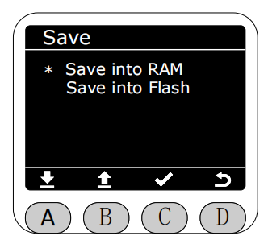

**若保存在Flash中，则机器重启后录制的轨迹文件不会丢失，同时保存在Flash中的轨迹文件可以选择上传至myCobot Pro的测试文件夹中，命名为tpr-1。**

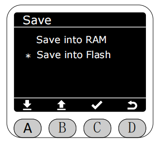

**每一次保存到Flash的文件均为覆盖保存，即只保留最新录制并保存至Flash的轨迹文件，上传至myCobot Pro的文件会以tpr-x的格式命名，x为上传的次数。**

选择保存的路径后,按下C键,会显示正在保存。

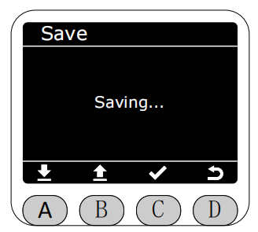

等待约3s后,会显示保存成功的界面。该界面显示约2s后会自动跳转回拖动示教界面。

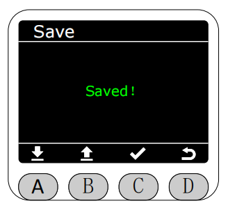

在录制过程中,若录制时间超过最大时长限制或不保存直接退出，会弹出警告界面。此时末端灯带为红灯闪烁，间隔1s。

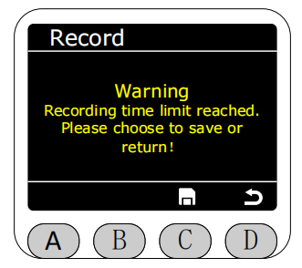

保存轨迹文件后，可在拖动示教(DragTeach)界面中选择Play功能播放最新保存的轨迹文件。

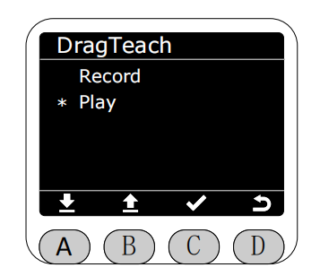

**轨迹的播放默认为无限循环播放。**

播放路径可选择从RAM播放或从Flash播放。

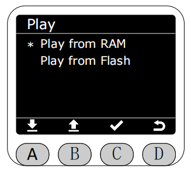

进入播放界面后，按下A键即可开始播放，此时末端灯带为黄灯闪烁，间隔1s。

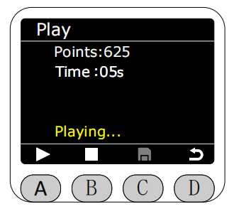

播放状态下再次按下A键可暂停播放，此时灯带为蓝色常亮。

按下B键即可停止播放,此时灯带为绿色常亮。

停止播放后，可选择是否上传至BlocklyRunner，若选择上传，该轨迹文件会存放至myStudio Pro的生产文件夹中，**保存在RAM中的文件无法被上传至myStudio Pro的生产文件夹中，只能在拖动示教界面中播放。保存在Flash中的文件可以被上传至myStudio Pro的生产文件夹中。**

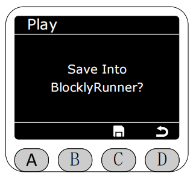

选择保存的路径后,按下C键,会显示正在保存。

等待约3s后,会显示保存成功的界面。该界面显示约2s后会自动跳转回播放界面。

尝试播放轨迹时,当两种播放路径都没有文件可供播放时显示警告,如其一路径没有,另一路径有,点击时也会提示相应的警告。此时末端灯带红灯闪烁，间隔1s

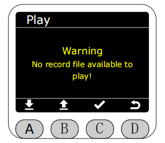

[← 上一页](./5.2.1-home.md) |[下一页 →](./5.2.3-blocklyrunner.md)
