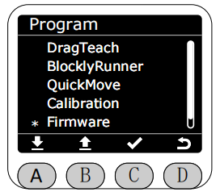
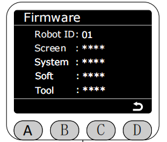

# 版本显示(Firmware)

在Program界面将星号选择为Firmware功能，按下C键进入Firmware功能。

进入Firmware功能后,会显示当前机械臂的所有版本信息。
RobotID对应机械臂的唯一标识符,用于区分不同的机械臂。
Screen对应MiniRobot的版本。
System对应系统版本。
Soft对应myStudio Pro版本+运动控制版本(如: 1.0.1 + 1.0.2 = 1.101.102)。
Tool对应末端版本。

[← 上一页](./5.2.4-quickmove.md) |[下一页 →](./5.2.6-firmware.md)