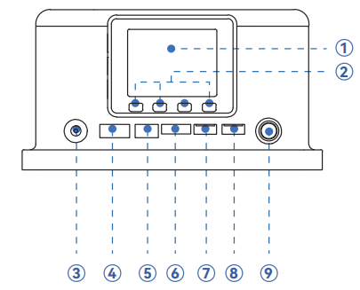
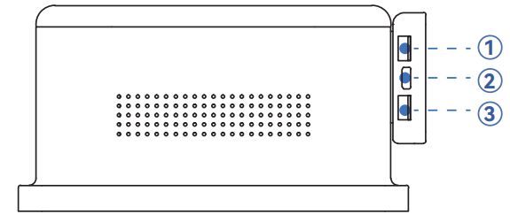
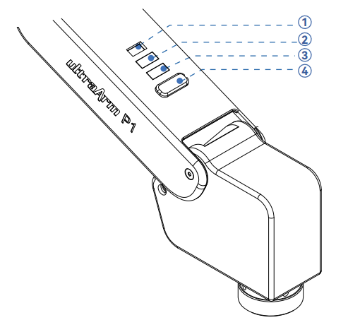

# 机器人参数说明

> 第一章中，我们探讨了产品的卖点及其设计理念，为您提供了对产品高层次理解的全景视角。现在，让我们进入第二章——机器人参数说明。这一章节将是您理解产品技术细节的关键。详细了解这些技术参数，不仅可以帮助您充分认识到我们产品的先进性和实用性，而且还能够确保您能够更有效地利用这些技术来满足您的具体需求。

## 1. 机器人规格参数

| 指标       | 参数 |
| :-----------: | :---------: |
| 名称         | 高精度 4 自由度智能码垛步进机械臂 |
| 型号         | ultraArm P1 |
| 自由度       | 4          |
| 有效负载     | 650g       |
| 工作半径     | 360mm      |
| 重复定位精度 | ±0.1mm (ISO 9283)  |
| 重量         | < 4.5Kg       |
| 电源输入     | DC 12V，8A       |
| 使用寿命     | > 5000h |
| 工作温度     | 0°~50℃     |
| 工作环境湿度 | 5%~80% |
| 通信         | WiFi-2.4G / 蓝牙 2.4G/5G / USB 3.0 / UART / RS485 |
| 通信协议     | TCP/IP-Socket / MODBUS |

---

## 2. 结构尺寸参数
> 本章以毫米为距离单位，以度为角度单位。

### 2.1 产品尺寸

### 2.2 关节运动范围

**硬件限位**

| 关节       | 范围 |
| :--------: | :----------:|
| J1 | -168° ~ +168° |
| J2 | -25° ~ +90° |
| J3 | +85° ~ +205° |
| J4 | -180° ~ +180° |

**软件限位**

| 关节       | 范围 |
| :--------: | :----------:|
| J1 | -158° ~ +158° |
| J2 | -18° ~ +85° |
| J3 | +89° ~ +190° |
| J4 | -179° ~ +179° |

### 2.3 关节最大速度

| 关节       | 最大速度 |
| :--------: | :----------:|
| J1 | 180°/s |
| J2 | 120°/s |
| J3 | 130°/s |
| J4 | 180°/s |

## 3. 机械臂底座接口说明

### 3.1 底座正面图：

  

  - ➀ MiniRobot 控制屏幕
  - ➁ MiniRobot 按钮
  - ➂ 12V 电源：连接电源适配器。
  - ➃ 电机接口：用于连接和控制电机。
  - ➄ 数字限位输入：用于 PNP 三线式光电/接近传感器专用输入。
  - ➅ 3.3V-I/O：提供 3.3V 电源和数字信号接口。
  - ➆ I²C Grove：用于连接 I²C 通信的传感器或模块。
  - ➇ PWM Grove：用于连接舵机等需要 PWM 信号的设备。
  - ➈ 电源开关：按下锁定为开机，再次按下释放为关机。

### 3.2 底座侧面图：

  

  - ➀ RS485 Grove：工业串行通信，抗干扰强，距离远。
  - ➁ Type-C 接口：程序烧录与通信。
  - ➂ UART Grove：串口通信，连接串口设备。

### 3.3 末端执行器接口说明

  

  - ➀ 舵机接口：为末端舵机型执行器（如气动夹爪）提供电源与控制信号。
  - ➁ Grove：支持5V数字逻辑电平输入。
  - ➂ Grove：提供5V数字逻辑电平输出。
  - ➃ 工具按钮：用于机器人应用的功能交互，可自定义按键功能。

## 4. 笛卡尔坐标

* 每个坐标系的定义如下表所示：

| 坐标系 | 定义 |
| :--- | :--- |
| **末端坐标系** |- 原点：末端快接锁头水平面中心点（图内标注：末端中心点）。 X轴：机械臂处于关节零位时，面朝底座开关，水平向前。 Y轴：机械臂处于关节零位时，面朝底座开关，水平向左。 Z轴：机械臂处于关节零位时，面朝底座开关，竖直向上。  |
| **基坐标系** | - 原点：底座底面中心点（图内标注：坐标系原点）。 X轴：面朝底座开关，水平向前。 Y轴：面朝底座开关，水平向左。 Z轴：竖直向上。 |

## 5. 关节坐标系

| 颜色 | 说明         |
| ---- | ------------ |
| 绿色 | 正常执行程序 |
| 蓝色 | 运动学异常   |
| 红色 | 系统报错     |

## 6. 工作范围

### 6.1 工作空间示意图

图示说明：图中环形区域定义了机械臂的3D工作空间，即末端执行器能够到达的所有空间点集合；图中红色箭头定义了机械臂各关节的运动方向。

### 6.2 平面工作范围

- J1可运动角度：±158°
- 最大工作半径：360mm
- 最小工作半径：141mm
- 最高工作半径：258.4mm

---

[← 上一章](../1-ProductIntroduction/1-ProductIntroduction.md) | [下一章 →](../../B-BasicSettings/3-UserNotes/README.md)
