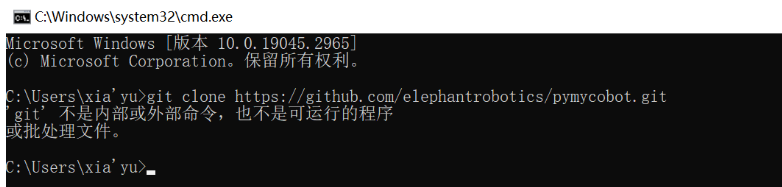

# 其他问题

**Q1：urdf 文件下载路径在哪里？**

- A1：请参考以下路径：https://github.com/elephantrobotics/mycobot_ros/tree/noetic/mycobot_description/urdf

**Q2：关于坐标的理解有更多的解释吗？**

A2：ultraArm P1 为四轴机械臂，控制坐标运动的 API 是 `set_coords([x, y, z, rz], speed)`。

**x、y、z 坐标：** 控制机械臂末端在空间中的位置。改变这些值将使机械臂末端移动到不同的空间位置。

**R 姿态角度：** 控制机械臂末端绕 Z 轴的旋转角度。P1 仅有一个姿态角 rz，范围 -180° ~ 180°。系统内用R来代指rz。

如果你希望更直观地看到变化，建议使用 myBlockly 的快速移动工具，单次调整一个参数，观察末端在空间中的变化。

**Q3：关于 DH 参数的 Offset 有更多的解释吗？Offset 是绕 Z 旋转吗？**

A3：DH 参数描述了机械臂中相邻连杆之间的几何和运动关系。在 DH 参数表中，Offset 参数表示前一个连杆绕其 Z 轴旋转对下一个连杆位置的影响，即连接两个连杆时的偏移量。因此 Offset 不是绕 Z 旋转，而是表示连接两个连杆时的位移量。

**Q4：ultraArm P1 有碰撞检测吗？**

A4：有。ultraArm P1 内置自研碰撞检测功能，运动过程中实时监测机器人状态，毫秒级碰撞响应，检测到碰撞自动刹停，已经集成到设置关节角度及坐标的 API 里。

**Q5：关节扭矩信息提供吗？**

A5：我们公开的是机械臂整体参数，如重复定位精度、电源电压、负载等，不提供电机执行单元的内部扭矩、电压电流等参数信息。

**Q6：下图中的查看两坐标之间的关系怎么理解？**

A6：如果你想查看名为"turtle1"的坐标系相对于名为"turtle2"的坐标系的变换关系，可以使用 `rosrun tf tf_echo` 指令。通俗来说，当你运行这个命令时，它会告诉你一个物体（"turtle1"）相对于另一个物体（"turtle2"）的位置和方向信息，就像在地图上你可以知道一个城市相对于另一个城市的位置一样。

**Q7：ROS2 的环境被不小心改动，我可以直接删掉 ROS，自己重新安装吗？**

A7：关于 ROS 重新安装，我们不建议用户自己重新安装，因为 ROS 环境的搭建相对复杂，容易出错。如果需要重置 ROS 环境，建议重新刷写系统镜像，具体方法请参考 [基于 ROS2 开发使用](../../C-FunctionsAndApplications/6-SoftwareDevelopment/6.3-ROS2/README.md)。

**Q8：API 和串口指令直接控制关节有什么区别？**

A8：API 提供了简化、抽象化的接口，使开发更高效和容易，适合快速开发和集成。串口指令提供了直接、底层的控制，适合需要精细调整或开发自定义功能的场景，但通常开发和调试更复杂。总的来说，使用串口指令直接控制机械臂更加灵活但更复杂，需要对通信协议有深入了解；而使用 API 控制更加简单方便。

**Q9：Windows 运行 git 指令报错**

A9：这是没有安装 git 导致的，需要先安装 git 后再使用 git 指令。

**Q10：MDI 和 JOG 的区别是什么？**

A10：MDI（Manual Data Input）称为设定值直接给定运行方式，即上位控制器直接设置目标位置、速度、加减速度后，轴自动移动到目标位置的定位方式。MDI 也是实际应用中最常使用的一种定位功能。JOG 是朝某一方向连续移动。

**Q11：末端零位异常**

A11：长时间使用夹爪夹取物品后可能出现夹爪和末端零位异常的现象，需要将夹爪静止后重新校准。

**Q12：什么是正向运动学和逆向运动学？**

A12：正向运动学（Forward Kinematics）是指已知机器人各个关节的角度，求解机器人末端在笛卡尔空间中的位置和姿态，`get_coords_info()` API 中实现了该功能。逆运动学（Inverse Kinematics）与正向运动学相反，是指已知机器人末端在笛卡尔空间中的位置和姿态，求解机器人各个关节的角度，`set_coords()` API 中实现了该功能。

---

[← 上一章](./3.4.2-hardware.md) | [下一章 →](../4-FirstInstallAndUse/README.md)
