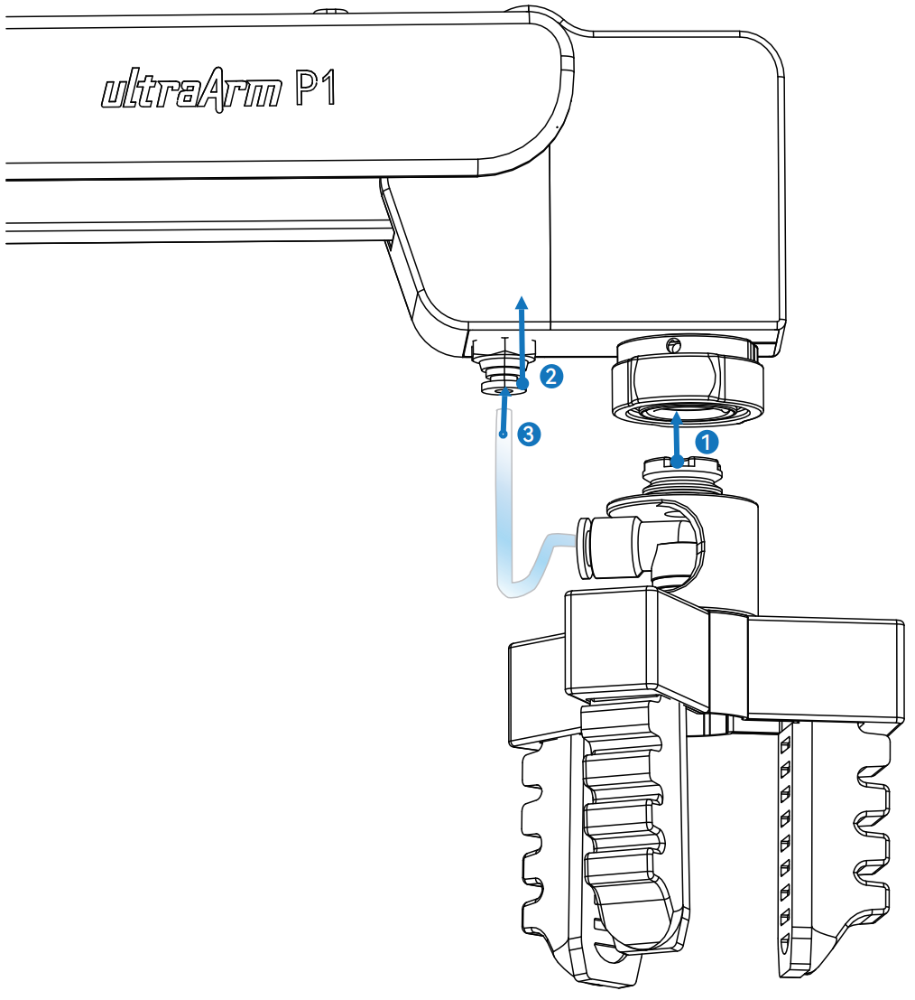
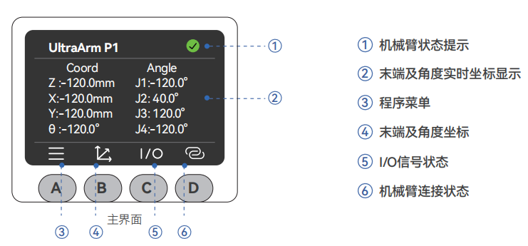
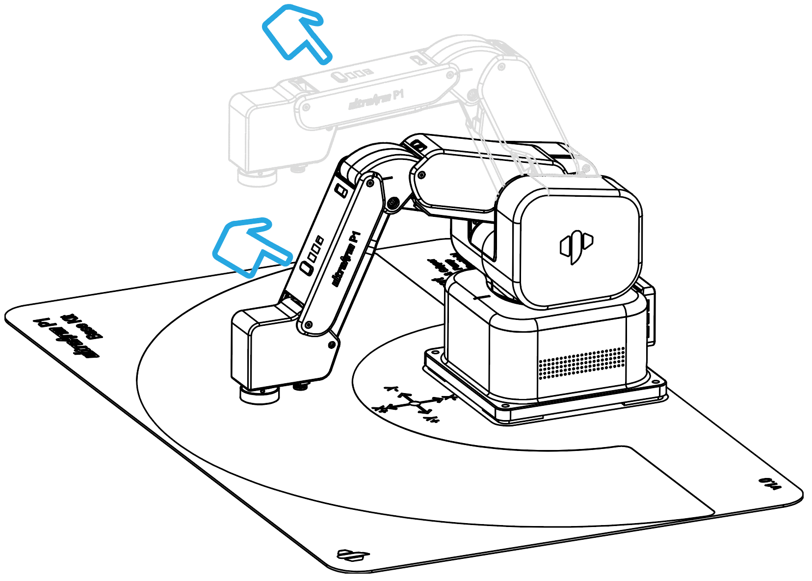
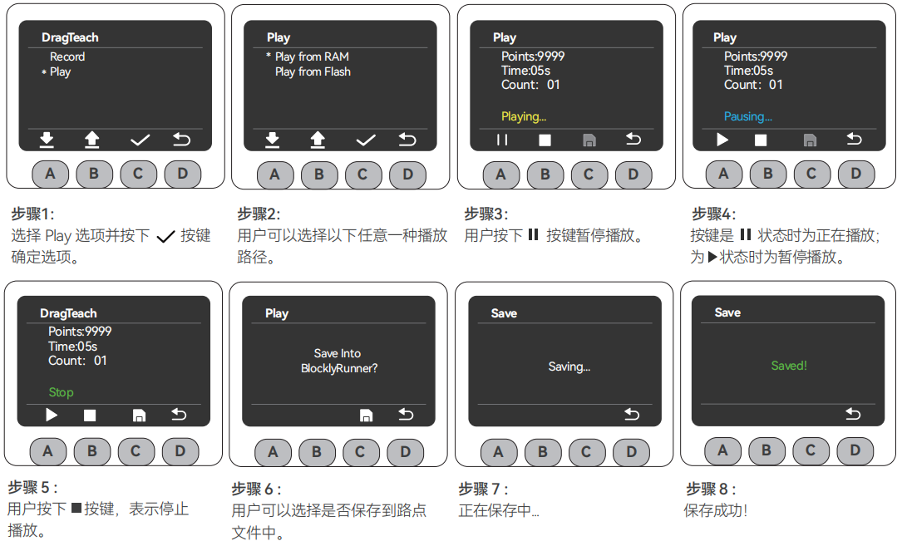

# 开机检测指南

## 1. 工作环境说明

在开机使用之前，请清理工作台，并准备好需要用到的工具。

- **工作环境**：水平放置在承重至少大于机械臂自重 5 倍的桌面上，且不小于机械臂的工作范围，并有足够的安装、使用、维护和修理空间。
- **工具清单**：ultraArm P1 机械臂主体、产品配件包等。

## 2. 外部线缆连接

请确认您已完成上述的结构安装并将机械臂水平放置稳固，以确保操作安全。请按照下列步骤进行连接：

### 步骤 1：连接电源

将直流电源适配器（请确保使用官方适配器，DC 12V 8A 以上供电能力）与 ultraArm P1 机械臂上对应的 DC 电源接口相连，适配器另一端连接 110-220V 电源插座。

### 步骤 2：连接电脑

将 Type-C USB 线一端连接 ultraArm P1 机械臂的 Type-C 接口，另一端连接上位机（电脑）。

### 步骤 3：开机

按下电源开关键，按键周围亮起绿色灯光则开机工作准备完成。

> **注意**：
> - 额定电压：DC 12V
> - 额定电流：8A

## 3. 开机状态展示

确认所有必要的线缆都已插好且接口紧固后，按下电源开关。

开机后，您会看到以下正常现象：

1. MiniRobot 屏幕首先展示 Logo，约 3 秒后自动进入主界面，显示当前关节角度和坐标信息。
2. 界面的顶部状态提示灯会变为绿色，意为机械臂已上电。

## 4. 末端工具安装方式
### 4.1 笔夹安装方法
ultraArm P1 采用快换接头设计，夹爪、吸泵等末端工具的安装方式类似：

**步骤 1**：向上提拉快换接头上的零件 A（锁紧环）。

**步骤 2**：将末端工具（零件 B）的定位孔与 A 对准并嵌入。

**步骤 3**：松开零件 A，完成锁定。
### 4.1 气动夹爪安装方法

**步骤 1**：按照气泵快接方法将夹爪快接至机械臂。

**步骤 2**：将卡扣向上抬。

**步骤 3**：将软管接入气口，松开卡扣。

## 5. MiniRobot 功能说明

### 5.1 主界面功能说明

**按键说明**：开机后机器人自检 3 秒并默认进入主界面，可实时查看机械臂坐标；通过下方按键可切换至其他功能界面。界面下方横线标识当前所在界面。

- **A 键**：进入菜单界面（30 秒无操作自动返回主界面）
- **B 键**：显示实时角度信息和坐标信息
- **C 键**：显示底部 IO 的输入输出状态
- **D 键**：显示 WiFi、USB 和 Bluetooth 的连接状态

### 5.2 菜单界面功能说明

在主界面按下 A 键进入菜单界面，菜单包含以下功能：

- ① **DragTeach（拖动示教）**：按住末端交互按钮即可自由拖动机械臂，支持轨迹记录与回放。
- ② **BlocklyRunner（运行器）**：可选择播放已保存的轨迹文件。
- ③ **QuicklyMove（快速移动）**：提供自由移动与点动移动两种快速移动模式。
- ④ **Connection（通信连接）**：支持 WLAN / USB / Bluetooth 通信，可查看及设置连接状态。
- ⑤ **Firmware（固件信息）**：可查看机器人 ID、屏幕驱动、固件系统版本。
- ⑥ **Calibration（零位校准）**：提供逐关节手动校准模式。
- ⑦ **Settings（系统设置）**：提供错误清零和日志查看两种功能。

## 6. 基础功能检测

完成连接后，建议进行以下检测确认产品功能正常：

### 记录轨迹

> **注意**：
>- 选择存储方式：存入 RAM（临时保存，断电丢失）或存入 Flash（长期保存，断电不丢失）。

### 拖动机械臂
MiniRobot操作步骤3中，用户可以自由拖动机械臂形成任意姿态（不可超过机械臂关节范围）并记录轨迹，下图为举例示范：
按住末端交互按钮，即可开始拖动示教。

### 播放轨迹

* 若在点击轨迹播放操作之前并未进行记录轨迹操作，屏幕会出现"警告：没有可播放的轨迹文件！"的提示，用户只需返回菜单页面进行上述记录轨迹操作即可。
* 用户播放轨迹流程中执行的保存操作属长期保存。
---

[← 上一章](4.2-ProductUnboxingGuide.md) | [下一章 →](../../C-FunctionsAndApplications/5-BasicApplication/README.md)
