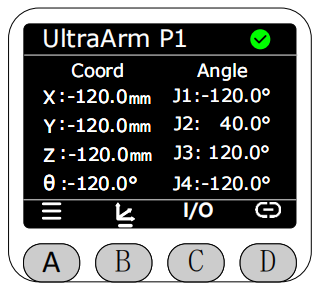
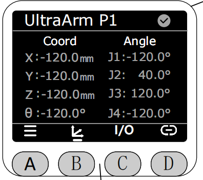
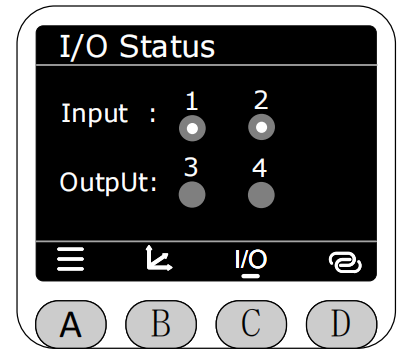
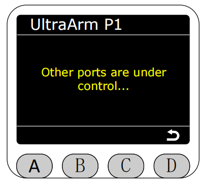

# 首次使用

MiniRobot是一个由TFT屏幕以及按键组成的交互式模块，底部的按键从左至右依次为A、B、C、D键，可通过按键切换显示不同的机械臂信息同时也可通过按键控制机械臂状态。

启动MiniRobot前，需要先将机械臂通电，并按下电源开关键才可正常使用。
机械臂通电后,若此时主控没有启动时，屏幕右上角显色灰色圆圈，所有数据显示为灰色,包括角度，坐标。机械臂通电后大约3sMiniRobot会自动更新当前数据，并且右上角显示绿色圆圈。

在机械臂上电后，MiniRobot会先显示Logo。

随后进入主界面，主界面默认显示当前机械臂的关节信息以及坐标信息。

按下A键，可进入菜单界面，通过屏幕底部的图标指引可上下选择具体的功能，**需要注意若在该界面30s内没有任何操作则会自动跳转回主界面。**

可以通过屏幕底部的按键切换显示不同的机械臂信息，按下C键显示机械臂当前的底部4个IO的输入输出状态。

按下D键显示WiFi、USB和BlueTooth的开启或连接状态。

**需要注意,MiniRobot、myStudio Pro与Python接口对机械臂的运动控制具有互斥性。同一时刻下只能有一端可以控制机械臂。若MiniRobot进入了控制界面,则myStudio Pro或Python接口将无法控制机械臂,反之同理。**

当进入如下界面时会认定为进入了控制界面:

1、拖动示教界面及其子页面。

2、BlocklyRunner界面及其子界面。

3、快速移动界面及其子界面。

4、零位校准界面及其子界面。

5、设置界面及其子界面。

当其他端在控制机械臂时，屏幕会弹窗提示“Other ports are under control...”，提示三秒自动退出弹窗。

此时进入菜单页面，只有“Firmware”和“Connection”可进入操作，其他选项置灰不可选。

[← 上一章](../5.1-SystemInstructions.md)[下一页 →](./5.2.2-dragteach.md)