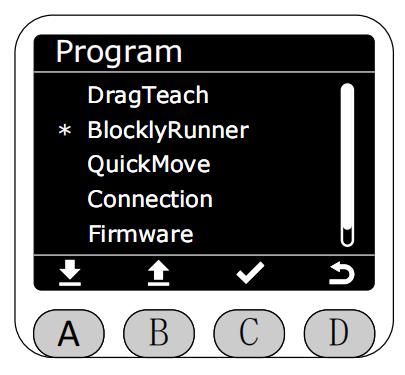
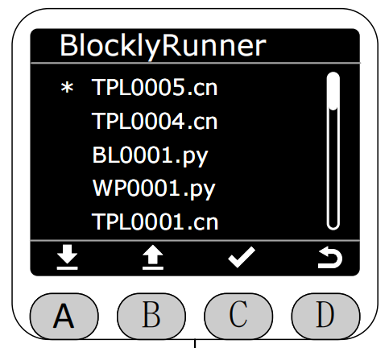
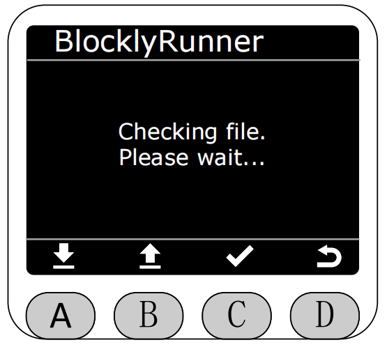
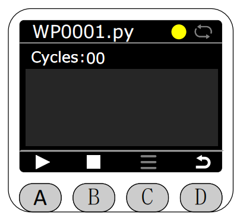
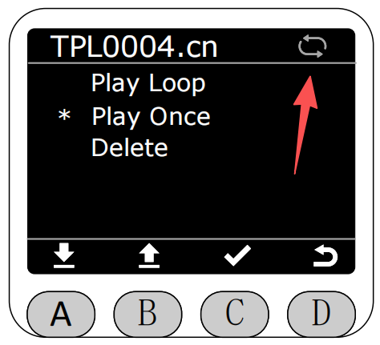
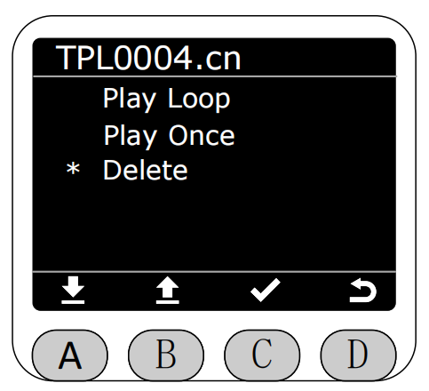
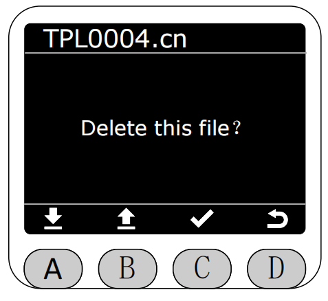

# BlocklyRunner

在Program界面将星号选择为BlocklyRunner功能，按下C键进入BlocklyRunner功能。

进入BlocklyRunner功能后，会先检查BlocklyRunner的文件夹中是否有python文件和之前flash保存.cn文件。
**BlocklyRunner的文件分为本地屏幕录制的轨迹文件.cn和PC端APP生成的python脚本文件，选择不同的文件跳转的执行页面也不同**

 

若没有文件则会提示相应的错误。

若有，则会在BlocklyRunner界面中显示已有的轨迹文件，可以选择播放对应的轨迹文件或者python脚本。

选择对应文件后，会先检查该文件的状态。

 

若文件正常，按下A键即可开始播放（左边为.cn文件播放页面，右边为.py文件的播放页面）。
**播放时在屏幕的右上角会显示当前的轨迹文件的播放循环状态，灰色表示单次循环播放，白色表示无限循环播放，选择文件刚进入播放页面默认无限循环播放。**

**在文件还没有开始执行或停止执行的时候，可按下C键的菜单选项对轨迹文件进行删除，单次播放，循环播放的操作。**

若选择循环播放，则在轨迹文件播放完成后，会自动重新开始播放。同时箭头所指图标将会变为白色。

若选择单次播放，则在轨迹文件播放完成后，会自动停止播放。同时箭头所指图标将会变为灰色。

播放状态下再次按下A键可暂停播放。

按下B键即可停止播放。

若选择删除文件。

点击删除时,会提示是否确认删除该文件。

确认后,会弹出删除成功的提示。进行删除操作后，BlocklyRunner的文件夹中对应的文件也会同步删除。删除后三秒自动返回，此时返回会跳转至读取BlocklyRunner文件夹的界面。

[← 上一页](./5.2.1-dragteach.md) |[下一页 →](./5.2.4-quickmove.md)