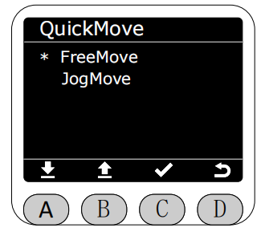
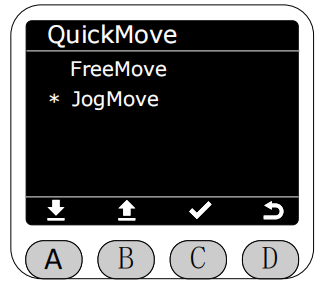
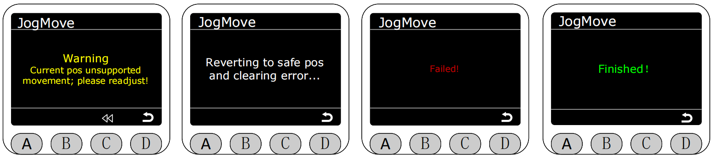

# 快速移动(QuickMove)

在Program界面将星号选择为QuickMove功能，按下C键进入QuickMove功能。

进入QuickMove功能后，可选择自由移动或关节点动。

自由移动(FreeMove)模式下,实时显示机械臂的角度数据和坐标数据,长按末端两侧的按钮即可自由拖动机械臂,**此时会松开所有电机的制动器,请注意安全**

返回并选择关节点动(JogMove)模式

进入关节点动(JogMove)模式后,可选择点动角度或点动坐标。

选择想要点动的关节或坐标控制机械臂关节或坐标运动,被选中的关节或坐标会高亮显示。单点点动时,步距角为0.1°,长按点动时,关节或坐标会以10的速度转动,运动至限位附近时会自动停下。

在点动模式点动时,机械臂移动至耦合点位附近时,会自动停下。此时会弹出警告提示，灯带蓝灯常亮。此时按下C键,可以退回至上一个点位（如下四张图片分别表示：提示触发耦合、回退上一个安全点位过程中、回退失败和回退成功）。

[← 上一页](./5.2.3-blocklyrunner.md) |[下一页 →](./5.2.5-connection.md)