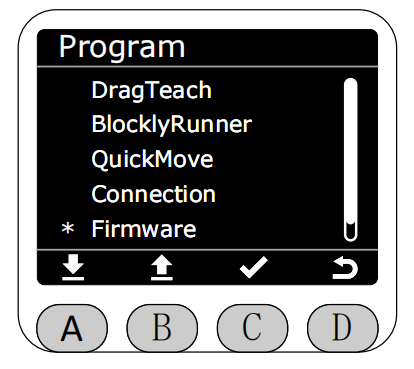
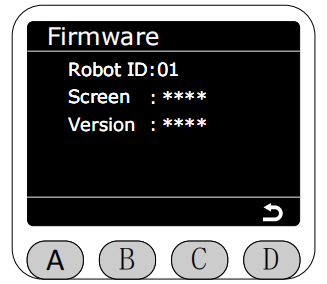

# 版本显示(Firmware)

在Program界面将星号选择为Firmware功能，按下C键进入Firmware功能。

> 方法b会让我运行EN的gitbook serve指令时，图片显示不出来了

进入Firmware功能后,会显示当前机械臂的所有版本信息。
RobotID对应机械臂的唯一标识符,用于区分不同的机械臂。
Display对应MiniRobot的版本。
Version对应系统版本（刚进入会显示获取中，获取成功显示对应的主控版本）。

[← 上一页](./5.2.5-connection.md) |[下一页 →](./5.2.7-calibration.md)