# 设置(Settings)

在Program界面将星号选择为Settings功能，按下C键进入Settings功能。

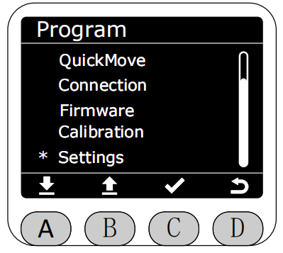

进入Settings功能后，可选择清除错误或者查看屏幕运行python脚本的日志。

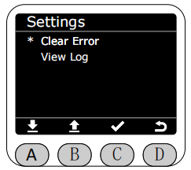

进入清除错误(Clear Error)页面,如果机械臂没有处于关节限位、耦合位置或者触发过碰撞会提示“No Errors.”

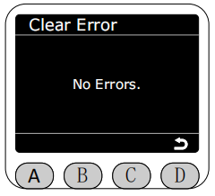

如果有关节处于限位之外就会提示处于限位中，可按下C键回零即可清除限位报错。

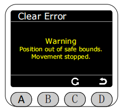

回零过程中白色文本提示“Backing...”

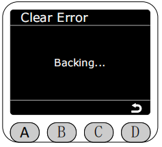

回零完成绿色文本提示“Finished！”，三秒自动返回settings页面。

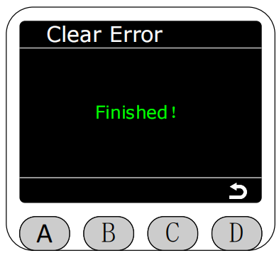

如果机器处于耦合位置或者触发过碰撞就会提示处于耦合位置或者碰撞过，可按下C键即可清除报错。

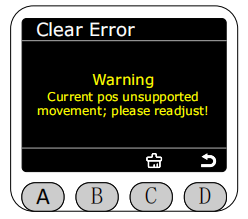
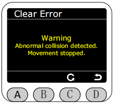

清除过程中白色文本提示“Clearing...”

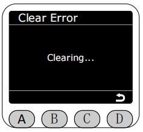

清除耦合完成绿色文本提示“Cleared！”，三秒自动返回settings页面。

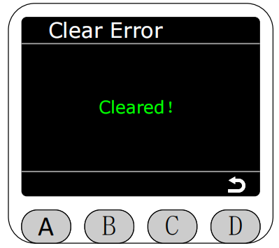

清除耦合失败红色文本提示“failed！”，三秒自动返回settings页面。

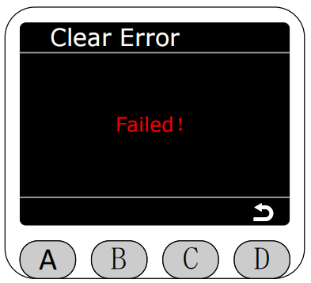

返回Settings页面选择进入View Log，可查看屏幕运行python文件的生成的日志文件。

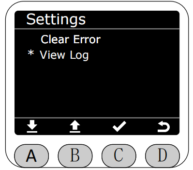

进入View Log后如果没有日志文件就会提示“No Log.”

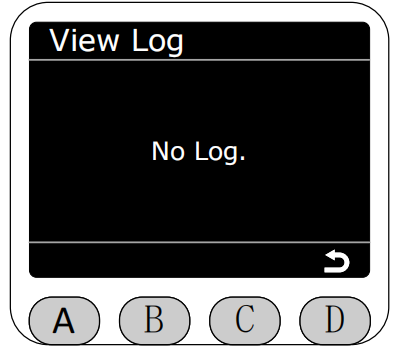

如果有日志文件就会加载并显示出来所有的日志文件。

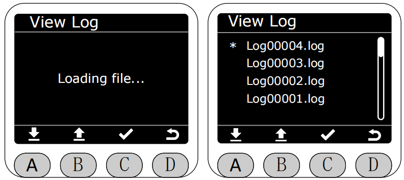

可以选择需要查看的日志文件点击C键进入查看该文件的详细日志，可再次点击C键进入删除页面，可以删除该文件。

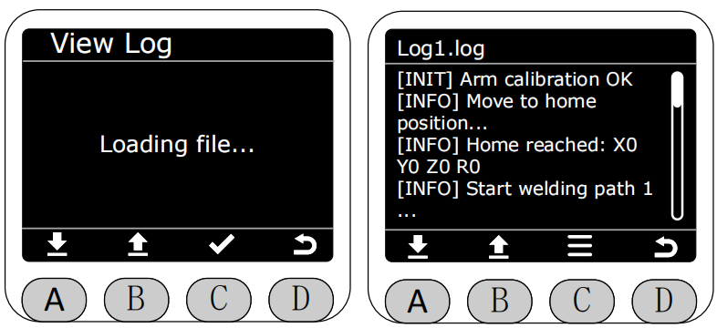

进入删除页面后，点击C键会提示是否确认删除该条日志文件，确认后即可删除。

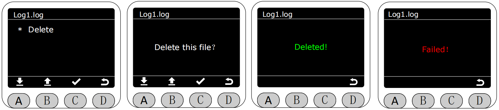

[← 上一页](./5.2.7-calibration.md) |[下一页 →](./5.2.9-Q&A.md)