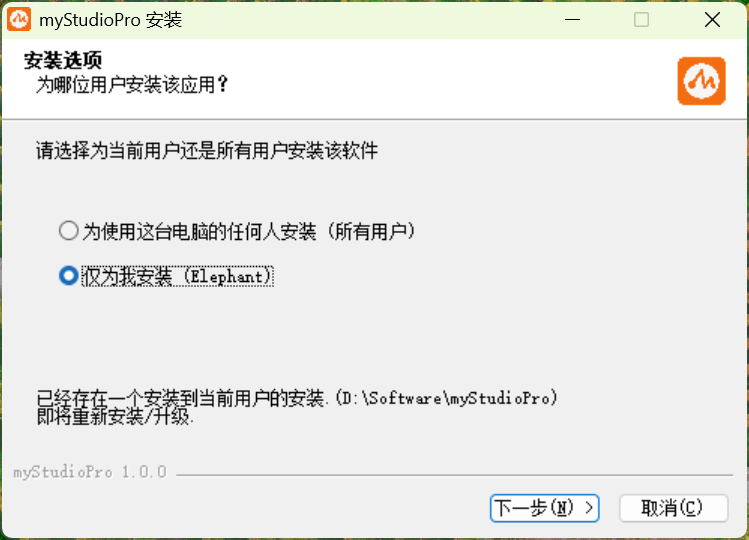
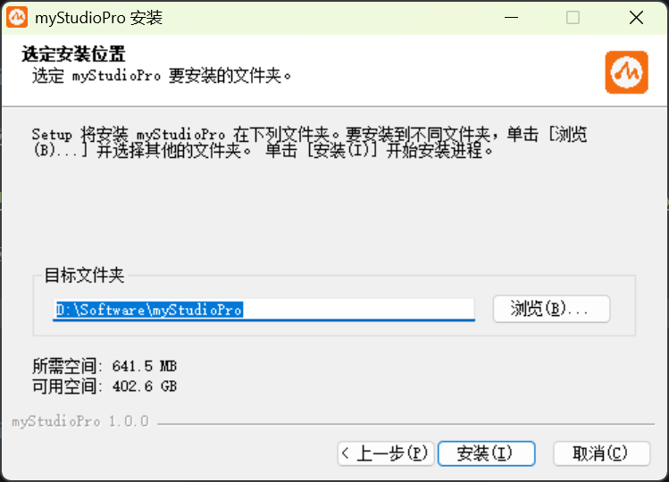
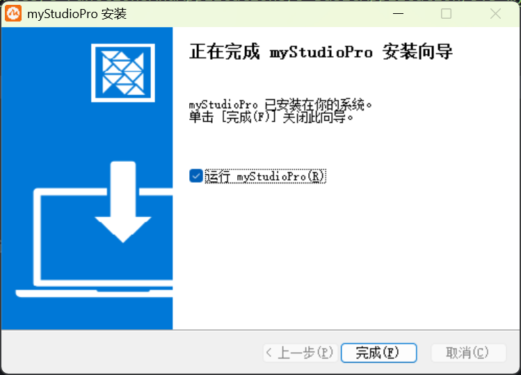
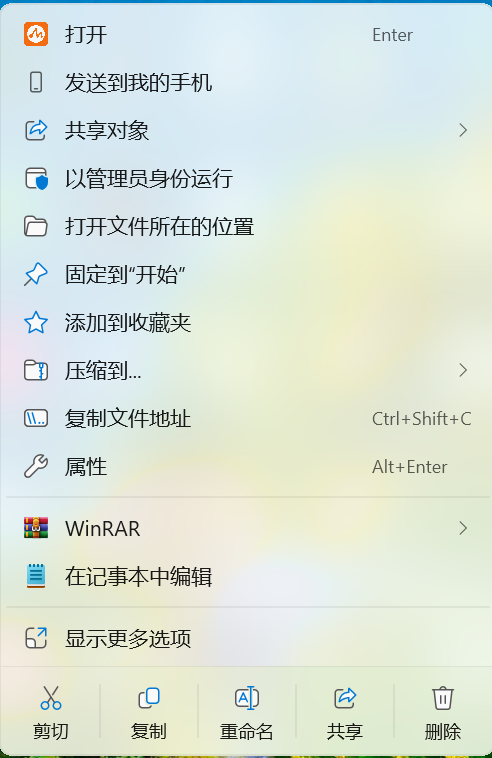
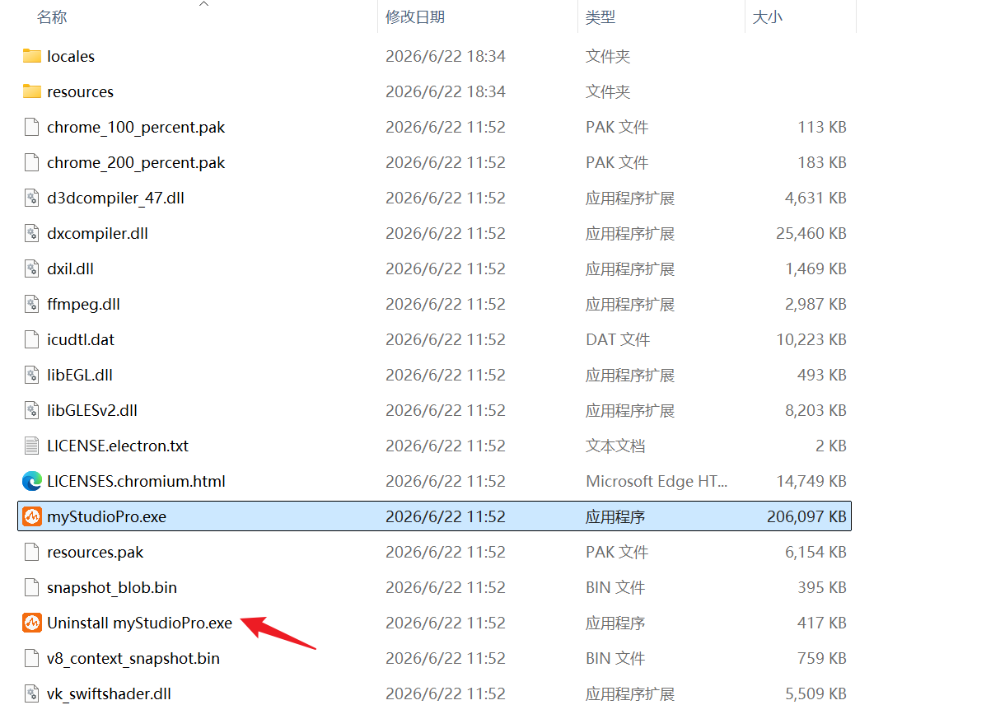
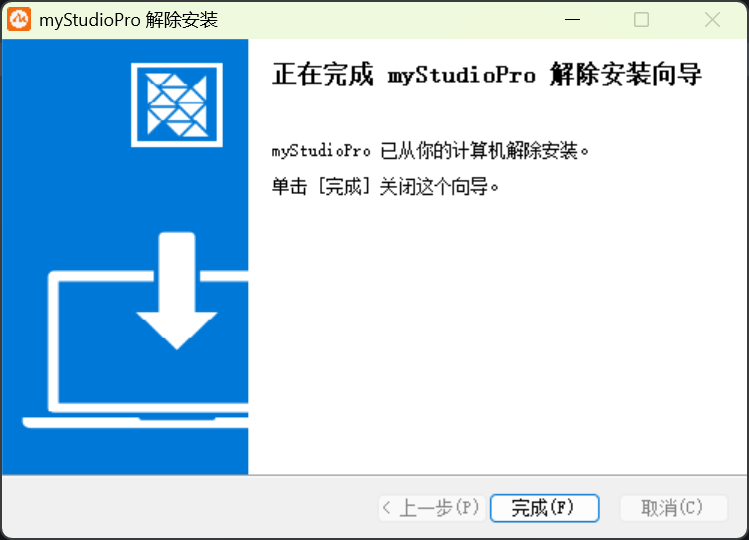
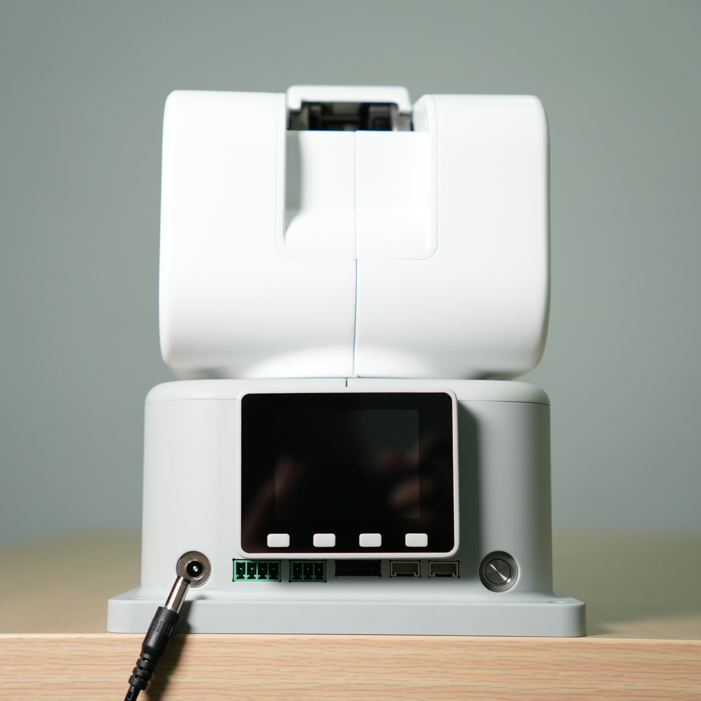
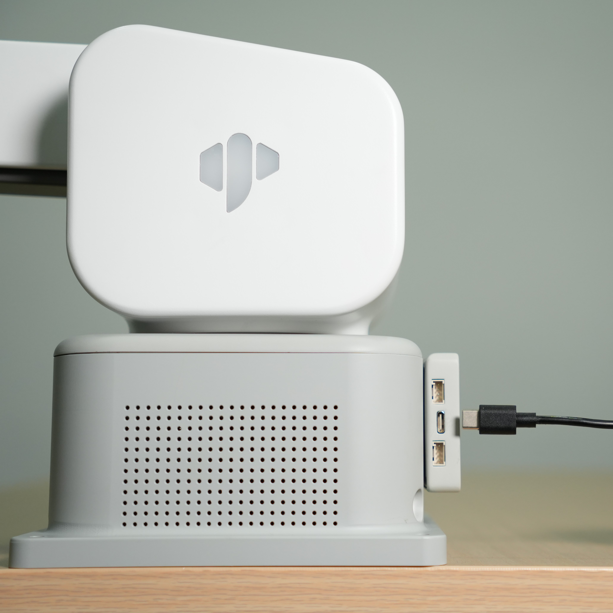

# 首次使用

## myStudio Pro支持的操作系统如下

- Windows 10/11

- macOS

- Linux_x86_64

## 安装myStudio Pro

> 以下安装步骤以Windows操作系统为例，查看本章节内容讲解前，请保证您已拥有软件的安装包

1. 双击软件安装程序，开始软件安装，安装用户选项按您自身需要选择。

2. 点击【下一步】，选择软件的安装路径，按您自身需要选择，建议安装至C盘以外的路径下

3. 确认无误后，最后点击【安装】，耐心等待直至软件安装完成

   
4. 点击【完成】，即可运行软件

## 卸载myStudio Pro

> 以下安装步骤以Windows操作系统且建立桌面快捷方式为例，查看本章节内容讲解前，请保证您的设备已成功安装软件

1. 选择软件，并鼠标右键。

2. 选择【打开文件所在的位置】，找到【Uninstall xxx.exe】执行文件鼠标双击。

3. 打开【解除安装向导】，点击下一步即可完成软件卸载

## 前置工作

> 准备工具: ultraArm P1机械臂、DC12VA直流电源、USB线源等。
>
> 注意:请确认您已完成上述的结构安装，并将机械臂水平放置在承重至少为机械臂自重5倍的桌面上，以确保操作安全。
> 
> 请按照下列图示流程，将电源适配器与机械臂上对应的接口进行连接:
>

**第一步：** 将直流电源与ultraArm P1机械臂上对应的DC圆形接口相连，适配器另一端链接110-220V电源插座。

**第二步：** 将ultraAm P1机械臂上对应的Type-C接口与上位机相连。

**第三步：** 按下电源开关键，按键周围亮起绿色灯光则开机工作准备完成。

## 使用myStudio

鼠标双击，打开已安装的软件，软件会自动检检测可用的串口号，点击【登录】按钮即可。

[← 上一章](./README.md) | [下一章 →](./5.3.2-launch.md)