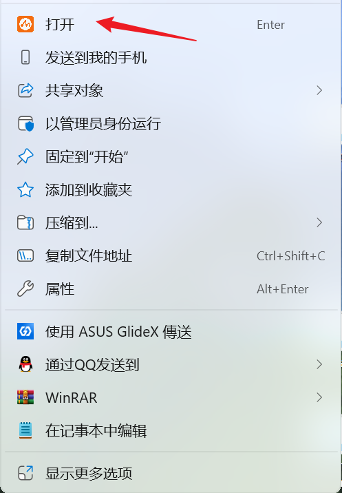
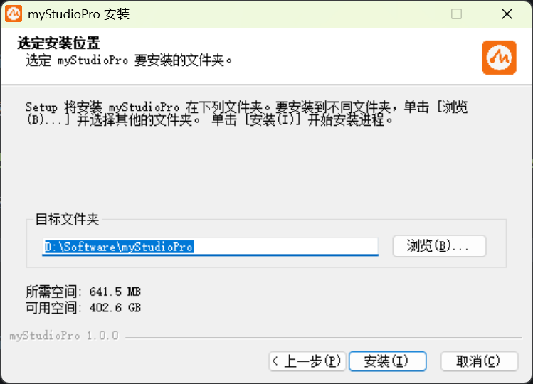
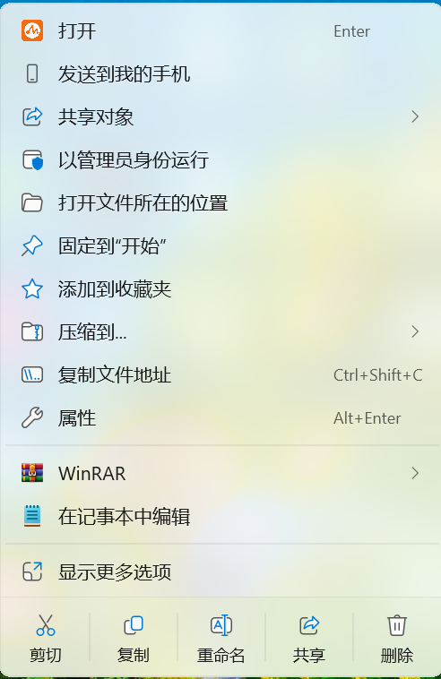
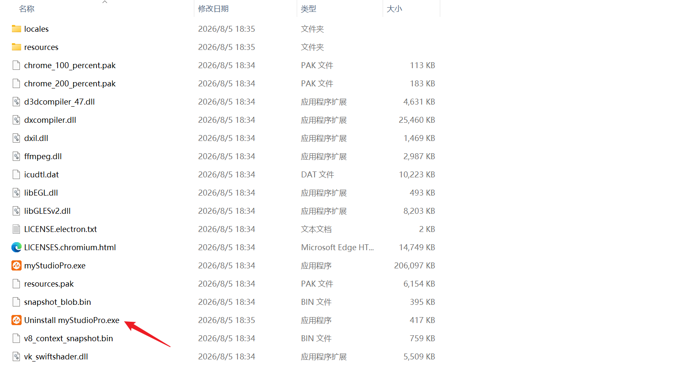
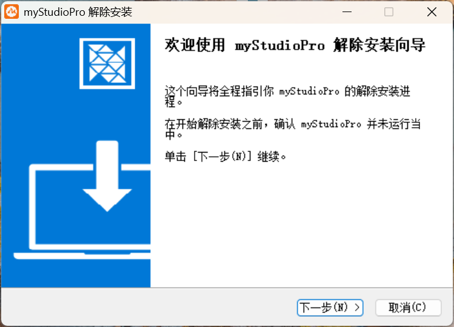
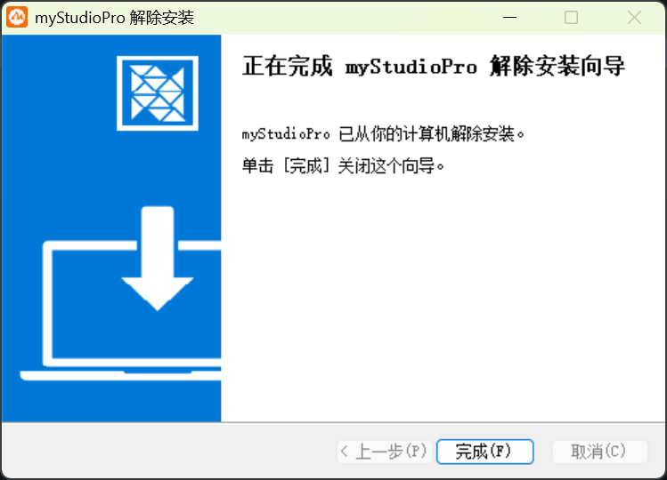
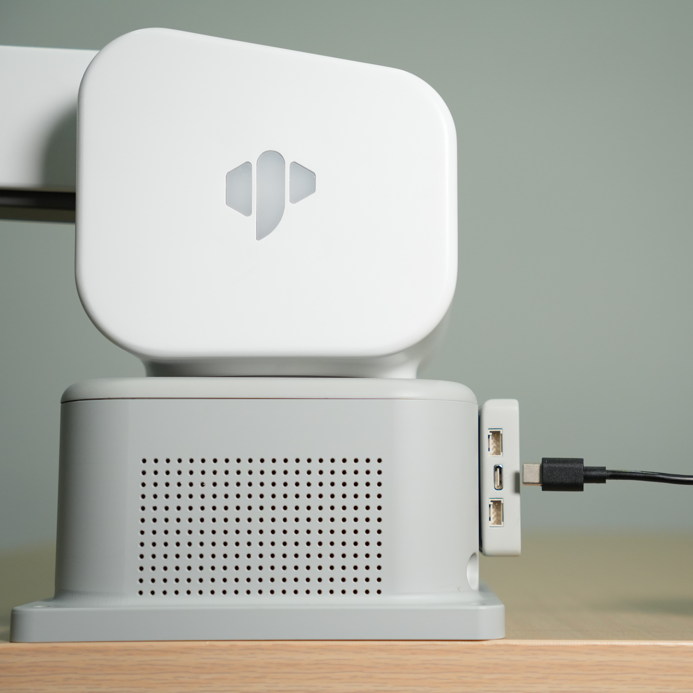

# 首次使用

介绍软件安装与卸载的完整流程，以及首次连接机械臂前需要完成的硬件准备工作。

## 1 准备工作

> 以下是对软件使用前准备工作的介绍，使用前请您仔细阅读

请确保您的设备已下载串口驱动程序，即 CP210X 或 CP34X 驱动程序压缩包。目前存在两种驱动芯片版本， CP210X （适用于CP2104版本）/CP34X （适用于CH9102版本）驱动程序压缩包。若您不确定您的设备所使用的USB芯片，可同时安装两种驱动。（ CH9102_VCP_SER_MacOS 在安装过程中，可能出现报错，但实际上已经完成安装，直接忽略即可）。请根据电脑系统点击下方链接自行下载。

CP210X：[Windows 10](https://download.elephantrobotics.com/software/drivers/CP210x_VCP_Windows.zip)、[MacOS](https://download.elephantrobotics.com/software/drivers/CP210x_VCP_MacOS.zip)、[Linux](https://download.elephantrobotics.com/software/drivers/CP210x_VCP_Linux.zip)

CP34X：[Windows 10](https://download.elephantrobotics.com/software/drivers/CH9102_VCP_SER_Windows.exe)、[MacOS](https://download.elephantrobotics.com/software/drivers/CH9102_VCP_MacOS.zip)

注意：对于 MacOS，在安装之前确保系统 "偏好设置->安全性和隐私->通用" ，并允许从 App Store 和被认可的开发者。

--- 

## 2 myStudio Pro支持的操作系统如下

> 以下是软件支持的操作系统，查看本章节内容讲解前，请保证您的操作系统是下列其一

- Windows 10/11

- macOS

- Linux_x86_64

--- 

## 3 安装myStudio Pro

> 以下安装步骤以Windows操作系统为例，查看本章节内容讲解前，请保证您已拥有软件的安装包

1. 双击软件安装程序，或者鼠标右键选择打开，即可打开软件安装引导。

2. 安装用户选项按您自身需要选择，完成用户选项选择后，点击【下一步】。

3. 选择软件的安装路径，按您自身需要选择，建议安装至C盘以外的路径下，确认无误后，最后点击【安装】，耐心等待直至软件安装完成。

   
4. 勾选运行选项，最后点击【完成】，即可运行软件。

---

## 4 卸载myStudio Pro

> 以下卸载步骤以Windows操作系统且建立桌面快捷方式为例，查看本章节内容讲解前，请保证您的设备已成功安装软件

1. 选择软件，并鼠标右键软件桌面快捷方式。

2. 选择【打开文件所在的位置】，找到【Uninstall xxx.exe】执行文件鼠标双击。

3. 打开【解除安装向导】，点击【下一步】将进行软件卸载操作，确认后等待卸载完成。
   

4. 点击【完成】按钮关闭向导。

---

## 5 前置工作

> 准备工具: ultraArm P1机械臂、DC12V8A直流电源、USB线源等。
>
> 注意:请确认您已完成上述的结构安装，并将机械臂水平放置在承重至少为机械臂自重5倍的桌面上，以确保操作安全。
> 
> 请按照下列图示流程，将电源适配器与机械臂上对应的接口进行连接:
>

**第一步：** 将直流电源与ultraArm P1机械臂上对应的DC圆形接口相连，适配器另一端连接110-220V电源插座。

**第二步：** 将 ultraArm P1 机械臂上对应的Type-C接口与上位机相连。

**第三步：** 按下电源开关键，等待5s，当小屏幕minirobot启动显示实时坐标信息并且顶部机械臂状态提示图标为绿色，则开机工作准备完成。

---

## 6 使用myStudio Pro

鼠标双击，打开已安装的软件，软件会自动检测可用的串口号，默认有线连接、在串口号选择端口、点击`登录`后进入软件。

> 注意：登录前请确认串口号正确，若存在疑问可查看[有线登录](./5.3.2-launch.md#有线连接登录)功能介绍

---

[← 上一章](./README.md) | [下一章 →](./5.3.2-launch.md)
