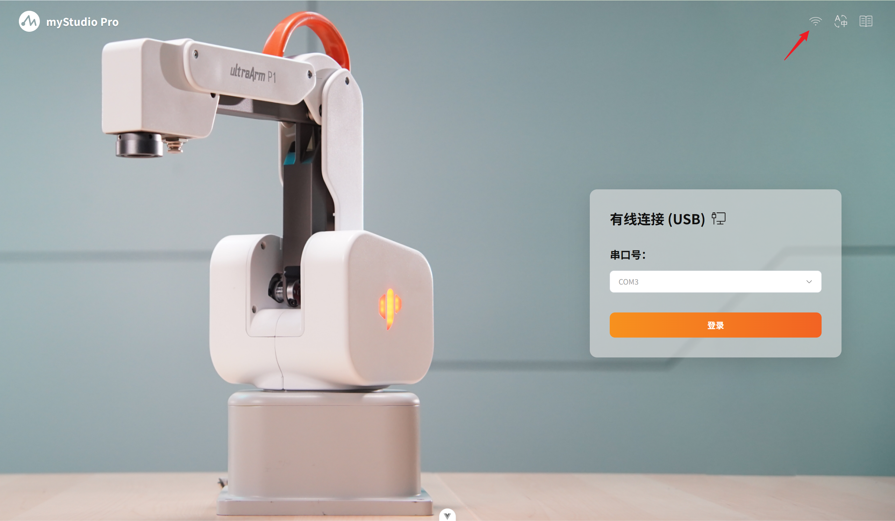
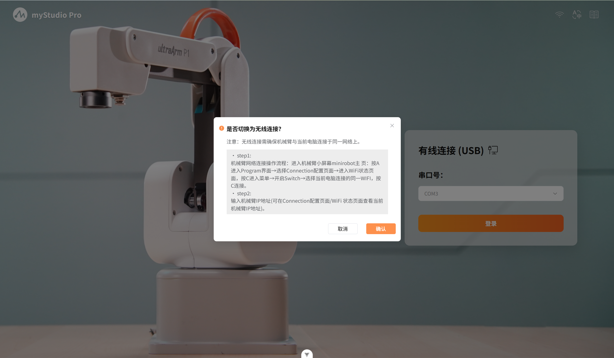
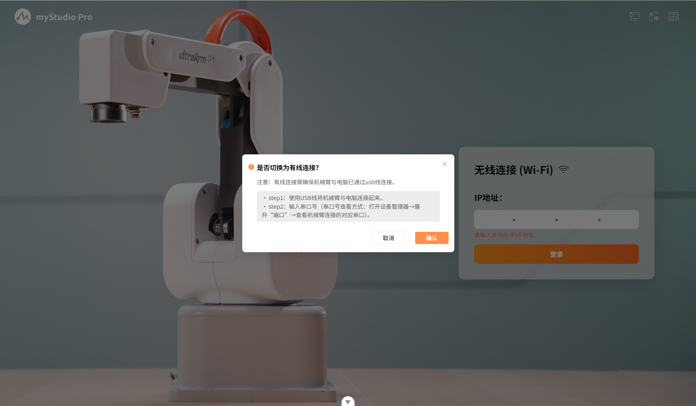
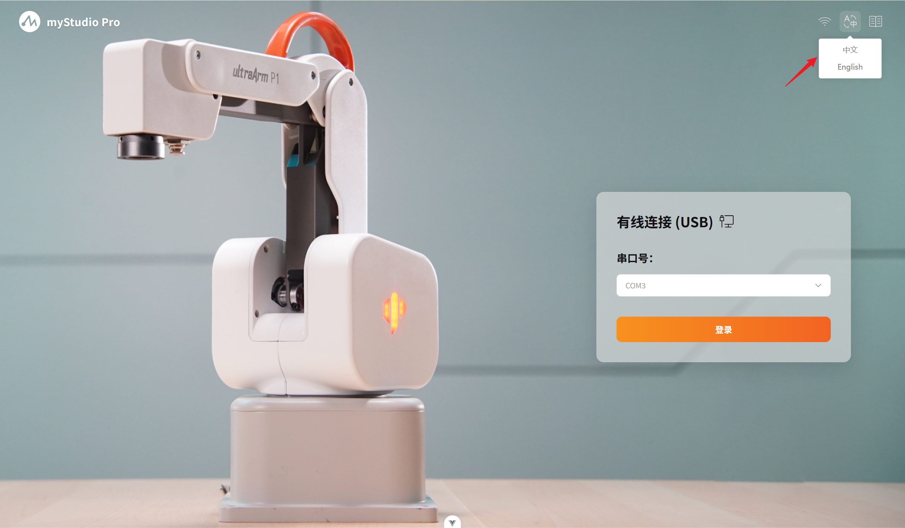
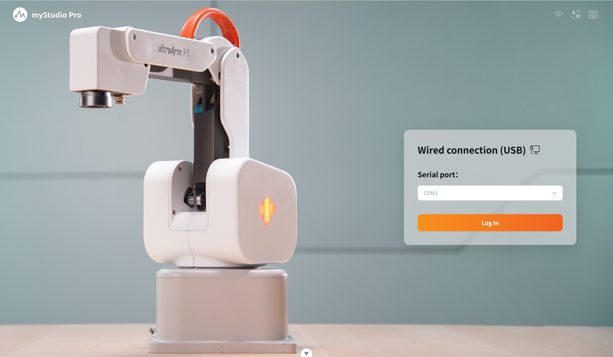

# 启动页

| 序号      | 功能介绍                                                     |
| ------   | ------------------------------------------------------------ |
| 1    | 连接方式切换 |
| 2    | 语言切换     |
| 3    | 用户手册跳转  |
| 4    | 登录模块     |

## 1 连接方式切换

打开软件默认是`有线`连接方式，软件支持两种连接方式，分别是`有线`连接和`无线`连接，可以通过连接方式的切换选择与机器人建立连接的方式。

点击切换按钮时，会弹出二次弹窗，弹窗中有具体的操作方式仔细阅读并操作，点击确认按钮后才进行切换。

- 若当前为有线连接:点击该按钮弹出无线连接确认弹窗
- 若当前为无线连接:点击该按钮弹出有线连接确认弹窗

其中，无线连接仅支持`IPV4`连接。

## 2 语言切换

鼠标悬停时，按钮下方平滑弹出选项浮层，提供 中文 / English 两种语言选择，选择对应的语言后软件将根据语言进行展示使用。

## 3 用户手册跳转

点击按钮，通过系统默认浏览器打开「大象机器人 P1」官方用户手册页面。

## 4 登录模块

### 有线连接登录

自动扫描系统所有可用串口设备，同时扫描到的端口号数字按升序排列，支持记忆功能，页面再次加载时，默认选中用户上一次成功使用的端口号，选择正确的串口点击登录按钮，即可登录进入至软件主页面。

### 无线连接登录

校验IP地址输入，仅支持合法的IPV4地址，具体的登录IP需要通过小屏幕进行查看。

确认登录信息无误后点击`登录`按钮，即可进行登录操作，当软件与机器人成功建立通信后，即可进入软件的主页面使用软件内的所有功能模块。

[← 上一章](./5.3.1-firstUse.md) | [下一章 →](./5.3.3-blockly.md)