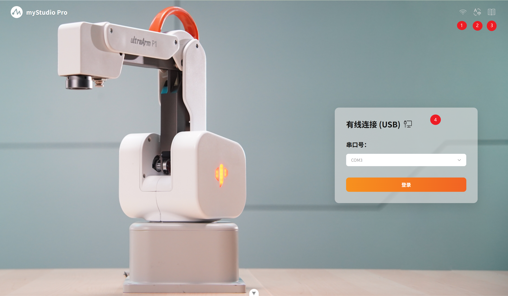
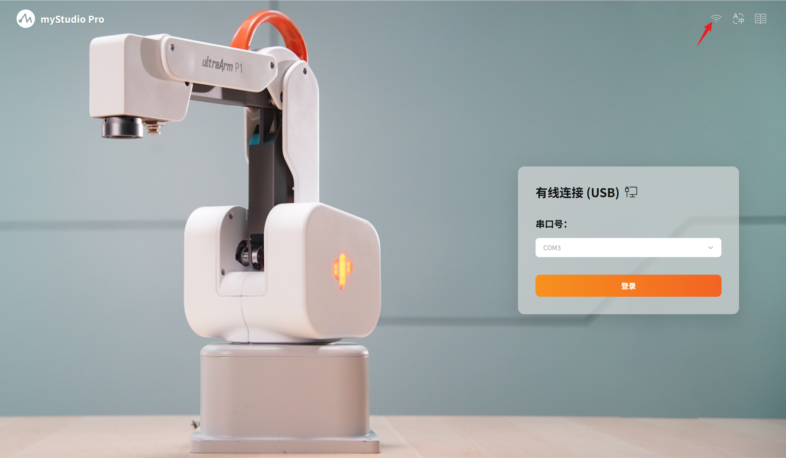
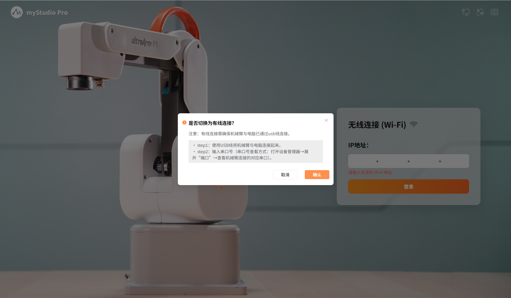
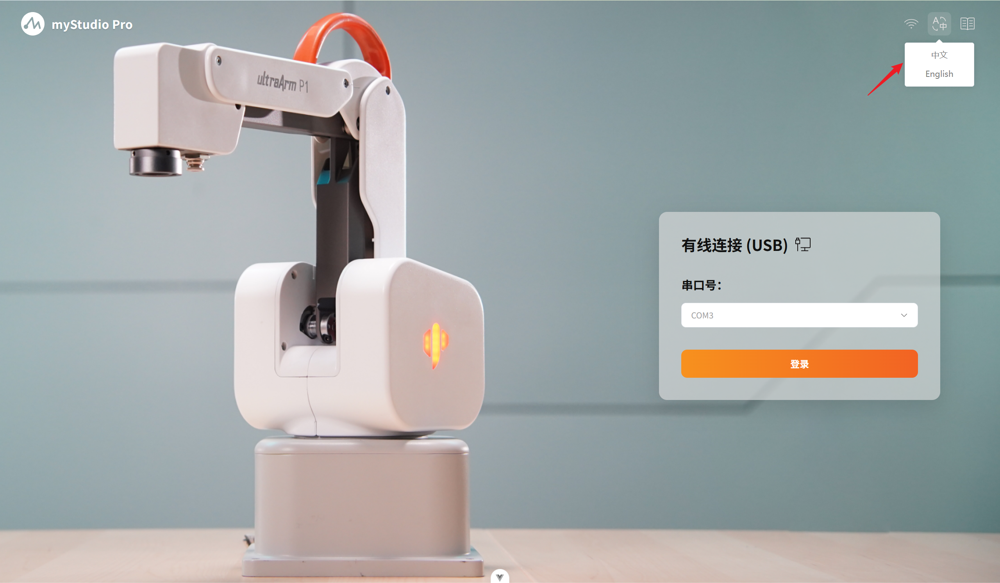
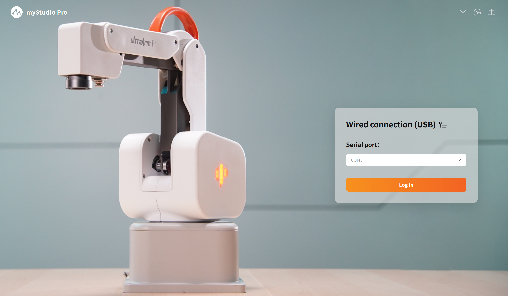
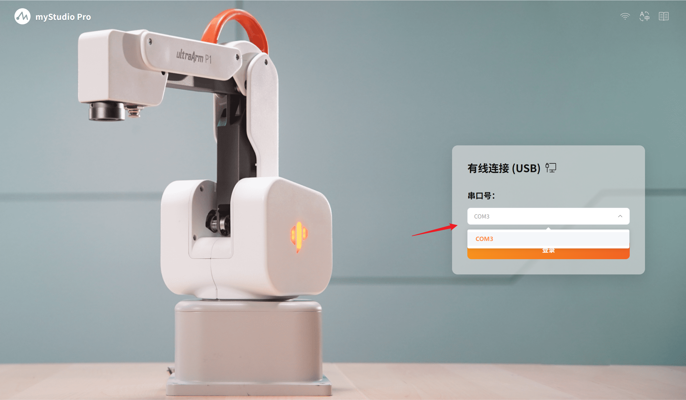
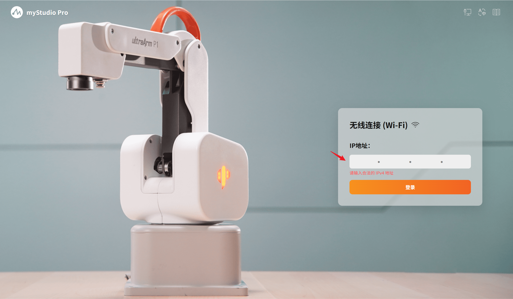
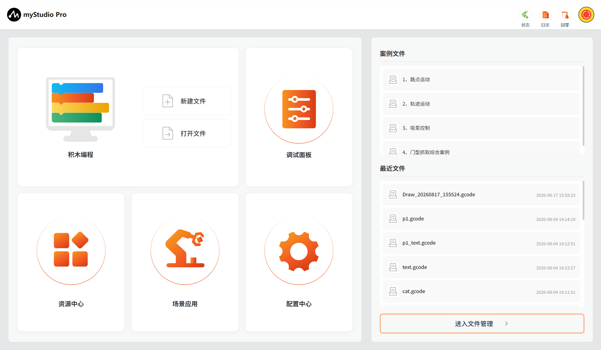

# 启动页

启动页作为登录前的首要界面，集成了连接方式选择、语言切换、用户手册查阅及账户登录等核心入口，助您快速完成初始配置，进入操作主界面。

## 1 界面介绍

| 序号      | 功能介绍                                                     |
| ------   | ------------------------------------------------------------ |
| 1    | 连接方式切换：可切换登录方式，支持有线连接和无线连接 |
| 2    | 语言切换：切换中文或English文字     |
| 3    | 用户手册跳转：用于跳转至P1机械臂的用户手册在线页面  |
| 4    | 登录模块：根据连接方式展示对应的登录模式    |

---

## 2 连接方式切换

> 以下是软件对于有线和无线连接机械臂的情况进行对应页面的切换功能讲解

打开软件默认是`有线`连接方式，软件支持两种连接方式，分别是`有线`连接和`无线`连接，可以通过连接方式的切换选择与机器人建立连接的方式。

1.有线连接模式下软件自动扫描所有可用串口并记忆上次成功的端口号，请确保usb正常连接。

2.无线连接模式下输入机械臂小屏幕显示的 IP 地址进行登录，请确保电脑设备与机械臂处于同一网络。

点击切换按钮时，会弹出二次弹窗，弹窗中有具体的操作方式仔细阅读并操作，点击确认按钮后才进行切换。

若当前为有线连接，点击该按钮弹出无线连接确认弹窗，点击`确认`按钮将切换至无线连接方式。

若当前为无线连接，点击该按钮弹出有线连接确认弹窗，点击`确认`按钮将切换至有线连接方式。

> 其中，无线连接仅支持`IPV4`连接。登录前会对IP格式进行实时校验，当校验不通过时将展示提醒文案，当且仅当校验通过时才可正常使用登录功能。

---

## 3 语言切换

> 以下是对软件中文或 English文字切换功能讲解，以中文切换至英文为例

鼠标悬停时，按钮下方平滑弹出选项浮层，提供 `中文 / English`两种语言选择，选择对应的语言后软件将根据语言进行展示使用。

选择`English`后，软件语言将切换为英文，反之则切换为中文。

---

## 4 用户手册跳转

> 以下是对用户手册跳转功能讲解

点击按钮，通过系统默认浏览器打开大象机器人P1官方用户手册页面。

---

## 5 登录模块

> 以下是对软件有线连接登录和无线连接登录模块功能讲解，以有线连接切换至无线连接为例

### 5.1 有线连接登录

> 以下是对有线连接登录的功能介绍

**注意：** 有线连接需确保机械臂与电脑已通过usb线连接

自动扫描系统所有可用串口设备，同时扫描到的端口号数字按升序排列，支持记忆功能，页面再次加载时，默认选中用户上一次成功使用的端口号，选择正确的串口点击登录按钮，即可登录进入至软件主页面。

若出现多个串口无法确认哪一串口为登录串口，以Windows操作系统为例，可在设置面板中打开设备管理器->端口，将展示所有可用的串口设备。

然后将机械臂与电脑连接的usb线做插拔操作，仔细观察哪一串口会消失与出现，然后到软件选择对应的串口号登录即可。

若无法检测到串口号，请确保已下载[串口驱动](./5.3.1-firstUse.md#准备工作)，若已下载还是无法检测可查看[Q&A](./5.3.8-Q&A.md)。

### 5.2 无线连接登录

> 以下是对无线连接登录的功能介绍

**注意：** 无线连接需确保机械臂与当前电脑连接于同一网络上

校验IP地址输入，仅支持合法的IPV4地址，具体的登录IP需要通过小屏幕中的Connection配置页面/WLAN状态页面查看。

确认登录信息无误后点击`登录`按钮，即可进行登录操作，当软件与机器人成功建立通信后，即可进入软件的主页面使用软件内的所有功能模块。

---

[← 上一章](./5.3.1-firstUse.md) | [下一章 →](./5.3.3-blockly.md)