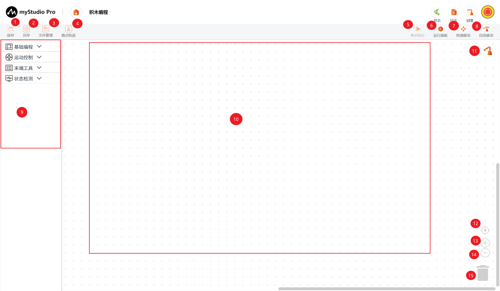

# 积木编程

## 1 积木编程主界面介绍

| 序号      | 功能介绍                                                     |
| ------   | ------------------------------------------------------------ |
| 1    | 保存：可以进行积木程序文件保存的操作，默认保存至文件管理-测试文件空间； |
| 2    | 另存为：将文件保存到文件管理-测试文件空间以外的本地电脑目录；          |
| 3    | 文件管理：打开文件列表面板，可以进行积木程序文件编辑、删除等相关操作；   |
| 4    | 路点轨迹：快速创建示教点位并运行，以及录制轨迹并复现；              |
| 5    | 单步执行：选中某个积木块，可以单击该按钮，只执行当前选中的积木块；    |
| 6    | 运行面板：打开运行面板，在此面板可以运行、调试工作区代码；   |
| 7    | 快速移动：用于快速控制机械臂运动；       |
| 8    | 自由移动：可以进行开启和关闭自由移动模式，；   |
| 9    | 工具箱（toolbox）：提供构建好的积木块供用户使用；            |
| 10   | 工作区（workspace）：可将工具箱（toolbox）中的积木块拖动到此处 进行编程；|
| 11   | 姿态：打开姿态页面，可以看到3D模型的实时仿真运动姿态；           |
| 12   | 工作区校准：点击后 工作区（workspace）会回到原点；                             |
| 13   | 放大：放大 工作区（workspace）；                             |
| 14   | 缩小：缩小 工作区（workspace）； |
| 15   | 垃圾箱（trashcan）：可将工作区中的积木块拖动到此处删除，也支持从此处取出已删除的积木块； |
