# 积木编程

您可以点击`积木编程`图标，或者点击新建文档按钮即可进入积木编程页面

> 当然，如果您也可以通过选择点击`打开文件`按钮会自动跳转到积木编程页面，同时加载您保存好的文件内容包括工作区、路点、轨迹文件（关于如何保存工作区，[请点这里](./5.3.3-blockly.md#2-基础功能使用)） 
> 
> 这里的通过点击积木编程图标和点击新建文件按钮进入积木编程页面的操作相当于是新增工作区

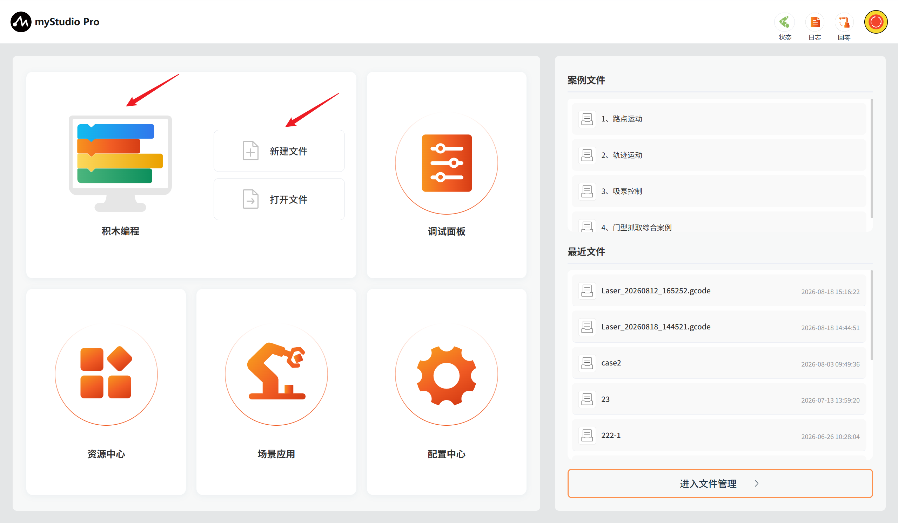

`积木编程`页如下图所示:

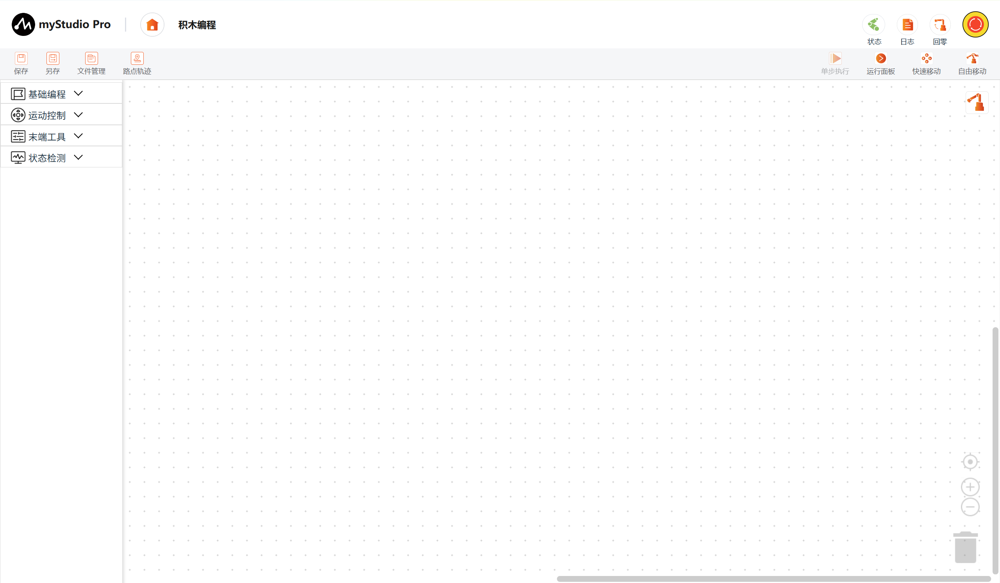

## 1 界面介绍

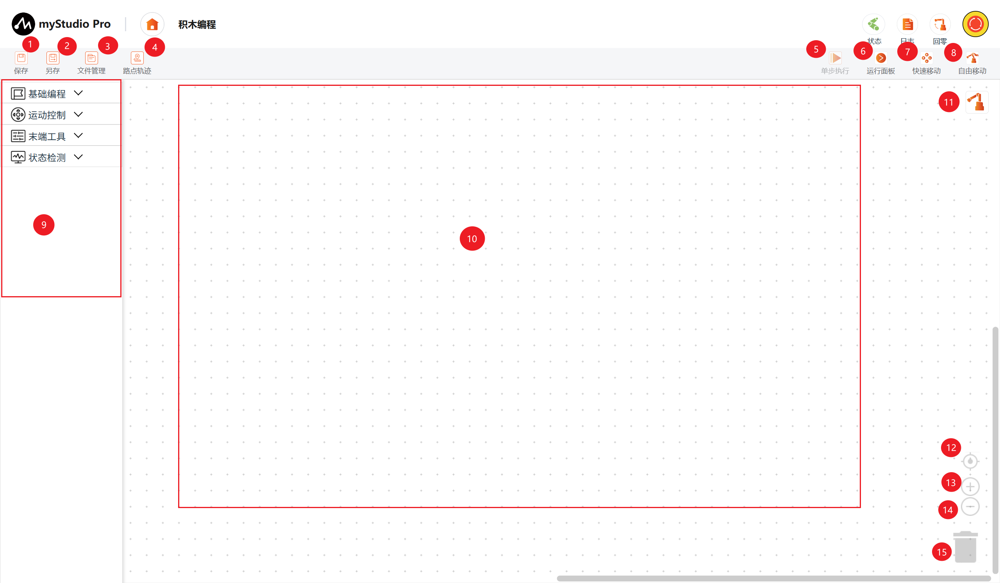

| 序号      | 功能介绍                                                     |
| ------   | ------------------------------------------------------------ |
| 1    | 保存：可以进行积木程序文件保存的操作，默认保存至文件管理-测试文件空间； |
| 2    | 另存为：将文件保存到文件管理-测试文件空间以外的本地电脑目录；          |
| 3    | 文件管理：打开文件列表面板，可以进行积木程序文件编辑、删除等相关操作；   |
| 4    | 路点轨迹：快速创建示教点位并运行，以及录制轨迹并复现；              |
| 5    | 单步执行：选中某个积木块，可以单击该按钮，只执行当前选中的积木块；    |
| 6    | 运行面板：打开运行面板，在此面板可以运行、调试工作区代码；   |
| 7    | 快速移动：用于快速控制机械臂运动；       |
| 8    | 自由移动：可以进行开启和关闭自由移动模式，；   |
| 9    | 工具箱：提供构建好的积木块供用户使用；            |
| 10   | 工作区：可将工具箱中的积木块拖动到此处 进行编程；|
| 11   | 姿态：打开姿态页面，可以看到3D模型的实时仿真运动姿态；           |
| 12   | 工作区校准：点击后 工作区会回到原点；                             |
| 13   | 放大：放大 工作区；                             |
| 14   | 缩小：缩小 工作区； |
| 15   | 垃圾桶：可将工作区中的积木块拖动到此处删除，也支持从此处取出已删除的积木块； |

## 2 积木编程工作台

> 以下是对积木编程工作台的简单介绍，含积木块仓库、编程区，可在该工作台进行积木编程

每个积木块的功能说明，可查看[积木块介绍章节](../5.5-blocks.md)

工作台为可视化编程区域，包括工具箱、工作区、校准、放大、缩小和垃圾桶功能。

`工具箱`主要为软件预设提供的积木块接口，可通过鼠标左键`点击`选择，`长按`拖动至编程区，可以通过拼接积木块的方式进行可视化编程，降低编程难度。

`编程区`您可以理解为一个公共的收纳区，任何存在的积木块都会以特定的方式转为可执行代码并作用于机械臂。进行积木编程时建议您遵循`拼接`的规则，避免出现执行混乱的问题。

同时工作台右下角还支持对编程视角的放大、缩小和校准功能。顾名思义放大是将编程区视角放大，反之则为缩小，校准则是将视角恢复至默认。

若您想对某个积木块进行快捷操作如复制、删除、禁用等操作。可以选择需要操作的积木块同时点击鼠标右键，将展示操作菜单。删除后的积木块想继续使用可以点击工作台右下角的`垃圾桶`图标，点击后会展示本次编程区删除过的代码，若您想继续使用重新拖动至编程区即可。

接下来以一个简单的数学算数题为例，带您简单熟悉以上介绍的功能。

首先，点击左侧工具栏的`基础编程`，点击`运算`分类，将展示该类别下可用的积木块。

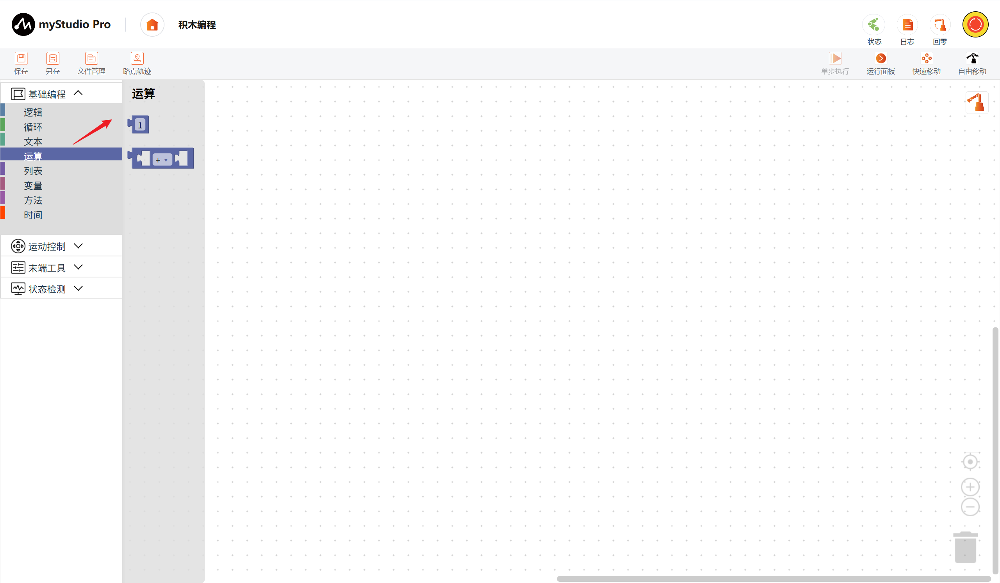

然后，将两个积木块均拖动至编程区，并进行拼接，注：部分积木块存在参数预留功能可通过积木块与积木块间的联合实现拼接的效果。

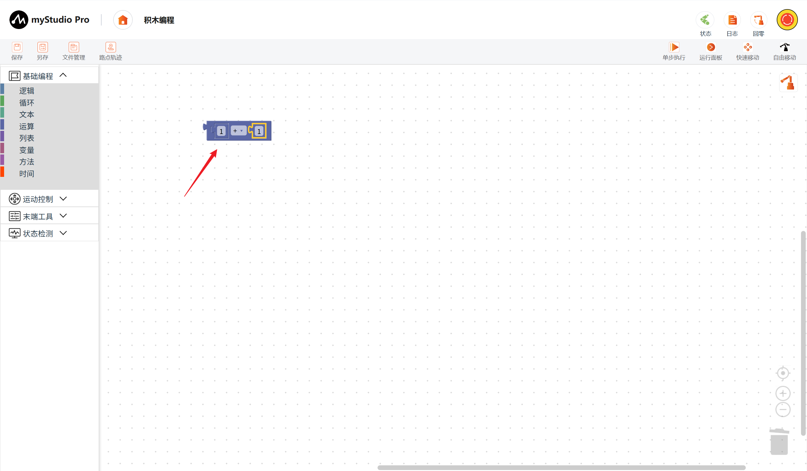

完成拼接后，要想查看编程的效果，还需要将积木代码运行。点击工作台右上角处的`运行面板`，打开运行面板后点击`运行全部`按钮即可进行代码运行。

可以观察到，积木块转为了实际的运行代码，并展示到了日志面板中，为了您能更好的看懂运行日志，建议您掌握简单的Python语法。

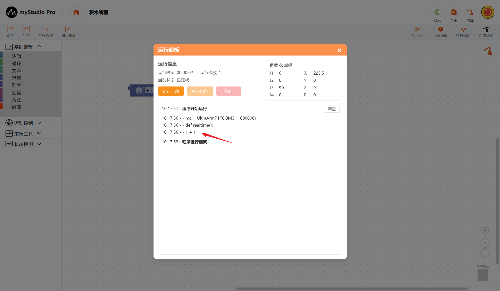

> 有输出值积木块一般前端或末端会有凸口，该类型积木块可与凹口积木块进行拼接。无输出值积木块则前末端直接闭合。

若您想知道某些积木块的执行结果，您还需要使用输出积木块。以上述例子进行简单介绍。选择`文本`分类，将`输出`积木块拖出并与要看输出结果的代码进行拼接。

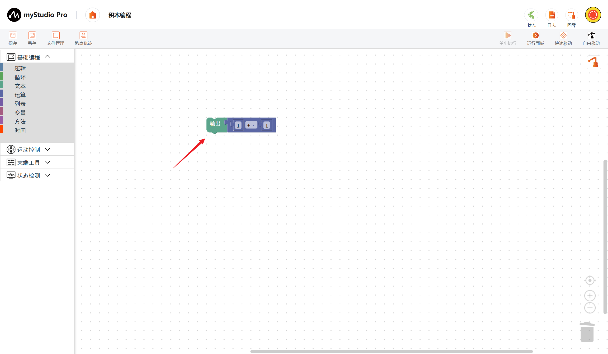

此时再将编程区代码运行，并查看日志面板。可以观察到运行结果也一并展示。

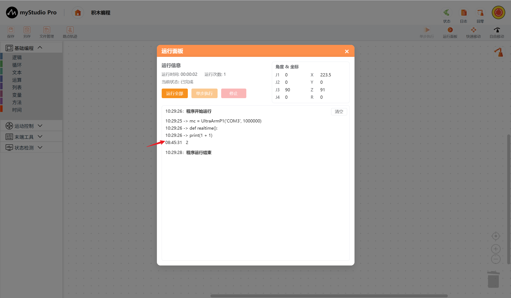

若您想再编程相同的积木块，可以使用`复制`功能，首先选中积木块，可鼠标右键展示操作菜单选择复制或使用键盘`Ctrl + C`与`Ctrl + V`方式实现。

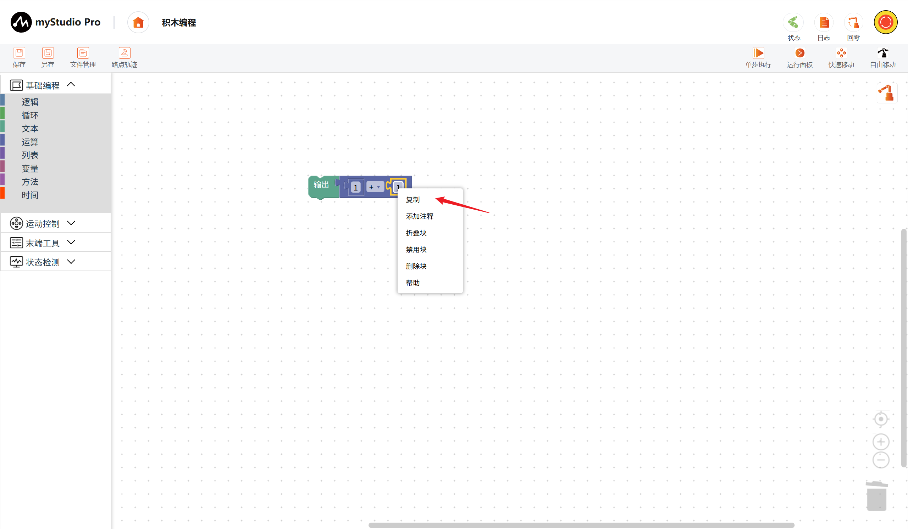

点击`复制`项后，将对该积木块进行复制操作。

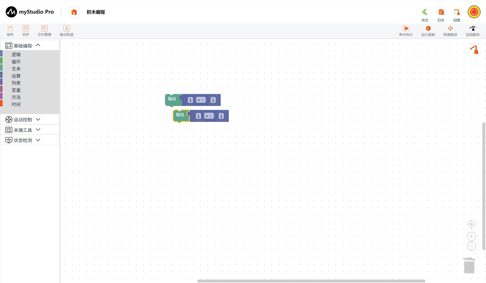

若您想将某一积木块删除，可用使用`删除`功能，首先选中积木块，可鼠标右键展示操作菜单选择删除或使用键盘`Backspace`与`Delete`方式实现。

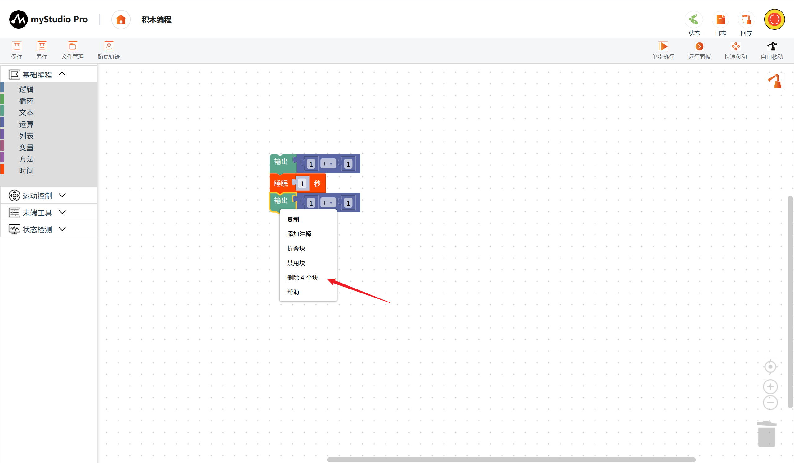

删除后的积木块均进入垃圾桶，需再次使用时可重新拖拽至编程区。

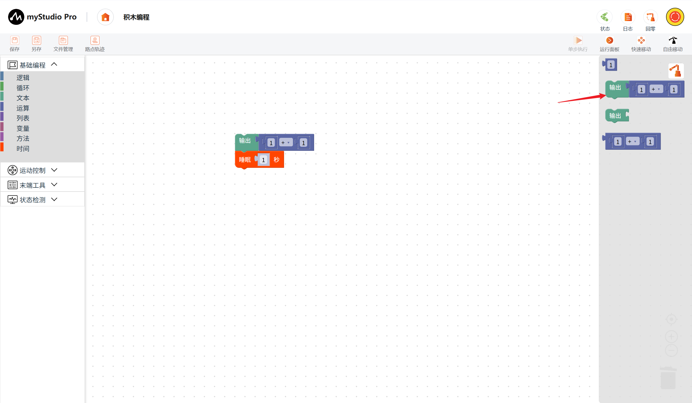

通过一个简单的积木编程介绍，您已经大致掌握积木编程工作台的功能。若想编程更复杂的代码，需要您花更多的时间探索！

--- 

## 3 文件管理

> 以下是对文件管理功能的介绍，对所有积木编程文件统一管理，可通过发布到机械臂上→机械臂小屏幕播放该文件来脱离电脑使用

功能描述：通过文件管理模块，可以方便的对不同文件空间下的文件进行保存、导入、导出等操作。文件列表打开方式有两种，首页-打开文件或myBlockly页文件操作菜单-打开选项，即可打开文件管理列表，同时加载您保存好的文件内容包括工作区、路点、轨迹文件（关于如何保存工作区，[请点这里](./5.3.3-blockly.md#2-基础功能使用)）。

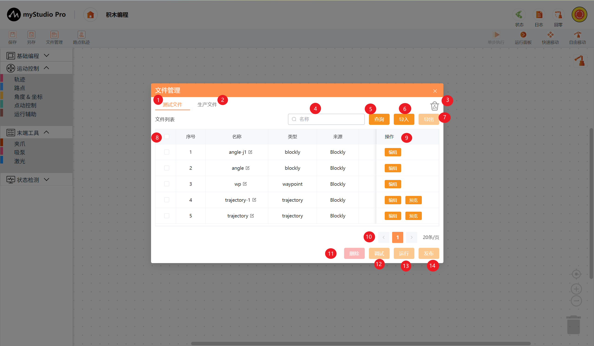

| 序号 | 说明 |
| ------ | ------------------------------------------------------ |
| 1 | 测试文件空间，切换到该选项会分页查询所有测试文件。 |
| 2 | 生产文件空间，切换到该选项会分页查询所有生产文件。 |
| 3 | 回收站文件空间，切换到该选项会分页查询所有回收站文件（测试/生产空间删除的文件会进入到回收站）。 |
| 4 | 查询条件输入框，目前仅支持根据文件名进行模糊查询，可直接enter查询或点击功能5按钮。 |
| 5 | 查询按钮，点击该按钮可根据输入框内容进行分页查询。 |
| 6 | 导入按钮，点击该按钮可对当前设备下的文件进行导入操作。 |
| 7 | 导出按钮，默认禁用选择文件时启用，点击该按钮可对选择的文件进行导出操作。 |
| 8 | 列表数据勾选列，功能7、11-14以该功能为前提。 |
| 9 | 单文件操作按钮，包括以下功能按钮：`编辑`-将文件内容加载到工作区，`预览`-仅适用轨迹文件，3D模型对轨迹点位进行模拟运行。 |
| 10 | 分页按钮，当前空间超过规定数量时可进行分页操作 |
| 11 | 批量操作按钮，`删除`-将勾选的文件删除到回收站， |
| 12 | 单文件操作按钮，勾选一个文件点击该按钮则会将文件内容加载到工作区并自动打开调试面板 |
| 13 | 单文件操作按钮，勾选一个文件点击该按钮则会将文件内容加载到工作区并自动打开调试面板，并可在面板中设置文件的运行循环次数-无限循环或次数循环 |
| 14 | 批量操作按钮，勾选一个或多个文件点击该按钮则会将文件发布到生产空间 |

**查询**

默认查询所有文件，可输入文件名进行模糊查询，当输入框内有内容时则会基于当前的文件空间，根据内容进行查询，查询成功会有信息显示。

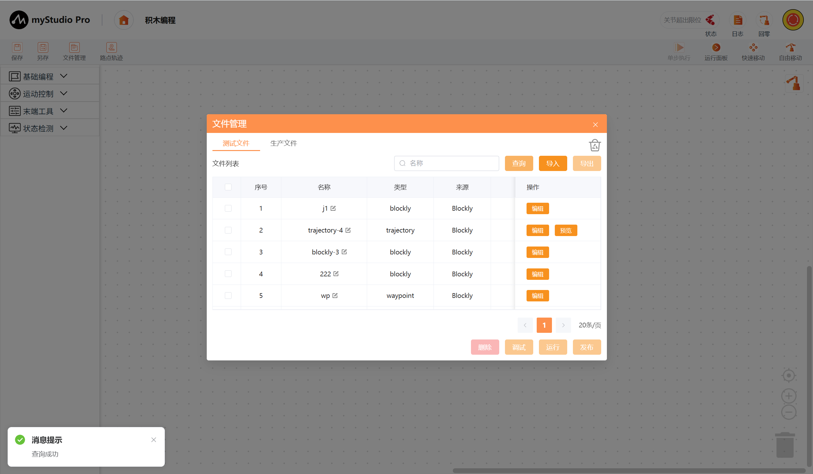

**导入**

> 注意：选择导入的文件，必须是从myStudio Pro中导出的文件，否则会出现`导入失败`/导入成功但`无法编辑`的情况。

点击`导入`按钮，选择需要导入的文件，点击确定即可。支持文件批量导入，以Windows为例按下`shift/ctrl`可以批量选择需要导入的文件。

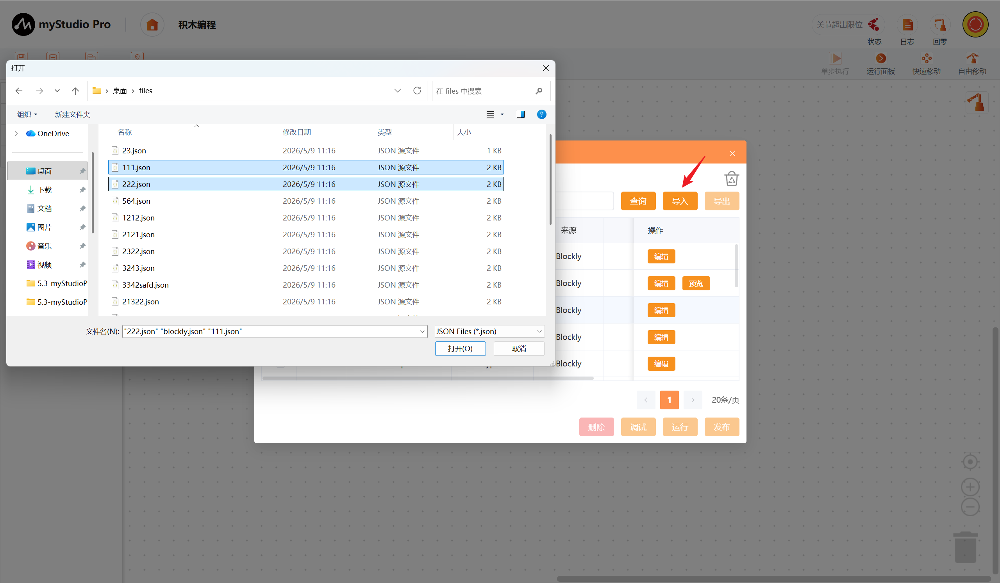

**编辑**

点击`编辑`按钮，将文件内容加载到工作区。

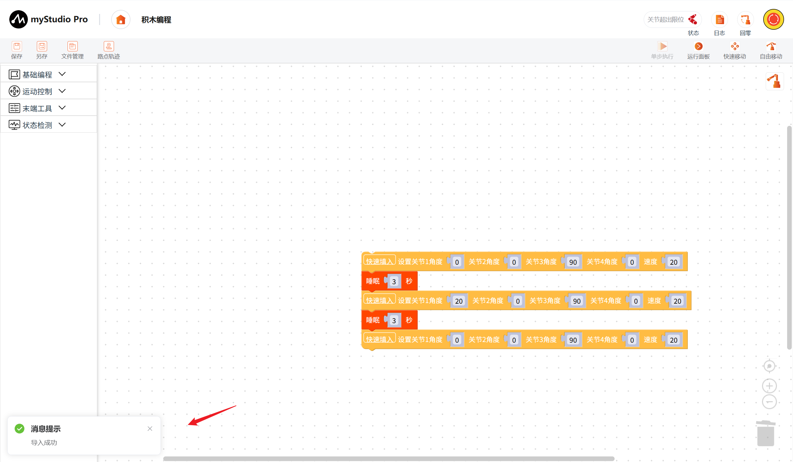

**预览**

点击`预览`按钮，将打开预览面板3D模型将基于轨迹文件实际的点位进行模拟运动。

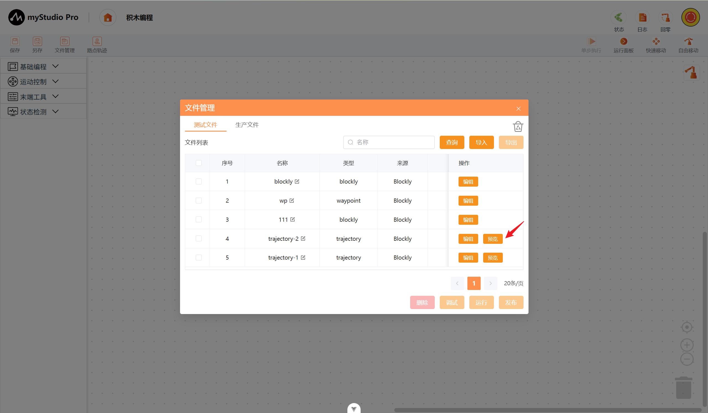

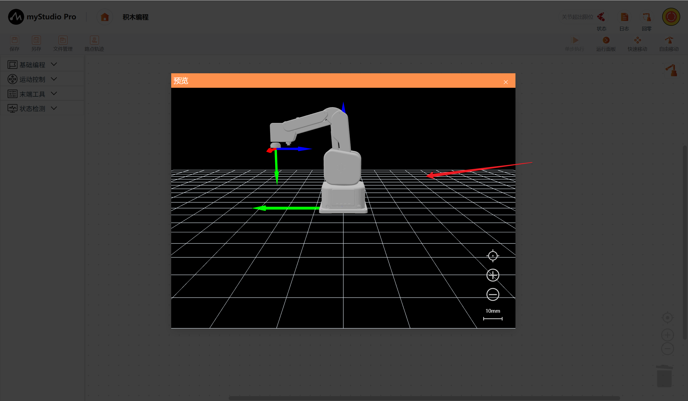

**删除**

点击`删除`按钮，批量删除，将勾选的文件删除到回收站，若删除的操作未回收站文件则永久删除，无法恢复。

勾选需要删除的文件，然后点击`删除`按钮既可，然后切换到回收站选项即可将删除的文件查询到列表。

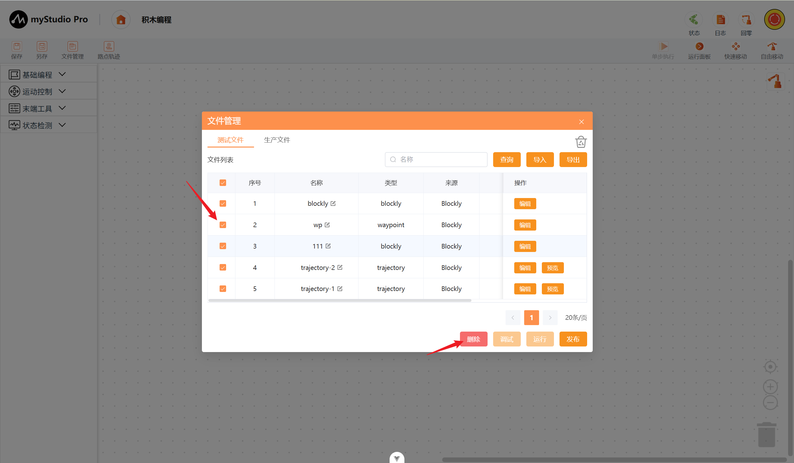

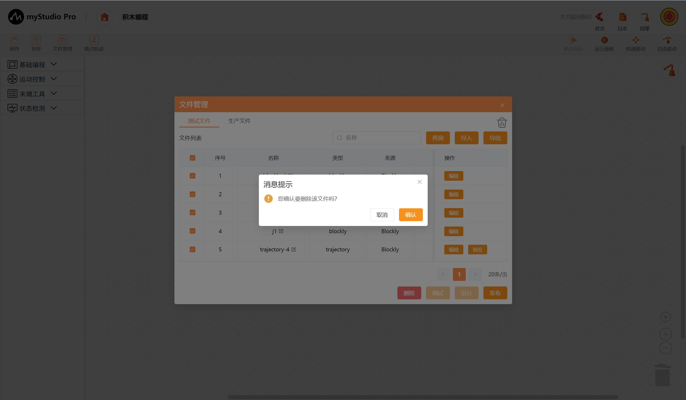

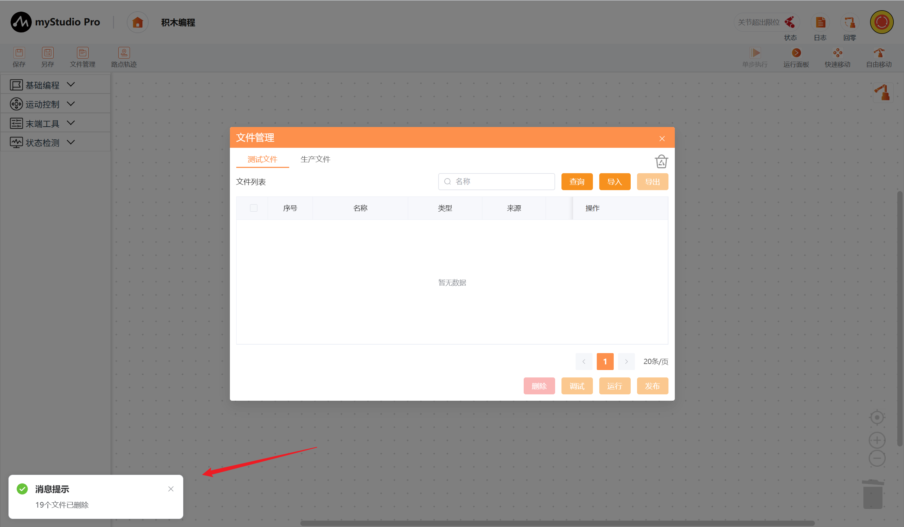

**恢复**

勾选需要恢复的文件，点击`恢复`按钮，将回收站文件恢复到测试空间。

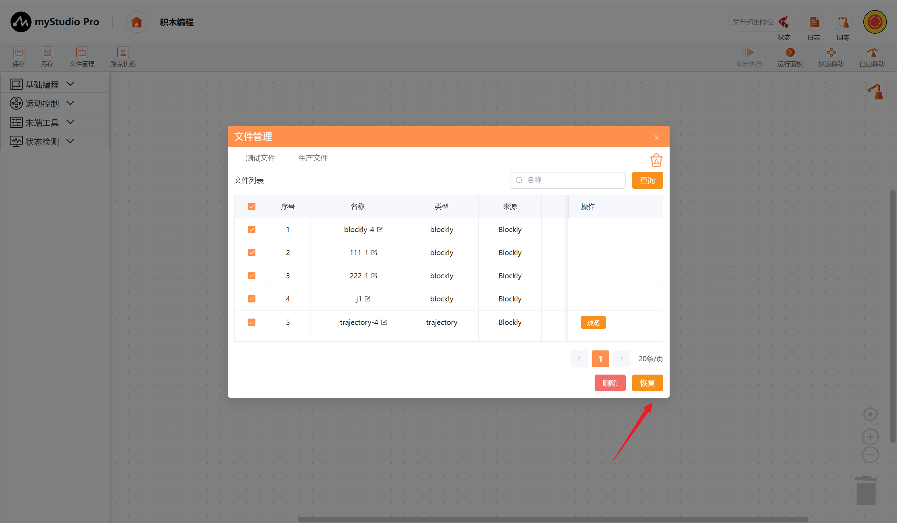

**调试**

勾选需要调试的文件，然后点击`调试`按钮，首先会对工作区是否有未保存的内容进行检测提示，有则弹窗显示，点击确认后再加载到工作区。否则直接加载，并打开调试面板。

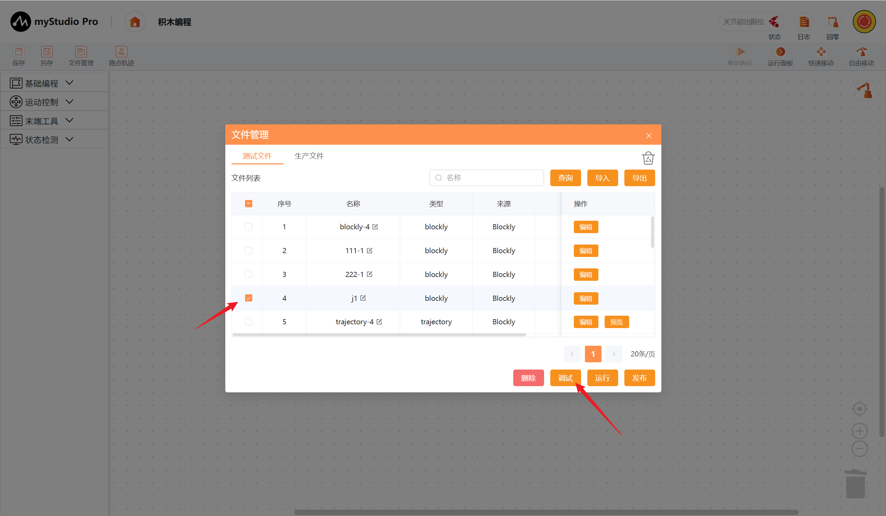

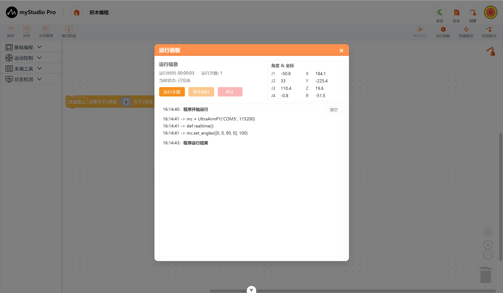

**运行**

勾选需要运行的文件，然后点击`运行`按钮，首先会对工作区是否有未保存的内容进行检测提示，有则弹窗显示，点击确认后再加载到工作区。否则直接加载，并打开运行面板点击运行即可进行运行。

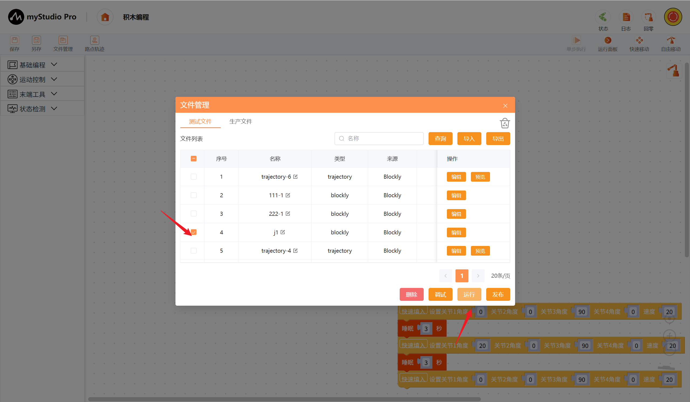

可以选择文件无限运行或指定运行次数（以下对次数循环讲解），设置完成后即可进行循环运行，首先会进行运行二次确认，点击确认后即开始循环运行。

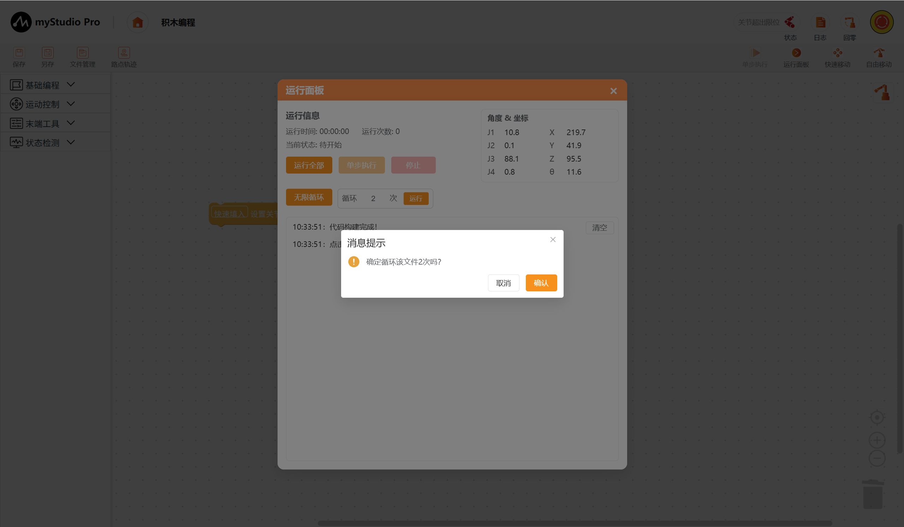

运行完成后。

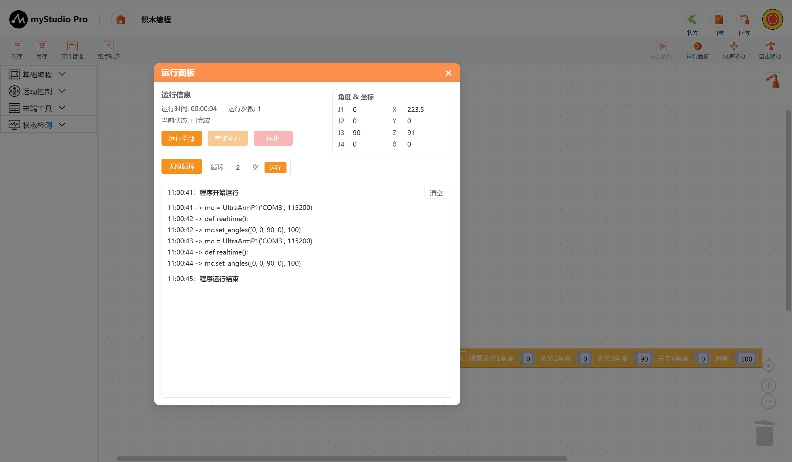

**发布**

勾选需要发布的文件，然后点击`发布`按钮，会将测试空间下对应的文件发布到生产空间，支持文件批量发布。

文件会发布至小屏幕，您可使用小屏幕的blocklyRunner功能查看是否存在同名发布文件。

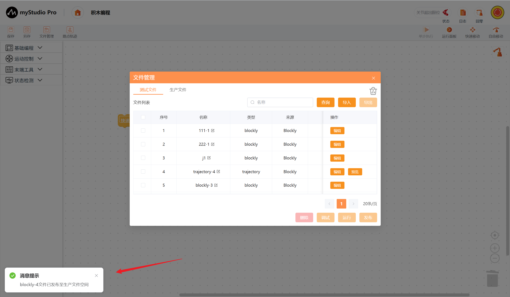

**拷贝**

点击`拷贝`按钮，将生产空间文件拷贝到测试空间，支持文件批量拷贝。

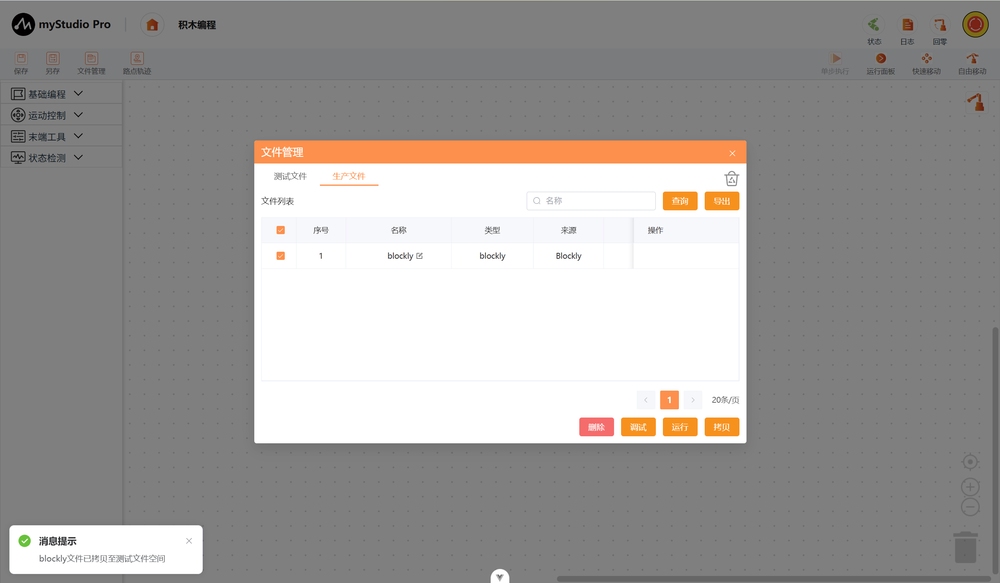

---

## 4 路点

> 以下是对路点功能的介绍，用于录入多个路点数据（关节+坐标），让机械臂按顺序自动到达各预设位置。

功能描述：通过`录入多个路点数据（机械臂的关节和坐标）`信息，快速控制机械臂到达每个路点的位置。打开路点列表页面，长按末端按钮，放松机械臂，手动调整机械臂姿态，点击新增点位，可以添加一条路点数据。

| 序号 | 功能介绍                                                         |
| ------ | -------------------------------------------------------- |
| 1    | 点击“导入”按钮，可以把之前保存好的路点信息json文件导入进来。 |
| 2    | 点击“保存”按钮，可以把路点信息全部导出合成一个json文件。     |
| 3    | 点击“删除”按钮，可以把当前路点列表中所有选中的路点进行删除操作。   |
| 4    | 点击“复制”按钮，可以把当前所有选中的路点进行坐标信息复制操作。 |
| 5    | 点击“重命名”按钮，可以把当前所有选中的路点进行路点名重命名操作。   |
| 6    | 点击“覆盖当前点”按钮，可以把当前机械臂坐标信息快速覆盖所有选中路点的坐标信息。 |
| 7    | 列表数据勾选列，功能3-6以该功能为前提。                      |
| 8    | 点击“运行”按钮，机械臂会运动到当前所录的路点位置             |
| 9    | 点击“新增点位”按钮，会录入当前机械臂的坐标信息 |
| 10   | 点击“生成代码”按钮会快速生成路点积木块到blockly程序编码区     |

在`积木编程`中选择路点积木块，加入到程序编码区。或者使用路点列表中的`生成代码`按钮，会在工作区最后一个积木块上拼接生成的路点积木块。

路点积木块关联路点列表中的数据，选择路点列表中任意路点进行关联。

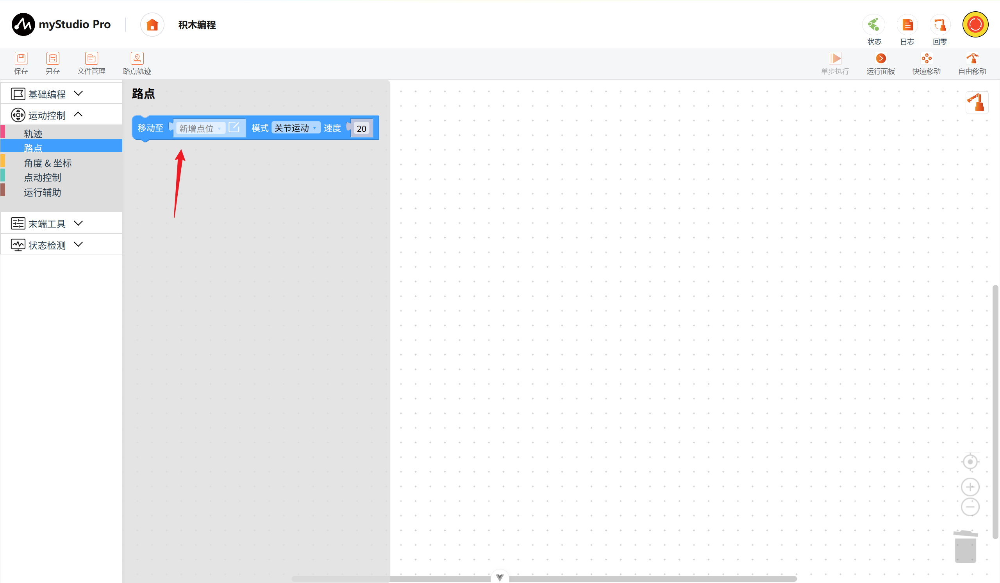

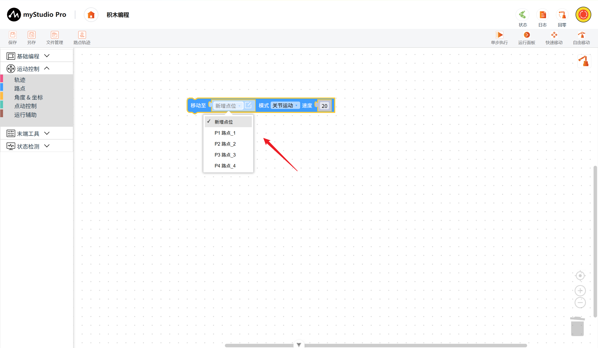

路点积木块新增点位信息。选择新增点位，点击编辑图标打开新增路点弹框，这时会默认自定义路点名字，通过+或者-进行调整好路点信息，点击保存路点按钮，即可添加路点数据。

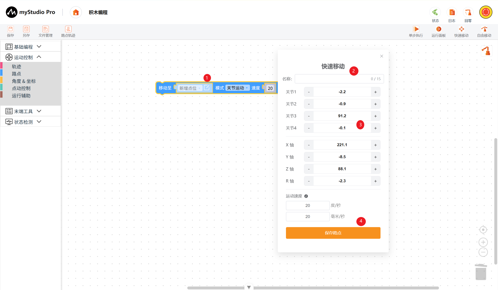

> 此外，路点积木块可对运动的模式进行修改，关节运动模式：以当前路点的关节信息进行运动，直线运动模式：以当前路点坐标信息进行运动。

| 序号 | 说明                                                         |
| ---- | ------------------------------------------------------------ |
| 1    | 选择路点，点击编辑图标后，会打开路点编辑弹框                 |
| 2    | 输入路点名称                                                 |
| 3    | 显示机械臂的关节和坐标数据，通过按钮左边(-)和右边(+)按钮进行调整路点数据 |
| 4    | 点击保存路点，可以新增或者修改路点数据                       |

--- 

## 5 轨迹

> 以下是对轨迹功能的介绍，通过手动拖拽机械臂录制运动轨迹，随后可选择并复现该轨迹

功能描述：通过`录制轨迹数据（机械臂的关节）`信息，快速控制机械臂到达每一个轨迹点位置。打开轨迹列表页面，点击录制轨迹按钮，机械臂各关节将放松，按下末端按钮并手动拖动机械臂录制轨迹，点击停止录制等待轨迹保存，保存完成即轨迹录制完成。（关于文件功能相关操作，[请点这里](./5.3.3-blockly.md#11-文件管理)）。

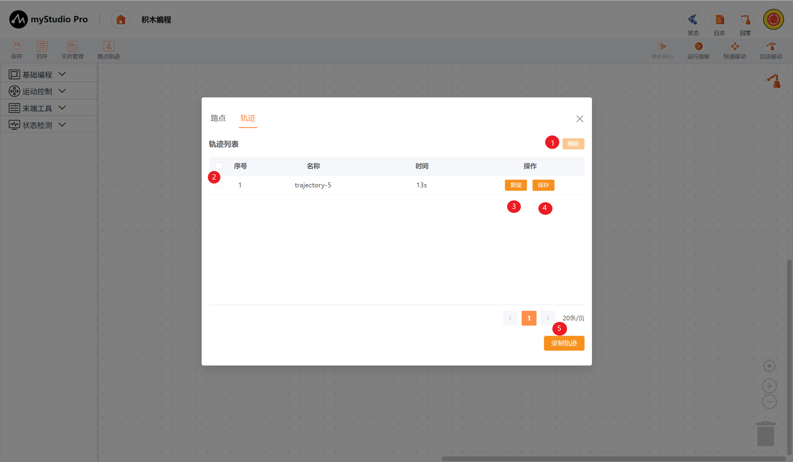

| 序号 | 说明                                                         |
| ---- | ------------------------------------------------------------ |
| 1    | 先选择需要删除的轨迹，至少勾选一条数据按钮可用，点击删除即可将所有勾选的轨迹删除。 |
| 2    | 列表数据勾选列，功能1以该功能为前提。     |
| 3    | 点击“复现”按钮，可以对该轨迹进行复现操作。   |
| 4    | 点击“保存”按钮，可以把当前轨迹拷贝至测试文件工作区。 |
| 5    | 点击“录制轨迹”按钮，机械臂会二次确认是否进行轨迹录制操作，确认后可开始录制（最长120s，超过将自动停止录制）。   |

在`积木编程`中选择轨迹积木块，加入到程序编程区。在工作区中点击轨迹积木块的下拉菜单可选择当前轨迹列表页面中的数据。

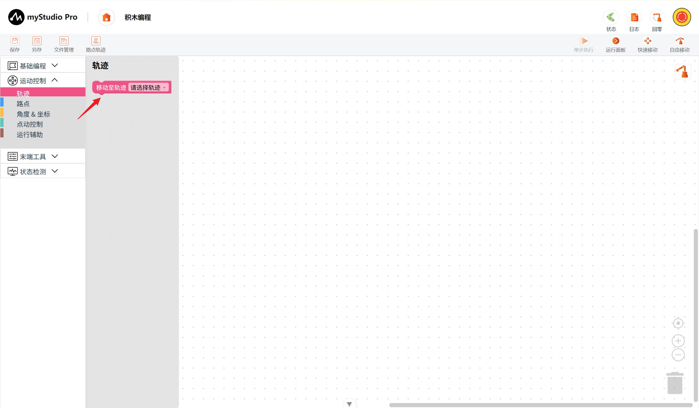

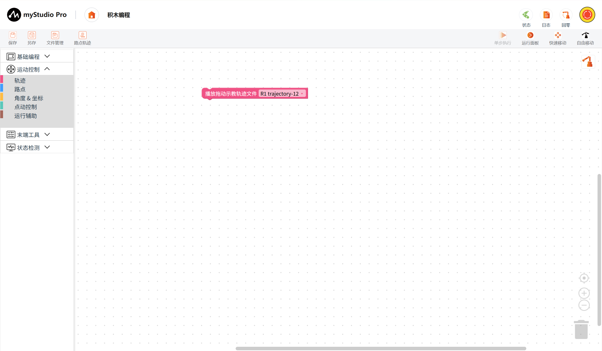

选择完成后打开运行面板，点击运行全部，可以积木块运行的方式对该轨迹进行复现。

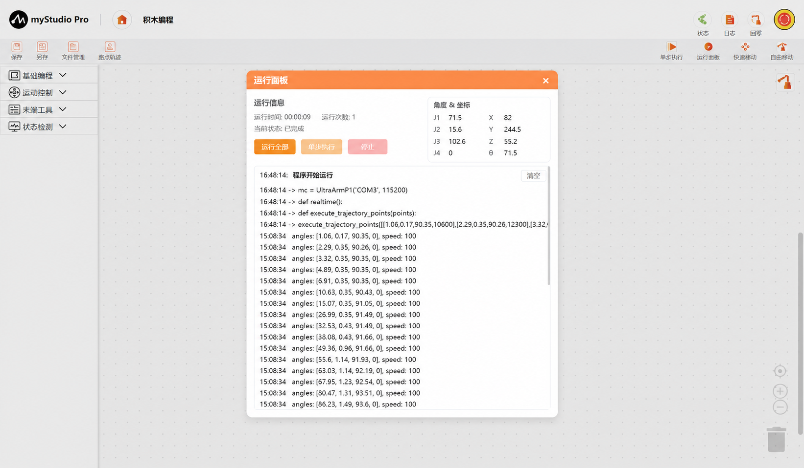

程序运行完成后，轨迹复现完成。当然，您也可以配合其他积木块进行更复杂的程序编程。

---

## 6 运行程序

> 以下是对运行程序功能的介绍，可通过单步执行来运行单个积木块，也可通过运行面板来运行工作台全部积木块文件

介绍如何通过`运行面板`来调试积木块代码，实现程序的 `暂停`、`恢复`、**`单步执行`**、`停止`。

编辑一段控制 机械臂 `关节1` 运动的程序。

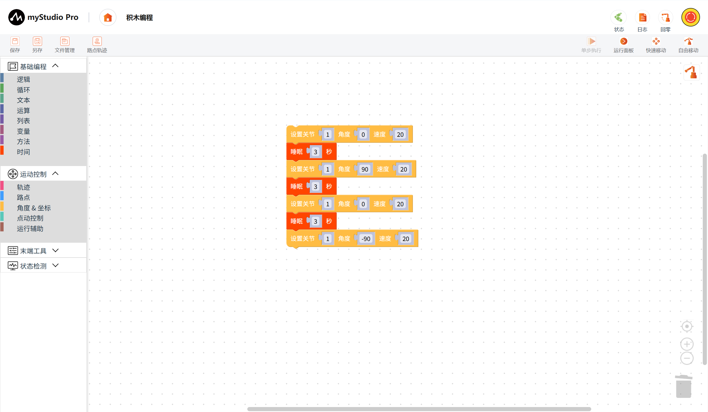

点击`运行面板`按钮，当运行面板弹出后，点击`运行全部`，马上点击 `暂停`按钮，程序会在执行完第一条指令`mc.set_angle(1,0,20)` 后暂停。

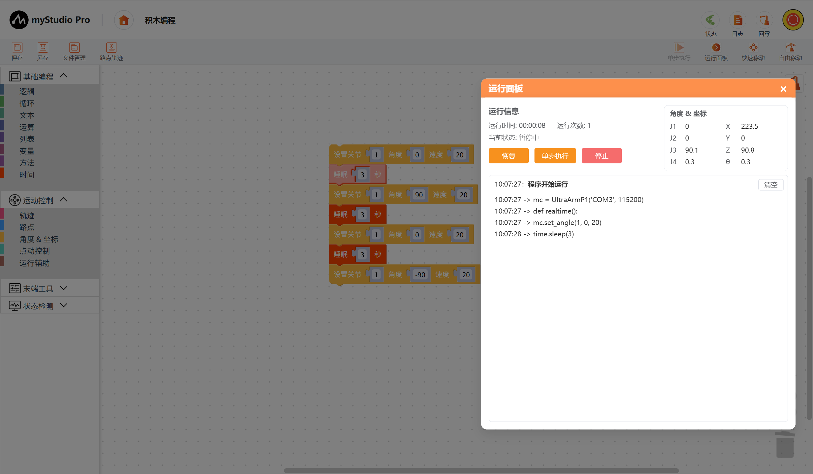

程序已暂停。出现下一条要执行的指令`time.sleep(3)`

此时：

- 如果点击`恢复`按钮，程序将会自动往下执行；
- 如果点击`单步执行`按钮，程序会执行`time.sleep(3)`指令，再次点击`单步执行`时,程序会执行下一条指令，即`mc.set_angle(1,-90,20)`；
- 如果点击`停止`按钮，程序会被终止；

至于接下来如何操作，由您自己决定吧！

所谓的单步执行，是指：单积木块执行。当工作区存在大量积木块时，我只想执行其中的一个积木块，看看是什么效果。这个时候就可以用到 单步执行。

> **单步执行** 按钮 默认处于禁用状态，是不可点击的

**第一步：** 拖动几个设置关节积木块进入工作区

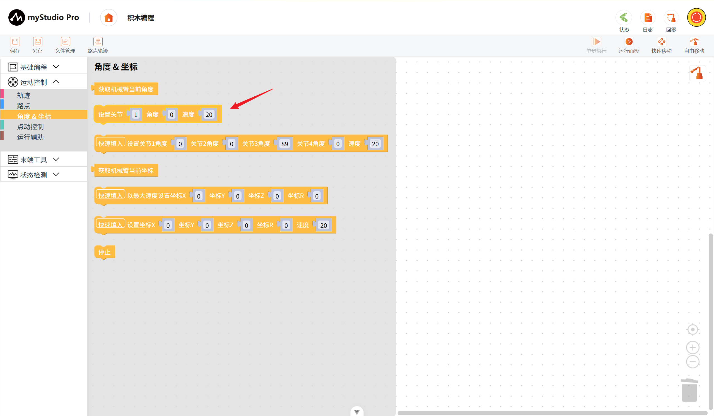

**第二步：** 选中 `设置关节` 积木块，观察到 **单步执行** 按钮已被解锁（颜色变为了深色）

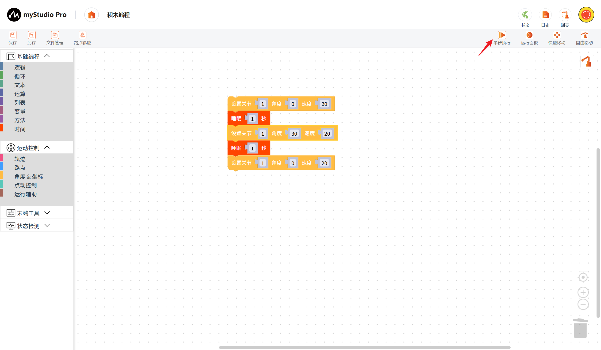

**第三步：** 点击 **单步执行** 按钮，会自动打开运行面板，并开始执行代码。同时，观察机械臂运动变化。(单步执行设置关节1为30°)

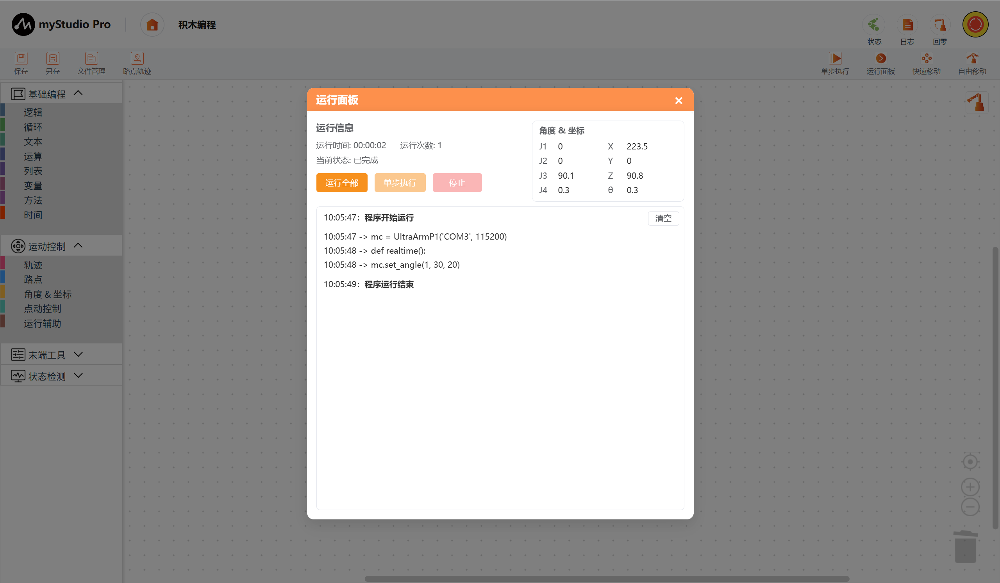

--- 

## 7 快速移动

> 以下是对快速移动功能的介绍，直接控制机械臂各关节或各坐标方向移动

什么是 快速移动 ？简单来讲就是，无需编程，仅通过鼠标点击的方式快速控制机器人移动。

**第一步：** 点击快速移动按钮，打开 快速移动 面板，等待机器人数据返回。

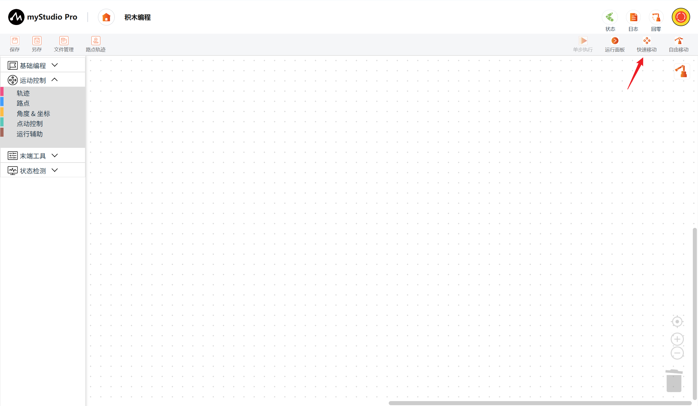

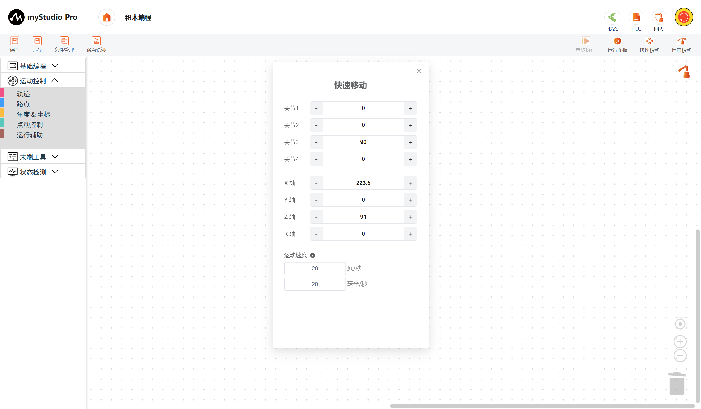

如果数据全为零，请检查是否已连接机械臂，机械臂是否正常。

**第二步：** - / +按钮控制机械臂的不同关节，支持单点、长按持续移动和直接修改角度、坐标并按下Enter回车控制。

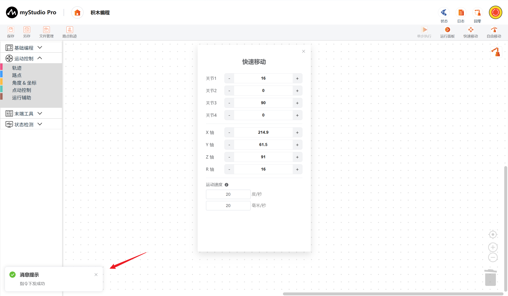

**第三步：** 控制坐标。

首先需要先将机械臂回到零点位置，如下图。或长按右上角回零按钮，等待机械臂回零完成。

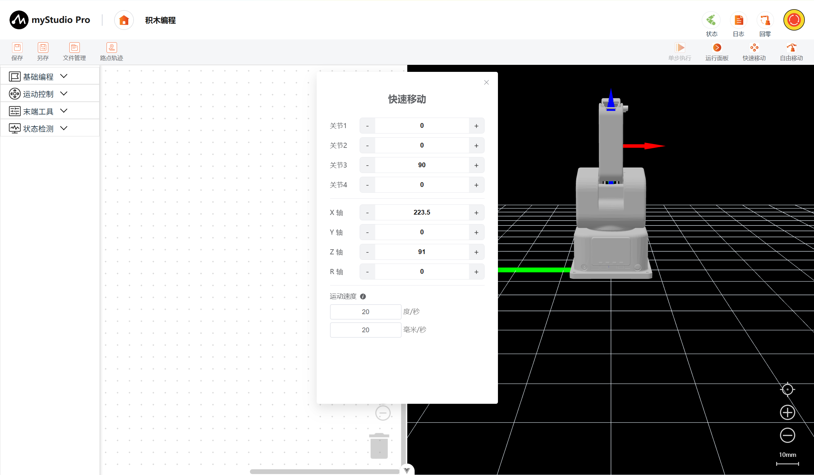

对于其它功能，请查阅[调试面板](./5.3.4-debugPlane.md)

--- 

## 8 自由移动

> 以下是对自由移动功能的介绍，点击开关后电机松开，可直接用手拖拽机械臂至任意位置

自由移动模式开启时，图标为彩色；自由移动模式关闭时，图标为灰色。进入积木编程页会自动检测当前的模式。

> 注意：软件开启时，会将自由移动模式设为关闭状态。

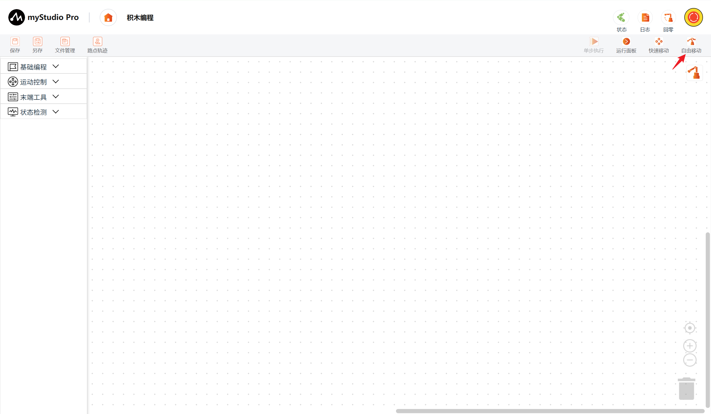

点击未激活的自由运动按钮，将弹出一个启用自由运动模式的确认提示窗口。点击`确认`以激活该功能。激活后，您可按下末端按钮来移动机械臂。

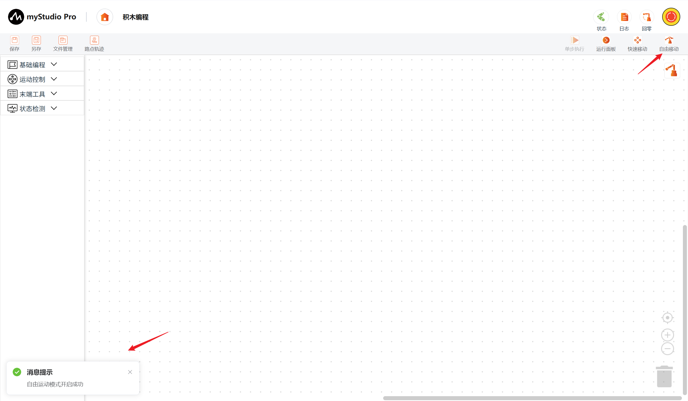

当处于开启状态时，点击按钮会直接下发关闭指令，关闭成功后展示对应的提示消息，同时按钮高亮取消。

---

## 9 门型移动抓取案例

> 以下是对门型移动抓取案例的介绍，请确保机械臂末端已装配吸泵工具

阅读该小节前请确保您对已掌握路点、程序运行、文件管理功能，请确保机械臂工作区无障碍物，保证机械臂的正常运动。

首先需要将抓取物件放置至工作范围内，待抓取物件放置平稳后，此时需要将物件的点位信息进行记录，可以使用`自由移动`和`路点`功能。

1. 开启`自由移动`模式。

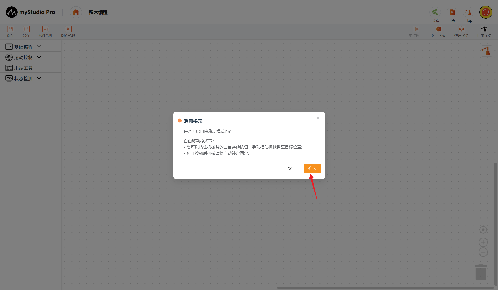

2. 按住`白色磨砂`按钮，将机械臂移动至抓取物件正上方位置，位置到达后放开松开按钮并打开点击`路点轨迹`面板，点击`新增点位`将该点位数据记录（点位1）。

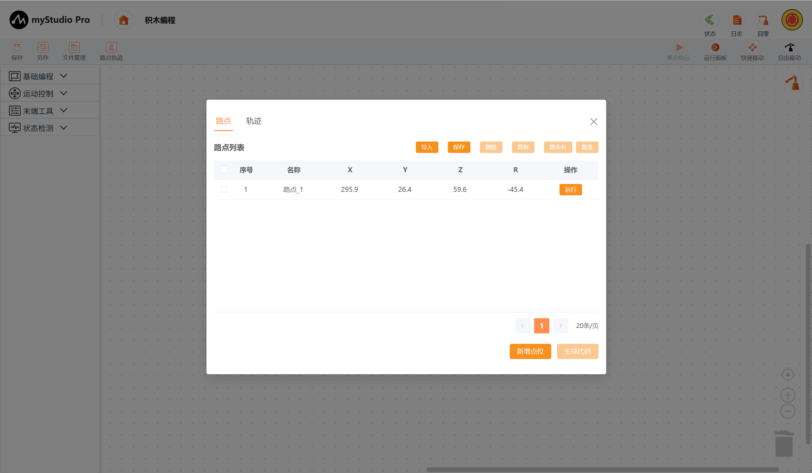

3. 物件正上方的点位记录完成后，需要记录吸泵需抓取的点位，同样的按下`白色磨砂`按钮将机械臂移动至吸泵工具可抓取物件的位置，位置到达后松开按钮并打开点击`路点轨迹`面板，点击`新增点位`将该点位数据记录（点位2）。
> 该位置主要是为了吸泵可以成功抓取物件

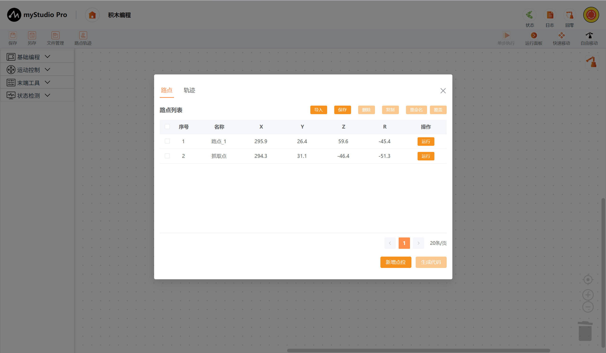

4. 完成上述步骤后，此时建议您将点位2复制为一个过度点（点位3）。

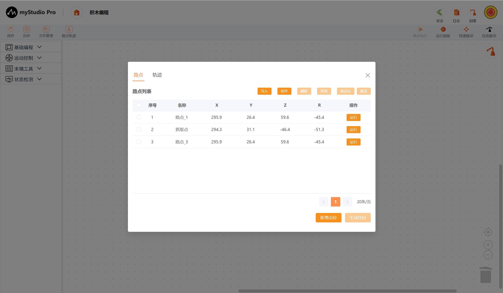

5. 现在需要定义一个物件释放点正上方，您可以通过自由移动或快速移动将机械臂调整至对应的点位，该点位建议只运动关节1，完成移动后同样的将该点位记录（点位4）。

6. 完成点位4记录后，最后就需要定义实际的物件释放点，建议为点位4的正下方（点位5）。

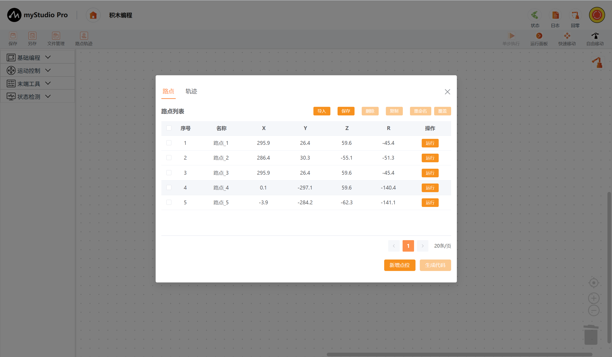

7. 然后将点位4复制为一个回零过度点（点位6）。

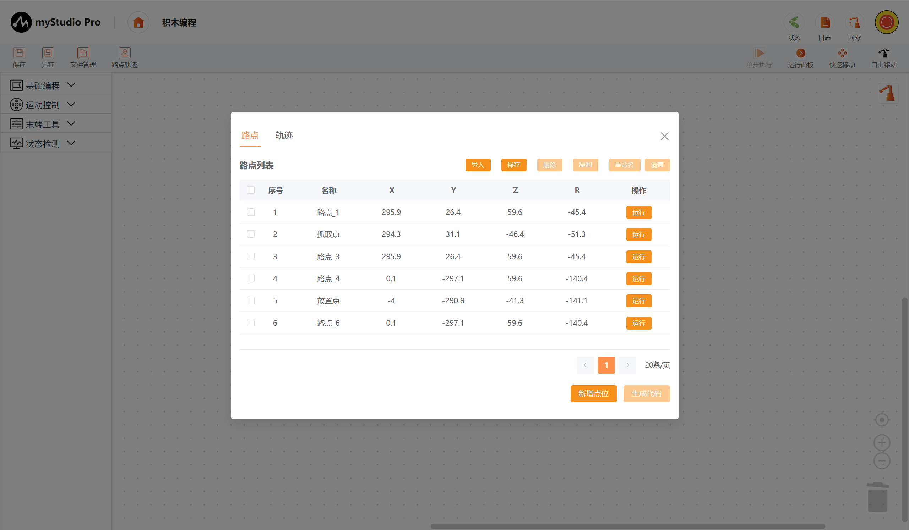

8. 最后，点击右上角回零按钮或使用积木块将机械臂运动至初始位置，并将该位置记录（点位7）。

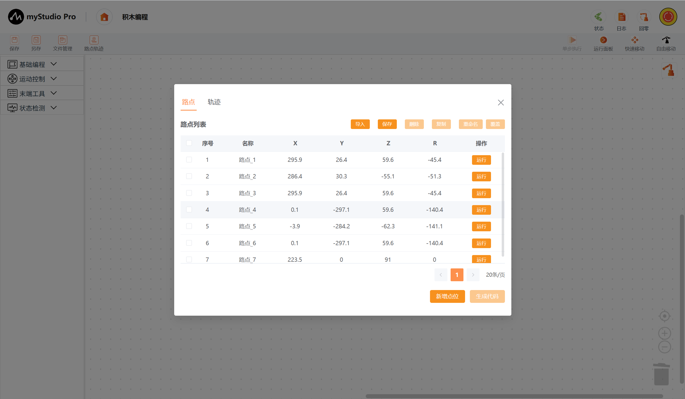

完成本次案例的所有点位信息记录后，此时就需要使用到`末端工具`类别中的吸泵控制和`运动控制`类别路点积木块，若您对路点功能不熟悉，建议您先仔细阅读[路点](./5.3.3-blockly.md#4-路点)介绍。

将所有的路点数据勾选，并点击`路点轨迹`面板中的`生成代码`按钮，生成对应的路点积木块。

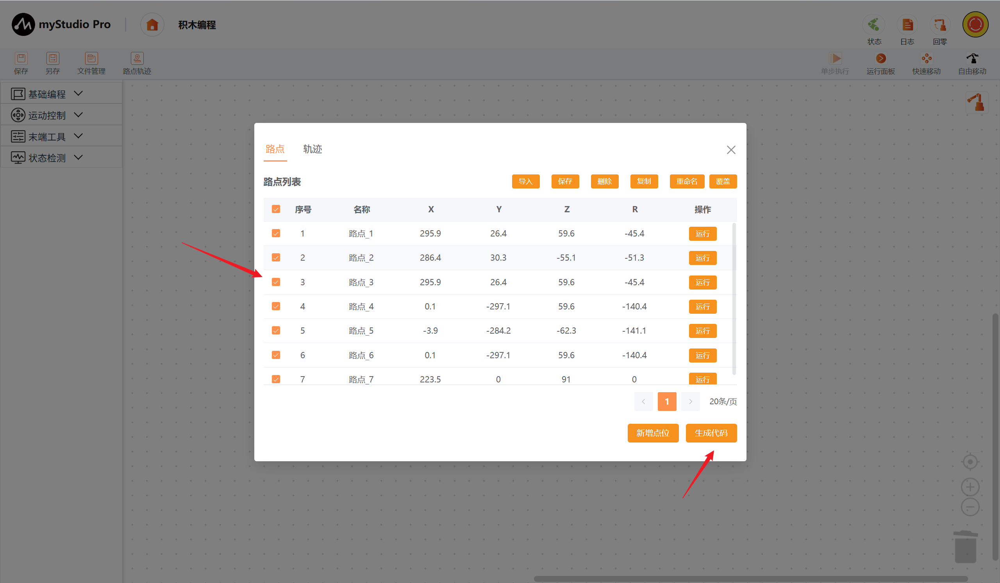

同时，以上述操作为例点位2为物体抓取点，需要拼接上吸泵控制积木块，并将状态设置为释放，执行到该代码吸泵将抓取物件。

同样的，以上述操作为例点位5为物体释放点，需要拼接上吸泵控制积木块，并将状态设置为打开，执行到该代码吸泵将抓取物件。

最后将不再使用的吸泵关闭和机械臂回零，完整的积木块编程代码如下图。

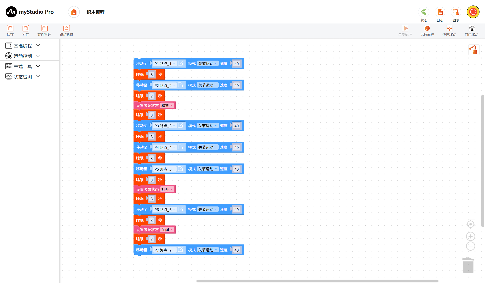

将机械臂回零，点击运行面板即可看到移动抓取的案例效果。

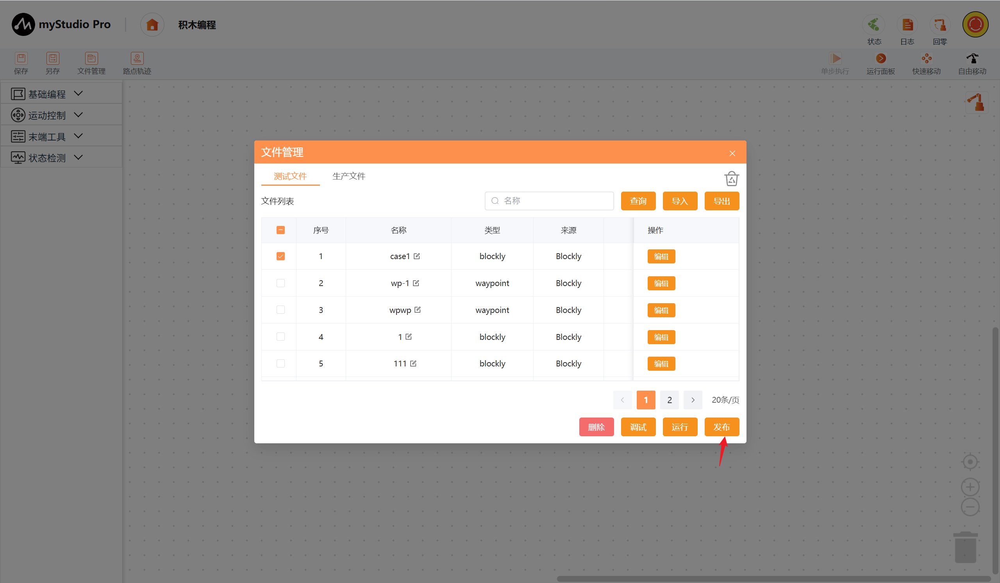

若您有多个物件需要抓取，您可以添加循环控制。

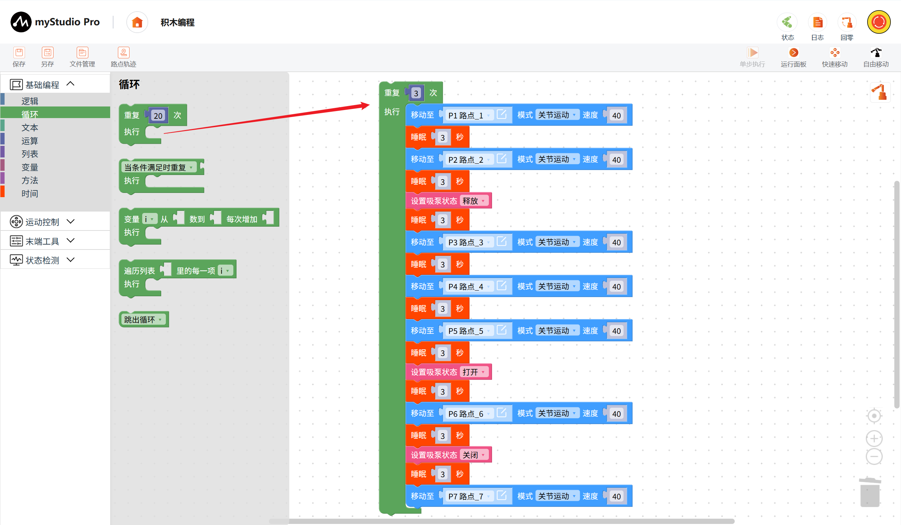

把该案例保存至文件管理，点击保存按钮，并给文件命名（case1），点击`确认`按钮确认保存。

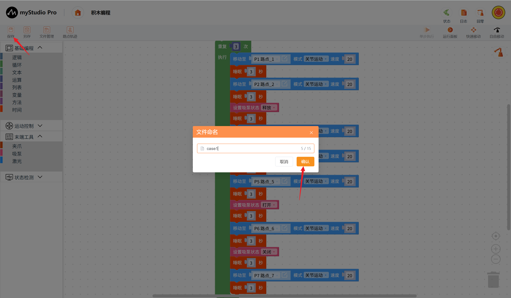

保存成功后即可在文件管理面板管理该文件。

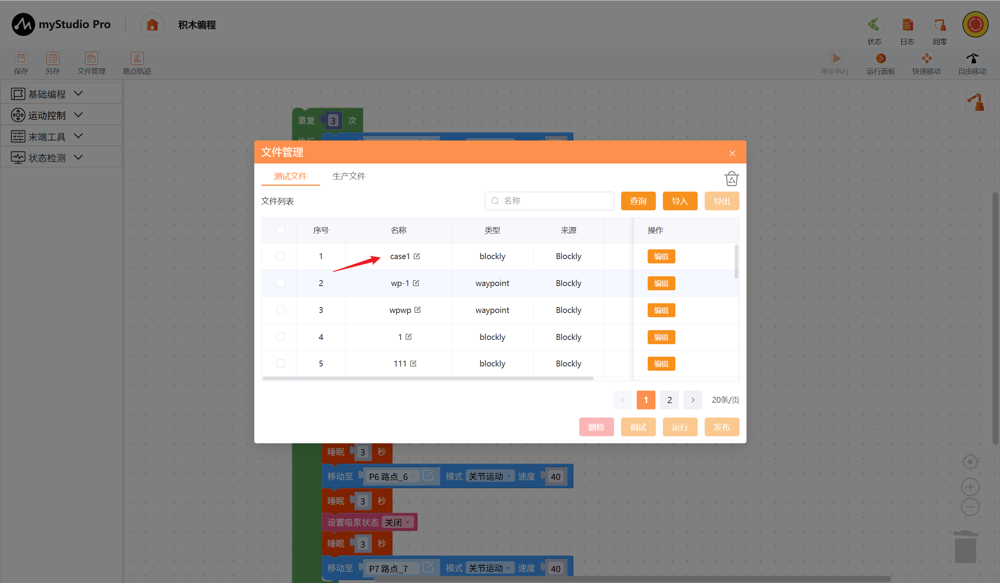

若您想将程序保存至设备中，可以使用`另存为`功能，点击按钮将弹出文件路径选择弹窗。文件名默认为blockly.json，您可以自定义文件名。

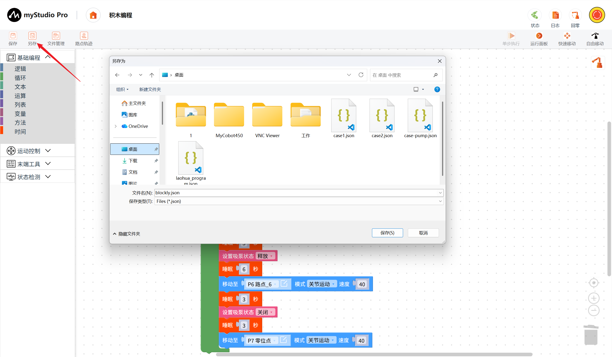

选择需要保存的路径和定义需保存的文件。点击保存按钮即可实现保存。另存为保存成功后即可到设备对应路径查看保存的文件。

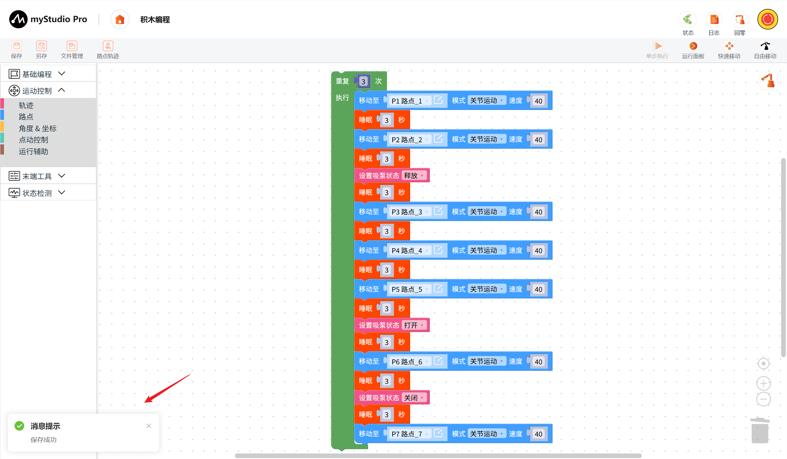

打开`文件管理面板`选择该文件，点击`发布`按钮发布至小屏幕，发布成功后文件变为生产文件，同时可在小屏幕中的BlocklyRunner菜单项中查找到同名的.py文件（注：软件发布至小屏幕的Blockly类型会以.py文件的形式存储）

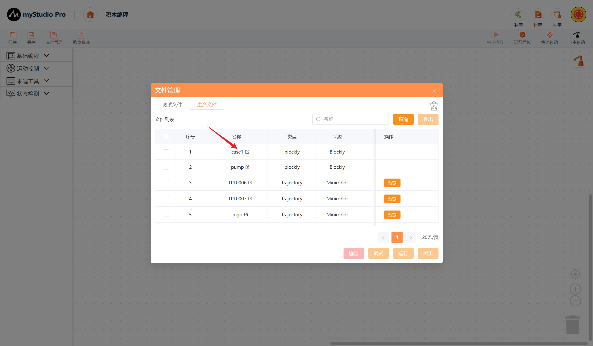

此时，就可用小屏幕运行对应的文件，具体可看小屏幕[BlocklyRunner章节](../5.2-minirobot/5.2.3-blocklyrunner.md)。

--- 

## 10 拖动示教案例

> 以下是对拖动示教案例的介绍

**注意：软件部分控制页面与小屏幕存在互斥功能，建议录制前先关闭软件，录制完成后再开启**

首先，使用小屏幕中的[拖动示教](../5.2-minirobot/5.2.2-dragteach.md)功能，录制两条示教轨迹，本次案例分别以`TPL0004`和`TPL0003`。

录制完成后，打开文件管理面板，选择`生产文件`，就能查询到对应的轨迹文件。

将小屏幕生成的轨迹文件使用文件管理中的`拷贝`功能，拷贝至测试文件中，测试文件支持`编辑`与`预览`。

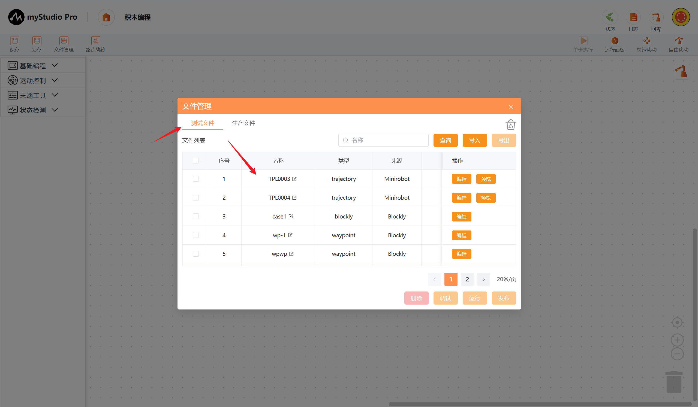

接下来我们通过某个判断条件，此案例结合判断末端IO引脚1状态（输入输出状态和高低电平），播放轨迹文件。

首先，需要先创建一个变量a，然后点击`确认`按钮。

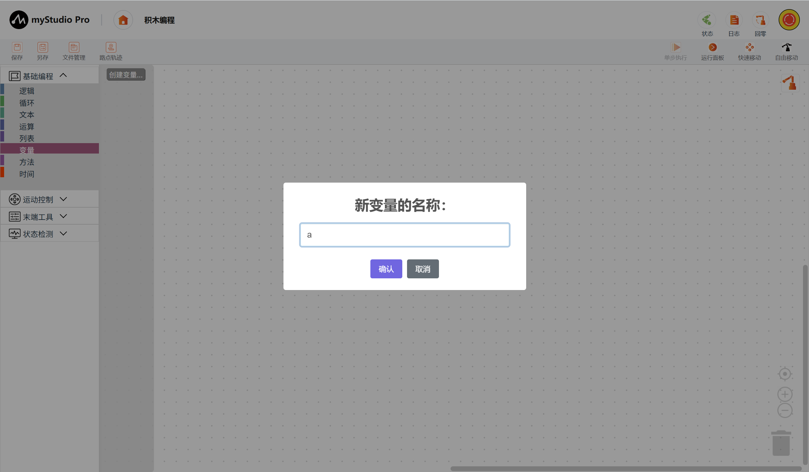

变量创建完成后，通过积木块进行编程，使用到逻辑判断如果执行、否则积木块。满足如果分支当前引脚输出3（输出低电平）则播放`TPL0004`，否则执行a++逻辑并将机械臂回零。

具体的积木块代码如下：

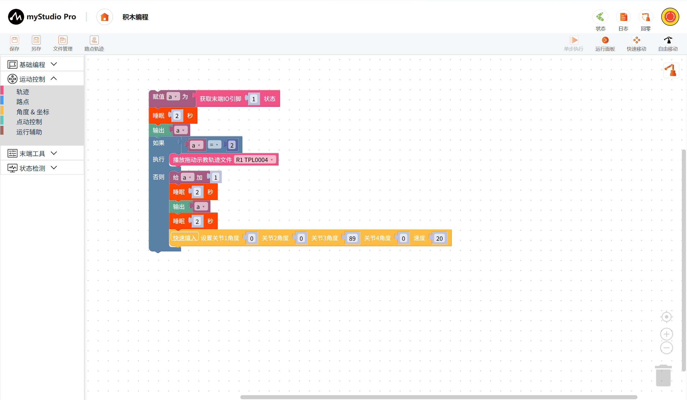

点击`运行面板`，运行代码。

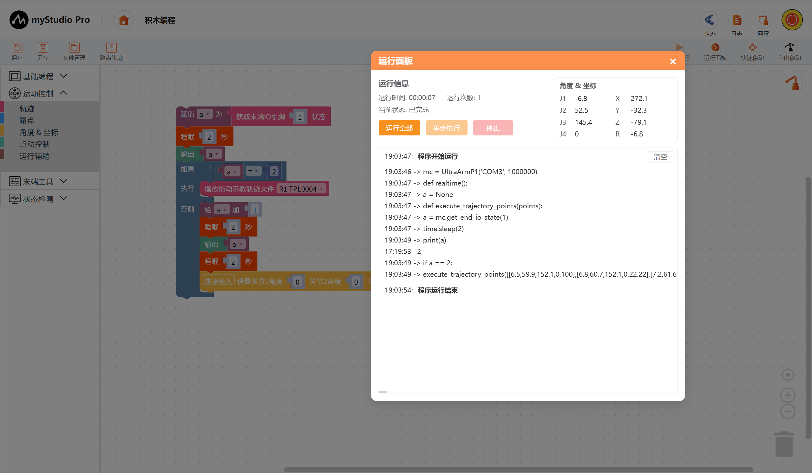

此时，我想让代码执行否则分支，可以前往调试面板将引脚1输出低电平修改为输出高电平具体查看[调试面板](./5.3.4-debugPlane.md#72-工具引脚)章节工具引脚功能。

**注意：** 提前将编程好的代码保存。

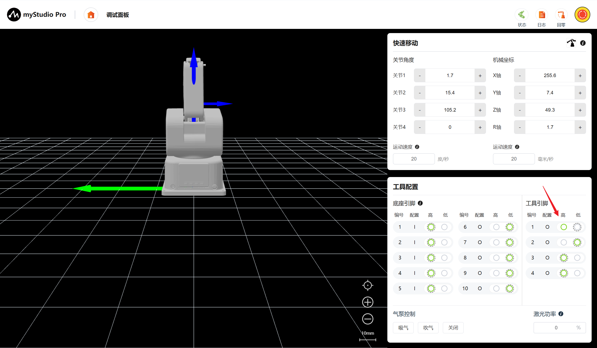

修改完成后，返回积木编程将文件编辑，再次运行代码。

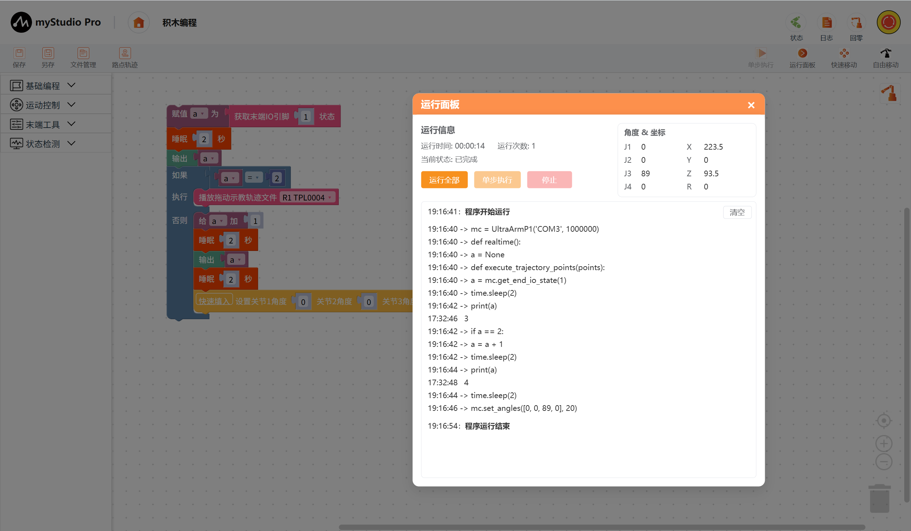

通过以上两个案例的介绍，希望能让您对积木编程功能更熟悉，您可以探索更有趣的功能！

--- 

[← 上一章](./5.3.2-launch.md) | [下一章 →](./5.3.4-debugPlane.md)