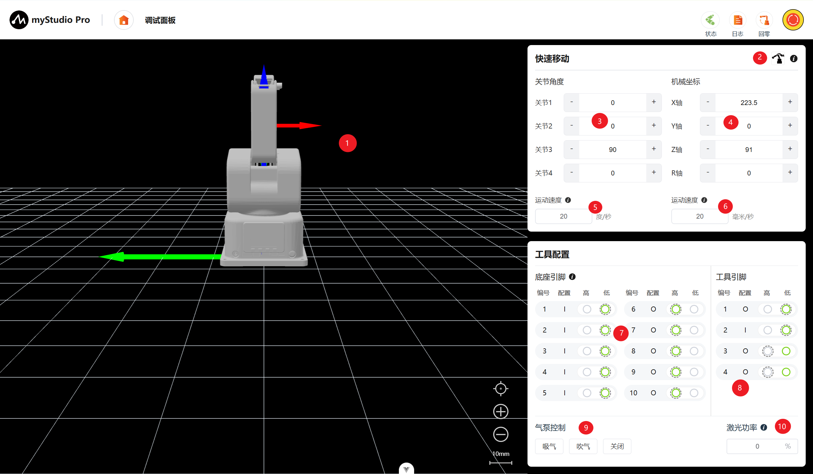

# 调试面板

*开始之前*

> *1、确保机器已上电*
> 
> *2、确保机器连接正常、通信正常*
> 
> *3、确保机器处于零位状态*

## 1 界面介绍

| 序号 | **说明**                                                     |
| ---- | ------------------------------------------------------------ |
| 1    | ultraArm P1 3D仿真模型（坐标系红色箭头：X，绿色箭头：Y，蓝色箭头：Z）  |
| 2    | 自由移动开关，可开启或关闭自由移动模式                     |
| 3    | 角度控制，通过点击 `+` `-` 按钮，对机械臂进行关节角度控制，数值代表当前机械臂的关节角度信息，也可以直接修改数值进行关节控制                           |
| 4    |  坐标控制，通过点击 `+` `-`按钮，对机械臂进行坐标控制，数值代表当前机械臂的坐标姿态信息，也可以直接修改数值进行坐标控制 |
| 5    | 设置机械臂关节的运动步长，默认 20 度/秒 |
| 6   | 设置机械臂坐标的运动步长，默认 20 毫米/秒                   |
| 7    | 底部引脚配置，可对底部IO进行读取和配置                          |
| 8   |  工具引脚配置，可对末端工具IO进行读取和配置 |
| 9    | 气泵控制，可进行气泵的吸气、吹起和关闭操作 |
| 10   | 激光功率控制，通过文本框输入数值调控激光功率                  |

## 2 角度控制
在角度控制区域中，通过点击`+` `-`按钮，对机械臂进行关节角度控制，数值代表当前机械臂的关节角度信息，也可以直接修改数值进行关节控制，输入限位范围内的位置，然后点击`Enter`，即可进行控制。
### 正在编写中
## 3 坐标控制
在使用坐标控制之前，需要将 关节3 移动到 90左右的角度位置。
### 正在编写中
## 4 持续移动

以通过长按 对应区域的`+` `-` 按钮，可以控制机器人按照指定的角度/坐标进行持续移动。
### 正在编写中
## 5 IO 控制
### 正在编写中
## 6 吸泵控制
### 正在编写中
## 7 激光功率控制
### 正在编写中

[← 上一章](./5.3.3-blockly.md) | [下一章 →](./5.3.5-resourceCenter.md)