# 调试面板

*开始之前*

> *1、确保机器已上电*
> 
> *2、确保机器连接正常、通信正常*
> 
> *3、确保机器处于零位状态*

## 1 界面介绍

| 序号 | **功能介绍**                                                     |
| ---- | ------------------------------------------------------------ |
| 1    | ultraArm P1 3D仿真模型（坐标系红色箭头：X，绿色箭头：Y，蓝色箭头：Z）  |
| 2    | 自由移动开关，可开启或关闭自由移动模式                     |
| 3    | 角度控制，通过点击 `+` `-` 按钮，对机械臂进行关节角度控制，数值代表当前机械臂的关节角度信息，也可以直接修改数值进行关节控制                           |
| 4    | 坐标控制，通过点击 `+` `-`按钮，对机械臂进行坐标控制，数值代表当前机械臂的坐标姿态信息，也可以直接修改数值进行坐标控制 |
| 5    | 设置机械臂关节的运动步长，默认 20 度/秒 |
| 6    | 设置机械臂坐标的运动步长，默认 20 毫米/秒                   |
| 7    | 底部引脚配置，可对底部IO进行读取和配置                          |
| 8    | 工具引脚配置，可对末端工具IO进行读取和配置 |
| 9    | 气泵控制，可进行气泵的吸气、吹起和关闭操作 |
| 10   | 激光功率控制，通过文本框输入数值调控激光功率                  |

## 2 自由移动

自由移动开关，可开启/关闭机械臂自由移动模式。

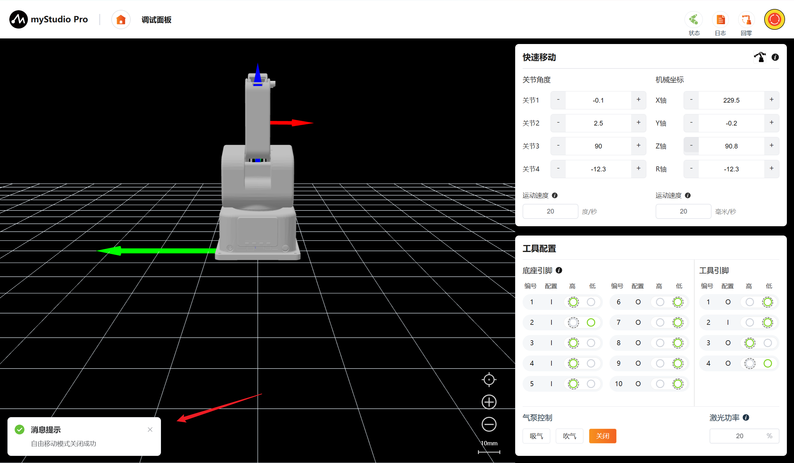

点击确认按钮，即可开启自由移动模式

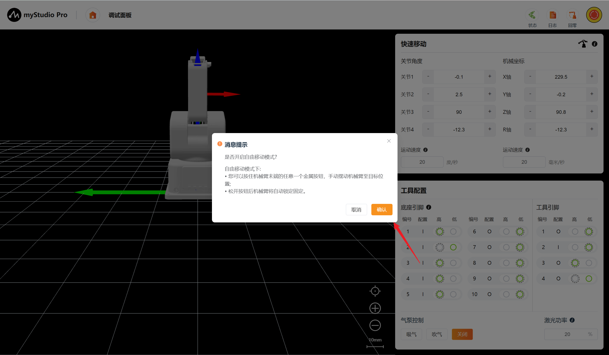

## 3 角度控制
在角度控制区域中，通过点击`+` `-`按钮，对机械臂进行关节角度控制，数值代表当前机械臂的关节角度信息，也可以直接修改数值进行关节控制，输入限位范围内的位置，然后点击`Enter`，即可进行控制。

**注意：**
> 输入角度:按设置的关节运动步长移动至目标角度
> 
> 长按”+"/"-"时:按此运动速度移动
> 
> 单点”+"/"-"时:按最小速度运动0.1度

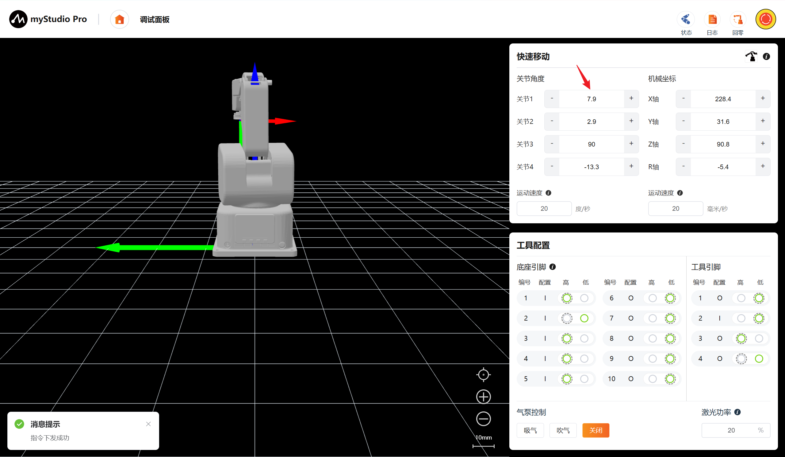

## 4 坐标控制

在使用坐标控制之前，建议将机械臂回零再进行操作。

**注意：**
> 输入角度:按设置的坐标运动步长移动至目标角度
> 
> 长按”+"/"-"时:按此运动速度移动
> 
> 单点”+"/"-"时:按最小速度运动0.1度

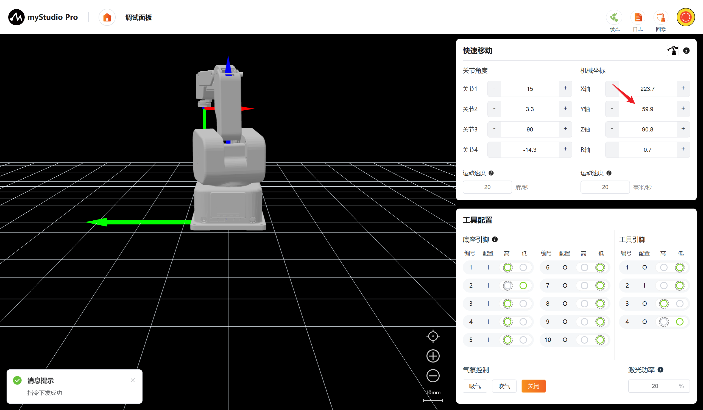

## 5 持续移动

以通过长按 对应区域的`+` `-` 按钮，可以控制机器人按照指定的角度/坐标进行持续移动。

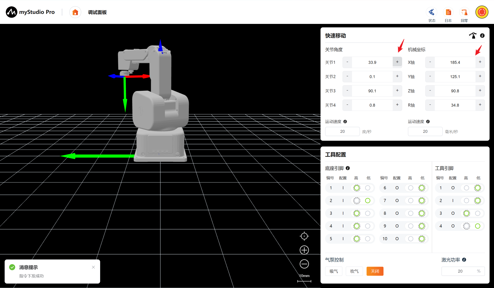

> 注意： 当长按操作持续运动到关节限位处时会自动停止。

## 6 运动不长

## 7 工具配置

在该功能模块可以直观的观察引脚编号、配置、电平状态，其中电平状态项中高亮的为当前引脚的实际状态。外边框虚线代表[引脚配置](./5.3.7-setting.md#3-引脚配置)页中设置的默认电平状态。

> I: 表示为当前为输入引脚，无法切换电平高低
> 
> O：表示为当前为输出引脚，可以切换电平
>
> 外边框虚线: 表示该电平为IO配置页面所配置的默认电平

### 7.1 底座引脚

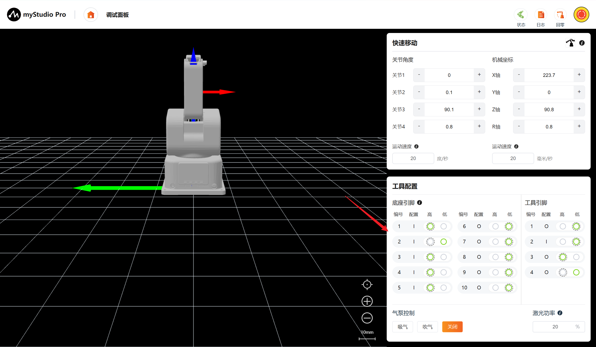

> 底座引脚6电平状态由低电平修改至高电平

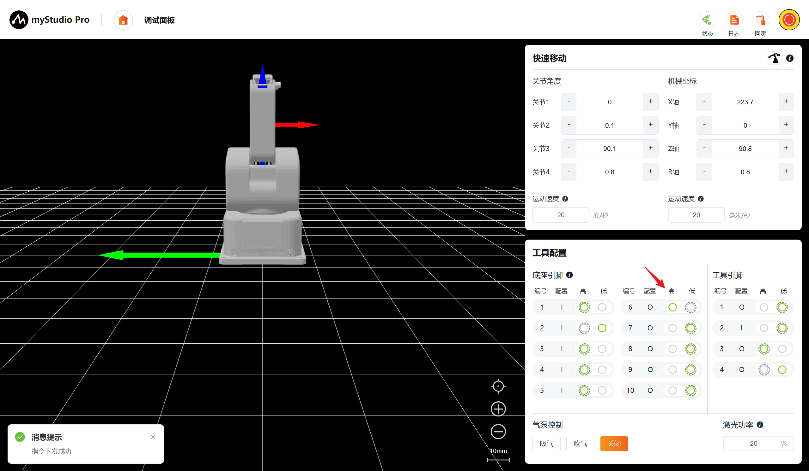

### 7.2 工具引脚

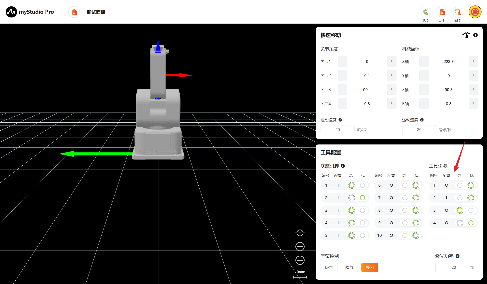

> 工具引脚3电平状态由低电平修改至高电平

## 8 吸泵控制

可进行气泵控制包括吸气、吹气、关闭。其中按钮存在互斥，通过点击切换状态。

吸气：启动真空发生器，使末端吸盘产生67kpa负压。

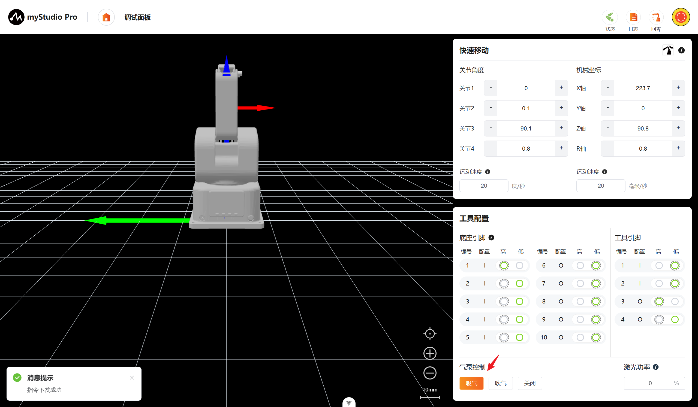

吹气：切换气路，使末端吸盘产生67kpa破真空气压。

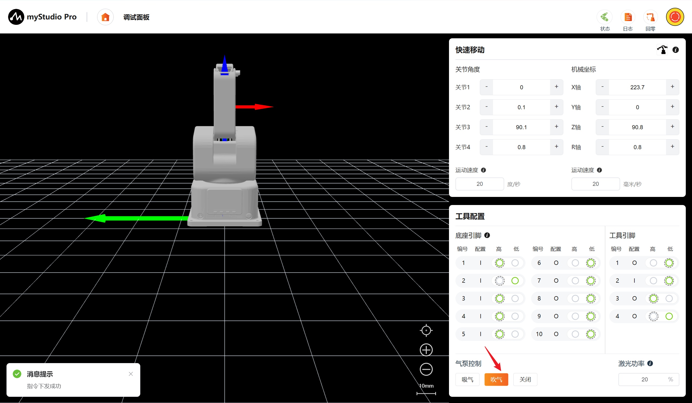

关闭：切断气泵电源或关闭所有气阀，气路恢复至常压状态。

## 9 激光功率控制

通过文本框输入数值调控激光功率，回车或点击空白处提交修改，0%为关闭激光。

**注意：严禁直视激光或将激光指向眼部**

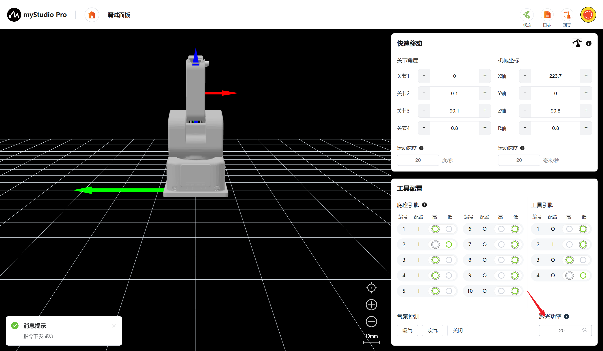

[← 上一章](./5.3.3-blockly.md) | [下一章 →](./5.3.5-resourceCenter.md)