# 调试面板

调试面板如同机械臂的实时遥控器，支持点动控制（角度/坐标）、运动步长设定、IO引脚电平查看与切换，以及气泵与激光的即时操作，让调试与控制尽在掌握。

*开始之前*

> *1、确保机器已上电*
> 
> *2、确保机器连接正常、通信正常*
> 
> *3、确保机器处于零位状态*

## 界面介绍

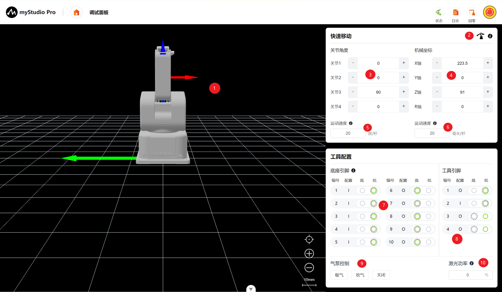

| 序号 | **功能介绍**                                                     |
| ---- | ------------------------------------------------------------ |
| 1    | ultraArm P1 3D仿真模型：模拟真实机械臂运动（坐标系红色箭头：X，绿色箭头：Y，蓝色箭头：Z）  |
| 2    | 自由移动开关：可开启或关闭自由移动模式                     |
| 3    | 角度控制：通过点击 `+` `-` 按钮，对机械臂进行关节角度控制，数值代表当前机械臂的关节角度信息，也可以直接修改数值进行关节控制                           |
| 4    | 坐标控制：通过点击 `+` `-`按钮，对机械臂进行坐标控制，数值代表当前机械臂的坐标姿态信息，也可以直接修改数值进行坐标控制 |
| 5    | 关节运动步长：设置机械臂关节的运动步长，默认 20 度/秒 |
| 6    | 坐标运动步长：设置机械臂坐标的运动步长，默认 20 毫米/秒                   |
| 7    | 底部引脚配置：可对底部IO进行读取和配置                          |
| 8    | 工具引脚配置：可对末端工具IO进行读取和配置 |
| 9    | 气泵控制：可进行气泵的吸气、吹气和关闭操作 |
| 10   | 激光功率控制：通过文本框输入数值调控激光功率                  |

---

## 自由移动

> 以下是对自由移动功能的介绍，用于松开电机让用户手动拖拽机械臂到任意姿态

自由移动开关，可开启/关闭机械臂自由移动模式。按钮的高亮代表当前自由移动模式已开启，反之则关闭。

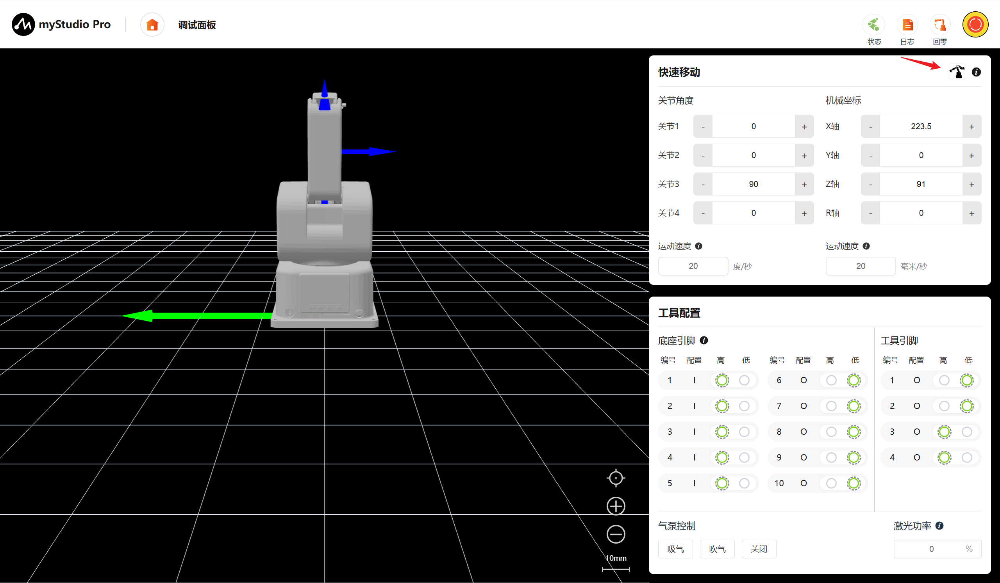

当处于关闭状态时，点击按钮会弹出二次确认弹窗，点击`确认`按钮，即可开启自由移动模式。

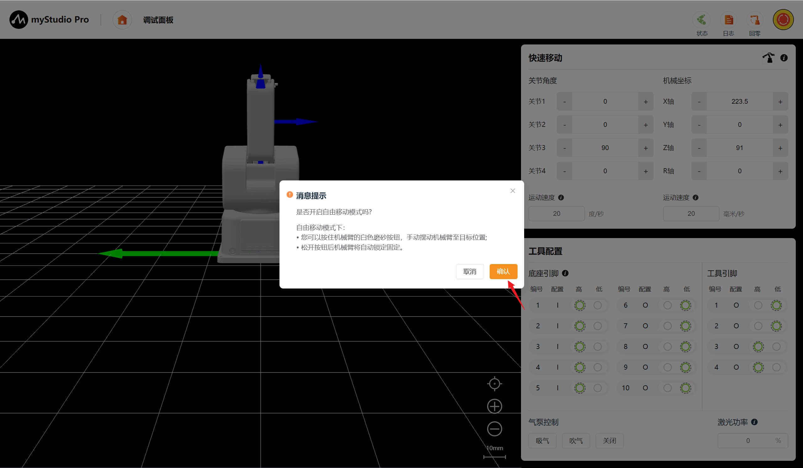

自由自动模式开启成功后，将展示对应的提示消息，同时按钮将变为高亮状态。

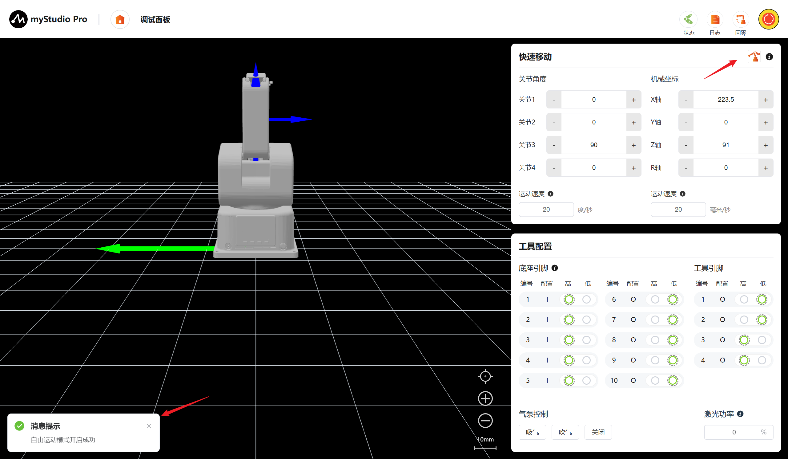

当处于开启状态时，点击按钮会直接下发关闭指令，关闭成功后展示对应的提示消息，同时按钮高亮取消。

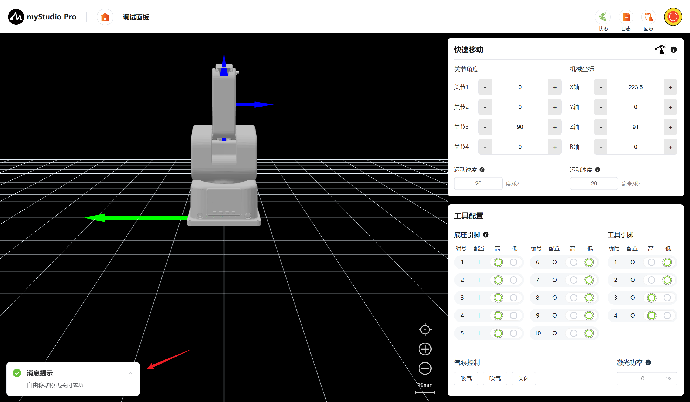

---

## 角度控制

> 以下是对角度控制功能的介绍，用于对各关节进行角度点动控制

在角度控制区域中，通过点击`+` `-`按钮，对机械臂进行关节角度控制，数值代表当前机械臂的关节角度信息，也可以直接修改数值进行关节控制，输入限位范围内的位置，然后点击`Enter`，即可进行控制。

**注意：**
> 输入角度：按设置的关节运动步长移动至目标角度
> 
> 长按`+`/`-`时：按设置的运动速度移动
> 
> 单点`+`/`-`时：按最小速度运动0.1度

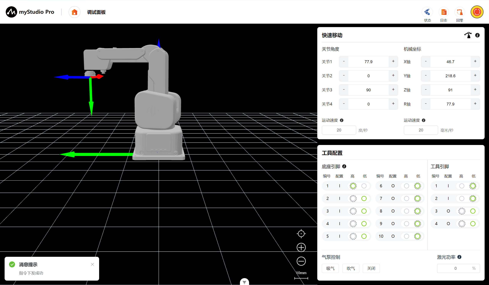

---

## 坐标控制

> 以下是对坐标控制功能的介绍，用于对机械臂末端坐标进行调控

在使用坐标控制之前，建议将机械臂回零再进行操作。

**注意：**
> 输入角度：按设置的坐标运动步长移动至目标角度
> 
> 长按`+`/`-`时：按设置的运动速度移动
> 
> 单点`+`/`-`时：按最小速度运动0.1度

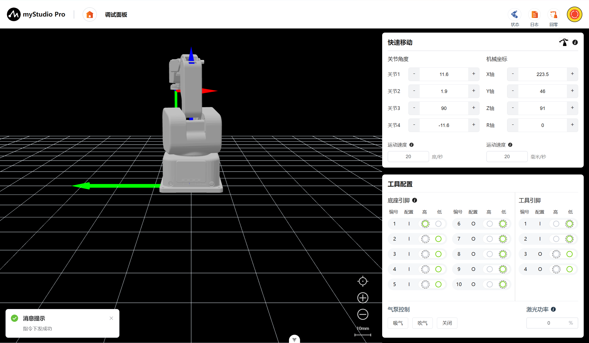

---

## 持续移动

> 以下是对关节角度、机械坐标持续移动功能的介绍

可以通过长按 对应区域的`+` `-` 按钮，可以控制机器人按照指定的角度/坐标进行持续移动，鼠标松开后停止运动。

- 当设定关节速度小于等于0.5，机械臂将步进式移动，否则将平滑连续移动
- 当设定坐标速度小于等于1.6，机械臂将步进式移动，否则将平滑连续移动

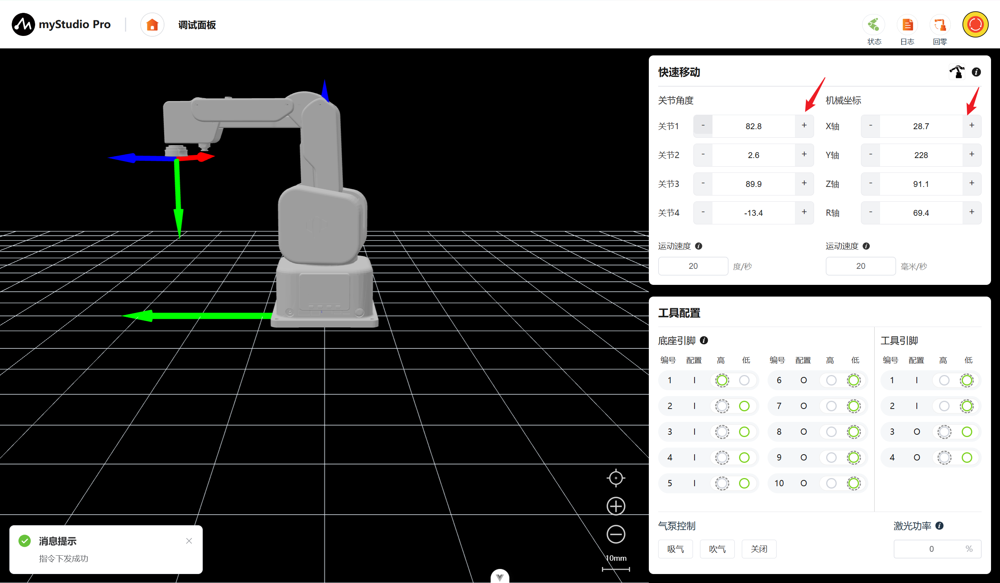

> 注意： 当长按操作持续运动到关节限位处时会自动停止。

---

## 运动步长

> 以下是对关节角度、机械坐标运动步长功能的介绍

可对角度/坐标持续运动或`Enter`控制运动方式设置运动步长。

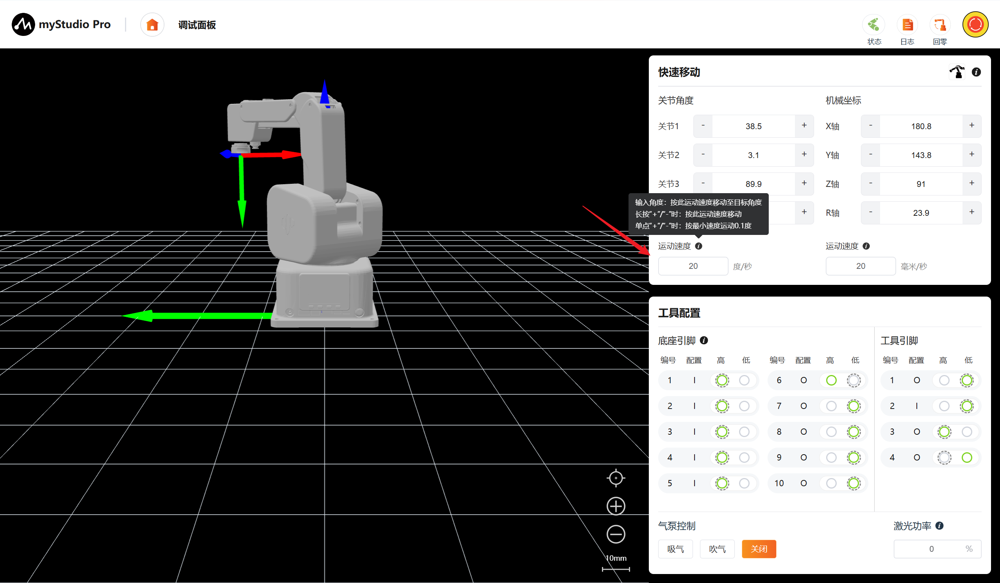

机械坐标运动速度设置框。

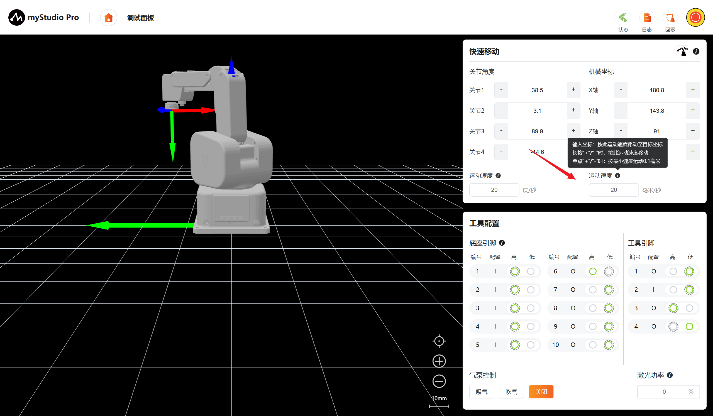

---

## 工具配置

> 以下是对底座引脚、工具引脚功能的介绍

在该功能模块可以直观的观察引脚编号、配置、电平状态，其中电平状态项中高亮的为当前引脚的实际状态。外边框虚线代表[引脚配置](./5.3.7-setting.md#3-引脚配置)页中设置的默认电平状态。可手动切换输出电平（高/低），并实时观察外部信号接入引发的输入电平跳变。

对于输入引脚：在无外部信号接入（悬空）时，其电平状态由默认配置的上/下拉电阻维持；当有外部信号接入时，引脚的实际电平将由外部信号直接驱动并决定。

> I：表示为当前为输入引脚，无法切换电平高低
> 
> O：表示为当前为输出引脚，可以切换电平
>
> 外边框虚线：表示该电平为IO配置页面所配置的默认电平

---

### 7.1 底座引脚

> 以下是对底座引脚的介绍，用于展示与手动切换底座 IO 引脚的实时电平状态

底座引脚6电平状态由低电平修改至高电平

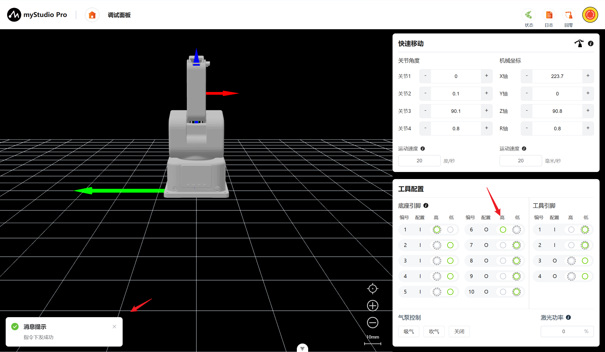

### 7.2 工具引脚

> 以下是对工具引脚的介绍，用于读写末端工具 IO 接口的引脚状态

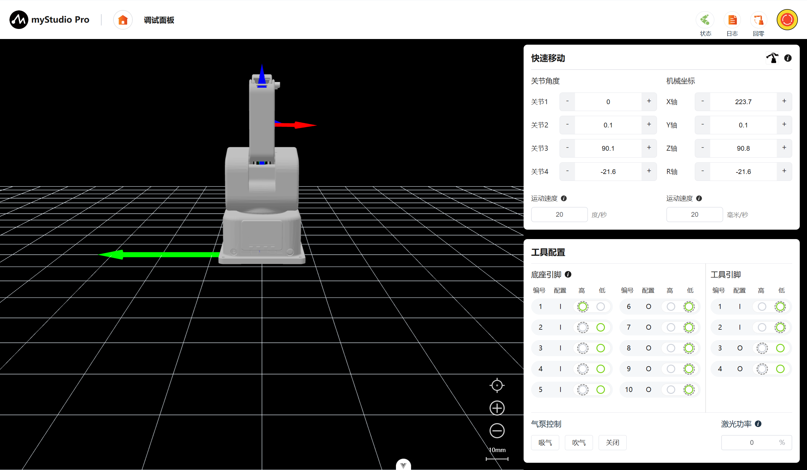

工具引脚3电平状态由低电平修改至高电平

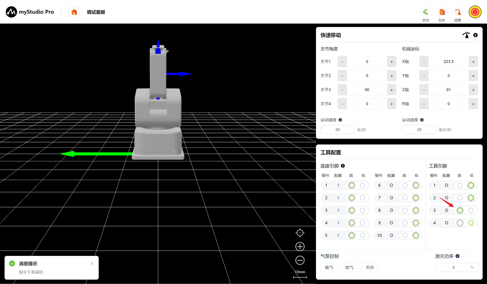

---

## 吸泵控制

> 以下是对吸泵控制功能的介绍，请确保机器已正常接上吸泵

可进行气泵控制包括`吸气`、`吹气`、`关闭`。其中按钮存在互斥，通过点击切换状态，按钮高亮则代表当前的控制模式。

吸气：启动真空发生器，使末端吸盘产生49.5kpa负压。

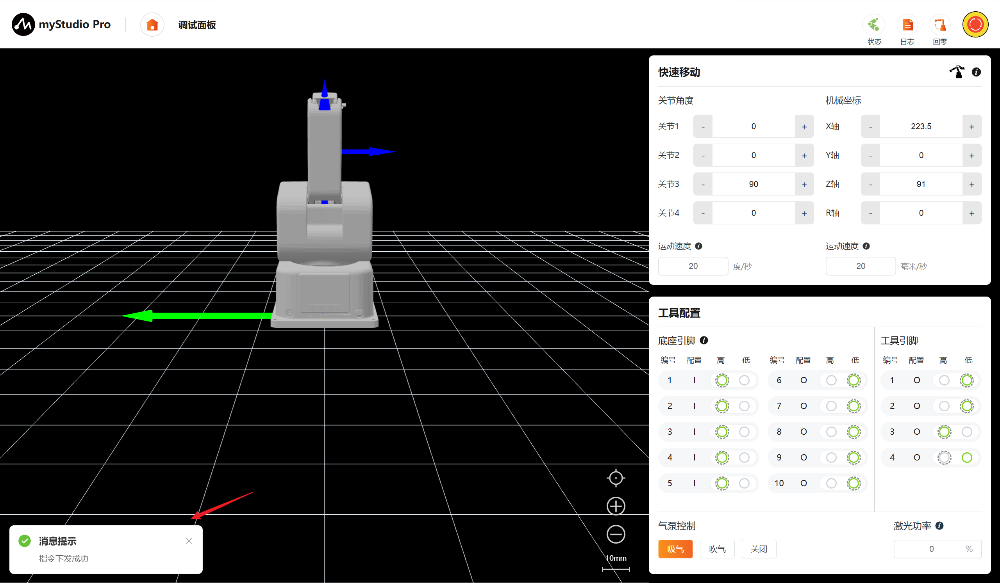

吹气：切换气路，使末端吸盘产生89kpa破真空气压。

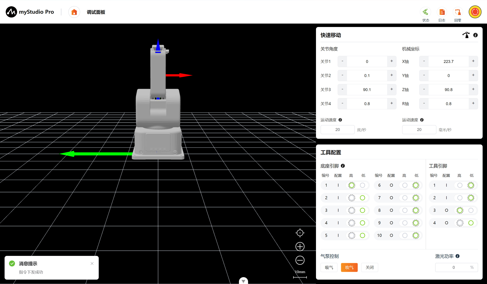

关闭：切断气泵电源且关闭所有气阀，气路恢复至常压状态。

---

## 激光功率控制

> 以下是对激光功率控制功能的介绍，请确保机器已正常接上激光设备

通过文本框输入数值调控激光功率，回车或点击空白处提交修改，0%为关闭激光。

**注意：**

> 1. 严禁直视激光或将激光指向眼部
>
> 2. 若激光开启，离开当前页面不会使激光关闭，若调试时将激光开启，建议离开页面前关闭激光

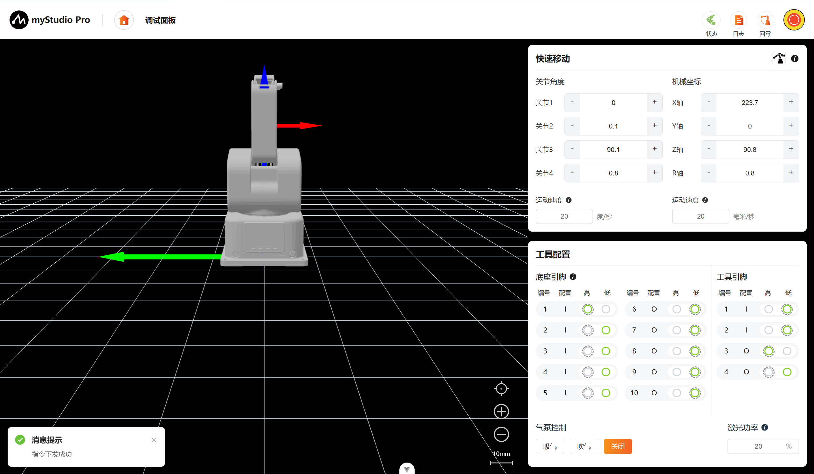

---

[← 上一章](./5.3.3-blockly.md) | [下一章 →](./5.3.5-resourceCenter.md)