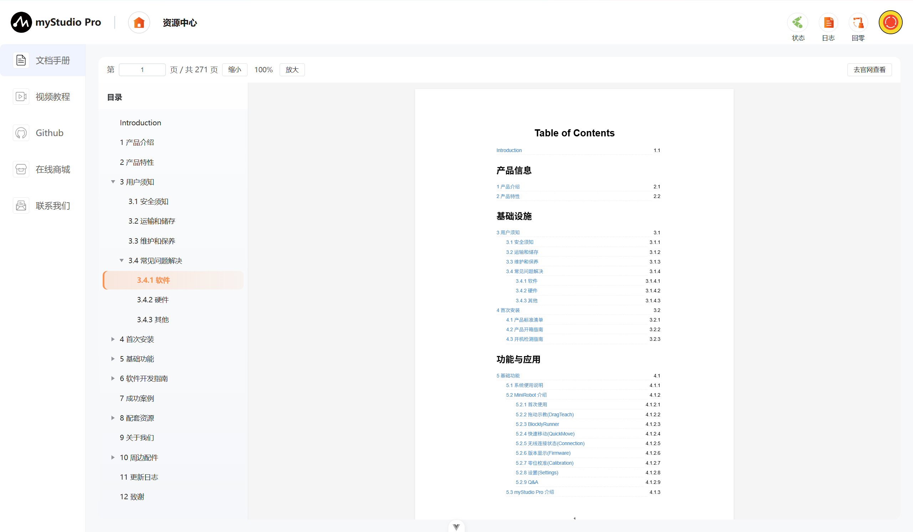
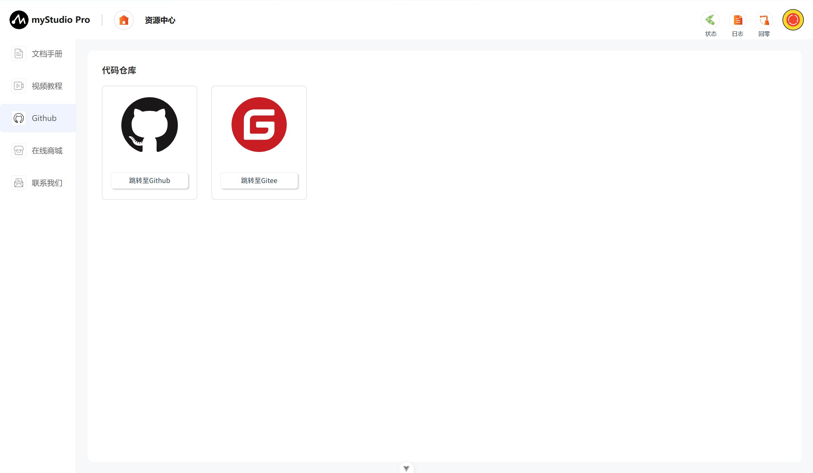
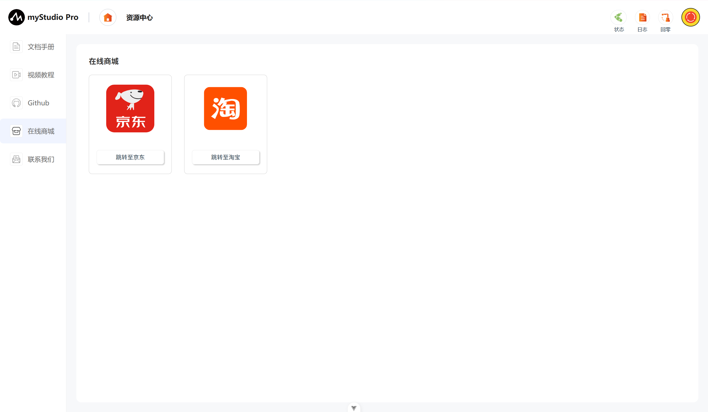
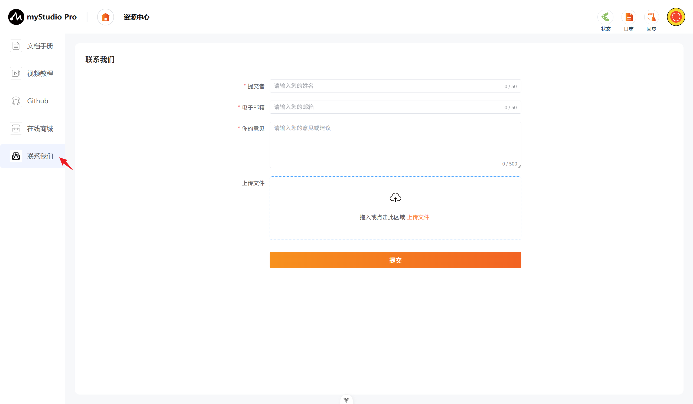
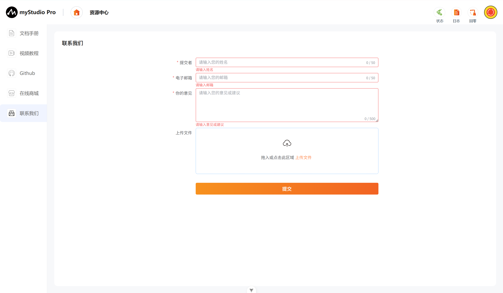
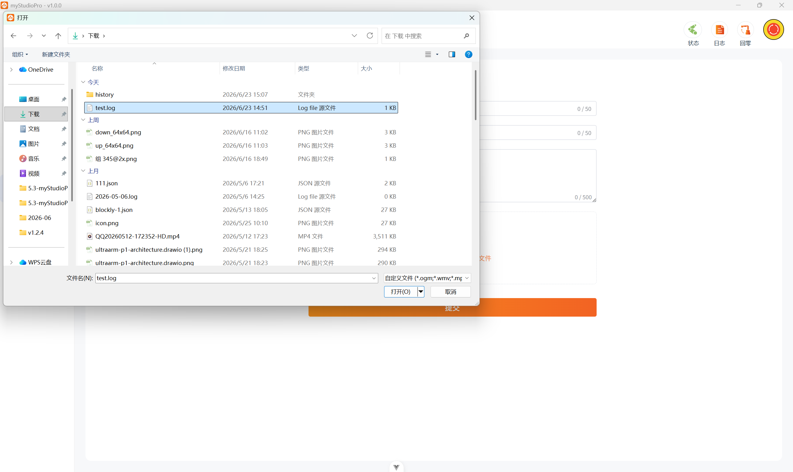
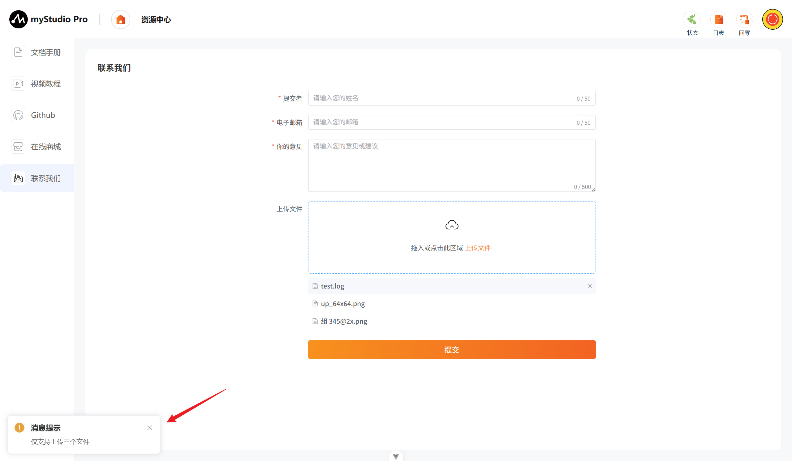
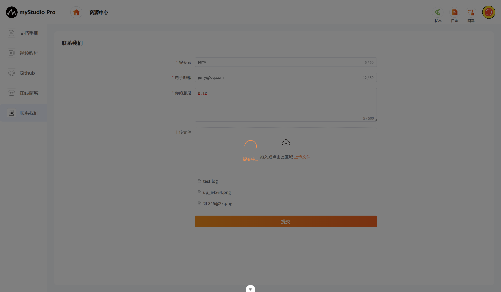
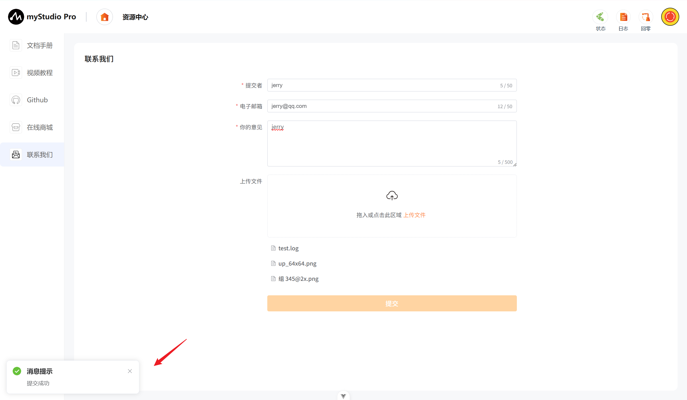

# 资源中心

## 1 界面介绍

首页如下图：

## 2 文档手册

**正在编写中**

## 3 视频教程

**正在编写中**

## 4 Github

此功能为网页跳转链接，点击以后，会在当前使用浏览器上打开官方Github或者官方Gitee。

## 5 在线商城

此功能为网页跳转链接，点击以后，会在当前使用浏览器上打开对应产品的购买界面，可前往淘宝或京东。

## 6 联系我们

如果你有任何的问题或者想法，可以通过这里来联系我们。

功能介绍：

#### 提交者

这里可以输入您的昵称

> 此处是必填项，如果你不填直接提交，会有对应文字提示您。

#### 电子邮箱

这里可以输入您的电子邮箱

> 此处是必填项，这里可以输入你的邮箱地址，方便官方人员后续回复您，如果你不填直接提交，会有对应文字提示您。

#### 您的意见

这里可以输入您的意见

> 此处是必填项，这里可以输入您的问题或者想法，如果你不填直接提交，会有对应文字提示您。

#### 上传

> 点击此按钮和可拖拽区域，可以上传文件，最多上传3个文件，并且每个文件不得超过1M。

> 点击以后会弹窗以供选择文件。

> 如果你选中的文件大小超过1M，在点击"**打开**"以后，会打开失败，并且弹窗提示你文件过大。

> 当你要上传的文件数量超过3个时，会弹窗提示你。

> 注意：上传的文件仅支持.log、.json、视频文件和图片文件

#### 提交

> 点击提交按钮，可以将所有信息进行提交，该步骤需要的时间可能较长，请您耐心等待

[← 上一章](./5.3.4-debugPlane.md) | [下一章 →](./5.3.6-scene.md)