# 资源中心

该页面聚合了全链路服务资源：可查阅使用手册与视频教程、一键跳转官方开源仓库与在线商城，并可随时提交反馈意见，为您提供从学习到采购再到沟通的一站式支持。

## 界面介绍

首页如下图：

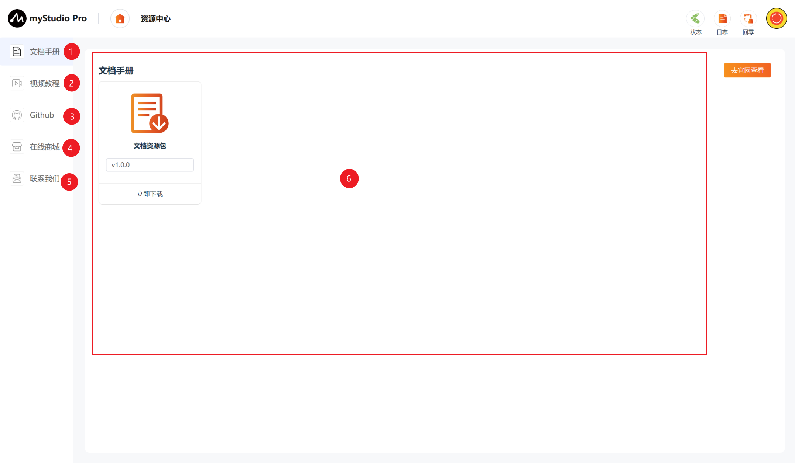

资源中心主界面提供五大功能入口：文档手册、视频教程、Github 开源资源、在线商城以及联系我们。用户可在此页面快速访问产品相关资料、视频教程以及官方开源代码。

| 序号 | **功能介绍** |
| ---- | ------------ |
| 1    | 文档手册：查看产品使用手册与开发指南 |
| 2    | 视频教程：观看产品操作与编程教学视频 |
| 3    | Github：跳转至官方 Github 或 Gitee 开源仓库 |
| 4    | 在线商城：跳转至淘宝或京东官方购买页面 |
| 5    | 联系我们：提交问题或建议，支持上传附件 |
| 6    | 模块内容显示区域：展示当前选中模块的操作界面 |

---

## 文档手册

> 以下是对文档手册功能的介绍

**正在编写中**

---

## 视频教程

> 以下是对视频教程功能的介绍

**正在编写中**

---

## Github

> 以下是对Github功能的介绍

此功能为网页跳转链接，点击以后，会在当前使用浏览器上打开官方Github或者Gitee开源仓库。

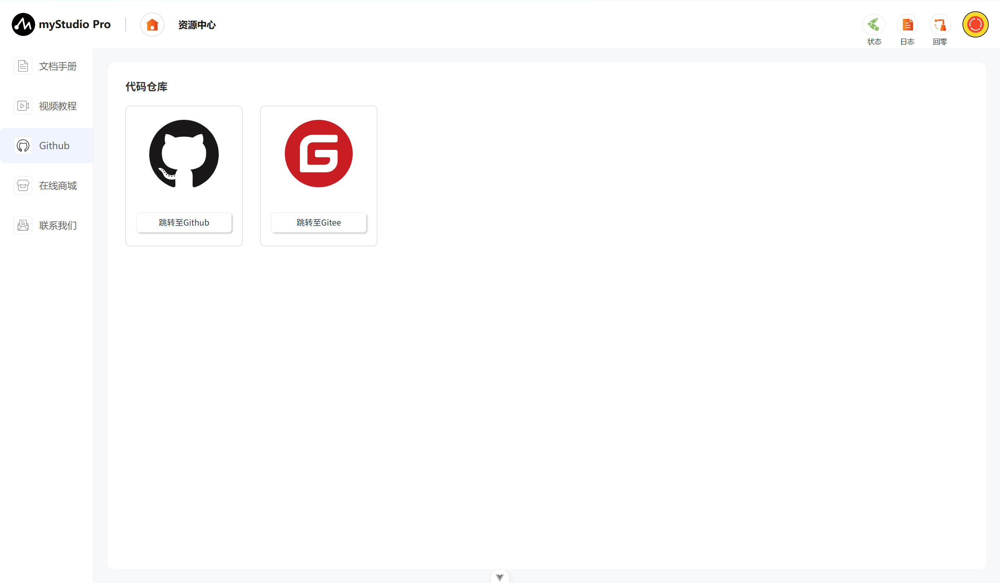

---

## 在线商城

> 以下是对在线商城功能的介绍

此功能为网页跳转链接，点击以后，会在当前使用浏览器上打开对应产品的购买界面，可前往淘宝或京东。

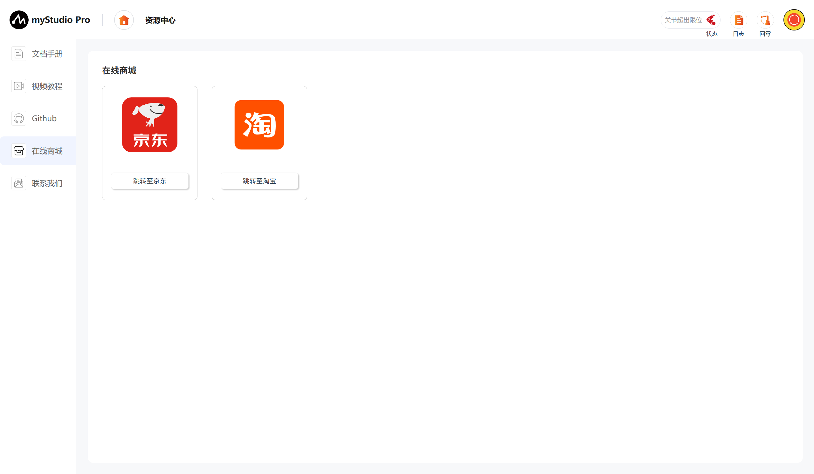

---

## 联系我们

> 以下是对联系我们功能的介绍

如果你有任何的问题或者想法，可以通过这里来联系我们。

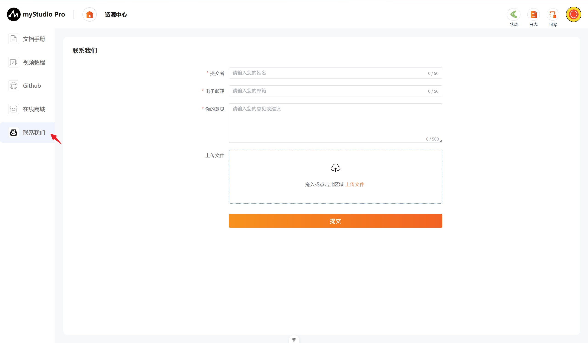

功能介绍：

#### 提交者

这里可以输入您的昵称

> 此处是必填项，如果你不填直接提交，会有对应文字提示您。

#### 电子邮箱

这里可以输入您的电子邮箱

> 此处是必填项，这里可以输入你的邮箱地址，方便官方人员后续回复您，如果你不填直接提交，会有对应文字提示您。

#### 您的意见

这里可以输入您的意见

> 此处是必填项，这里可以输入您的问题或者想法，如果你不填直接提交，会有对应文字提示您。

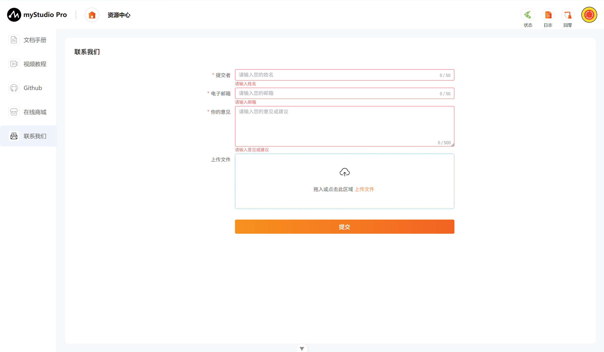

#### 上传

点击此按钮和可拖拽区域，可以上传文件，最多上传3个文件，并且每个文件不得超过1M。

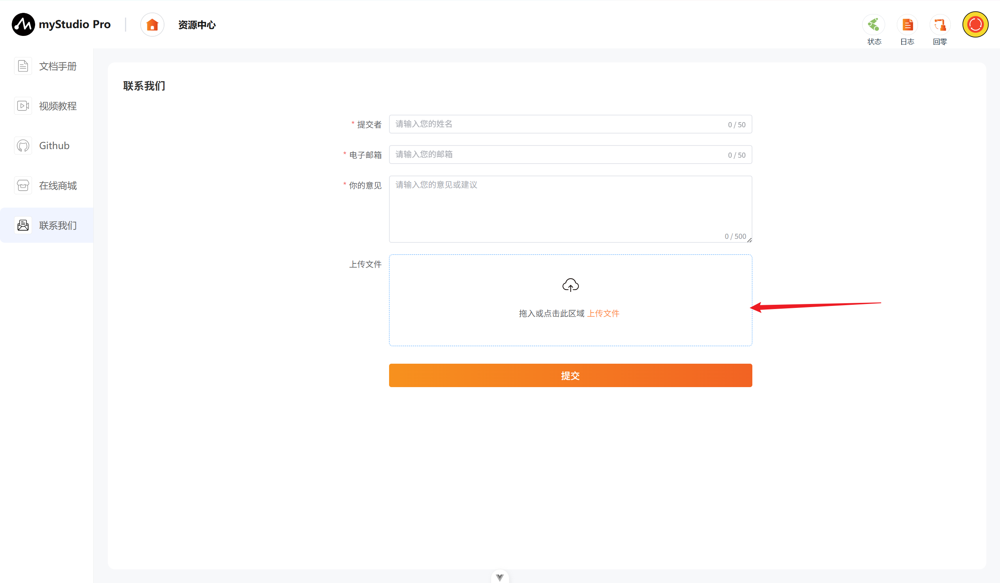

点击以后会弹窗以供选择文件。

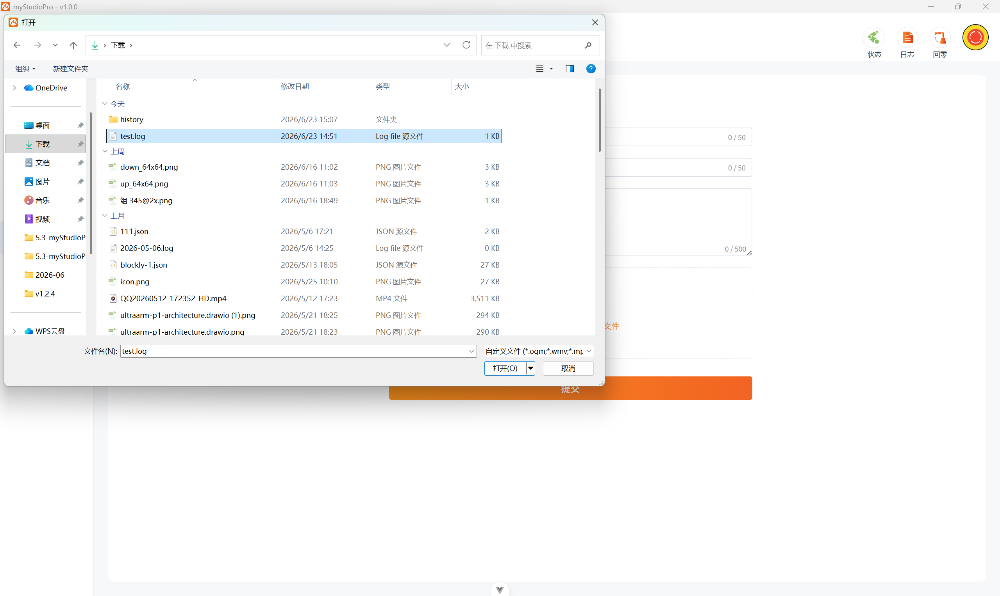

如果你选中的文件大小超过1M，在点击"**打开**"以后，会打开失败，并且弹窗提示你文件过大。

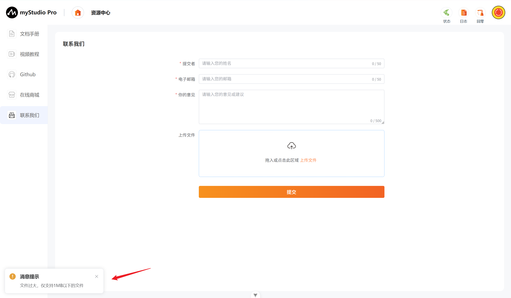

当你要上传的文件数量超过3个时，会弹窗提示你。

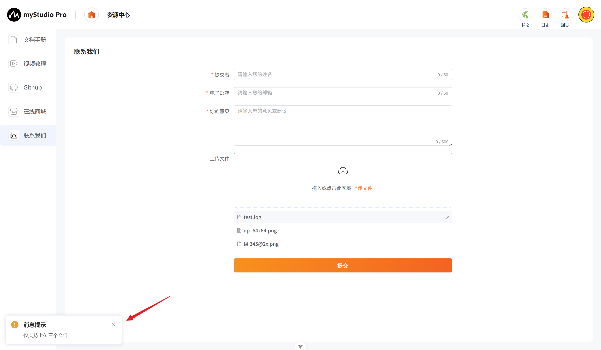

> 注意：上传的文件仅支持.log、.json、视频文件和图片文件

#### 提交

点击提交按钮，可以将所有信息进行提交，该步骤需要的时间可能较长，请您耐心等待片刻。

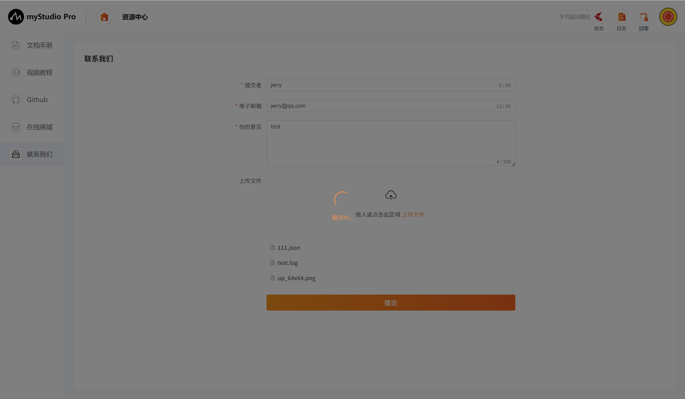

当信息提交完成后，页面将展示对应的提示消息。

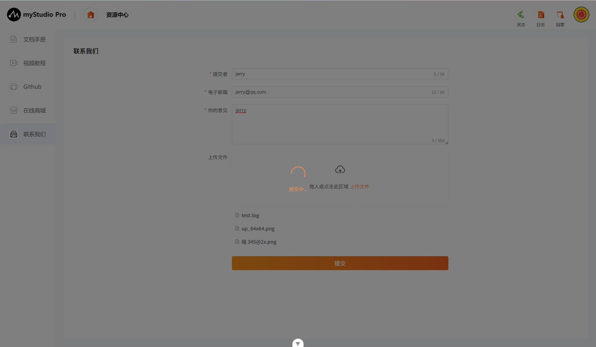

---

[← 上一章](./5.3.4-debugPlane.md) | [下一章 →](./5.3.6-scene.md)
