# 场景应用

## 主页面

进入场景应用主界面后能立即找到"写字画画”激光雕刻"两大核心功能，点击一键跳转至对应编辑页面。

## 写字画画

### 主页面

主界面是用户进行G代码文件管理、轨迹预览与作业执行的核心入口，主要划分为以下区域:

#### 顶部工具栏

提供返回、新增、案例库、快速移动、自由移动五个功能按钮。新增用于进入工作台创作图案;案例库内置预设G代码文件;快速移动支持点动调试与特殊点设置;自由移动可手动拖拽机械臂至目标点位

**返回:** 点击按钮可返回场景应用主页面。

**新增:** 点击按钮后，可进入写字画画工作创建编辑新项目。

**案例库:** 下拉菜单，可浏览并选用内置预设的可加工G代码文件，快速加载其加工轨迹至中间预览区。

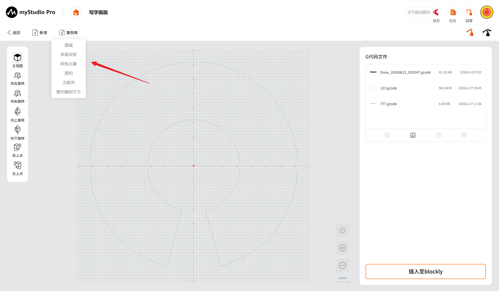

**快速移动:** 点击后弹出快速移动页面，支持设置工作原点、轨迹起点、精确点位调试以及实时坐标读取。

**自由移动:** 点击后会弹出消息框，点击确认后，机械臂可手动拖拽，用户可移动机械臂至初始点位，简化调试过程。

#### 左侧视图控制区

提供主视图(恢复默认视角)、向左旋转/向右旋转/向上旋转/向下旋转(调整观察角度)以及左上点/右上点(将视图中心快速定位至作业区域的左上角或右上角)，便于用户多维度检查加工轨迹。

**主视图:** 点击按钮后恢复3D预览区至默认初始视角。此页面主视图默认为俯视图。

**向左旋转:** 支持单击和长按，单击旋转15度，长按以30度/s的速度向左持续旋转，直至松开按钮停止。

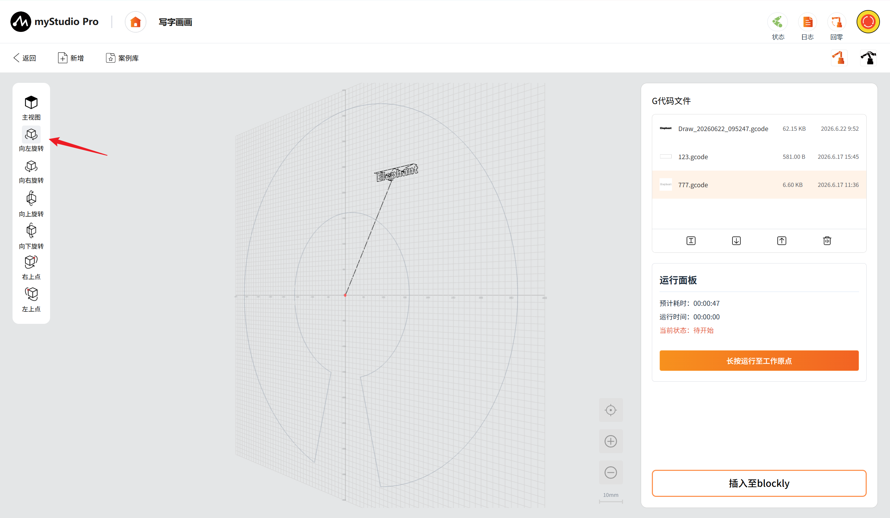

**向右旋转:** 支持单击和长按，单击旋转15度，长按以30度/s的速度向右持续旋转，直至松开按钮停止。

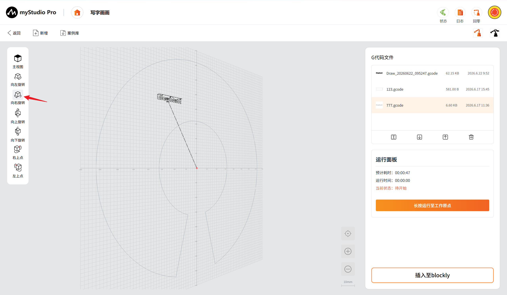

**向上旋转:** 支持单击和长按，单击旋转15度，长按以30度/s的速度向上持续旋转，直至松开按钮停止。

**向下旋转:** 支持单击和长按，单击旋转15度，长按以30度/s的速度向下持续旋转，直至松开按钮停止。

**右上点:** 点击按钮后将视角中心快速定位至作业区域的左上角。

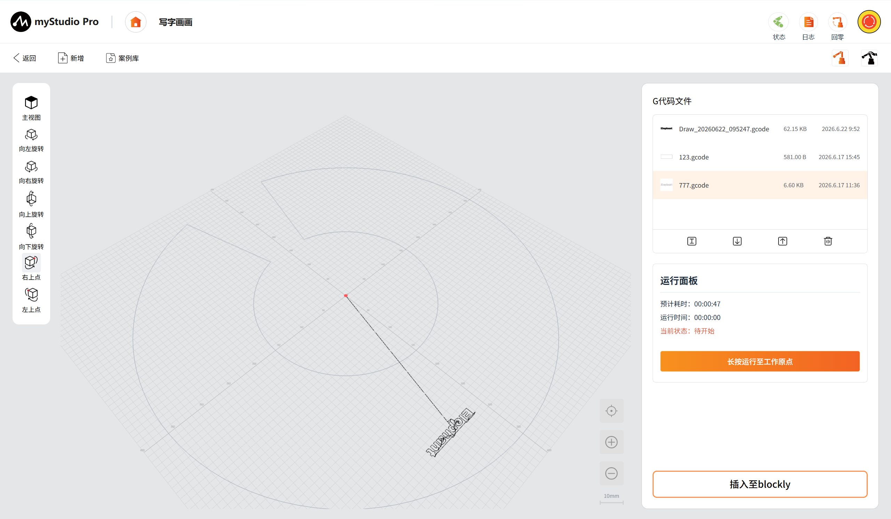

**左上点:** 点击按钮后将视角中心快速定位至作业区域的右上角。

#### 中间3D轨迹预览区

以三维形式展示当前选中G代码文件的加工轨迹，扇形边界代表机械臂可加工范围。右下角提供缩放控制，支持对视图进行精细调节。

鼠标可拖动视角平移，滚轮可决定放大放小的中心。

**校准:** 点击"校准"按钮，将视图恢复至默认主视角，缩放比例恢复至默认值(10mm/格)

**放大:** 点击"放大"按钮一次，视图放大一级，比例尺按预设序列向更小值切换(例如从10mm/格变为5mm/格)。支持连续点击逐步放大至最小比例尺1mm/格，达到最小比例后点击按钮无反应。

**缩小:** 点击"缩小"按钮一次，视图缩小一级，比例尺按预设序列向更大值切换(例如从10mm/格变为50mm/格)。支持连续点击逐步缩小至最大比例尺100mm/格，达到最大比例后点击按钮无反应。

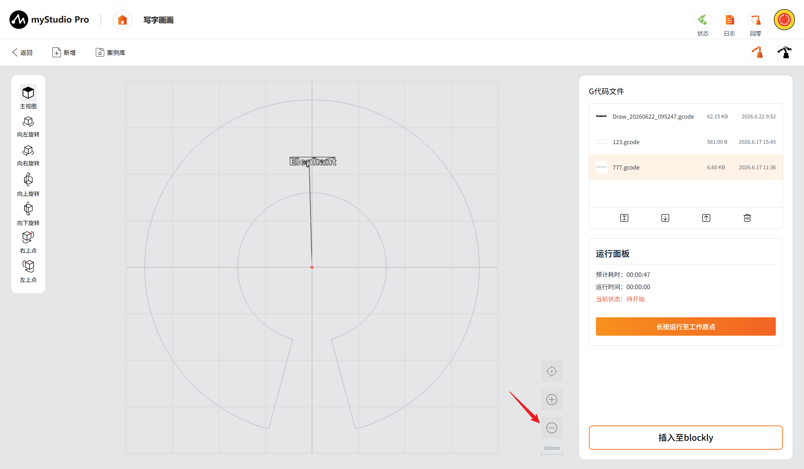

**比例尺:** 在右下角显示当前比例尺，格式如"10mm"，表示当前网格每一小格所代表的实际长度。

#### 文件管理与运行控制区 

按时间倒序展示G代码文件列表，支持重命名、导入、导出、删除等基础操作。底部为运行面板，显示当前文件的预计耗时、运行时间及运行状态;插入至Blockly可跳转至积木编程界面，便于构建批量加工流程。

**G代码文件列表:** 该区域展示G代码文件列表，列表项字段包含文件名、文件大小以及保存日期，列表项图片为加工图案。

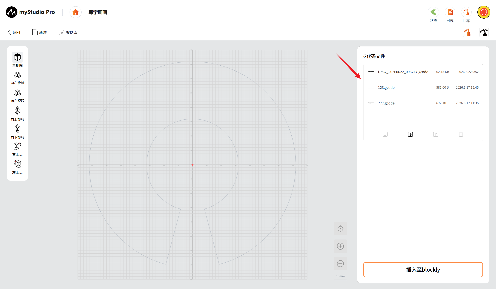

**重命名:** 选中列表项后，点击按钮后可重命名列表项的文件名。

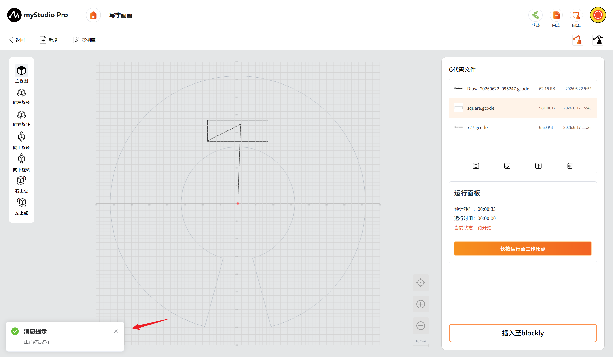

**导入:** 点击导入按钮后，可从本地导入G代码文件。

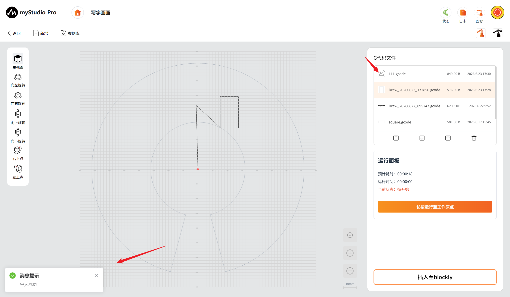

**导出:** 点击导出按钮后，可导出所选文件到本地。

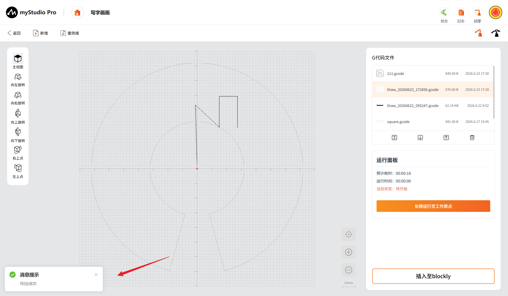

**删除:** 点击删除按钮后，弹出弹窗确认后即可删除所选文件，点击确认后删除。

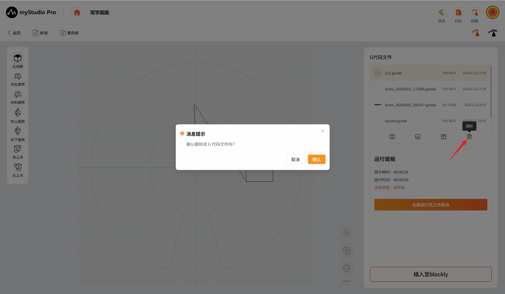

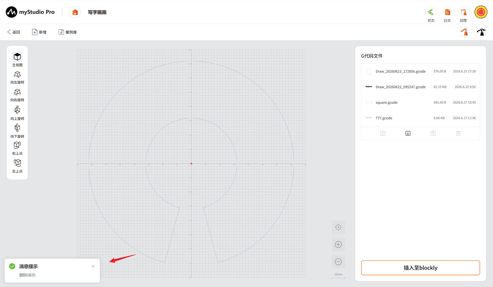

#### 运行面板

页面载入时无选中G代码文件，运行面板为隐藏状态。当选中G代码文件后，显示该G代码文件的运行面板，面板展示该文件的预计耗时、运行时间以及机械臂的当前状态，支持对加工任务进行运行、暂停、停止、继续等控制操作。

**长按至工作原点:** 长按按钮后机械臂运行至预设的工作原点。回原点完毕后，将展示运行、暂停、停止按钮。

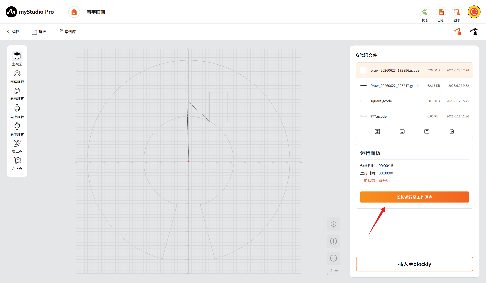

**运行:** 点击运行按钮后，机械臂开始运行加工文件。运行时间开始计时、当前状态变为运行中，运行按钮转变为禁用状态，暂停按钮和停止按钮转为启用状态。

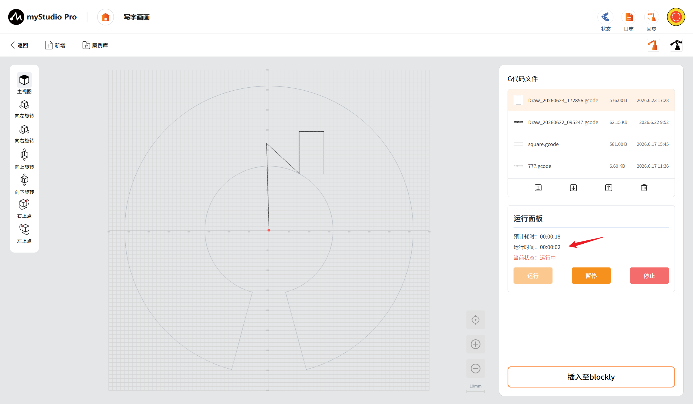

**暂停:** 点击暂停按钮后，机械臂暂停运行。面板的当前状态转为暂停中，运行按钮转变为恢复按钮，同时暂停按钮为禁用状态，恢复按钮和停止按钮为启用状态。

**恢复:** 点击恢复按钮后，机械臂恢复运动。

**停止:** 点击停止按钮后，软件停止下发指令，当前状态为已停止，按钮状态除运行按钮为启用状态之外，暂停按钮和停止按钮皆为禁用状态。机械臂将已发送指令执行完毕后停止，运行面板的当前状态为待开始。

**插入至Blockly:** 点击插入至blockly按钮后，会跳转至「积木编程工作台」，可通过积木编程实现批量运行。

### 工作台

写字画画工作台是用户进行图案创作、编辑、参数配置与作业执行的核心界面，主要划分为以下区域:

**顶部工具栏:** 项目操作与素材导入包含返回上级、打开本地项目、保存当前作品、调用内置模板库以及拍照上传图片，实现从外部资源获取到项目文件管理的全流程操作。点位工具提供快速移动与自由移动，快速移动点击后弹出调试弹窗，支持设置工作原点、轨迹起点及精确点位调试;自由移动模式支持直接拖拽机械臂至目标点，简化点位调试流程。

**左侧工具箱:** 汇聚图形绘制与编辑核心工具，提供对象选择、画布平移、钢笔绘制、圆形绘制、文字添加、预设图形插入以及撤销与重做。其中撤销与重做支持快捷键操作(Ctrl+Z/Ctrl+Y)，便于用户快速回退或恢复编辑步骤。

**画布:** 核心显示区域，可视化展示机械臂实际可加工的扇形作业边界，承载当前编辑图形对象的展示与基础交互，支持画布校准、缩放等视图操作，便于用户从不同尺度观察和编辑图案。

**右侧属性台:**  作为图形属性配置与加工准备的核心区域，通过页签切换编辑与处理两大功能模块。编辑模块支持图层管理(重命名、层级调整、删除)以及图形对象的变换属性调整(坐标、尺寸、文本以及图片处理模式);处理模块支持选中图形对象并创建工具路径，进入后续加工参数配置与G代码生成流程，实现从设计到加工的无缝衔接。

### 预览页

用户在工作台完成图形创作后，点击"生成G代码并预览”按钮所跳转的专属预览调试界面。页面聚焦于当前生成的G代码文件的轨迹验证与执行准备，不支持图形编辑，确保用户专注于加工文件的最终确认。

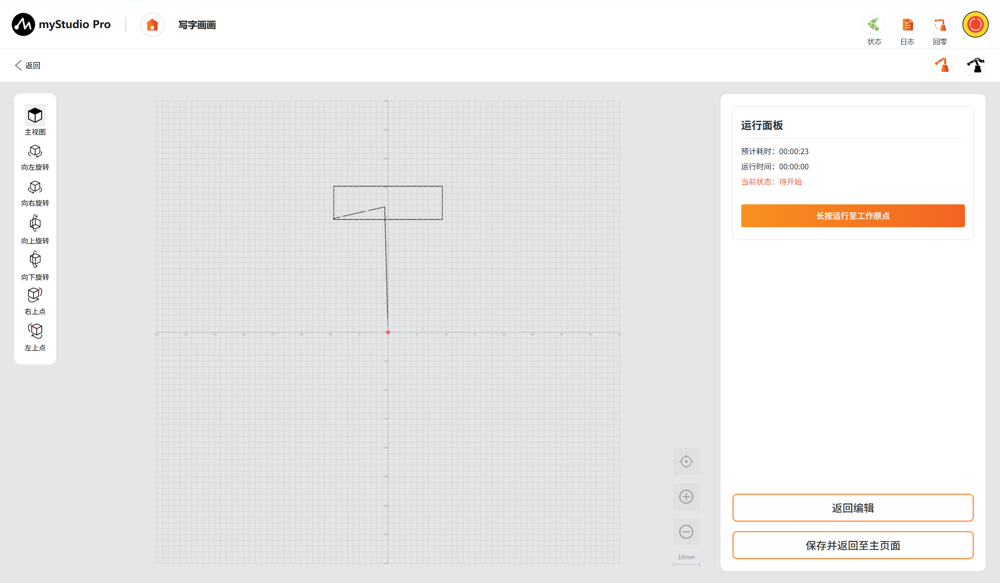

主要划分为以下区域:

#### 顶部工具栏

提供返回、快速移动与自由移动工具，方便用户在加工前进行机械臂的快速定位与初始点位校准。

**返回：** 点击“返回"可返回上一级页面。

**快速移动：** 同主页面一致，点击弹出[快速移动页](./5.3.6-scene.md#快速移动)。

**自由移动：** 同主页面一致，点击弹出开启自由移动弹窗。

#### 左侧视图控制区

提供主视图(恢复默认视角)、向左旋转/向右旋转/向上旋转/向下旋转(调整观察角度)以及左上点/右上点(将视图中心快速定位至作业区域的左上角或右上角)，便于用户多维度检查加工轨迹。

**主视图:** 点击按钮后恢复3D预览区至默认初始视角。此页面主视图默认为俯视图。

**向左旋转:** 支持单击和长按，单击旋转15度，长按以30度/s的速度向左持续旋转，直至松开按钮停止。

**向右旋转:** 支持单击和长按，单击旋转15度，长按以30度/s的速度向右持续旋转，直至松开按钮停止。

**向上旋转:** 支持单击和长按，单击旋转15度，长按以30度/s的速度向上持续旋转，直至松开按钮停止。

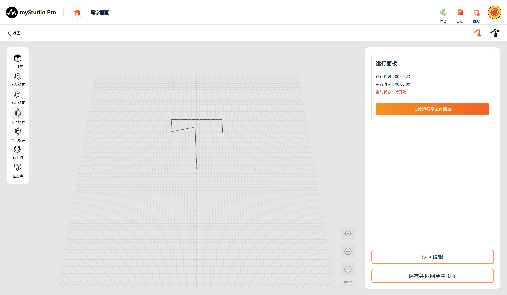

**向下旋转:** 支持单击和长按，单击旋转15度，长按以30度/s的速度向下持续旋转，直至松开按钮停止。

**右上点:** 点击按钮后将视角中心快速定位至作业区域的左上角。

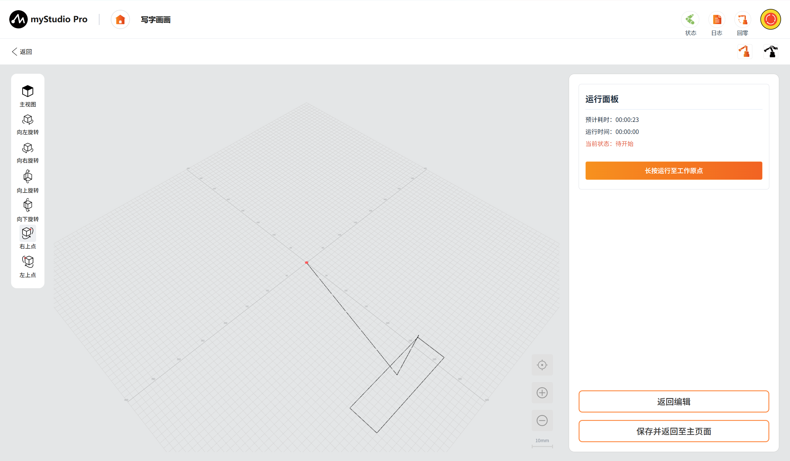

**左上点:** 点击按钮后将视角中心快速定位至作业区域的右上角。

集成多向视角调整按钮(主视图、旋转、定位)，用户可自由切换观察角度，从任意维度审视轨迹细节。

#### 中间3D加工轨迹预览区 

以三维形式渲染当前G代码文件的加工轨迹，扇形边界清晰标示机械臂可加工范围，支持缩放、旋转、平移等操作，并动态显示网格比例尺。

鼠标可拖动视角平移，滚轮可决定放大放小的中心。

**校准:** 点击"校准"按钮，将视图恢复至默认主视角，缩放比例恢复至默认值(10mm/格)

**放大:** 点击"放大"按钮一次，视图放大一级，比例尺按预设序列向更小值切换(例如从10mm/格变为5mm/格)。支持连续点击逐步放大至最小比例尺1mm/格，达到最小比例后点击按钮无反应。

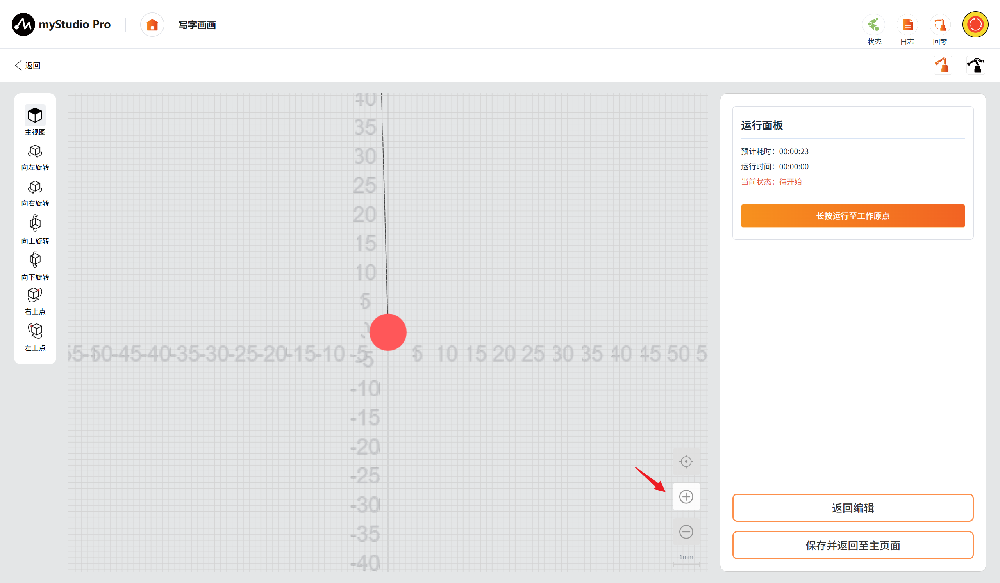

**缩小:** 点击"缩小"按钮一次，视图缩小一级，比例尺按预设序列向更大值切换(例如从10mm/格变为50mm/格)。支持连续点击逐步缩小至最大比例尺100mm/格，达到最大比例后点击按钮无反应。

**比例尺:** 在右下角显示当前比例尺，格式如"10mm"，表示当前网格每一小格所代表的实际长度。

#### 右侧调试台

运行面板支持进行调试运行，若在调试运行中发现不当，可返回调整编辑，如若用户确认了加工文件可保存返回至主界面

**长按至工作原点:** 长按按钮后机械臂运行至预设的工作原点。回原点完毕后，将展示运行、暂停、停止按钮。

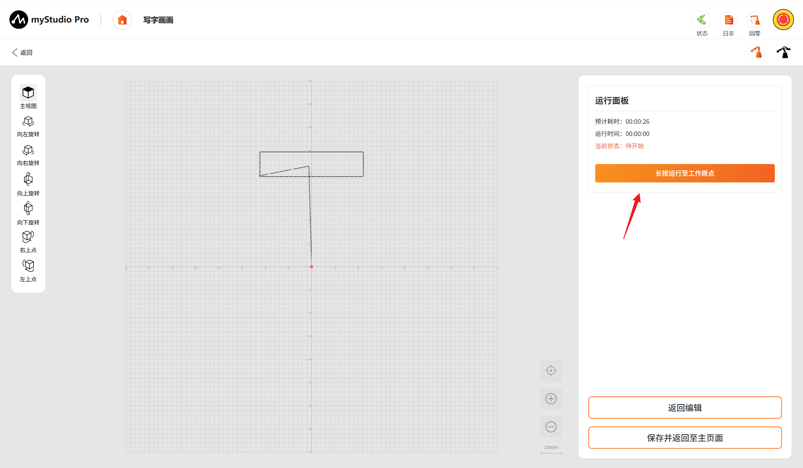

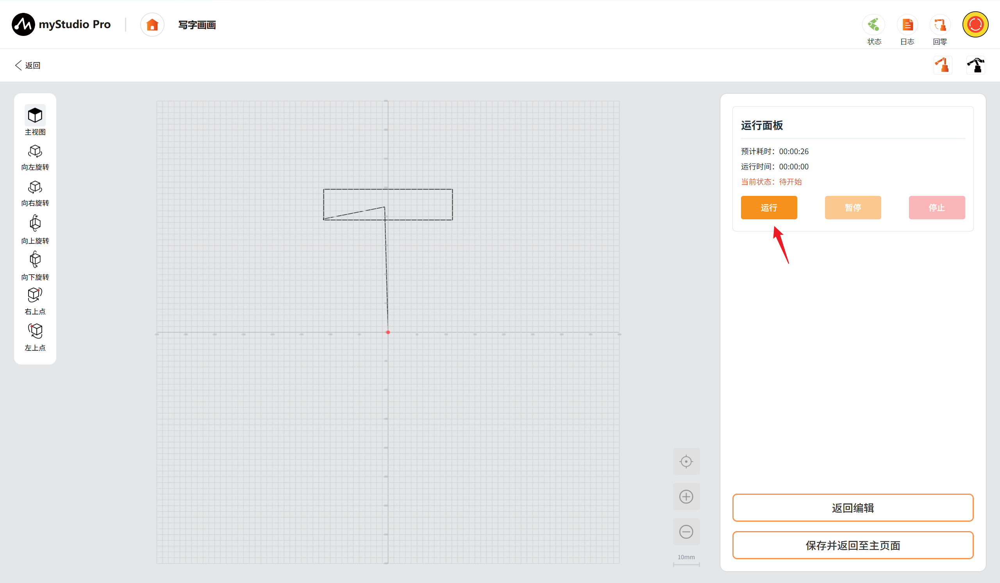

**运行:** 点击运行按钮后，机械臂开始运行加工文件。运行时间开始计时、当前状态变为运行中，运行按钮转变为禁用状态，暂停按钮和停止按钮转为启用状态。

**暂停:** 点击暂停按钮后，机械臂暂停运行。面板的当前状态转为暂停中，运行按钮转变为恢复按钮，同时暂停按钮为禁用状态，恢复按钮和停止按钮为启用状态。

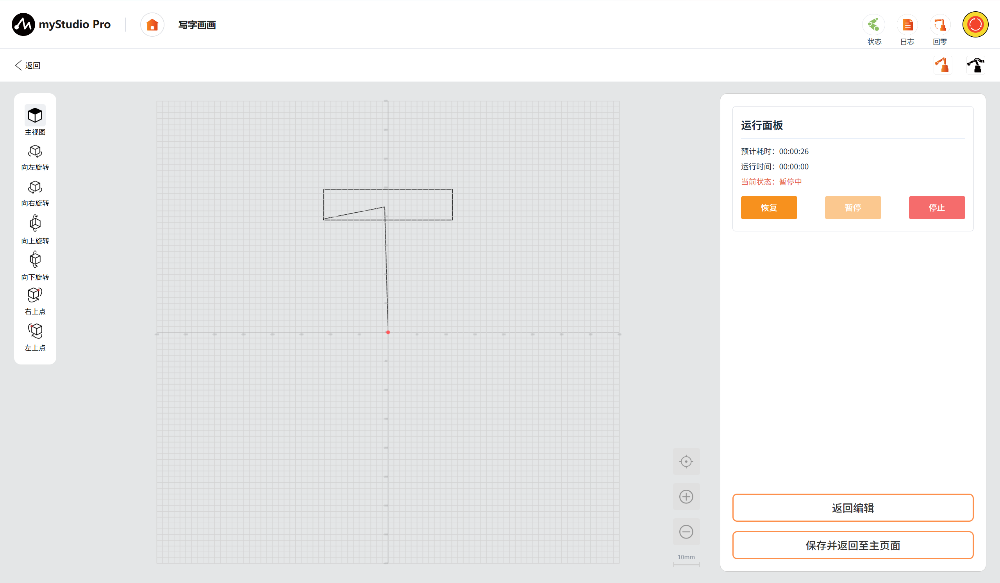

**恢复:** 点击恢复按钮后，机械臂恢复运动。

**停止:** 点击停止按钮后，软件停止下发指令，当前状态为已停止，按钮状态除运行按钮为启用状态之外，暂停按钮和停止按钮皆为禁用状态。机械臂将已发送指令执行完毕后停止，运行面板的当前状态为待开始。

**返回编辑：** 点击”返回"可返回「写字画画工作台」的编辑面板。

**保存并返回至主页面：** 保存并返回至主界面:点击按钮后跳转「写字画画主界面」，且G代码文件自动添加至主界面的文件列表开头并选中。

### 快速移动

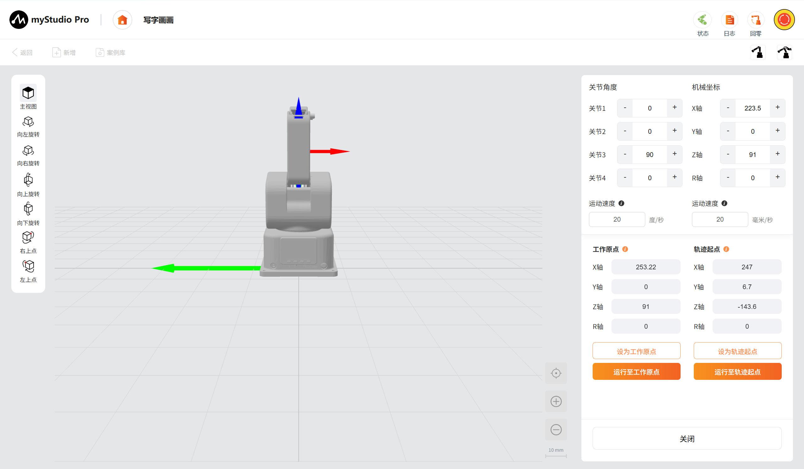

#### 左侧视图控制区

提供主视图(恢复默认视角)、向左旋转/向右旋转/向上旋转/向下旋转(调整观察角度)以及左上点/右上点(将视图中心快速定位至作业区域的左上角或右上角)，便于用户多维度检查加工轨迹。

**主视图:** 点击按钮后恢复3D预览区至默认初始视角。此页面主视图默认为俯视图。

**向左旋转:** 支持单击和长按，单击旋转15度，长按以30度/s的速度向左持续旋转，直至松开按钮停止。

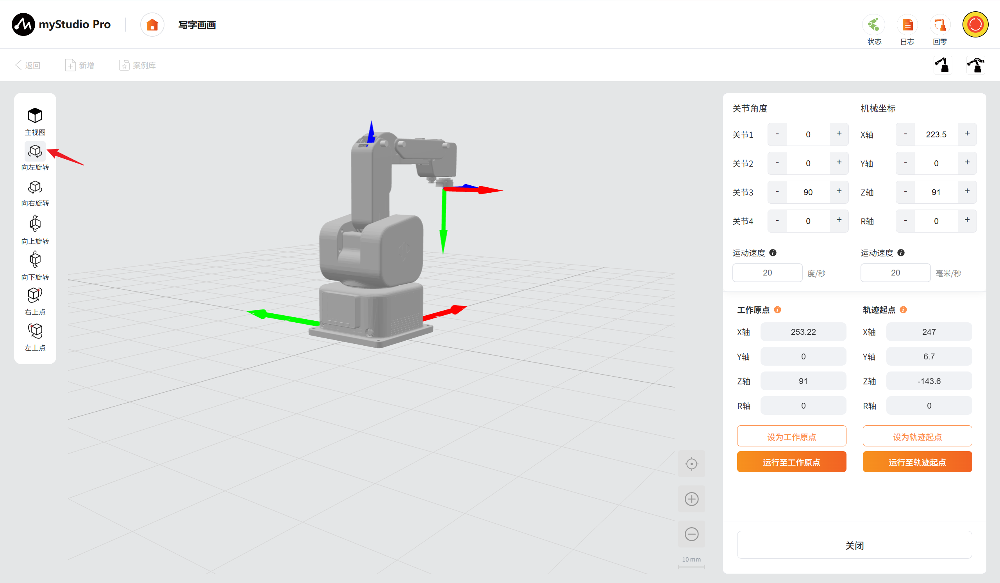

**向右旋转:** 支持单击和长按，单击旋转15度，长按以30度/s的速度向右持续旋转，直至松开按钮停止。

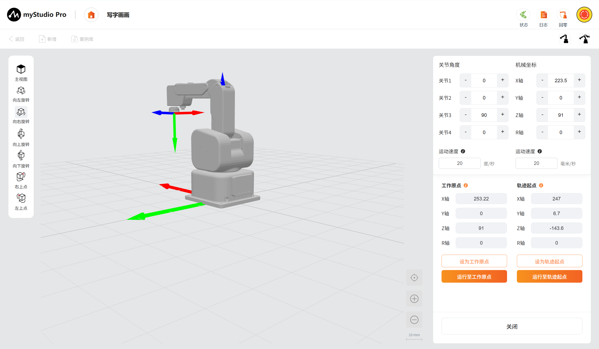

**向上旋转:** 支持单击和长按，单击旋转15度，长按以30度/s的速度向上持续旋转，直至松开按钮停止。

**向下旋转:** 支持单击和长按，单击旋转15度，长按以30度/s的速度向下持续旋转，直至松开按钮停止。

**右上点:** 点击按钮后将视角中心快速定位至作业区域的左上角。

**左上点:** 点击按钮后将视角中心快速定位至作业区域的右上角。

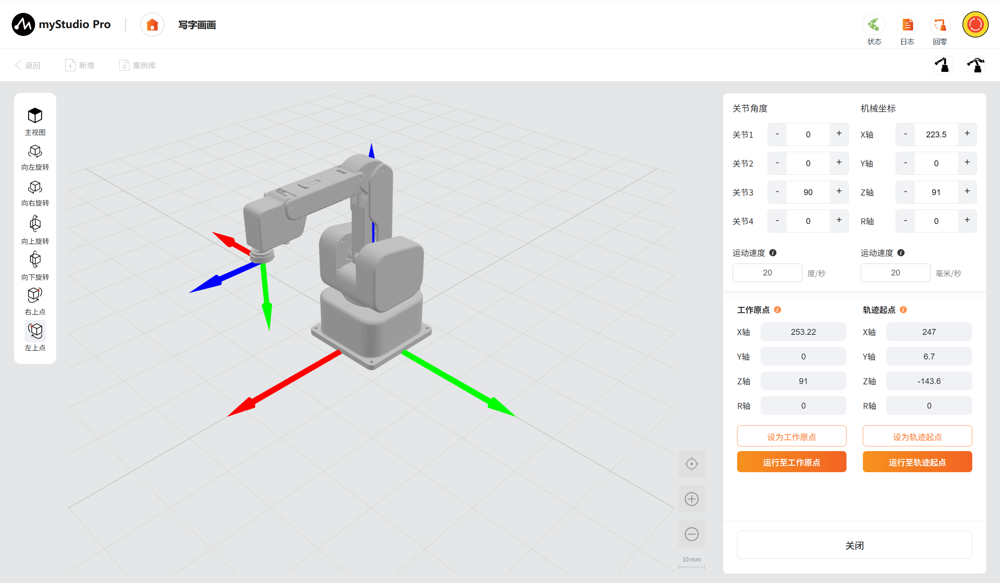

#### 3D实时姿态面板

为可视化区域，用于实时展⽰机械臂当前姿态的3D模型。

**校准:** 点击"校准"按钮，将视图恢复至默认主视角，缩放比例恢复至默认值(10mm/格)

**放大:** 点击"放大"按钮一次，视图放大一级，比例尺按预设序列向更小值切换(例如从10mm/格变为5mm/格)。支持连续点击逐步放大至最小比例尺1mm/格，达到最小比例后点击按钮无反应。

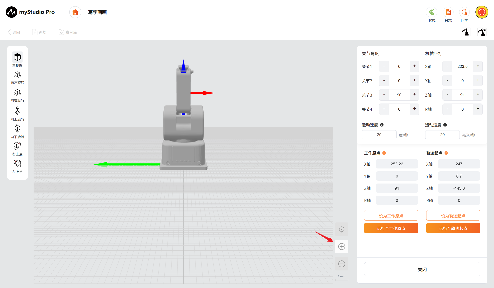

**缩小:** 点击"缩小"按钮一次，视图缩小一级，比例尺按预设序列向更大值切换(例如从10mm/格变为50mm/格)。支持连续点击逐步缩小至最大比例尺100mm/格，达到最大比例后点击按钮无反应。

**比例尺:** 在右下角显示当前比例尺，格式如"10mm"，表示当前网格每一小格所代表的实际长度。

#### 角度坐标控制

实时显示关角度，可点动调节关节角度以及长按速度的设置。机械坐标:实时显示机械坐标，可点动调节机械坐标以及长按速度的设置。

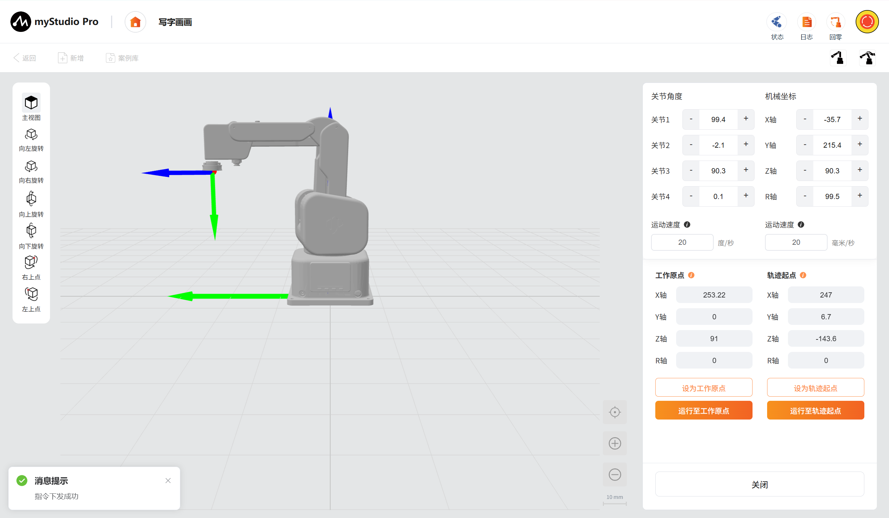

更详细的功能介绍可阅读[调试面板章节](./5.3.4-debugPlane.md#3-角度控制)

#### 工作原点

显示预设工作原点的坐标数值。点击输入框可修改工作原点坐标数值，修改后如图所示会出现还原图标。点击还原图标后可还原预设工作原点坐标数值。

点击设为工作原点按钮后保存修改过的工作原点坐标。

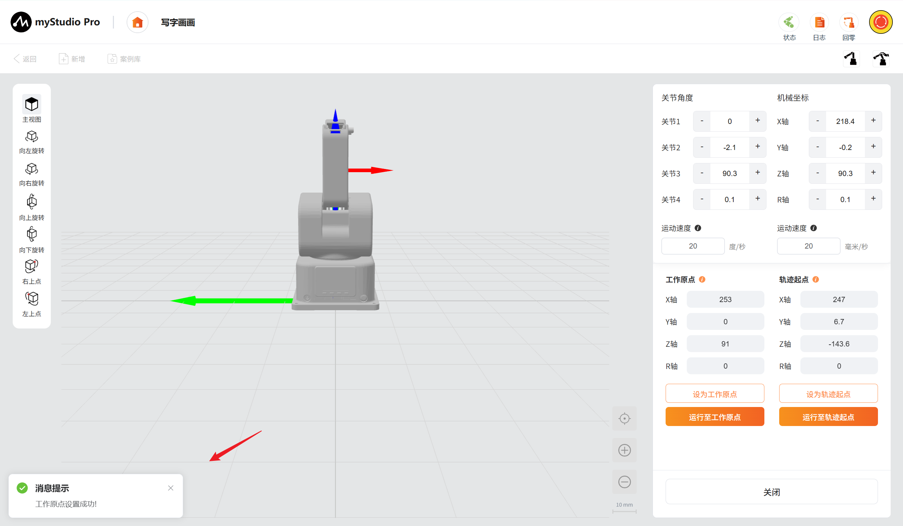

点击运行至工作原点按钮后机械臂运行至预设的工作原点。

#### 轨迹起点

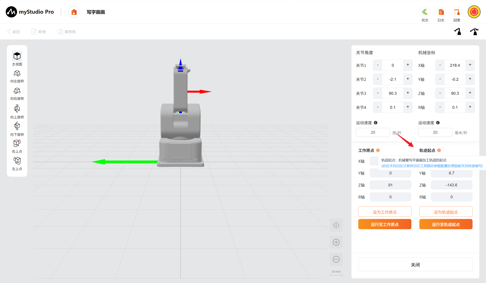

显示预设轨迹起点的坐标数值。点击输入框可修改轨迹起点坐标数值，修改后如图所示会出现还原图标。点击还原图标后可还原预设轨迹起点坐标数值。

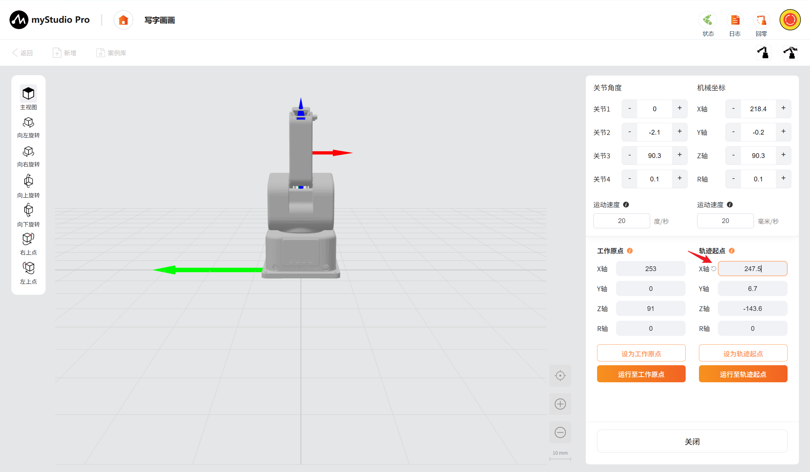

点击设为轨迹起点按钮后保存修改过的轨迹起点坐标。

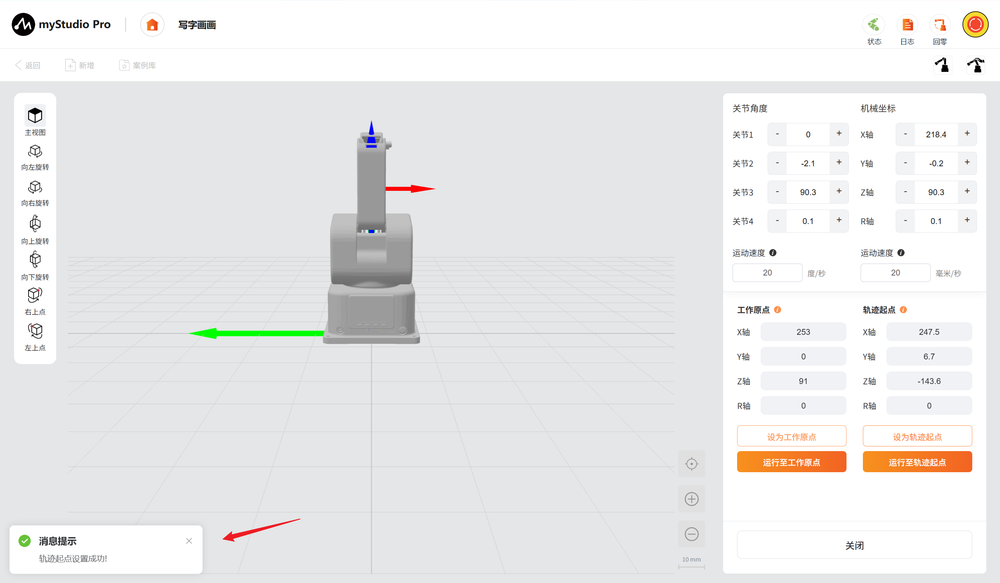

点击运行至轨迹起点按钮后机械臂运行至预设的轨迹起点。

**注意：** 

- 若修改了工作原点未点击按钮进行保存，当点击"关闭”按钮或是“运行至工作原点”按钮时，将跳出弹窗询问用户是否保存。
- 若修改了轨迹起点未点击按钮进行保存，当点击"关闭”按钮或是"运行至轨迹起点”按钮时，将跳出弹窗询问用户是否保存。

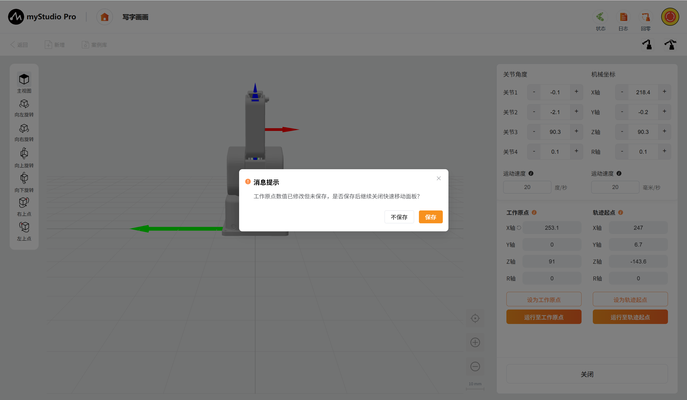

### 激光雕刻

[← 上一章](./5.3.5-resourceCenter.md) | [下一章 →](./5.3.7-setting.md)