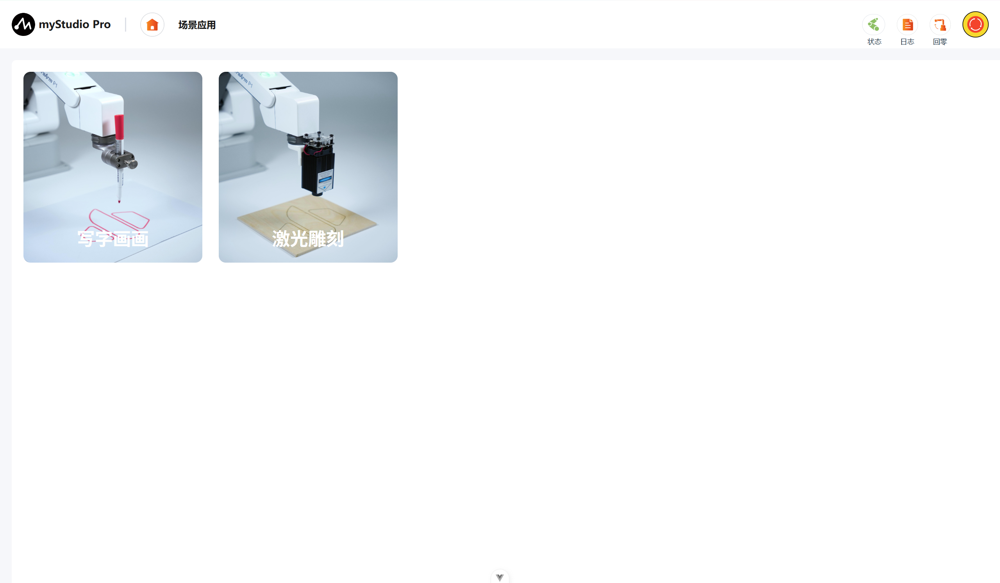

# 场景应用

## 主页面

进入场景应用主界面后能立即找到"写字画画”激光雕刻"两大核心功能，一键跳转至对应编辑页面。

## 写字画画

### 主页面

主界面是用户进行G代码文件管理、轨迹预览与作业执行的核心入口，主要划分为以下区域:

**顶部工具栏:** 提供返回、新增、案例库、快速移动、自由移动五个功能按钮。新增用于进入工作台创作图案;案例库内置预设G代码文件;快速移动支持点动调试与特殊点设置;自由移动可手动拖拽机械臂至目标点位

**左侧视图控制区:** 提供主视图(恢复默认视角)、向左旋转/向右旋转/向上旋转/向下旋转(调整观察角度)以及左上点/右上点(将视图中心快速定位至作业区域的左上角或右上角)，便于用户多维度检查加工轨迹。

**中间3D轨迹预览区:** 以三维形式展示当前选中G代码文件的加工轨迹，扇形边界代表机械臂可加工范围。右下角提供缩放控制，支持对视图进行精细调节。

**文件管理与运行控制区:** 按时间倒序展示G代码文件列表，支持重命名、导入、导出、删除等基础操作。底部为运行面板，显示当前文件的预计耗时、运行时间及运行状态;插入至Blockly可跳转至积木编程界面，便于构建批量加工流程。

### 工作台

写字画画工作台是用户进行图案创作、编辑、参数配置与作业执行的核心界面，主要划分为以下区域:

**顶部工具栏:** 项目操作与素材导入包含返回上级、打开本地项目、保存当前作品、调用内置模板库以及拍照上传图片，实现从外部资源获取到项目文件管理的全流程操作。点位工具提供快速移动与自由移动，快速移动点击后弹出调试弹窗，支持设置工作原点、轨迹起点及精确点位调试;自由移动模式支持直接拖拽机械臂至目标点，简化点位调试流程。

**左侧工具箱:** 汇聚图形绘制与编辑核心工具，提供对象选择、画布平移、钢笔绘制、圆形绘制、文字添加、预设图形插入以及撤销与重做。其中撤销与重做支持快捷键操作(Ctrl+Z/Ctrl+Y)，便于用户快速回退或恢复编辑步骤。

**画布:** 核心显示区域，可视化展示机械臂实际可加工的扇形作业边界，承载当前编辑图形对象的展示与基础交互，支持画布校准、缩放等视图操作，便于用户从不同尺度观察和编辑图案。

**右侧属性台:**  作为图形属性配置与加工准备的核心区域，通过页签切换编辑与处理两大功能模块。编辑模块支持图层管理(重命名、层级调整、删除)以及图形对象的变换属性调整(坐标、尺寸、文本以及图片处理模式);处理模块支持选中图形对象并创建工具路径，进入后续加工参数配置与G代码生成流程，实现从设计到加工的无缝衔接。

### 预览页

用户在工作台完成图形创作后，点击"生成G代码并预览”按钮所跳转的专属预览调试界面。页面聚焦于当前生成的G代码文件的轨迹验证与执行准备，不支持图形编辑，确保用户专注于加工文件的最终确认。

主要划分为以下区域:

**顶部工具栏:** 提供返回、快速移动与自由移动工具，方便用户在加工前进行机械臂的快速定位与初始点位校准。

**左侧视图控制区:** 集成多向视角调整按钮(主视图、旋转、定位)，用户可自由切换观察角度，从任意维度审视轨迹细节。

**中间3D加工轨迹预览区:** 以三维形式渲染当前G代码文件的加工轨迹，扇形边界清晰标示机械臂可加工范围，支持缩放、旋转、平移等操作，并动态显示网格比例尺。

**右侧调试台:** 运行面板支持进行调试运行，若在调试运行中发现不当，可返回调整编辑，如若用户确认了加工文件可保存返回至主界面

### 快速移动

### 激光雕刻

[← 上一章](./5.3.5-resourceCenter.md) | [下一章 →](./5.3.7-setting.md)