# 5.3 myStudio Pro 介绍

**myStudio Pro** 是一款集多功能于一体的机器人编程控制软件，为用户提供可视化编程交互、快捷移动控制、拖动教学、机器人状态查询与配置等一站式解决方案。软件内主要集成五大功能模块：`积木编程`、`调试面板`、`资源中心`、`场景应用`、`配置中心`覆盖从编程到调试、从学习到部署的全流程需求。

**积木编程** 模块在功能与设计理念上借鉴了麻省理工学院开发的儿童编程语言 Scratch，采用图形化积木拼接的方式进行编程。用户通过直观地拖拽模块组合，逐步构建出完整的代码逻辑，整个过程操作简单、易于理解，尤其适合编程初学者和教学场景使用。

从用户体验的角度来看，**积木编程** 是一款低门槛的可视化代码生成工具，让编程变得像搭积木一样轻松直观。而从开发者的视角来看，该模块实质上是一个能够动态生成结构化代码的文本编辑器，用户通过拖拽交互所生成的代码，最终会转化为可在机器人上执行的指令序列。这种设计与交互方式，不仅降低了使用难度，也保证了程序的专业性与可执行性。

**调试面板**

该模块可点动控制各关节角度和坐标，可设置每次点动改变的关节角度和坐标移动距离，并实时显示机械臂姿势；可手动控制对应IO端口的信号开关状态。

**资源中心**

该模块为用户提供便捷的资源导航功能，集中展示常用外部链接入口，包括技术文档、官方联系方式等。用户无需手动查找，即可快速访问相关支持材料，提升使用与维护效率。

**场景应用**

该模块为用户提供机器人的两大核心功能，写字画画和激光雕刻。用户可进行图形编辑与预览操作，并转换为真实的控制指令，实现机器人的写字画画与激光雕刻功能。

**配置中心**

模块涵盖软件与机器人系统的基础配置选项。用户可在此进行语言切换、关节运动限位设置、系统更新检测与软件驱动更新等操作。

## myStudio Pro界面的显示和基本功能的使用

登录软件，主界面如下图所示

界面功能介绍，界面分成三个区域：

1. 顶部安全监控区
2. 功能实现
3. 信息展示

> 注意：登录后软件会自动与机器进行通信连接

## 回零

此按钮功能为：控制机器人所有关节都回到零位位置

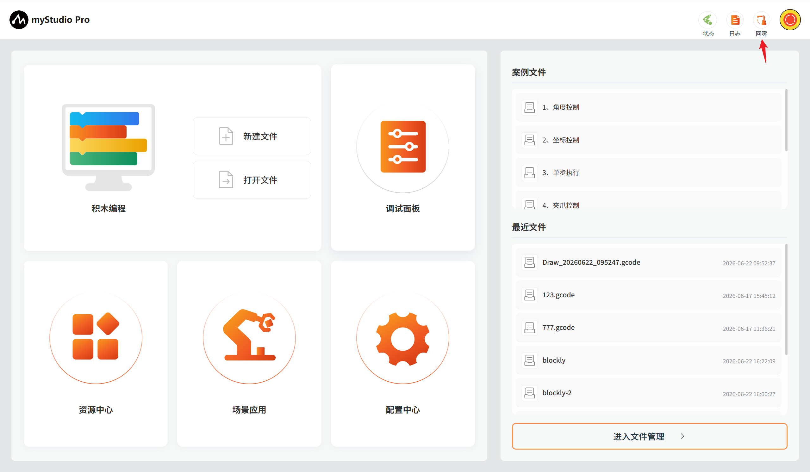

**注意**：此按钮功能生效的前提的已经成功连接机器人的通信。鼠标左键长按点击此按钮以后，机器人开始执行回零指令，机械臂将缓慢移动至零位，鼠标长按松开即回零指令停止执行。

回零完成以后，会弹窗提示完成回零。

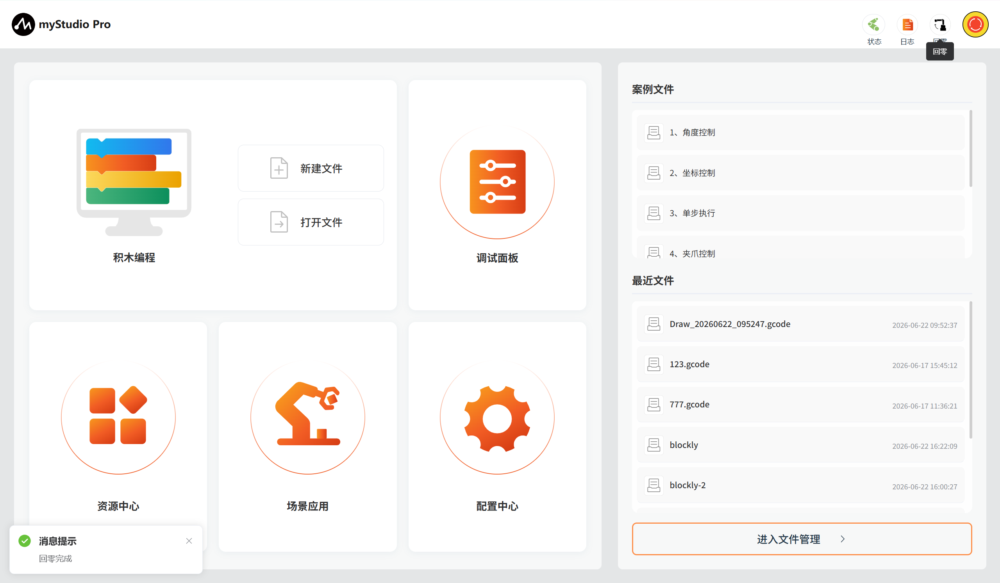

## 软急停

此按钮功能为：控制机器人当前运动停止，所有运行程序中止

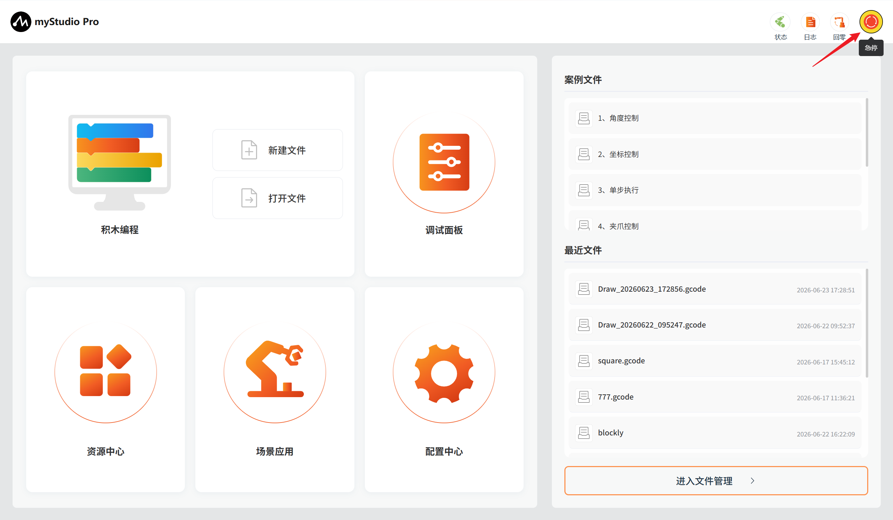

## 功能实现

这里可以选择你想要使用的功能，功能包含如下：

> 1. [积木编程](./5.3.3-blockly.md)
> 2. [调试面板](./5.3.4-debugPlane.md)
> 3. [资源中心](./5.3.5-resourceCenter.md)
> 4. [场景应用](./5.3.6-scene.md)
> 5. [配置中心](./5.3.7-setting.md)

## 积木编程

`积木编程`是一个完全可视的模块化编程界面，属于图形化编程语言，适合初级用户熟悉编程。使用者以拖拽拼图的方式开发出应用程序，即可创造出简单及复杂的功能。支持图形化代码的保存、加载、单步调试执行、执行指定的单个积木块等功能。

#### 新建文件

此处为可点击按钮，鼠标左键点击以后，会跳转到[积木编程界面](./5.3.3-blockly.md)。

#### 打开文件

此处为可点击按钮于最近文件处的`进入文件管理`按钮功能一致。

点击后会自动跳转到积木编程并打开文件管理列表，可以基于文件列表进行 JSON 文件相关操作。

**快捷载入历史保存的 blockly/gcode 文件**

当你在使用过积木编程并且已经保存过 blockly 文件，如下图示位置会显示保存的文件名称以及保存时间，显示数量最多为 20 个，如果超过 20 个，只显示最新保存的 20 个。鼠标左键点击可以打开 积木编程并且自动加载选中的 blockly 文件

## 常用工具

#### [调试面板](./5.3.4-debugPlane.md)

功能：提供机器人 IO 快捷控制以及关节角度、坐标的快捷控制

#### [资源中心](./5.3.5-resourceCenter.md)

功能：提供机器人产品使用手册、官方视频、官方 GitHub 官方在线商城以及意见反馈功能。

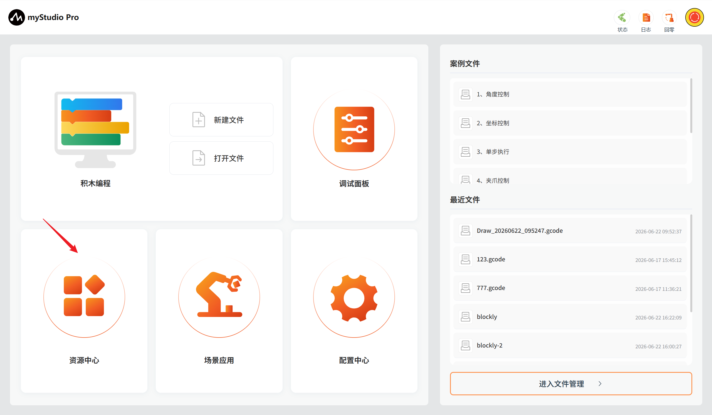

#### [场景应用](./5.3.6-scene.md)

功能：集成以下核心功能：写字画画与激光雕刻。

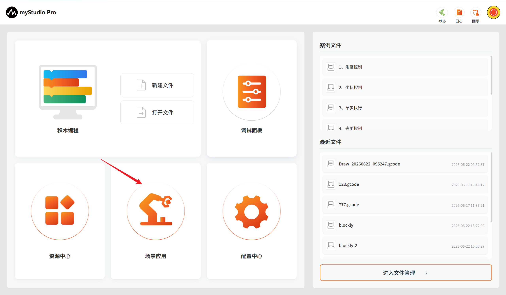

#### [配置中心](./5.3.7-setting.md)

功能：集成以下核心功能：实时监控机器人状态与信息、一键检查更新应用版本、个性化设置（语言/运动参数）、引脚配置等，助您高效管理机器人系统。

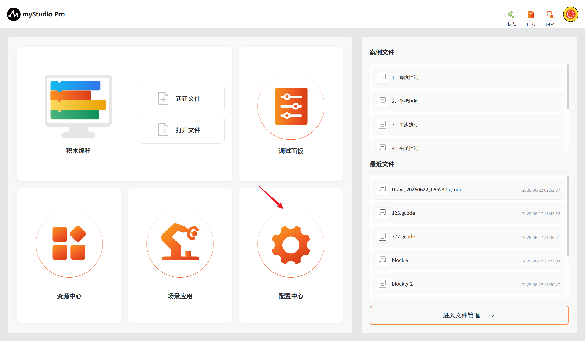

## 信息展示

应用的底层部分，警报提示以及当前机器人的运行状态。

## 报警提示

功能：展示机器人错误信息，并且鼠标左点击可以打开错误日志窗口。

鼠标左键点击，打开错误日志窗口。

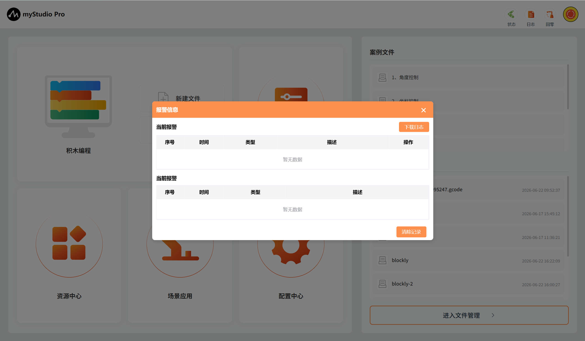

如果机器人在运行的过程中报错，应用就会捕获异常并且显示在错误日志界面中，错误日志表格内含义如下：

- number：错误日志序号
- time：错误发生的时间
- type：出现的错误类型
- description：错误描述信息

应用捕获到错误以后，首先会弹窗提示并且会给出解决方案，如果你不想处理错误，也可以忽略错误。当你断开连接并且重新连接设备或者进入到错误日志界面，点击"清除"按钮以后，会重新弹窗提示并且保存到错误日志表中。

以捕获到关节1超限错误为例：

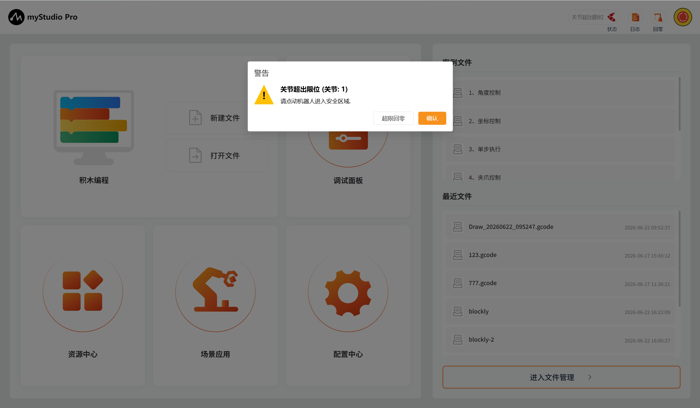

1、当捕获到机械臂异常时，会弹出捕获到的具体警告弹窗，弹窗主要由4部分组成，1：当前异常错误的具体内容；2：当前异常错误的解决方法，若当前异常可解决或恢复则会显示，反之则没有内容显示；3：当前可清除或恢复的异常错误的'修复按钮'，触发即自动对该异常进行修复处理，反之则没有按钮显示；4：当前异常确认按钮，如果你不想处理错误，可以该按钮忽略当前异常。

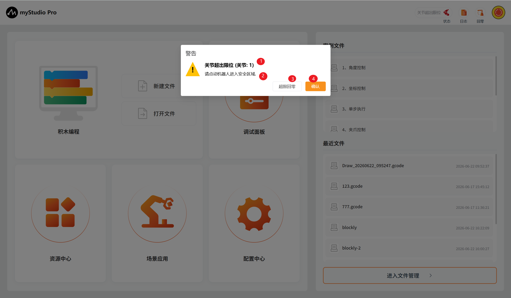

2、已修复的异常会展示到异常列表中的历史报警表格中，当前存在的异常会展示到当前报警表格中，同时自动记录异常存在时间。

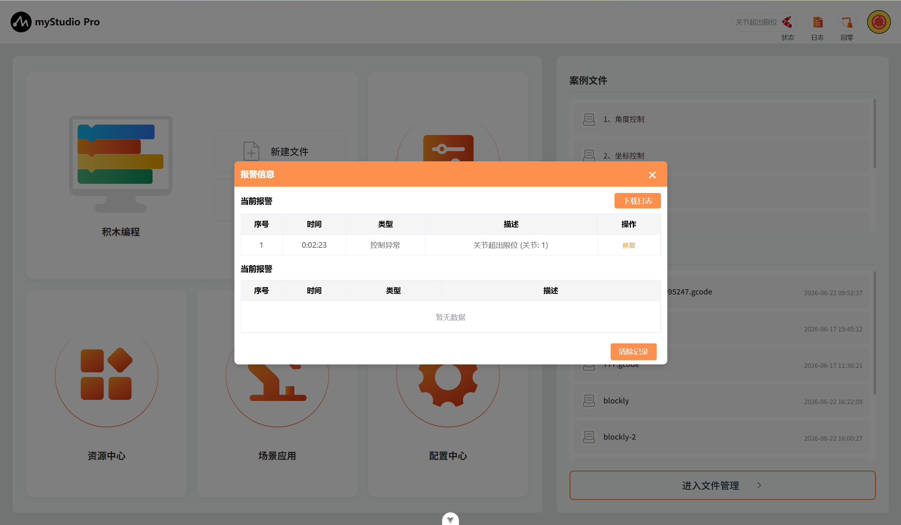

3、（1）机器人日志下载按钮，自动获取当前时间往前推 1天 范围内的日志，并将日志文件以“.log”文件格式下载至对
应存储位置，若异常可修复可点击修复按钮（2）进行异常修复操作，点击清理记录按钮（3）会对已解决的历史报警记录进行清除操作。

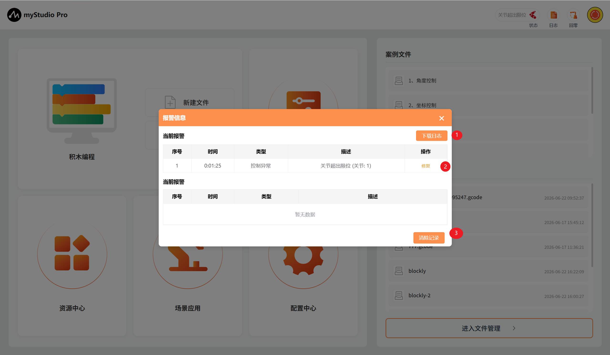

## 机器人状态

功能：显示当前机器人的运行状态

| Color | meaning                                                     |
| ---- | ------------------------------------------------------------ |
| | 未连接 |
|     | 连接中 |
|     | 正在运动 |
|     | 机器异常  |

---

[← 上一章](../5.2-minirobot/5.2.9-Q&A.md) | [下一章 →](./5.3.1-firstUse.md)
