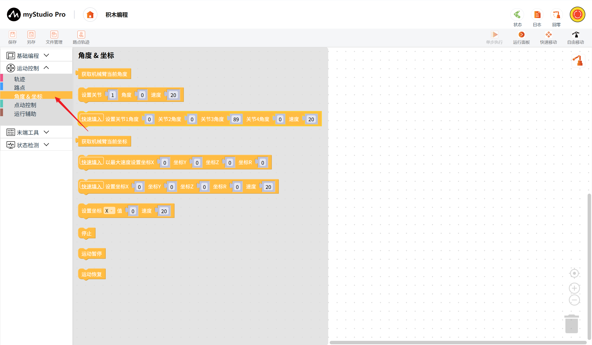
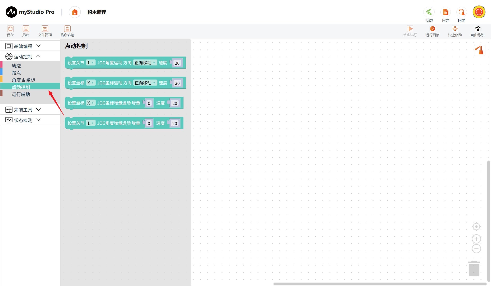
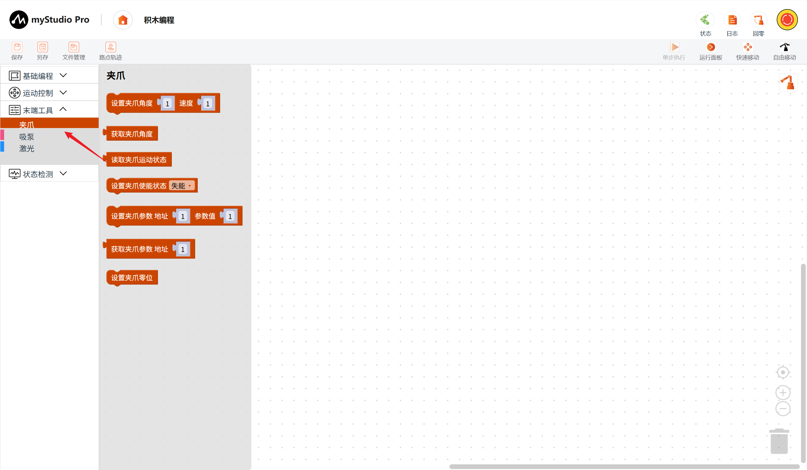
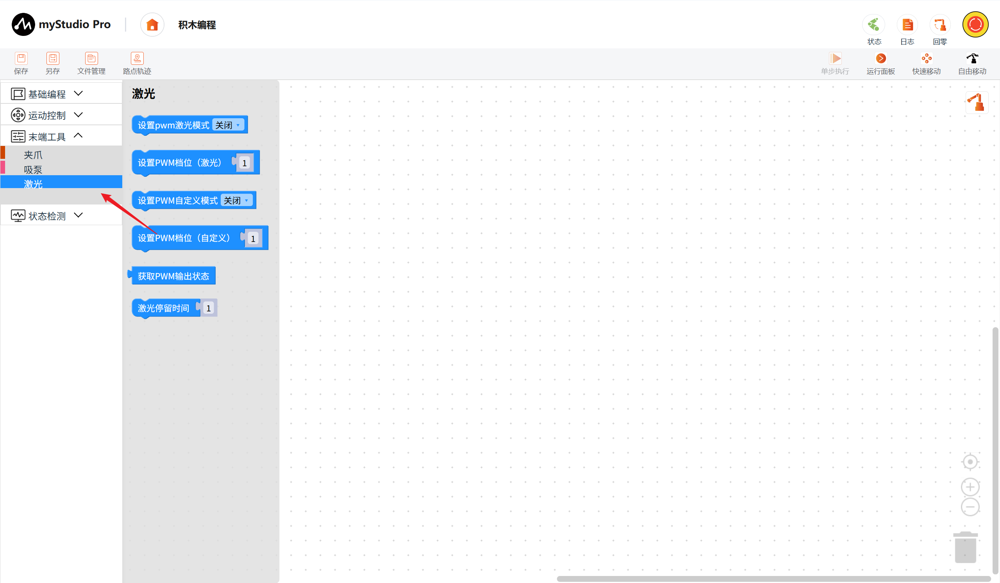
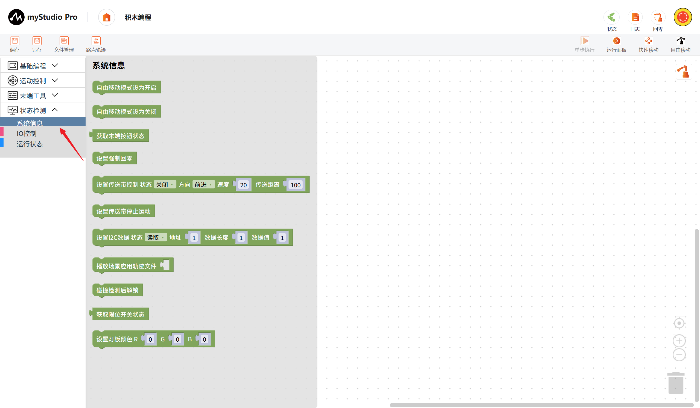
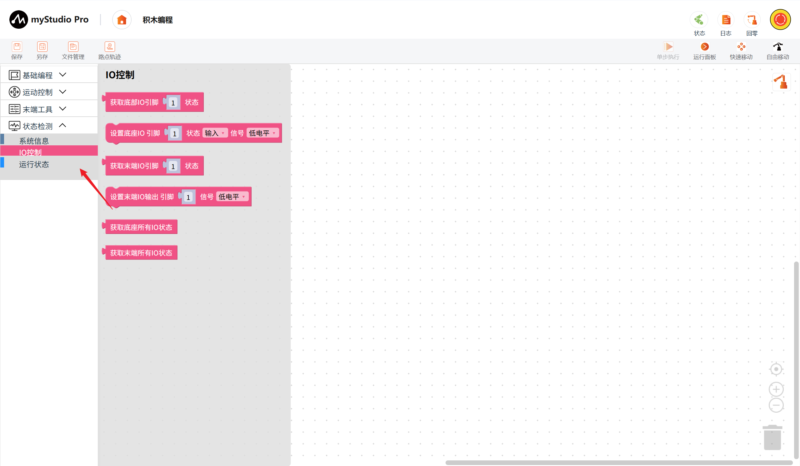

# ultraArmP1 积木块说明

## 运动控制

> 以下是对运动控制类别积木块的介绍

### 轨迹

#### 播放拖动示教轨迹文件

功能：选择并播放已保存的拖动示教轨迹。

参数：轨迹文件：从当前轨迹列表中选择。

返回值：无

### 路点

#### 移动至指定路点

功能：控制机械臂以指定运动模式和速度移动至所选路点。

参数：路点：从当前路点列表中选择；模式：关节运动、线性运动；速度：1～100。

返回值：无

### 角度与坐标

#### 获取机械臂当前角度

功能：读取机械臂当前各关节角度。

参数：无。

返回值：`list`，四个关节的浮点角度列表 `[J1, J2, J3, J4]`。

#### 设置关节角度

功能：控制指定关节以设定速度运动到目标角度。

参数：关节：1～4；角度：关节1为 -165°～165°，关节2为 -18°～85°，关节3为 89°～200°，关节4为 -179°～179°；速度：1～100。

返回值：闭环模式返回 `ok`，开环模式返回 `1`。

#### 设置全部关节角度

功能：控制四个关节以设定速度同时运动到各自的目标角度，支持快速填入当前角度。

参数：关节1角度：-165°～165°；关节2角度：-18°～85°；关节3角度：89°～200°；关节4角度：-179°～179°；速度：1～100。

返回值：闭环模式返回 `ok`，开环模式返回 `1`。

#### 获取机械臂当前坐标

功能：读取机械臂当前的 X、Y、Z、R 坐标。

参数：无。

返回值：`list`，长度为 4 的坐标列表 `[X, Y, Z, R]`。

#### 以最大速度设置坐标

功能：控制机械臂以最大速度运动到指定坐标，支持快速填入当前坐标。

参数：X：-350～362.43；Y：-362.43～362.43；Z：-186.265～93.44；R：-180°～180°。

返回值：闭环模式返回 `ok`，开环模式返回 `1`。

#### 设置机械臂坐标

功能：控制机械臂以设定速度运动到指定的 X、Y、Z、R 坐标，支持快速填入当前坐标。

参数：X：-350～362.43；Y：-362.43～362.43；Z：-186.265～93.44；R：-180°～180°；速度：1～100。

返回值：闭环模式返回 `ok`，开环模式返回 `1`。

#### 设置单个坐标

功能：控制机械臂以设定速度将指定坐标轴运动到目标值。

参数：坐标轴：X、Y、Z、R；目标值：X 为 -350～362.43，Y 为 -362.43～362.43，Z 为 -186.265～93.44，R 为 -180°～180°；速度：1～100。

返回值：闭环模式返回 `ok`，开环模式返回 `1`。

#### 停止

功能：停止机械臂当前运动。

参数：无。

返回值：`ok`。

#### 运动暂停

功能：暂停机械臂当前运动。

参数：无。

返回值：`ok`。

#### 运动恢复

功能：恢复机械臂当前运动。

参数：无。

返回值：`ok`。

### 点动控制

#### 设置关节 JOG 角度运动

功能：控制指定关节按所选方向和速度持续点动。

参数：关节：1～4；方向：正向移动、负向移动；速度：1～100。

返回值：闭环模式返回 `ok`，开环模式返回 `1`。

#### 设置坐标 JOG 运动

功能：控制指定坐标轴按所选方向和速度持续点动。

参数：坐标轴：X、Y、Z、R；方向：正向移动、负向移动；速度：1～100。

返回值：闭环模式返回 `ok`，开环模式返回 `1`。

#### 设置坐标 JOG 增量运动

功能：控制指定坐标轴按设定增量和速度运动。

参数：坐标轴：X、Y、Z、R；增量：X 为 -350～362.43，Y 为 -362.43～362.43，Z 为 -186.265～93.44，R 为 -180°～180°；速度：1～100。

返回值：闭环模式返回 `ok`，开环模式返回 `1`。

#### 设置关节 JOG 角度增量运动

功能：控制指定关节按设定角度增量和速度运动。

参数：关节：1～4；增量：关节1为 -165°～165°，关节2为 -18°～85°，关节3为 89°～200°，关节4为 -179°～179°；速度：1～100。

返回值：闭环模式返回 `ok`，开环模式返回 `1`。

### 运行辅助

#### 放松关节

功能：解除指定关节的电机使能，使该关节可被手动移动。

参数：关节：1～4。

返回值：`ok`。

#### 锁紧关节

功能：使能指定关节的电机，使该关节保持锁紧。

参数：关节：1～4。

返回值：`ok`。

#### 设置 PWM 控制

功能：设置机械臂 PWM 控制档位。

参数：PWM 控制值：0～5。

返回值：无。

#### 设置关节零位校准

功能：将指定关节的当前位置设置为零位。

参数：关节：全关节、关节1、关节2、关节3、关节4。

返回值：`ok`。

#### 获取零位校准状态

功能：读取各关节的零位校准状态。

参数：无。

返回值：`list`，各关节零位校准状态，例如 `[1, 1, 1, 1]`。

#### 读取电机使能状态

功能：读取机械臂电机当前是否处于使能状态。

参数：无。

返回值：`list`，5 个电机的使能状态。

---

## 末端工具

> 以下是对末端工具类别积木块的介绍

### 夹爪

#### 设置夹爪角度

功能：控制夹爪以设定速度运动到指定角度。

参数：角度：1～100；速度：1～100。

返回值：`ok`。

#### 获取夹爪角度

功能：读取夹爪当前角度。

参数：无。

返回值：夹爪角度，范围为 1～100。

#### 读取夹爪运动状态

功能：读取夹爪当前的运动状态。

参数：无。

返回值：无。

#### 设置夹爪使能状态

功能：设置夹爪电机的使能状态。

参数：状态：失能、使能。

返回值：`ok`。

#### 设置夹爪参数

功能：按参数地址写入夹爪配置值。

参数：地址：1～69；参数值：1～65535。

返回值：`ok`。

#### 获取夹爪参数

功能：读取指定地址对应的夹爪参数值。

参数：地址：1～69。

返回值：`int`，夹爪参数值，范围为 0～65535。

#### 设置夹爪零位

功能：将夹爪当前位置设置为零位。

参数：无。

返回值：`ok`。

### 吸泵

#### 设置吸泵状态

功能：设置吸泵的工作状态。

参数：状态：打开、释放、关闭。

返回值：`ok`。

### 激光

#### 设置 PWM 激光模式

功能：开启或关闭 PWM 激光模式。

参数：模式：开启、关闭。

返回值：成功返回 `ok`，失败返回 `0`。

#### 设置 PWM 档位（激光）

功能：设置激光模式下的 PWM 输出值。

参数：PWM 值：0～255。

返回值：成功返回 `ok`，失败返回 `0`。

#### 设置 PWM 自定义模式

功能：开启或关闭 PWM 自定义输出模式。

参数：模式：开启、关闭。

返回值：成功返回 `ok`，失败返回 `0`。

#### 设置 PWM 档位（自定义）

功能：设置自定义模式下的 PWM 输出值。

参数：PWM 值：0～255。

返回值：成功返回 `ok`，失败返回 `0`。

#### 获取 PWM 输出状态

功能：读取当前 PWM 输出状态。

参数：无。

返回值：`list[int]`，长度为 4，依次为激光模式状态、激光 PWM 值、自定义模式状态、自定义 PWM 值；模式状态为 `0`（关闭）或 `1`（打开），PWM 值范围为 0～255。

#### 激光停留时间

功能：设置激光雕刻过程中的停留时间。

参数：停留时间：0～1000。

返回值：`ok`。

---

## 状态检测

> 以下是对状态检测类别积木块的介绍

### 系统信息

#### 自由移动模式设为开启

功能：启用末端按钮控制的自由移动模式。

参数：无。

返回值：`ok`。

#### 自由移动模式设为关闭

功能：禁用末端按钮控制的自由移动模式。

参数：无。

返回值：`ok`。

#### 获取末端按钮状态

功能：读取机械臂末端按钮的当前状态。

参数：无。

返回值：`int`，`0` 表示未按下，`1` 表示已按下。

#### 设置强制回零

功能：控制机械臂执行强制回零操作。

参数：无。

返回值：`ok`。

#### 设置传送带控制

功能：设置传送带的启停状态、运动方向、速度和传送距离。

参数：状态：打开、关闭；方向：前进、后退；速度：1～125；传送距离：1～1200。

返回值：`ok`。

#### 设置传送带停止运动

功能：停止传送带运动。

参数：无。

返回值：`ok`。

#### 设置 I2C 数据

功能：通过指定地址读取或写入 I2C 数据。

参数：状态：读取、写入；地址：0～255；数据长度：0～64；数据值：0～255。

返回值：写入成功返回 `ok`；读取成功返回 `list[str]`，例如 `['8f', '15']`；通信异常返回错误码 `1`～`7`。

#### 播放场景应用轨迹文件

功能：播放指定的 G-code 场景应用轨迹文件。

参数：文件名或文件路径：字符串。

返回值：无。

#### 碰撞检测后解锁

功能：机械臂发生碰撞并触发保护后执行解锁。

参数：无。

返回值：成功返回 `OK`，失败返回 `0`。

#### 获取限位开关状态

功能：读取机械臂限位开关的当前状态。

参数：无。

返回值：`int`，`0` 表示未触发，`1` 表示已触发。

#### 设置灯板颜色

功能：通过 RGB 数值设置灯板颜色。

参数：R：0～255；G：0～255；B：0～255。

返回值：`ok`。

### IO 控制

#### 获取底部 IO 引脚状态

功能：读取指定底座 IO 引脚的当前状态。

参数：引脚：1～10。

返回值：`int`，范围为 0～3：`0` 输入低电平、`1` 输入高电平、`2` 输出低电平、`3` 输出高电平。

#### 设置底座 IO

功能：设置指定底座 IO 引脚的输入/输出模式及电平信号。

参数：引脚：1～10；状态：输入、输出；信号：低电平、高电平。

返回值：`ok`。

#### 获取末端 IO 引脚状态

功能：读取指定末端 IO 引脚的当前状态。

参数：引脚：1～4。

返回值：`int`，范围为 0～3：`0` 输入低电平、`1` 输入高电平、`2` 输出低电平、`3` 输出高电平。

#### 设置末端 IO 输出

功能：设置指定末端 IO 引脚的输出电平。

参数：引脚：1～4；信号：低电平、高电平。

返回值：`ok`。

#### 获取底座所有 IO 状态

功能：读取底座全部 IO 引脚的状态。

参数：无。

返回值：`list`，长度为 10，每项范围为 0～3：`0` 输入低电平、`1` 输入高电平、`2` 输出低电平、`3` 输出高电平。

#### 获取末端所有 IO 状态

功能：读取末端全部 IO 引脚的状态。

参数：无。

返回值：`list`，长度为 4，每项范围为 0～3：`0` 输入低电平、`1` 输入高电平、`2` 输出低电平、`3` 输出高电平。

### 运行状态

#### 获取错误信息

功能：读取机械臂当前错误信息。

参数：无。

返回值：错误信息。

#### 获取队列大小

功能：读取机械臂当前待执行指令队列的大小。

参数：无。

返回值：`int`，缓冲区队列大小。

#### 获取运行状态

功能：读取机械臂当前运行状态。

参数：无。

返回值：运行状态。

#### 清除错误状态

功能：清除机械臂当前错误状态。

参数：无。

返回值：成功返回 `OK`，失败返回 `0`。

---

[← 上一章](./5.4-set_joint_zero.md) | [下一章 →](../6-SoftwareDevelopment/README.md)