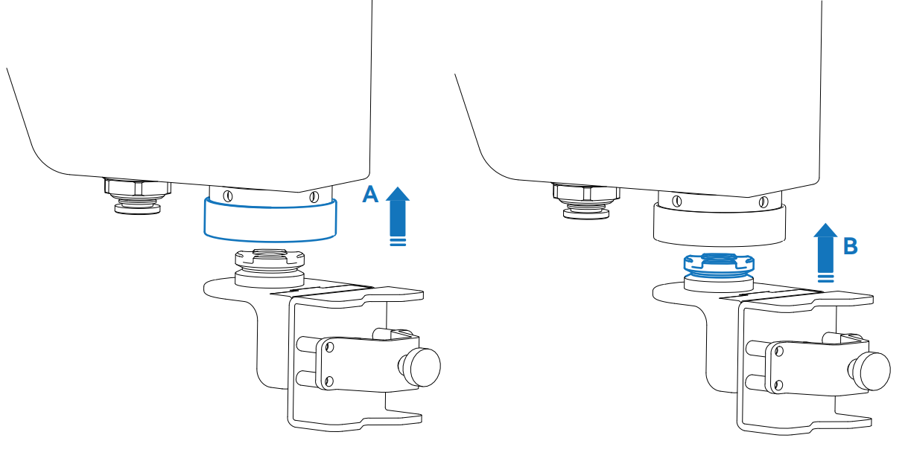
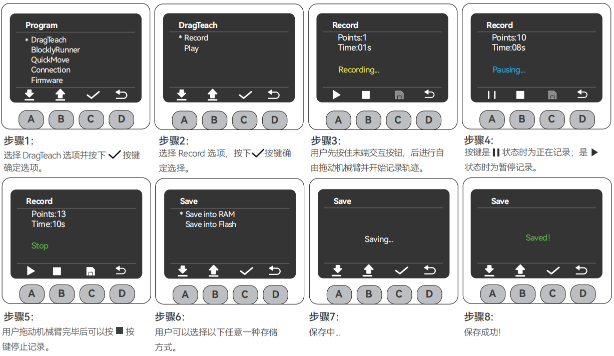

# Startup Troubleshooting Guide

## 1. Working Environment

Before starting up, please clean the workbench and prepare the necessary tools.

- **Working Environment**: Place the robot arm horizontally on a table with a load capacity at least 5 times greater than the weight of the robot arm itself. The workspace should be no smaller than the robot's working range, with sufficient space for installation, operation, maintenance, and repair.
- **Tool List**: ultraArm P1 robotic arm main body, product accessory bag, etc.

## 2. External Cable Connections

Please ensure you have completed the structural installation and placed the robotic arm horizontally and securely to ensure safe operation. Please follow the steps below to connect:

### Step 1: Connect Power

Connect the DC power adapter (please ensure you use the official adapter with DC 12V 8A or higher power capacity) to the corresponding DC power interface on the ultraArm P1 robotic arm. Connect the other end of the adapter to a 110-220V power outlet.

### Step 2: Connect to Computer

Connect one end of the Type-C USB cable to the Type-C interface of the ultraArm P1 robotic arm, and the other end to the host computer.

### Step 3: Power On

Press the power switch. Wait 5 seconds. When the MiniRobot screen starts up and displays real-time coordinate information, and the top robotic arm status indicator icon turns green, the startup preparation is complete.

> **Note**:
> - Rated voltage: DC 12V
> - Rated current: 8A

## 3. Power-On Status Display

After confirming all necessary cables are properly connected and the connectors are secure, press the power switch.

After powering on, you will observe the following normal phenomena:

1. The MiniRobot screen first displays the Logo for about 3 seconds, then automatically enters the main interface, showing the current joint angles and coordinate information.
2. The top status indicator light on the interface will turn green, indicating that the robotic arm is powered on.

## 4. End-Effector Tool Installation

### 4.1 Pen Holder Installation Method

The ultraArm P1 adopts a quick-change connector design. The installation method for end-effector tools such as grippers and suction pumps is similar:

**Step 1**: Pull up Part A (locking ring) on the quick-change connector.

**Step 2**: Align the positioning hole of the end-effector tool (Part B) with Part A and insert.

**Step 3**: Release Part A to complete the locking.

### 4.2 Pneumatic Gripper Installation Method

**Step 1**: Attach the gripper to the robotic arm using the quick-connect method.

**Step 2**: Lift the buckle upward.

**Step 3**: Insert the hose into the air port and release the buckle.

## 5. MiniRobot Function Description

### 5.1 Main Interface Function Description

**Button Instructions**: After powering on, the robot performs a self-check for 3 seconds and defaults to the main interface, where you can view the robotic arm's coordinates in real time. Use the buttons below to switch to other function interfaces. The horizontal line at the bottom of the interface indicates the currently active interface.

- **Button A**: Enter the menu interface (automatically returns to the main interface after 30 seconds of inactivity)
- **Button B**: Display real-time angle and coordinate information
- **Button C**: Display the input/output status of the bottom IOs
- **Button D**: Display WiFi, USB, and Bluetooth connection status

### 5.2 Menu Interface Function Description

Press Button A on the main interface to enter the menu interface. The menu includes the following functions:

- ➀ **DragTeach**: Press and hold the end effector interaction button to freely drag the robotic arm; supports trajectory recording and playback.
- ➁ **BlocklyRunner**: Select and play saved trajectory files.
- ➂ **QuicklyMove**: Provides two fast movement modes: free movement and jog movement.
- ➃ **Connection**: Supports WLAN / USB / Bluetooth communication; view and configure connection settings.
- ➄ **Firmware**: View robot ID, screen driver, and firmware system version.
- ➅ **Calibration**: Provides per-joint manual calibration mode.
- ➆ **Settings**: Provides error clearing and log viewing functions.

## 6. Basic Functionality Testing

After completing the connections, it is recommended to perform the following checks to confirm the product functions normally:

### Record Trajectory

> **Note**:
> - Choose storage mode: Save to RAM (temporary storage, lost on power-off) or save to Flash (long-term storage, retained after power-off).

### Dragging the Robotic Arm

In the MiniRobot operation steps, the user can freely drag the robotic arm into any posture (within the joint range) and record the trajectory. The image below shows an example:

Press and hold the end effector interaction button to start drag teaching.

### Playback Track

* If you attempt to play a trajectory before actually recording one, the screen will display the warning: "Warning: No playable trajectory file!" Simply return to the menu page and follow the trajectory recording steps described above.
* The save operation performed during the trajectory playback process is long-term storage.

---

[← Previous Chapter](4.2-ProductUnboxingGuide.md) | [Next Chapter →](../../C-FunctionsAndApplications/5-BasicApplication/README.md)
