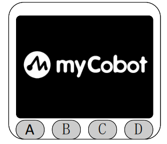
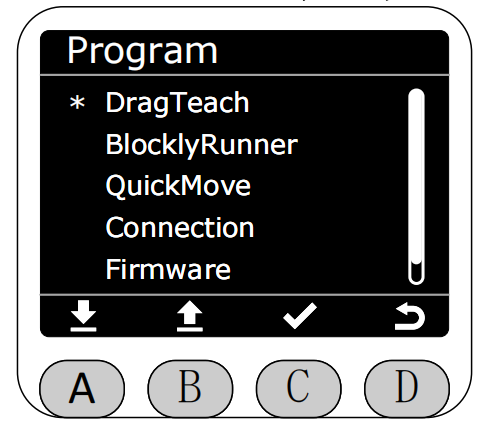
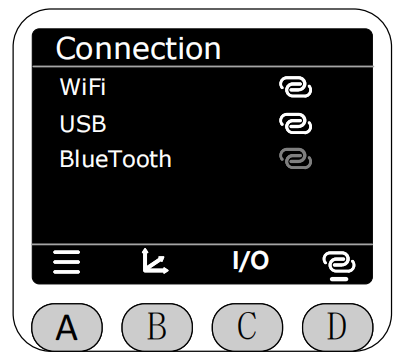
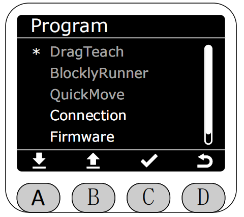

# First Use

MiniRobot is an interactive module consisting of a TFT screen and buttons. The bottom buttons are A, B, C, D from left to right. You can switch to display different robotic arm information and also control the robotic arm status via buttons.

Before starting MiniRobot, you need to power on the robotic arm first and press the power switch to use normally.
After powering on the robotic arm, if the main controller is not started yet, the top right corner of the screen will show a gray circle, and all data will appear gray, including angles and coordinates. Approximately 3 seconds after powering on, MiniRobot will automatically update current data and display a green circle in the top right corner.

After the robotic arm is powered on, MiniRobot will first display the Logo.

Then it will enter the main interface, which displays current joint information and coordinate information of the robotic arm by default.

Press button A to enter the menu interface. You can navigate up and down through the icons at the bottom of the screen to select specific functions. **Note: If there is no operation on this interface for 30 seconds, it will automatically return to the main interface.**

You can switch to display different robotic arm information using the bottom buttons. Press button C to display the current input/output status of the 4 bottom IOs of the robotic arm.

Press button D to display the enabled or connection status of WiFi, USB, and BlueTooth.

**Note: MiniRobot, myStudio Pro, and Python interfaces have mutual exclusion for robotic arm motion control. Only one side can control the robotic arm at the same time. If MiniRobot enters a control interface, myStudio Pro or Python interface cannot control the robotic arm, and vice versa.**

When entering the following interfaces, it will be considered as entering a control interface:

1. DragTeach interface and its subpages.

2. BlocklyRunner interface and its subpages.

3. QuickMove interface and its subpages.

4. Calibration interface and its subpages.

5. Settings interface and its subpages.

When other sides are controlling the robotic arm, the screen will popup "Other ports are under control...", and the popup will automatically exit after 3 seconds.

At this time, entering the menu page, only "Firmware" and "Connection" can be accessed, other options are grayed out and cannot be selected.

[← Previous Chapter](../5.1-SystemInstructions.md) [Next Chapter →](./5.2.2-dragteach.md)
