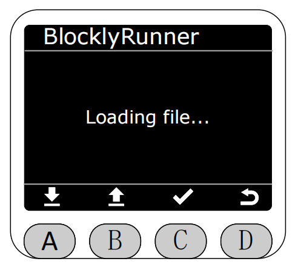
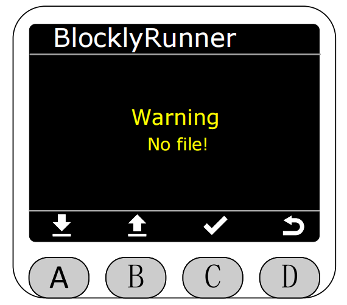
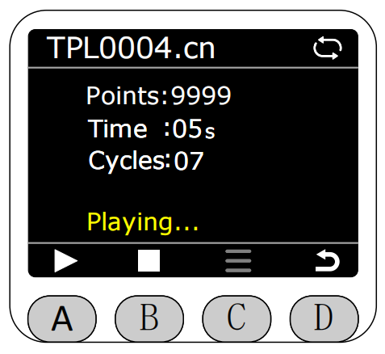
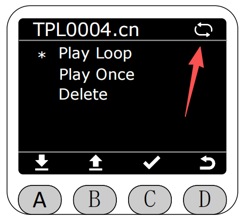
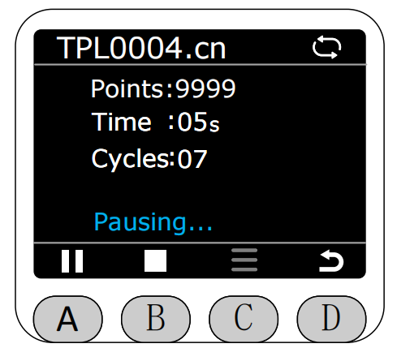
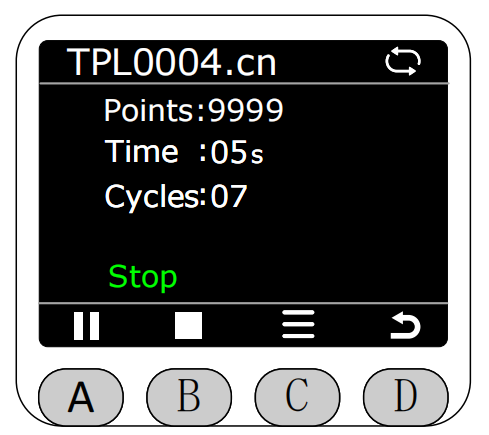
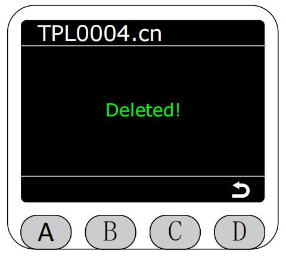

# BlocklyRunner

In the Program interface, select the BlocklyRunner function with the asterisk, then press button C to enter BlocklyRunner function.

After entering BlocklyRunner function, it will first check if there are python files and previously Flash saved .cn files in the BlocklyRunner folder.
**BlocklyRunner files are divided into local screen recorded trajectory files .cn and PC-side APP generated python script files. Selecting different files navigates to different execution pages.**

If there are no files, the corresponding error will be prompted.

If there are files, existing trajectory files will be displayed in the BlocklyRunner interface. You can select to play corresponding trajectory files or python scripts.

After selecting the corresponding file, it will first check the status of this file.

If the file is normal, press button A to start playing (left side is .cn file playback page, right side is .py file playback page).
**During playback, the top right corner of the screen will display the current trajectory file playback loop status. Gray indicates single loop playback, white indicates infinite loop playback. Selecting a file just entering the playback page defaults to infinite loop playback.**

**Before the file starts executing or when execution is stopped, you can press button C's menu options to delete the trajectory file, single play, or loop play operations.**

If loop play is selected, after the trajectory file finishes playing, it will automatically restart playback. Meanwhile, the arrow-pointed icon will turn white.

If single play is selected, after the trajectory file finishes playing, it will automatically stop playback. Meanwhile, the arrow-pointed icon will turn gray.

Press button A again during playback to pause playback.

Press button B to stop playback.

If delete file is selected.

Click delete, it will prompt whether to confirm deleting this file.

After confirmation, a deletion success prompt will popup. After performing the delete operation, the corresponding file in BlocklyRunner's folder will also be deleted. It automatically returns after 3 seconds, and at this time returns will navigate to the read BlocklyRunner folder interface.

[← Previous Page](./5.2.1-dragteach.md) | [Next Page →](./5.2.4-quickmove.md)
