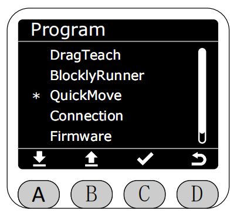
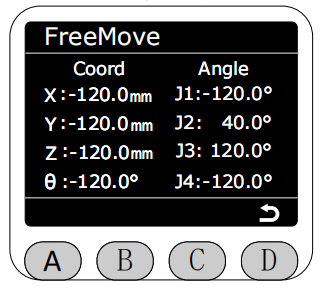
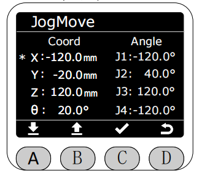
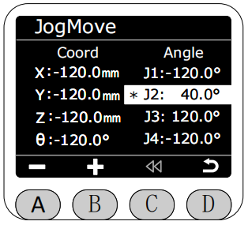

# QuickMove

In the Program interface, select the QuickMove function with the asterisk, then press button C to enter QuickMove function.

After entering QuickMove function, you can select FreeMove or JogMove.

In FreeMove mode, real-time display of robotic arm angle data and coordinate data. Long press the buttons on both sides of the end to freely drag the robotic arm. **At this time, all motor brakes will release, please be careful with safety.**

Return and select JogMove mode.

After entering JogMove mode, you can select jog angle or jog coordinate.

Select the joint or coordinate you want to jog to control the robotic arm joint or coordinate movement. The selected joint or coordinate will be highlighted. Single jog step is 0.1°, long press jog will rotate the joint or coordinate at 10 speed, and it will automatically stop when moving near the limit.

When jogging in jog mode, the robotic arm will automatically stop when moving near the coupling position. At this time, a warning prompt will popup, and the light strip will light blue. At this time, press button C to return to the previous position (the following four images respectively show: prompt coupling triggered, returning to previous safe position in progress, return failure, and return success).

[← Previous Page](./5.2.3-blocklyrunner.md) | [Next Page →](./5.2.5-connection.md)
