# Connection

In the Program interface, select the Connection function with the asterisk, then press button C to enter Connection function.

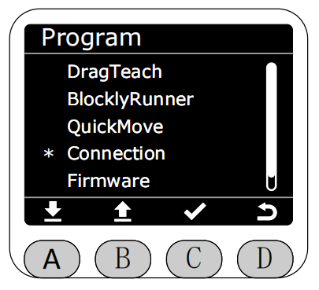

After entering Connection function, you can select USB to view the machine's SN code and configure serial communication baud rate.

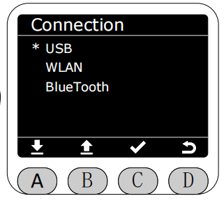

After selecting USB, it will display the current machine's SN code and currently configured serial baud rate.

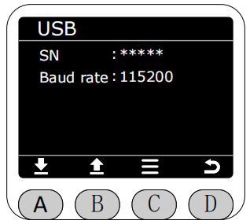

Select Baud rate to modify the baud rate configuration (select the corresponding baud rate, press button C to modify successfully).

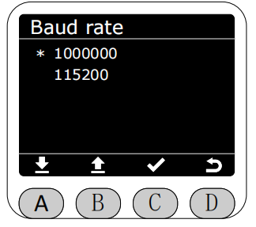

Return to Connection function, you can select WLAN to view the machine's WiFi connection information and select WiFi to connect, etc.

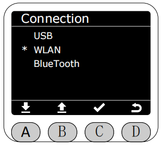

After selecting WLAN, it will display the current machine's WiFi connection status. Press button C to enter the configuration page, which supports switch, search nearby WiFi and connect, historical connection records (supports direct connection to previously connected WiFi, and can also delete historical connection records), and view current machine's MAC.

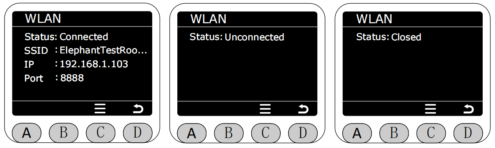

After entering WLAN configuration page, you can select the Switch option and press button C to turn WiFi on/off. After turning off WiFi, the Available and History options will be grayed out and cannot be clicked.

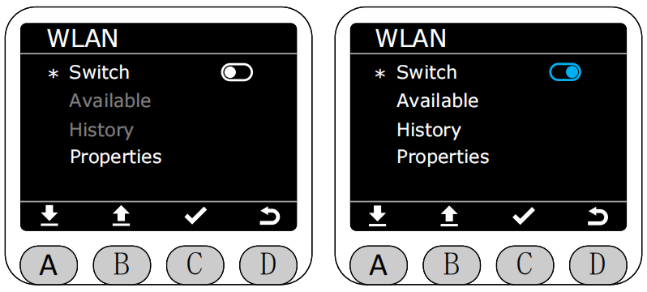

After turning on WiFi and selecting Available to enter, it will search nearby WiFi and display them.

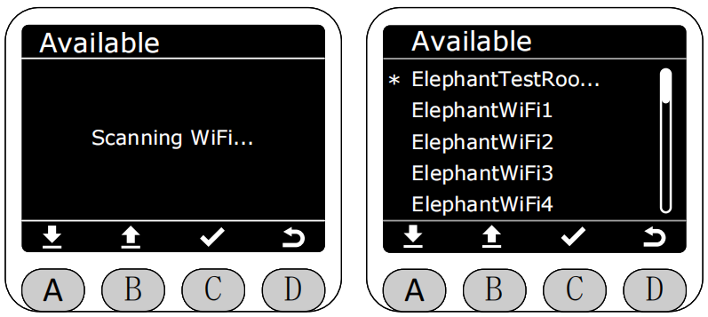

After selecting the WiFi to connect and pressing button C, connection will start (the following four images respectively show: connecting, no password, connection failed, and connection successful).

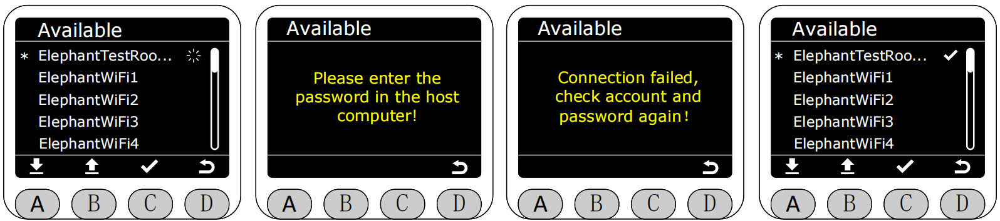

Return to WLAN menu page, select History page to enter, you can see historical connection record WiFi. Select the historical WiFi to connect and press button C to directly connect or delete this historical record WiFi.

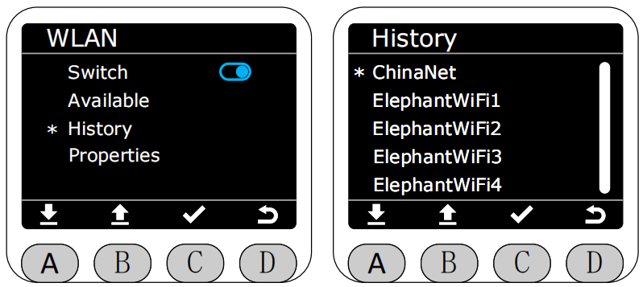

After selecting a historical connection WiFi and pressing button C to enter, you can again select connection to directly connect.

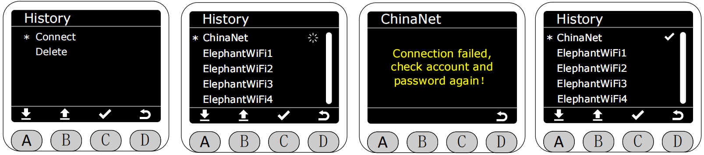

You can also select to delete this historical record.

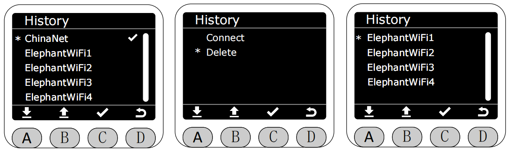

Return to WLAN menu page, select properties to enter, you can see current machine's MAC.

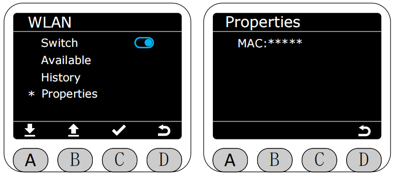

Return to Connection menu page, select BlueTooth to enter to view Bluetooth connection status.

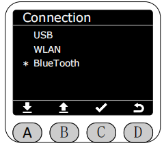

After entering BlueTooth page, you can see current Bluetooth connection status.

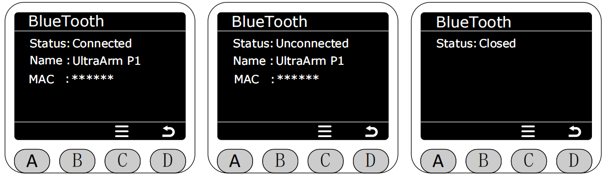

Press button C in BlueTooth page to enter Bluetooth on/off.

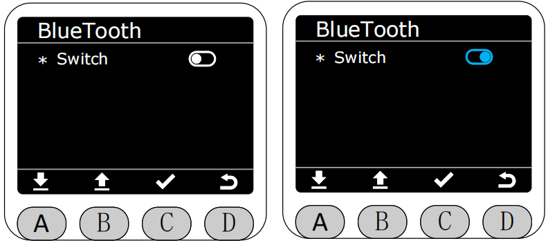

[← Previous Page](./5.2.4-quickmove.md) | [Next Page →](./5.2.6-firmware.md)
