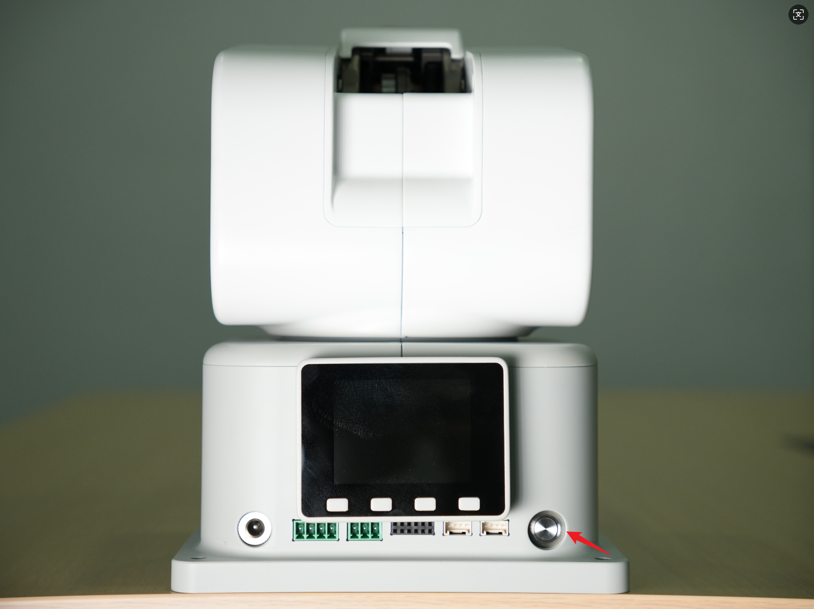
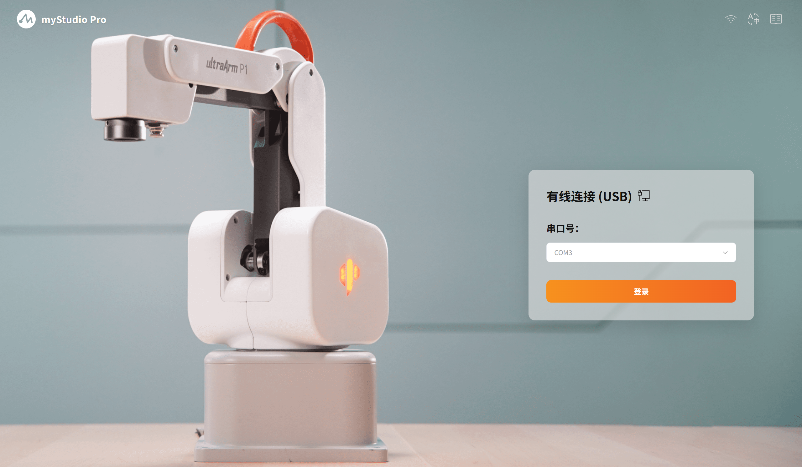

# First Use

## Supported Operating Systems for myStudio Pro

- Windows 10/11

- macOS

- Linux_x86_64

## Installing myStudio Pro

> The following installation steps use Windows OS as an example. Before reading this section, please ensure you have the software installation package.

1. Double-click the software installer to begin installation. Choose the installation user options according to your own needs.

2. Click [Next], choose the installation path for the software according to your needs. It is recommended to install to a path other than the C drive.

3. After confirming everything is correct, click [Install] and wait patiently until the software installation is complete.

4. Click [Finish] to run the software.

## Uninstalling myStudio Pro

> The following uninstallation steps use Windows OS with a desktop shortcut created as an example. Before reading this section, please ensure the software has been successfully installed on your device.

1. Select the software and right-click.

2. Select [Open file location], find the [Uninstall xxx.exe] executable file and double-click it.

3. Open the [Uninstall Wizard], click Next to complete the software uninstallation.

## Preparatory Work 

> Required tools: ultraArm P1 robotic arm, DC12VA DC power supply, USB power source, etc. 
>
> Note: Please ensure that you have completed the above-mentioned structure installation and placed the robotic arm horizontally on a table with a load capacity of at least 5 times the weight of the robotic arm itself, to ensure operational safety.
>
> Please follow the following diagrammed procedure to connect the power adapter to the corresponding interface on the robotic arm: 
>

**Step 1:** Connect the DC power supply to the corresponding DC circular interface on the ultraArm P1 robotic arm. The other end of the adapter should be connected to a 110-220V power socket.

**Step 2:** Connect the corresponding Type-C interface on the ultraAm P1 robotic arm to the host computer.

**Step 3:** Press the power switch. If green lights illuminate around the buttons, it indicates that the device has completed its startup process and is ready for use.

## Use myStudio Pro 

Double-click the mouse to open the installed software. The software will automatically detect the available serial ports. Just click the "Login" button.

[← Previous Chapter](./README.md) | [Next Chapter →](./5.3.2-launch.md)
