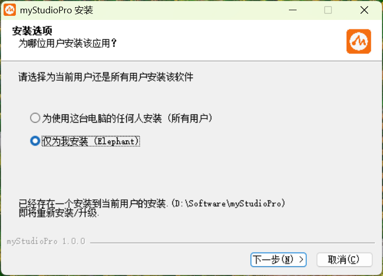
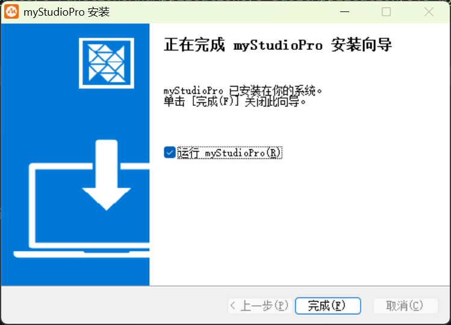
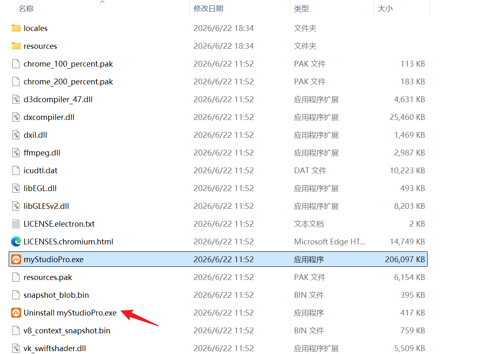
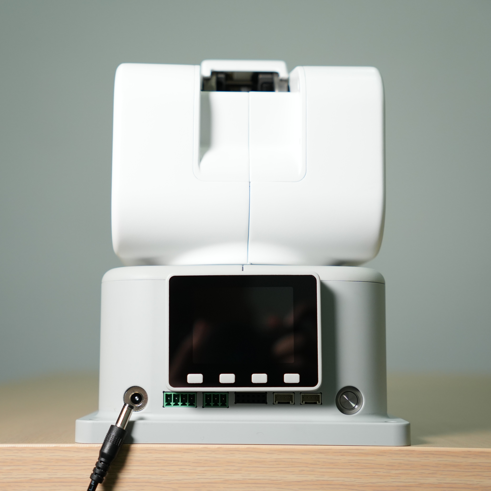
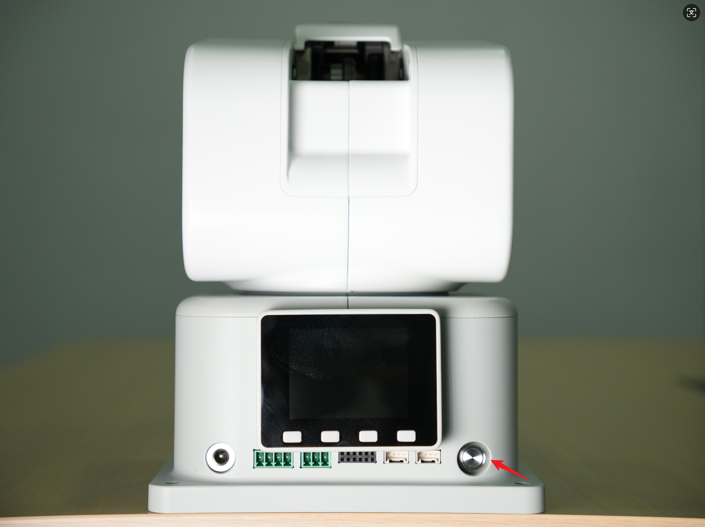
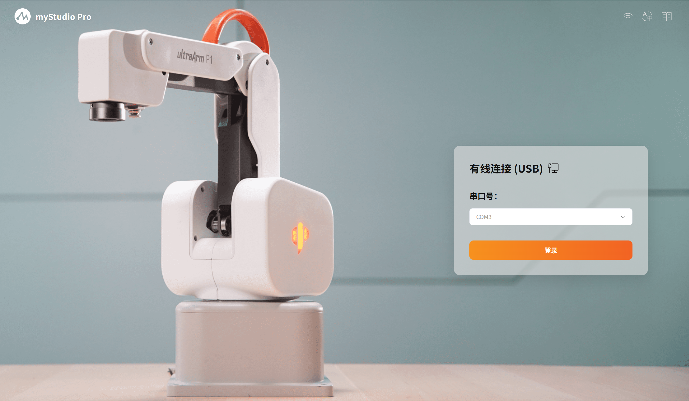

# First Use

## 1 Preparation

> The following is an introduction to the preparations needed before using the software. Please read carefully before use.

Please ensure that your device has downloaded the serial port driver, namely the CP210X or CP34X driver package. Currently, there are two versions of the driver chips, CP210X (for CP2104 version) / CP34X (for CH9102 version) driver package. If you are unsure about the USB chip used by your device, you can install both drivers at the same time. (During the installation process of CH9102_VCP_SER_MacOS, there may be an error message, but the installation has actually been completed. Just ignore it.) Please click the link below according to your computer system to download.

CP210X: [Windows 10](https://download.elephantrobotics.com/software/drivers/CP210x_VCP_Windows.zip), [MacOS](https://download.elephantrobotics.com/software/drivers/CP210x_VCP_MacOS.zip), [Linux](https://download.elephantrobotics.com/software/drivers/CP210x_VCP_Linux.zip)

CP34X: [Windows 10](https://download.elephantrobotics.com/software/drivers/CH9102_VCP_SER_Windows.exe), [MacOS](https://download.elephantrobotics.com/software/drivers/CH9102_VCP_MacOS.zip)

Note: For MacOS, before installation, make sure that the system "Preferences -> Security and Privacy -> General" allows access from the App Store and approved developers. 

---

## 2 Supported Operating Systems for myStudio Pro

> The following are the operating systems supported by the software. Before proceeding to read the content of this section, please ensure that your operating system is one of the following.

- Windows 10/11

- macOS

- Linux_x86_64

--- 

## 3 Installing myStudio Pro

> The following installation steps use Windows OS as an example. Before reading this section, please ensure you have the software installation package.

1. Double-click the software installation program, or right-click and select "Open", and the software installation guide will be opened.

2. Select the user options according to your own needs. After completing the selection of user options, click "Next".

3. Select the installation path for the software. Choose it according to your own needs. It is recommended to install it in a location other than the C drive. After confirming that it is correct, finally click on "Install" and patiently wait until the software installation is completed.

4. Check the "Run" option, then click "Finish" at the end, and the software will be run.

--- 

## 4 Uninstalling myStudio Pro

> The following uninstallation steps use Windows OS with a desktop shortcut created as an example. Before reading this section, please ensure the software has been successfully installed on your device.

1. Select the software and right-click.

2. Select [Open file location], find the [Uninstall xxx.exe] executable file and double-click it.

3. Open the [Uninstall Wizard], click Next to complete the software uninstallation.

---

## 5 Preparatory Work 

> Required tools: ultraArm P1 robotic arm, DC12VA DC power supply, USB power source, etc. 
>
> Note: Please ensure that you have completed the above-mentioned structure installation and placed the robotic arm horizontally on a table with a load capacity of at least 5 times the weight of the robotic arm itself, to ensure operational safety.
>
> Please follow the following diagrammed procedure to connect the power adapter to the corresponding interface on the robotic arm: 
>

**Step 1:** Connect the DC power supply to the corresponding DC circular interface on the ultraArm P1 robotic arm. The other end of the adapter should be connected to a 110-220V power socket.

**Step 2:** Connect the corresponding Type-C interface on the ultraArm P1 robotic arm to the host computer.

**Step 3:** Press the power switch. Wait for 5 seconds. When the MiniRobot screen starts up and displays real-time coordinate information, and the top robotic arm status indicator icon turns green, the startup preparation is complete.

---

## 6 Use myStudio Pro 

Double-click the mouse to open the installed software. The software will automatically detect the available serial ports. Just click the "Login" button.

> Note：Please make sure the serial port number is correct before logging in. If you have any questions, you can refer to the [Wired Login](./5.3.2-launch.md#wired-connection-login) for more information.

--- 

[← Previous Chapter](./README.md) | [Next Chapter →](./5.3.2-launch.md)
