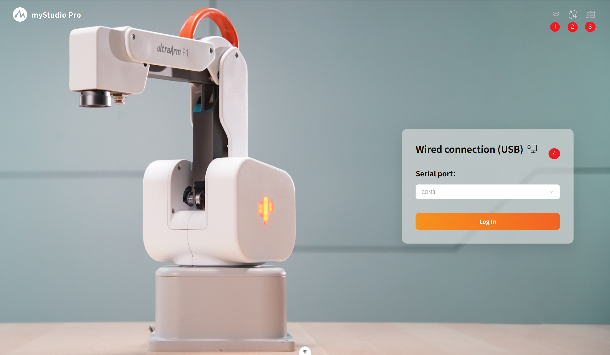
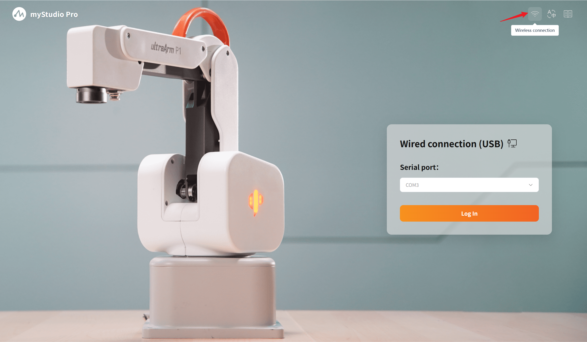
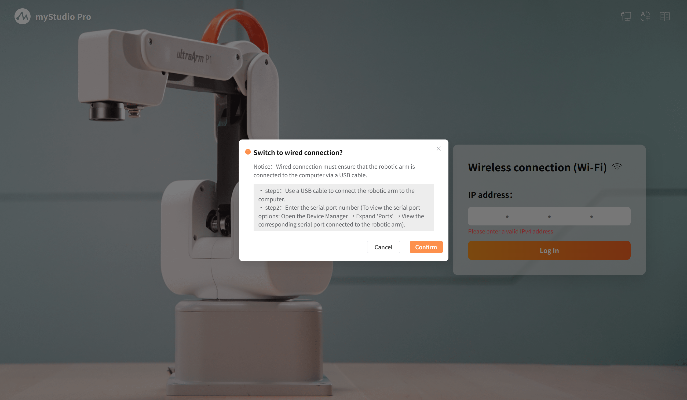
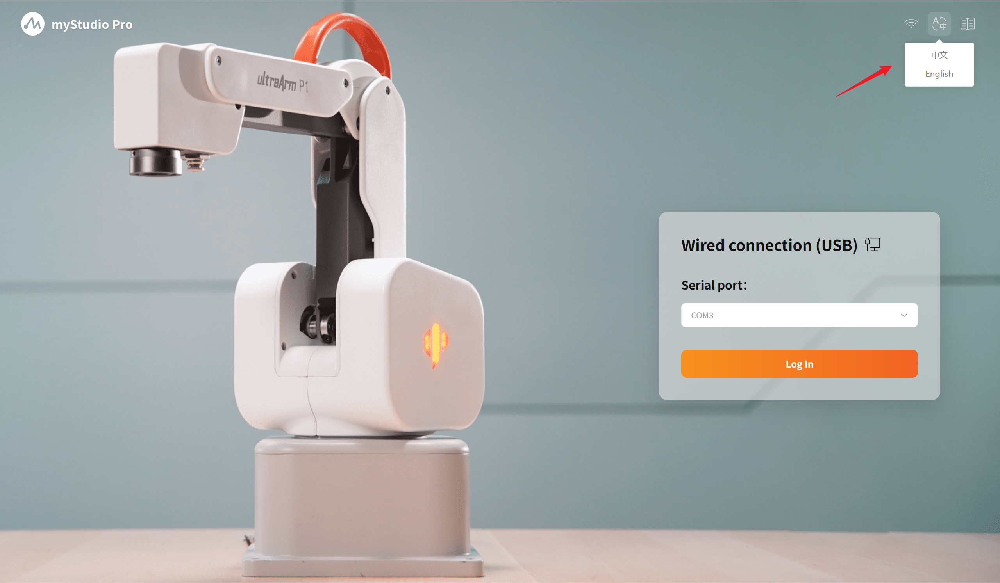
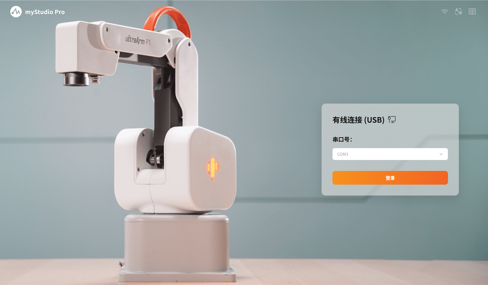
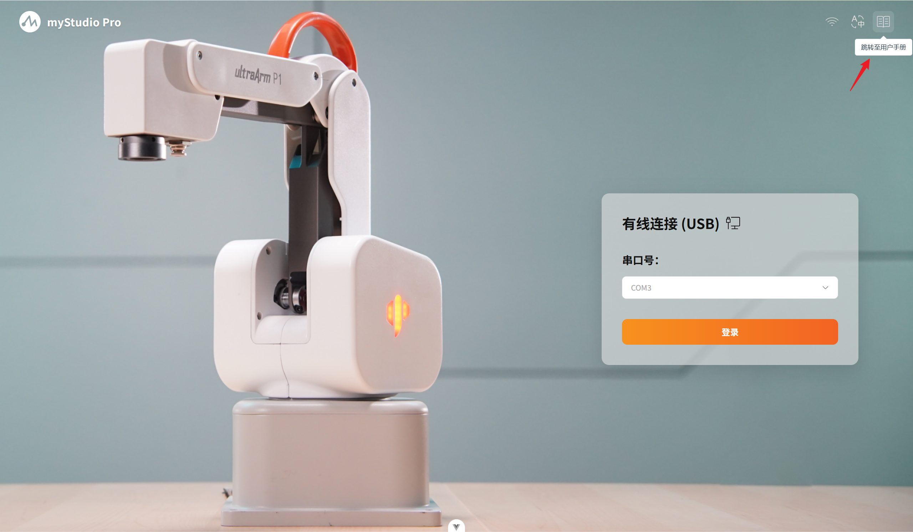
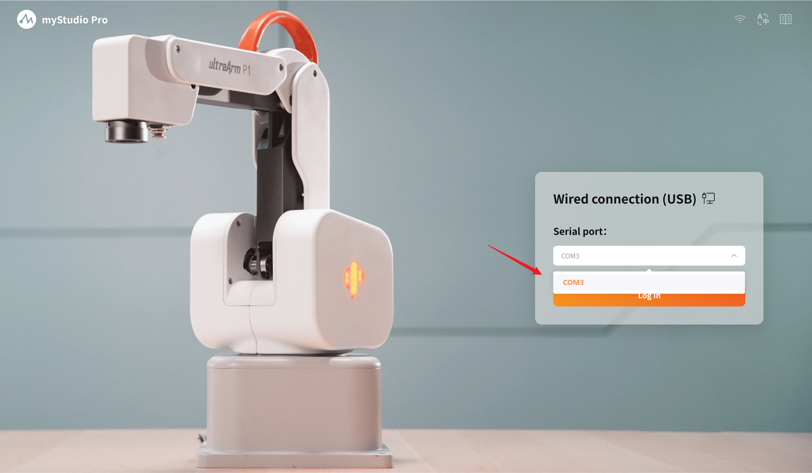
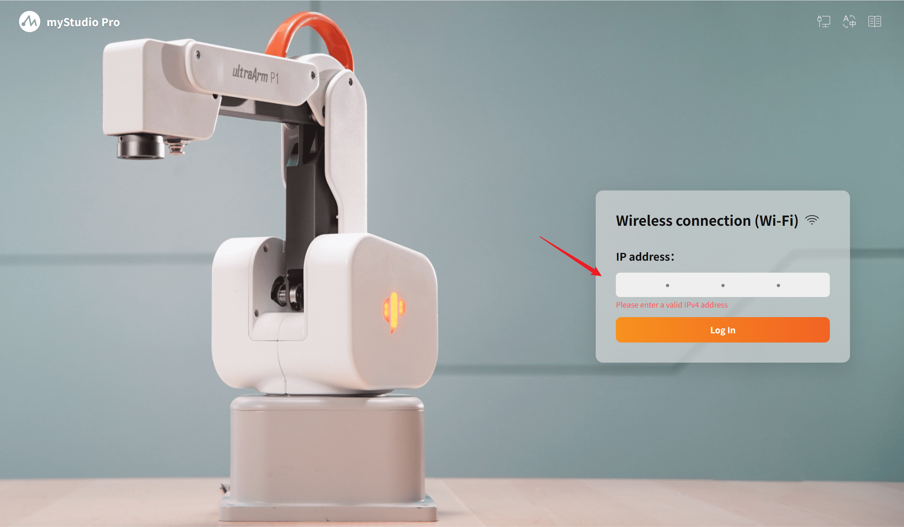

# Launch page

| Serial Number | Function Description                                           |
 | ------   | ------------------------------------------------------------ |
| 1    | Switching of connection method |
| 2    | Language switching       |
| 3    | Jump to user manual    |
| 4    | Login module           | 

## 1 Switching of Connection Methods 

When the software is launched, it defaults to the `wired` connection mode. The software supports two connection methods, namely `wired` connection and `wireless` connection. You can switch the connection mode to choose the way to establish a connection with the robot.

When the toggle button is clicked, a secondary pop-up window will appear. Inside the pop-up window, there are specific operation methods. Please read them carefully and follow the instructions. Only after clicking the confirm button can the switch be made.

- If it is currently a wired connection: Click this button to pop up a confirmation window for wireless connection.
- If it is currently a wireless connection: Click this button to pop up a confirmation window for wired connection.

Among them, the wireless connection only supports `IPV4` connection.

## 2 Language Switching 

When the mouse hovers over the button, a smooth pop-up option layer will appear below it, offering the choice of 中文 / English. After selecting the corresponding language, the software will display and operate according to that language.

## 3 User Manual Navigation 

Click the button and the official user manual page of "UltraArm P1" will be opened in the system's default browser.

## 4 Login Module

### Wired connection login

The automatic scanning system scans all available serial port devices. The port numbers scanned are arranged in ascending order. It supports a memory function. When the page is reloaded, the default selection is the port number that the user successfully used last time. Select the correct serial port and click the login button to log in and enter the main page of the software.

### Wireless Connection Login

Verify the input of the IP address. Only valid IPv4 addresses are supported. The specific login IP needs to be viewed on the minirobot. 

After confirming that the login information is correct, click the `Log in` button to proceed with the login process. Once the software successfully establishes communication with the robot, you can enter the main page of the software and use all the functional modules within it.

[← Previous Chapter](./5.3.1-firstUse.md) | [Next Chapter →](./5.3.3-blockly.md)
