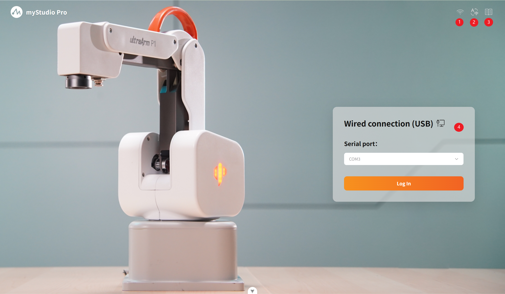
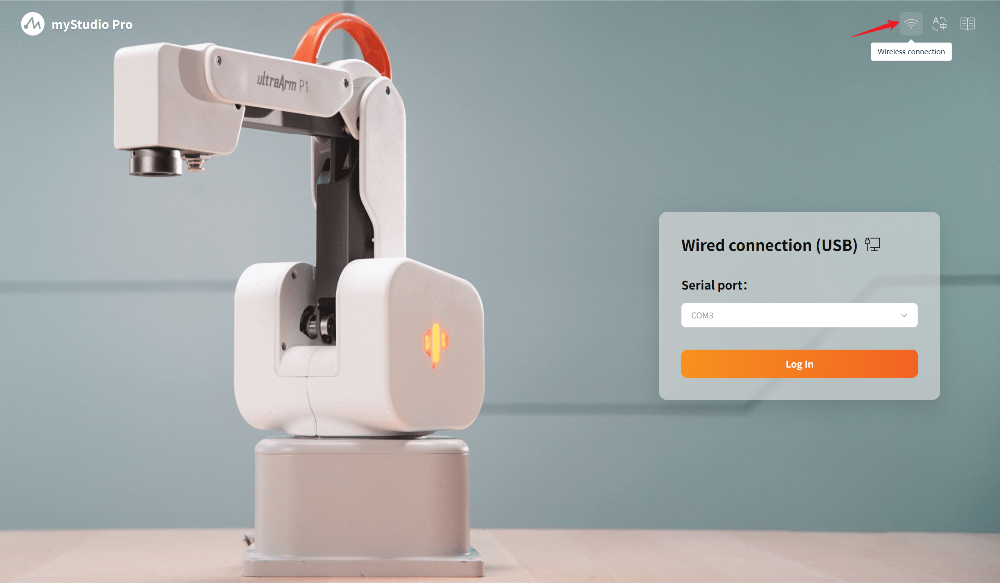
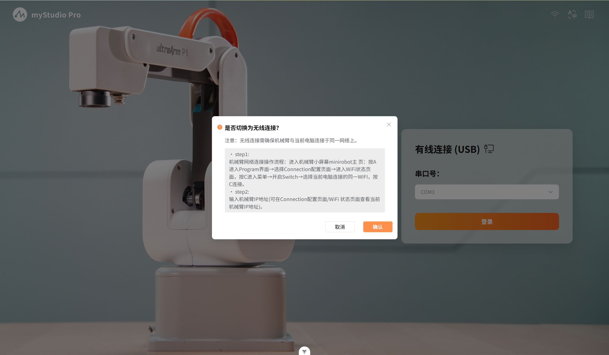
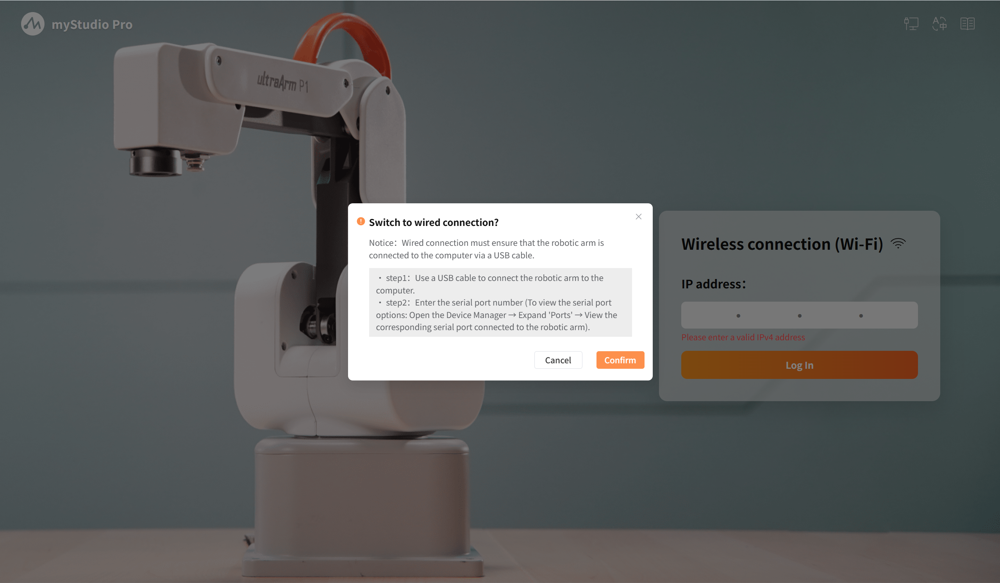
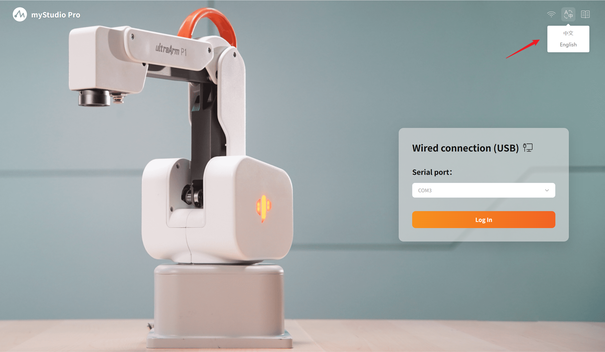
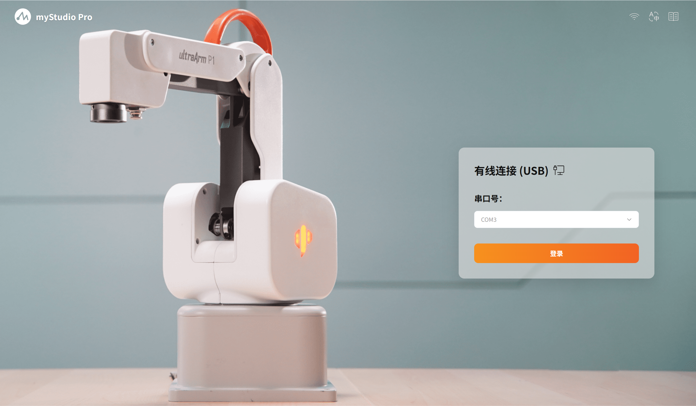
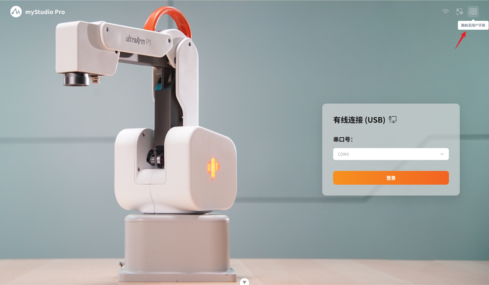
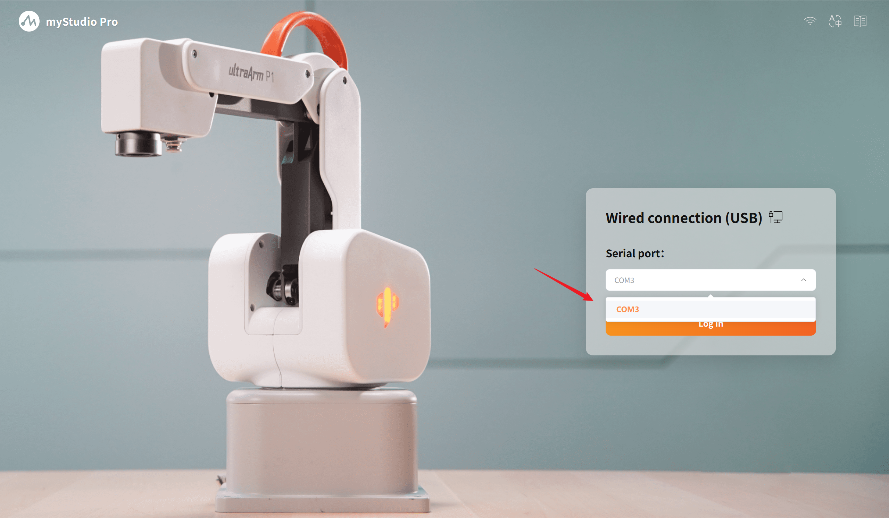
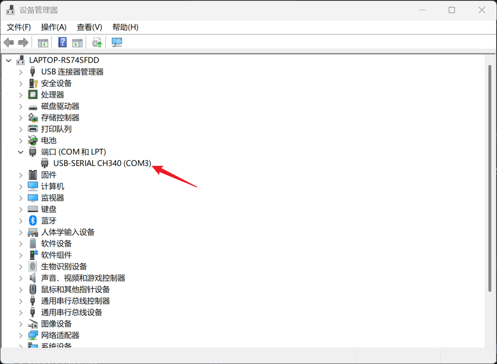
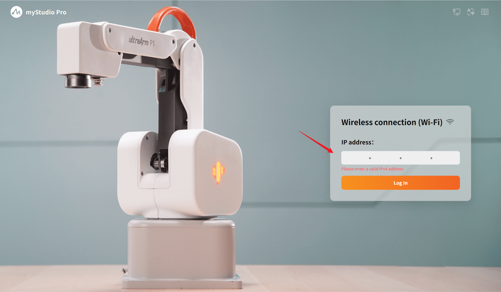

# Launch page

## 1 Interface Introduction

| Serial Number | Function Description                                           |
 | ------   | ------------------------------------------------------------ |
| 1    | Switching of connection method：Switchable login methods are available, supporting both wired connection and wireless connection |
| 2    | Language switching：Switch between Chinese and English text       |
| 3    | Jump to user manual：The online page of the user manual for jumping to the P1 robotic arm   |
| 4    | Login module：Display the corresponding login mode based on the connection method           | 

---

## 2 Switching of Connection Methods 

> The following is an explanation of the software's function of switching between corresponding pages for wired and wireless connections of the robotic arm.

When the software is launched, it defaults to the `wired` connection mode. The software supports two connection methods, namely `wired` connection and `wireless` connection. You can switch the connection mode to choose the way to establish a connection with the robot.

1.In the wired connection mode, the software automatically scans all available serial ports and remembers the last successful port number.

2.In the wireless connection mode, enter the IP address displayed on the small screen of the robotic arm for login.

When the toggle button is clicked, a secondary pop-up window will appear. Inside the pop-up window, there are specific operation methods. Please read them carefully and follow the instructions. Only after clicking the confirm button can the switch be made. 

If the current connection is wired, clicking this button will display a confirmation pop-up window for wireless connection. Clicking the `Confirm` button will switch to the wireless connection mode.

If the current connection is wireless, clicking this button will pop up a confirmation window for wired connection. Clicking the `Confirm` button will switch to the wired connection mode.

> Among them, the wireless connection only supports `IPV4` connection. Before logging in, a real-time check of the IP format will be conducted. If the check fails, a reminder message will be displayed. Only when the check is successful can the login function be used normally.

---

## 3 Language Switching 

> The following is an explanation of the function for switching between Chinese and English text in the software. Let's take the example of switching from Chinese to English.

When the mouse hovers over the button, a smooth pop-up option layer will appear below it, offering the option to select either `中文` or `English`. After selecting the corresponding language, the software will display and operate based on that language.

After selecting `English`, the software language will be switched to English; conversely, it will be switched to Chinese.

---

## 4 User Manual Navigation 

> The following is an explanation of the jump function in the user manual.

Click the button and the official user manual page of "UltraArm P1" will be opened in the system's default browser.

---

## 5 Login Module

### Wired connection login

**Notice:** Wired connection must ensure that the robotic arm is connected to the computer via a USB cable.

The automatic scanning system scans all available serial port devices. The port numbers scanned are arranged in ascending order. It supports a memory function. When the page is reloaded, the default selection is the port number that the user successfully used last time. Select the correct serial port and click the login button to log in and enter the main page of the software.

If multiple serial ports cannot be identified as the login serial port, for example with the Windows operating system, you can open the Device Manager in the settings panel -> Ports, and it will display all available serial port devices.

If the serial port cannot be detected, please ensure that the [serial port driver](./5.3.1-firstUse.md#preparation) has been downloaded. If it still cannot be detected after downloading, you can refer to [Q&A](./5.3.8-Q&A.md).

### Wireless Connection Login

**Notice:** Wireless connection must ensure that the robotic arm isconnected to the same network as the current computer.

Verify the input of the IP address. Only valid IPv4 addresses are supported. The specific login IP can be viewed through the Connection page or the WLAN page on the minirobot.

After confirming that the login information is correct, click the `Log in` button to proceed with the login process. Once the software successfully establishes communication with the robot, you can enter the main page of the software and use all the functional modules within it.

---

[← Previous Chapter](./5.3.1-firstUse.md) | [Next Chapter →](./5.3.3-blockly.md)
