# Debugging panel

> *1. Ensure the machine is powered on*

> *2. Ensure the machine connection and communication are normal*

> *3. Ensure the machine is in zero position*

## 1 Interface Introduction

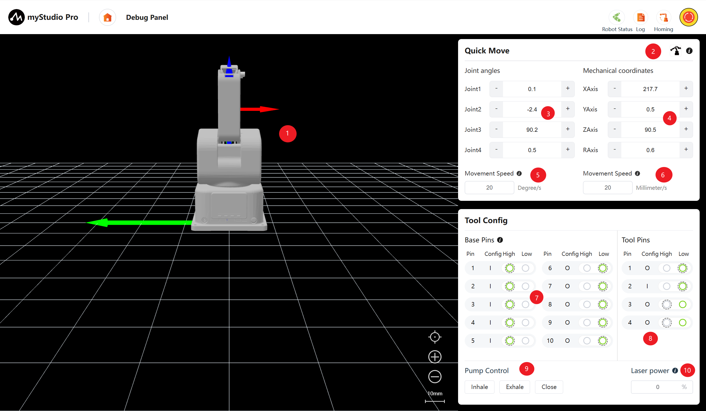

| Serial Number | **Description**                                       |
 | ---- | ------------------------------------------------------------ |
| 1    | ultraArm P1 3D simulation model (coordinate system: red arrow: X, green arrow: Y, blue arrow: Z)  |
| 2    | Free movement switch, can enable or disable the free movement mode                     |
| 3    | Angle control, by clicking the `+` `-` buttons, control the joint angles of the robotic arm, the numbers represent the current joint angle information of the robotic arm, and the numbers can also be directly modified for joint control                           |
| 4    | Coordinate control, by clicking the `+` `-` buttons, control the coordinates of the robotic arm, the numbers represent the current coordinate posture information of the robotic arm, and the numbers can also be directly modified for coordinate control |
| 5    | Set the movement step size of the robotic arm joints, default 20 degrees per second |
| 6    | Set the movement step size of the robotic arm coordinates, default 20 millimeters per second                   |
| 7    | Bottom pin configuration, can read and configure the bottom IO |
| 8    | Tool pin configuration, can read and configure the end tool IO |
| 9    | Air pump control, can perform suction, blowing and closing operations of the air pump |
| 10   | Laser power control, by inputting numbers in the text box to regulate the laser power | 

## 2 Free Movement

The free movement switch can enable/disable the free movement mode of the robotic arm.

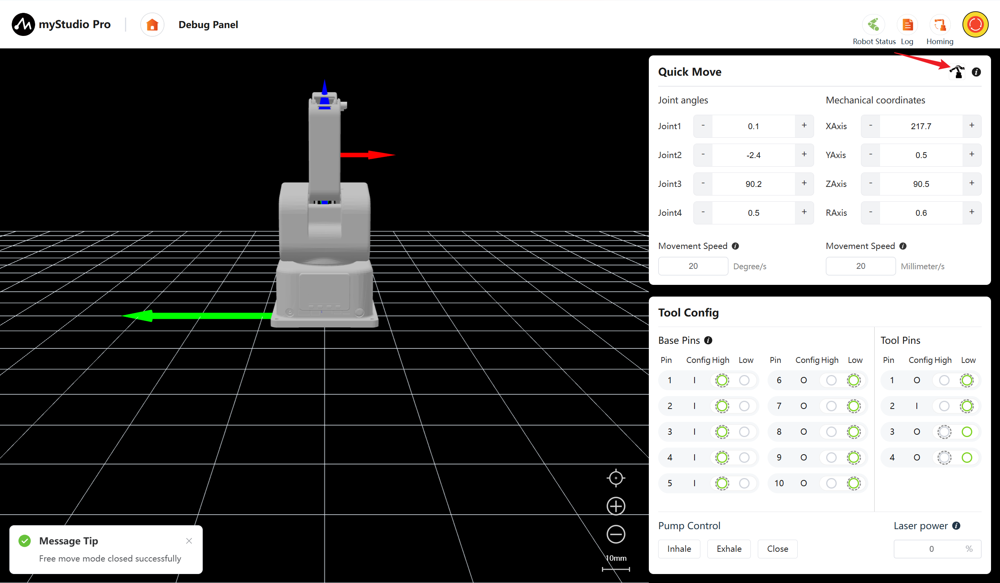

When the automatic mode is activated, clicking the switch will display a confirmation pop-up window. After clicking the confirm button, the free movement mode can be enabled.

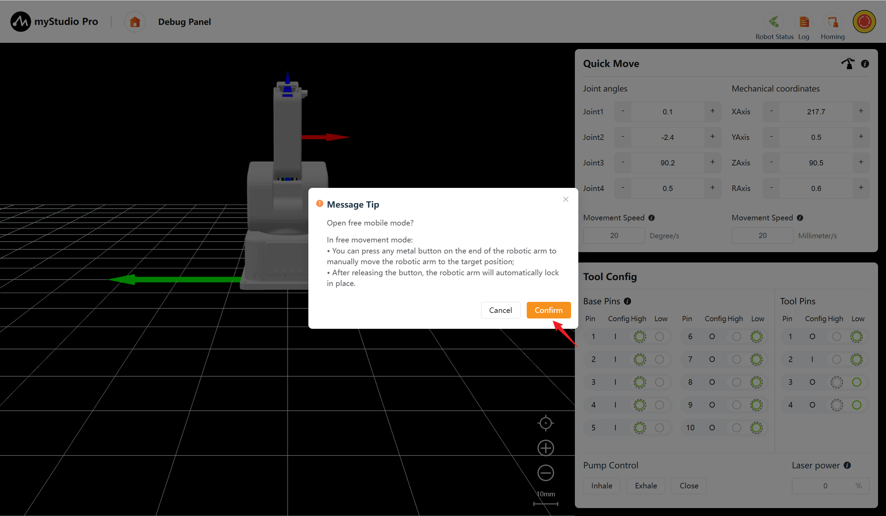

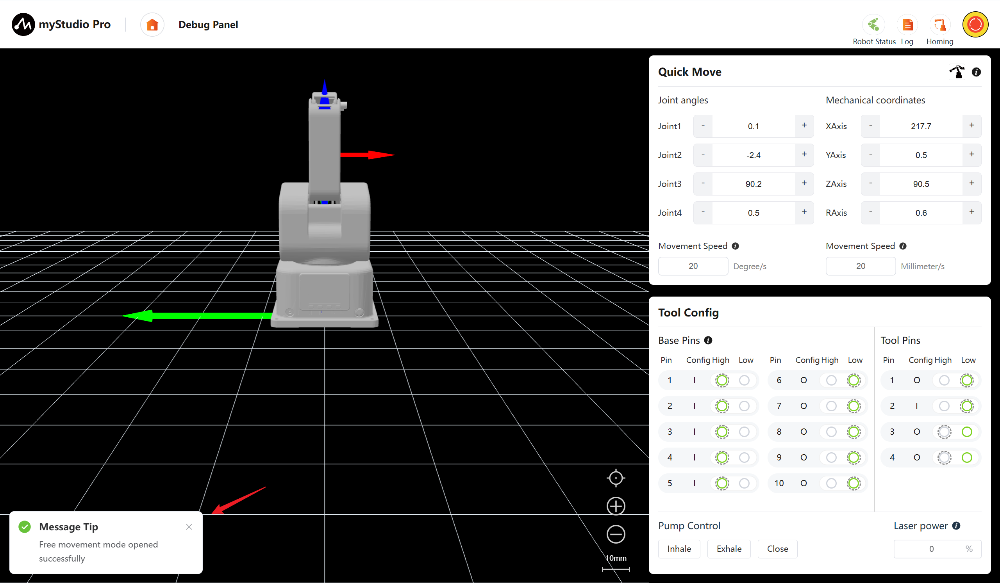

## 3 Angle Control
In the angle control area, by clicking the `+` `-` buttons, you can control the joint angles of the robotic arm. The numbers represent the current joint angle information of the robotic arm. You can also directly modify the numbers to control the joints. Input a position within the limit range, and then click `Enter` to perform the control.

**Note:**
> Input angle: Move to the target angle by following the set joint movement steps. 
> 
> When long-pressing "/" or "-": Move at this speed. >
> 
> When the "plus" or "minus" sign is present: Move at the minimum speed by 0.1 degree.

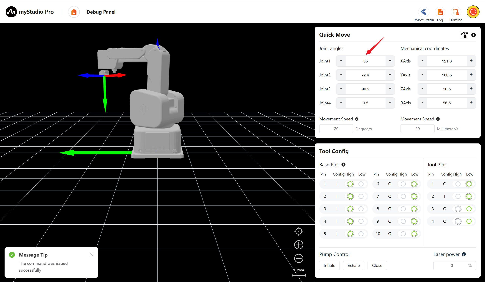

## 4 Coordinate Control

Before using the coordinate control, it is recommended to return the robotic arm to its zero position before proceeding with the operation.

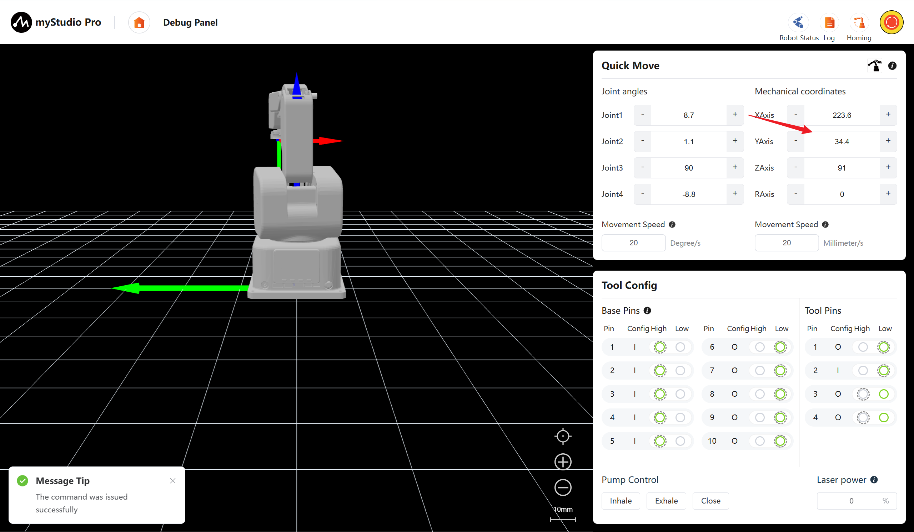

## 5 Continuous Movement 
By long-pressing the '+' and '-' buttons in the corresponding area, you can control the robot to move continuously at the specified angle/coordinates. The movement will stop once you release the mouse.

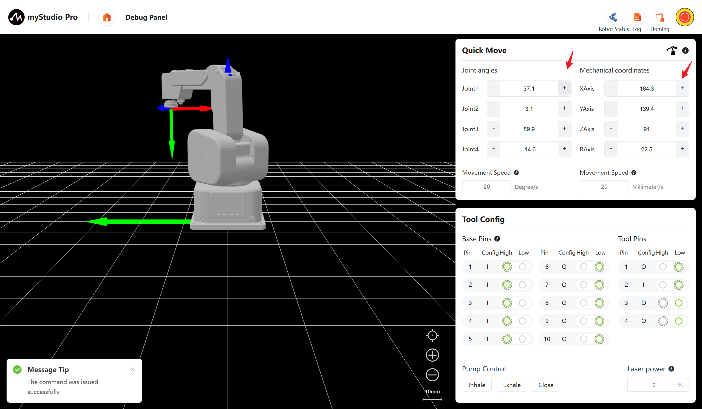

> Note: When the long press operation reaches the joint limit position, it will automatically stop.

## 6 Movement Step

The angle/coordinate can be continuously moved or the movement mode can be controlled by pressing 'Enter', and the movement step size can also be set.

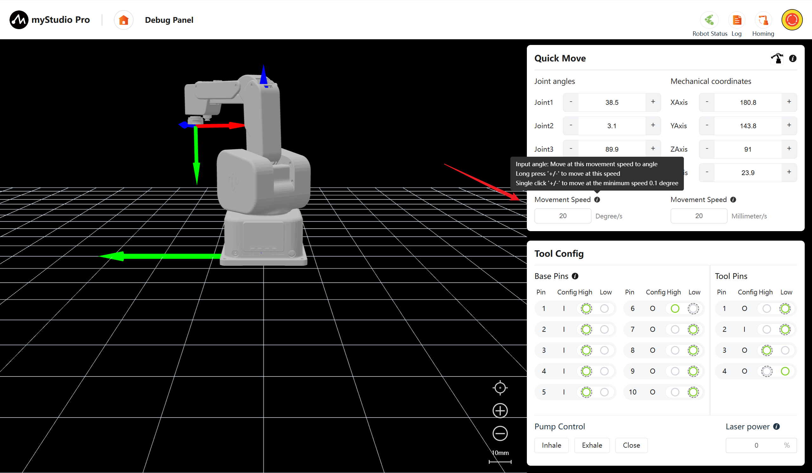

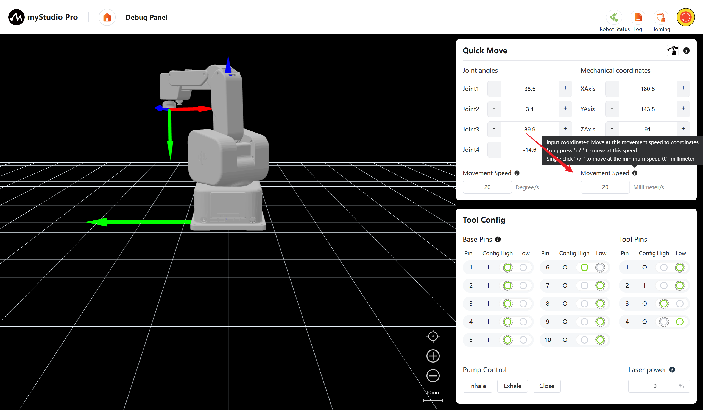

## 7 IO Control 

In this function module, the pin number, configuration and level status can be observed intuitively. Among them, the highlighted item in the level status section represents the actual status of the current pin. The dotted outer border represents the default level status set in the [Pin Configuration](./5.3.7-setting.md#3-pin-configuration)

> I: The current pin is an input pin and cannot switch the high/low level
> 
> O: The current pin is an output pin and can switch the high/low level
> 
> The dotted outer border: The current level is the default level configured in the IO configuration page

### 7.1 Base pins

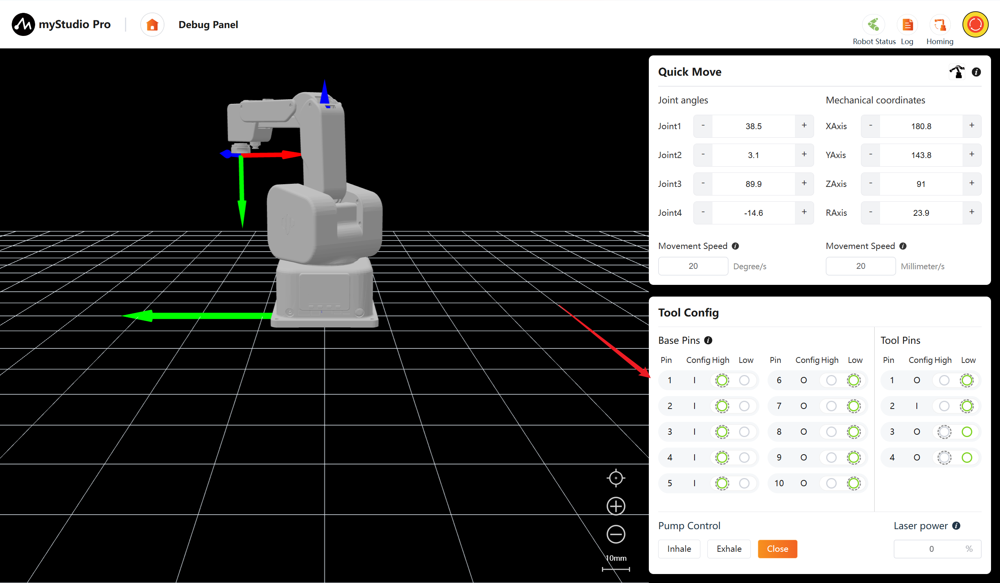

> The level state of pin 6 of the base is changed from a low level to a high level.

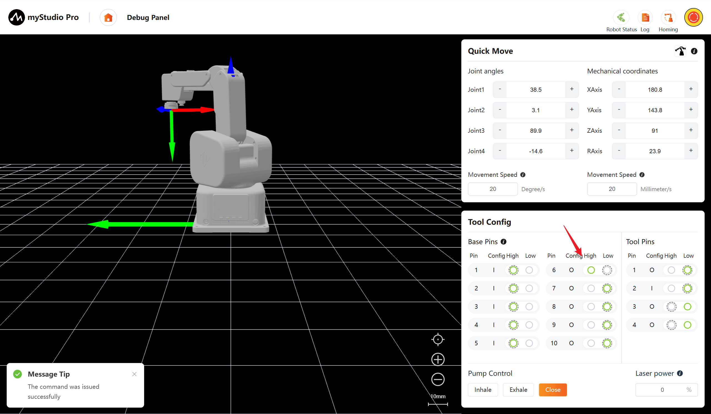

### 7.2 Tool pins

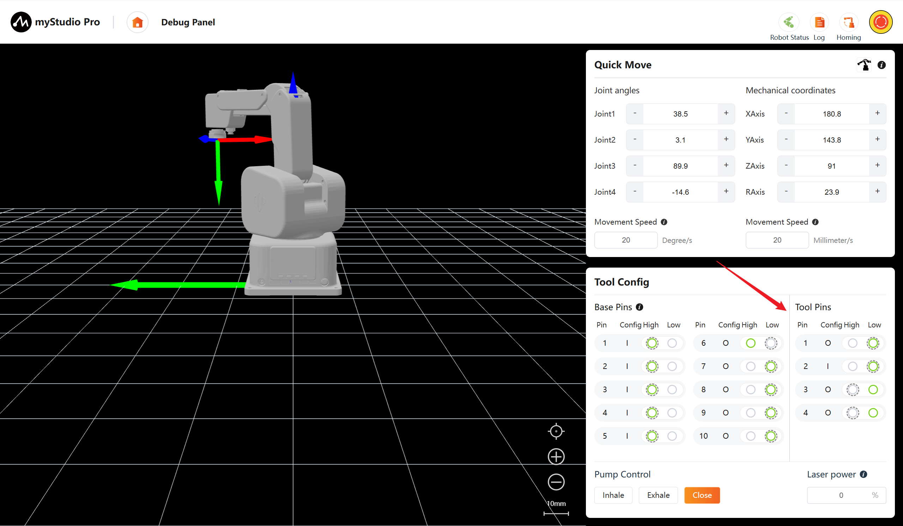

> The level state of tool pin 3 has been changed from low level to high level.

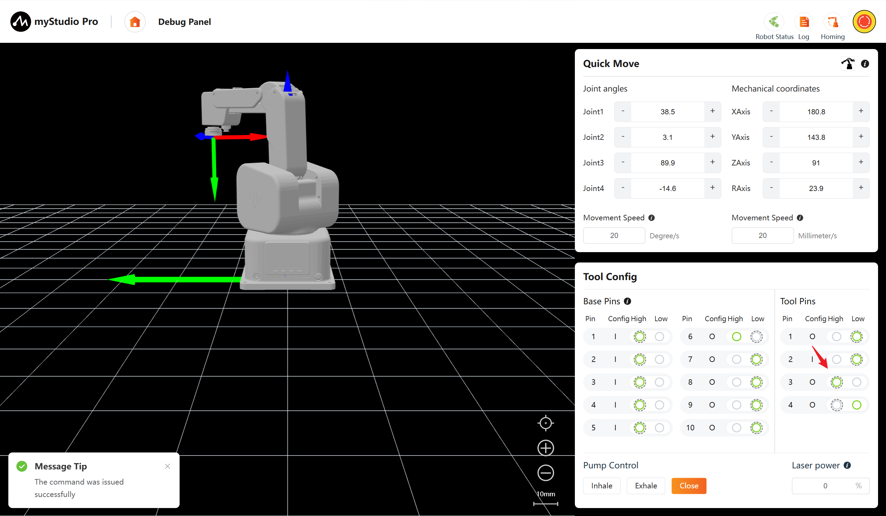

## 8 Pump Suction Control 

The air pump control functions include Inhale, Exhale, and Close. Among them, the buttons are mutually exclusive and can be switched by clicking. 

Inhale: Start the vacuum generator to create a negative pressure of 67 kPa at the end of the suction cup.

Exhale: Switch the air path to make the end suction cup generate a vacuum pressure of 67 kPa.

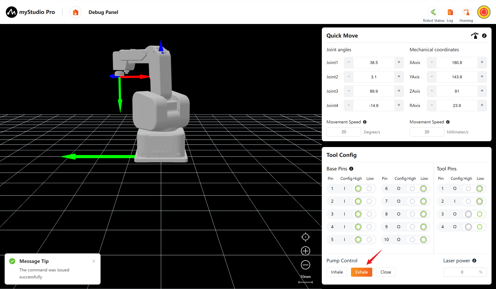

Close: Cut off the power supply of the air pump or close all air valves, and the gas path will return to the normal pressure state.

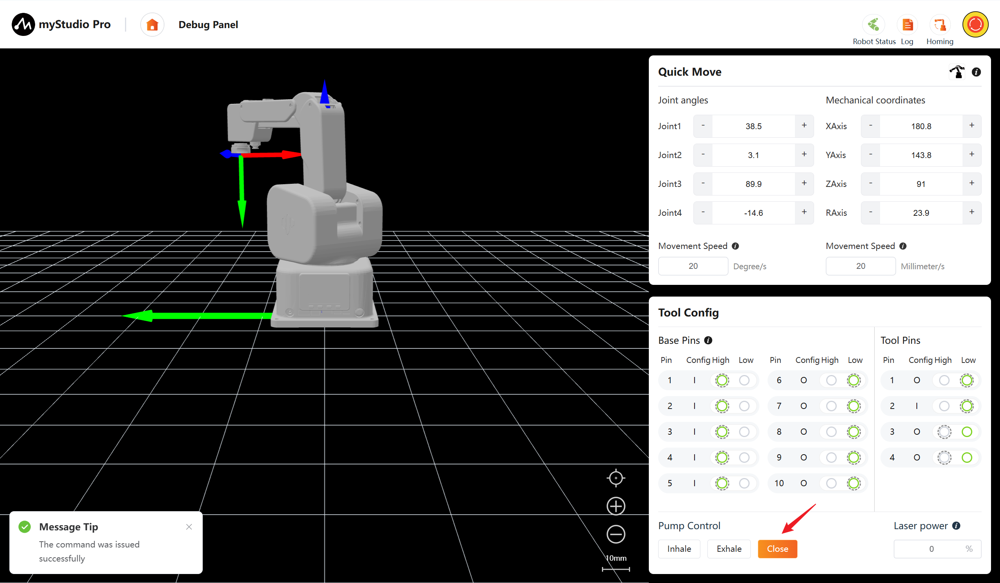

## 9 Laser Power Control

Input the numerical value in the text box to adjust the laser power. Press Enter or click on an empty area to submit the modification. 0% indicates the laser is turned off. 

**Note: Do not look directly at the laser beam or point it at your eyes.**

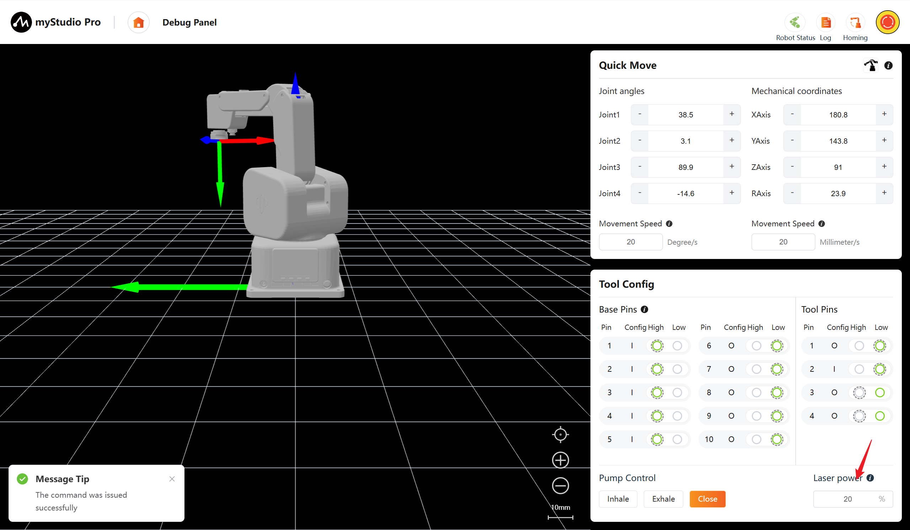

[← Previous Chapter](./5.3.3-blockly.md) | [Next Chapter →](./5.3.5-resourceCenter.md)