# Debug Panel

*Before you start*

> *1. Ensure the machine is powered on*
>
> *2. Ensure the machine connection and communication are normal*
>
> *3. Ensure the machine is in zero position*

## 1 Interface Introduction

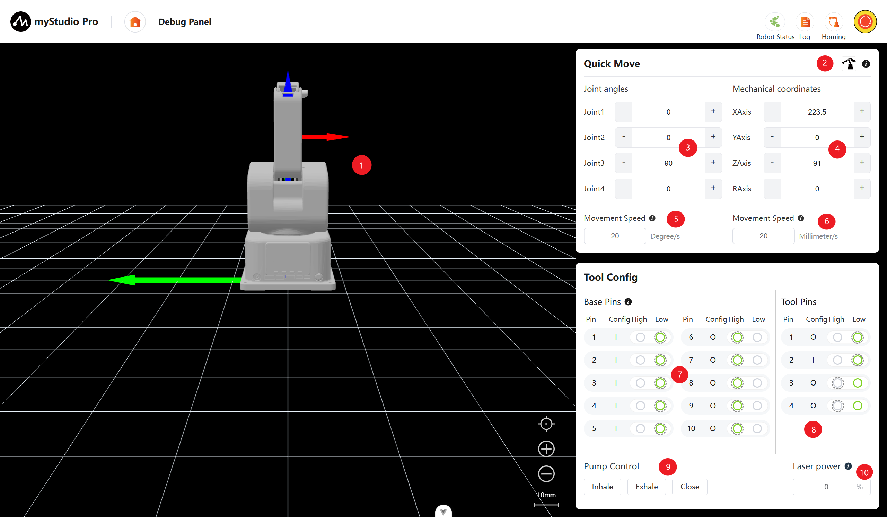

| Serial Number | **Description** |
| ---- | ------------------------------------------------------------ |
| 1 | ultraArm P1 3D simulation model：Simulates the real robotic arm motion (coordinate system: red arrow: X, green arrow: Y, blue arrow: Z) |
| 2 | Free movement switch：Can enable or disable the free movement mode |
| 3 | Angle control：By clicking the `+` `-` buttons, control the joint angles of the robotic arm; the numbers represent the current joint angle information, and can also be modified directly for joint control |
| 4 | Coordinate control：By clicking the `+` `-` buttons, control the coordinates of the robotic arm; the numbers represent the current coordinate posture information, and can also be modified directly for coordinate control |
| 5 | Joint movement step：Set the movement step of the robotic arm joints, default 20 degrees/second |
| 6 | Coordinate movement step：Set the movement step of the robotic arm coordinates, default 20 millimeters/second |
| 7 | Base pins：Can read and configure the base IO |
| 8 | Tool pins：Can read and configure the end tool IO |
| 9 | Pump control：Can perform inhale, exhale, and close operations of the air pump |
| 10 | Laser power control：Regulate the laser power by entering a value in the text box |

---

## 2 Free Movement

> The following introduces the free movement function, which releases the motors so that users can manually drag the robotic arm to any posture

The free movement switch can enable/disable the free movement mode of the robotic arm. A highlighted button indicates that free movement mode is currently enabled; otherwise it is disabled.

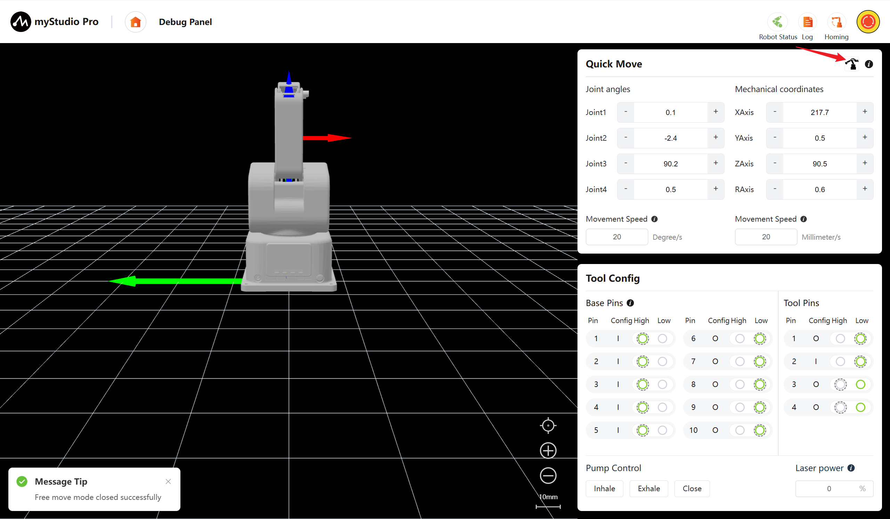

When it is disabled, clicking the button will display a confirmation pop-up window. After clicking the `Confirm` button, free movement mode can be enabled.

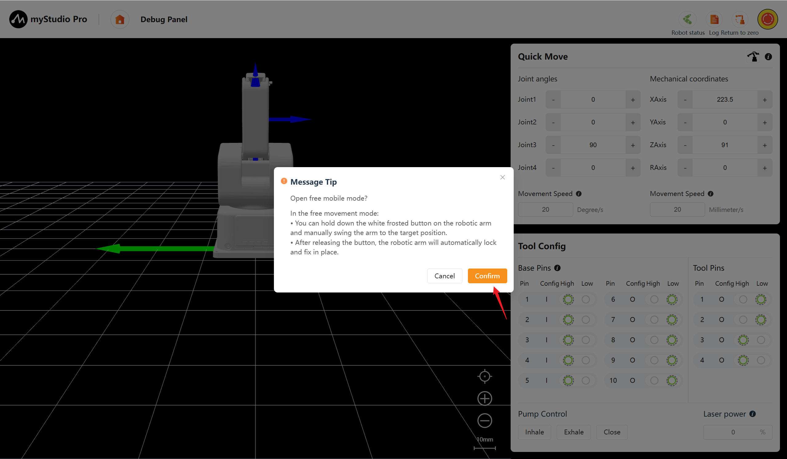

After free movement mode is enabled successfully, a corresponding prompt message will be displayed, and the button will become highlighted.

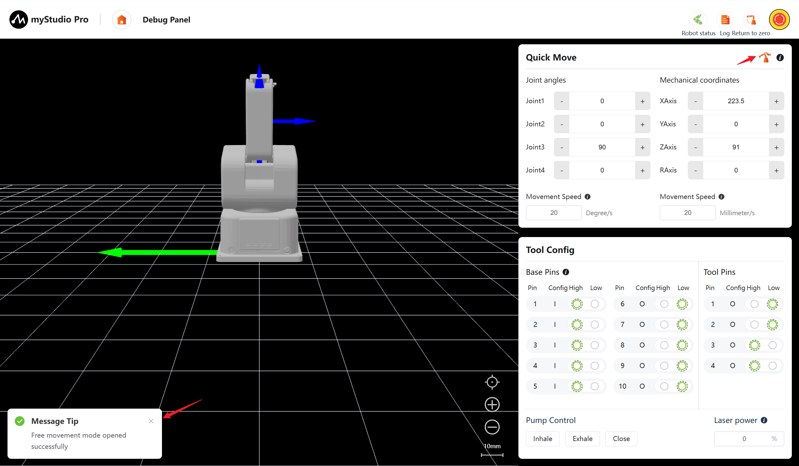

When it is enabled, clicking the button will directly issue a disable command. After it is disabled successfully, a corresponding prompt message will be displayed, and the button highlight will be cleared.

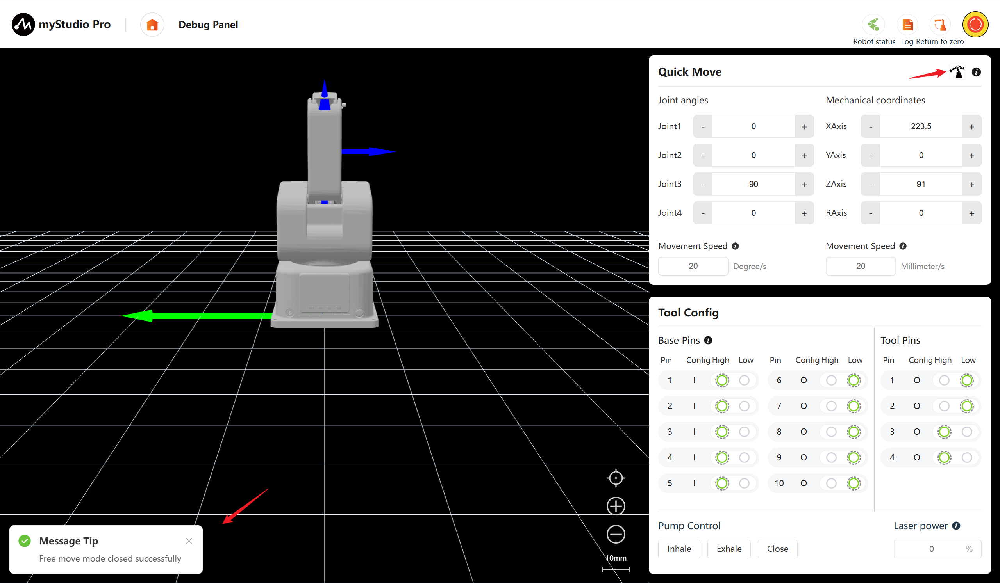

---

## 3 Angle Control

> The following introduces the angle control function, which is used for jog control of each joint angle

In the angle control area, by clicking the `+` `-` buttons, you can control the joint angles of the robotic arm. The numbers represent the current joint angle information of the robotic arm. You can also directly modify the numbers to control the joints. Input a position within the limit range, and then click `Enter` to perform the control.

**Note:**
> Input angle: Move to the target angle according to the set joint movement step
>
> When long-pressing `+`/`-`: Move at this motion speed
>
> When single-clicking `+`/`-`: Move 0.1 degree at the minimum speed

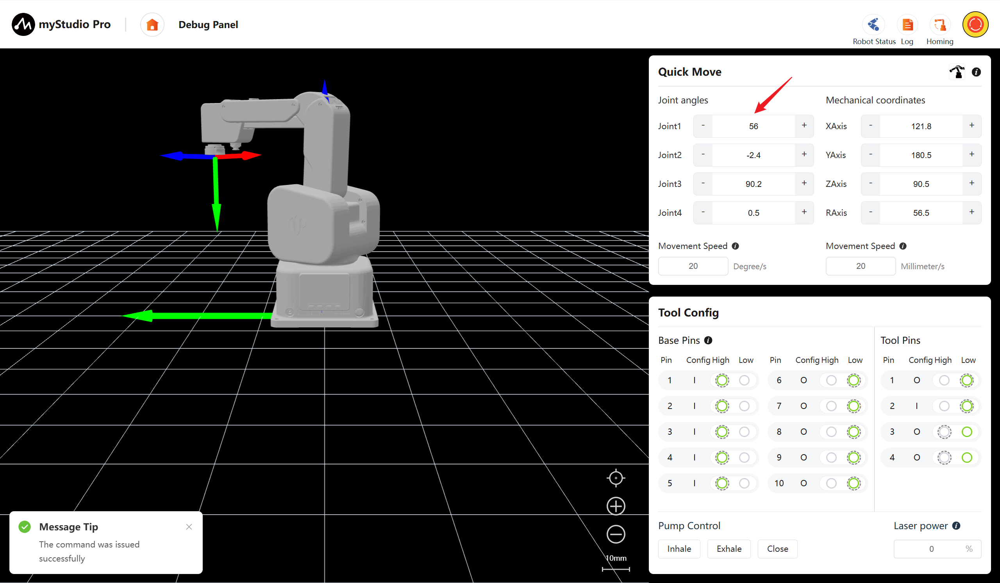

---

## 4 Coordinate Control

> The following introduces the coordinate control function, which is used to adjust the end-effector coordinates of the robotic arm

Before using the coordinate control, it is recommended to return the robotic arm to its zero position before proceeding with the operation.

**Note:**
> Input value: Move to the target position according to the set coordinate movement step
>
> When long-pressing `+`/`-`: Move at this motion speed
>
> When single-clicking `+`/`-`: Move 0.1 degree at the minimum speed

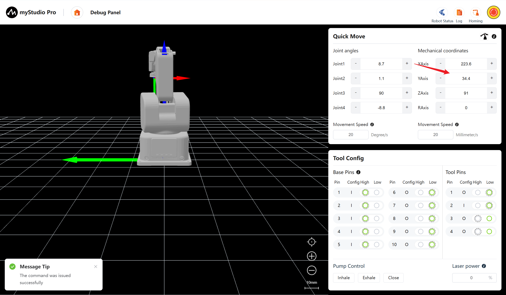

---

## 5 Continuous Movement

> The following introduces the continuous movement function for joint angles and robot coordinates

By long-pressing the `+` `-` buttons in the corresponding area, you can control the robot to move continuously at the specified angle/coordinates. The movement will stop once you release the mouse.

- When the set joint speed is less than or equal to 0.5, the robotic arm moves in a stepping manner; otherwise it moves smoothly and continuously
- When the set coordinate speed is less than or equal to 1.6, the robotic arm moves in a stepping manner; otherwise it moves smoothly and continuously

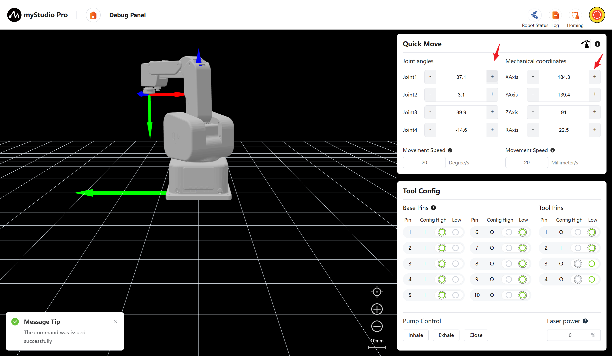

> Note: When the long-press operation continues to the joint limit position, it will stop automatically.

---

## 6 Movement Step

> The following introduces the movement step function for joint angles and robot coordinates

You can set the movement step for continuous angle/coordinate motion or for motion controlled by `Enter`.

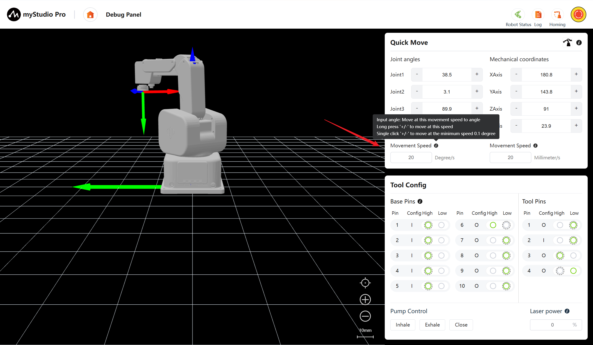

Robot coordinate motion speed setting box.

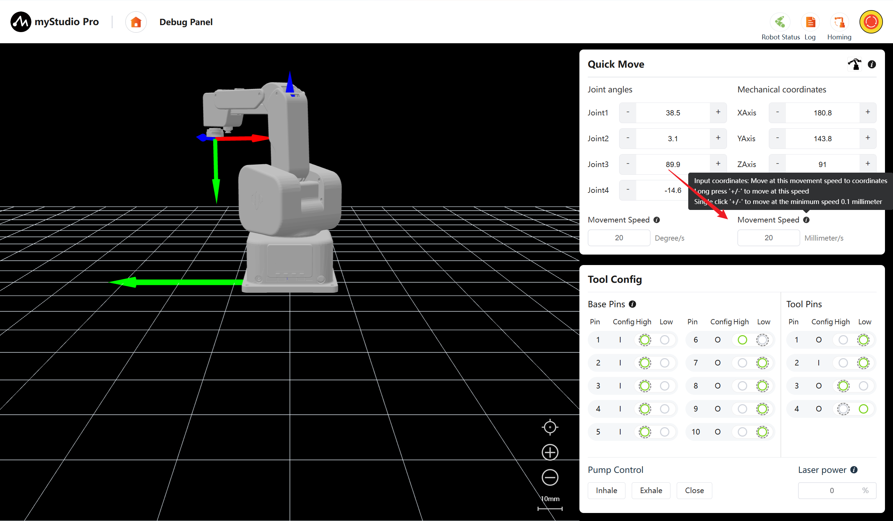

---

## 7 Tool Configuration

> The following introduces the base pin and tool pin functions

In this function module, the pin number, configuration and level status can be observed intuitively. Among them, the highlighted item in the level status section represents the actual status of the current pin. The dotted outer border represents the default level status set in the [Pin Configuration](./5.3.7-setting.md#3-pin-configuration). You can manually switch the output level (high/low) and observe input level changes triggered by external signal input in real time.

For input pins: When there is no external signal connected (floating), the pin level state is maintained by the default pull-up/pull-down resistor configuration; when an external signal is connected, the actual pin level will be directly driven and determined by the external signal.

> I：Indicates the current pin is an input pin and cannot switch the high/low level
>
> O：Indicates the current pin is an output pin and can switch the high/low level
>
> Dotted outer border：Indicates this level is the default level configured in the IO configuration page

---

### 7.1 Base pins

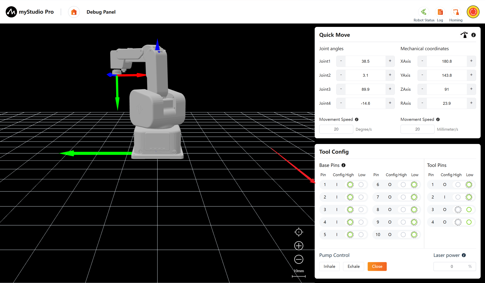

The level state of base pin 6 is changed from low level to high level.

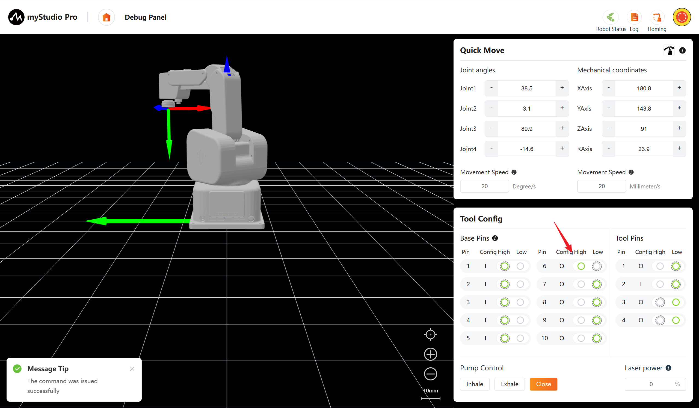

### 7.2 Tool pins

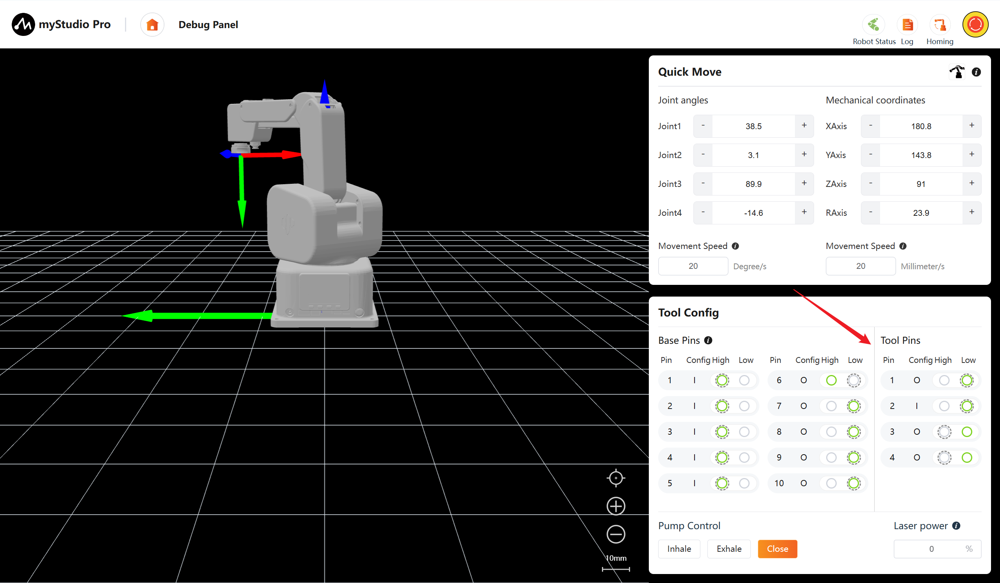

The level state of tool pin 3 is changed from low level to high level.

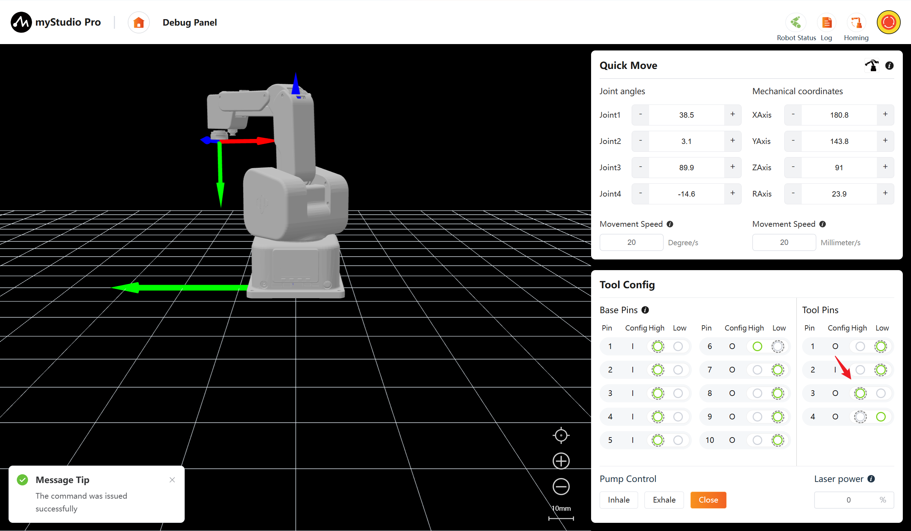

---

## 8 Pump Suction Control

> The following introduces the pump suction control function. Please ensure that the suction pump is properly connected to the machine

Pump control includes `Inhale`, `Exhale`, and `Close`. The buttons are mutually exclusive and can be switched by clicking. A highlighted button indicates the current control mode.

`Inhale`: Start the vacuum generator to create a negative pressure of 67 kPa at the end of the suction cup.

`Exhale`: Switch the air path to generate a 67 kPa vacuum-breaking pressure at the end suction cup.

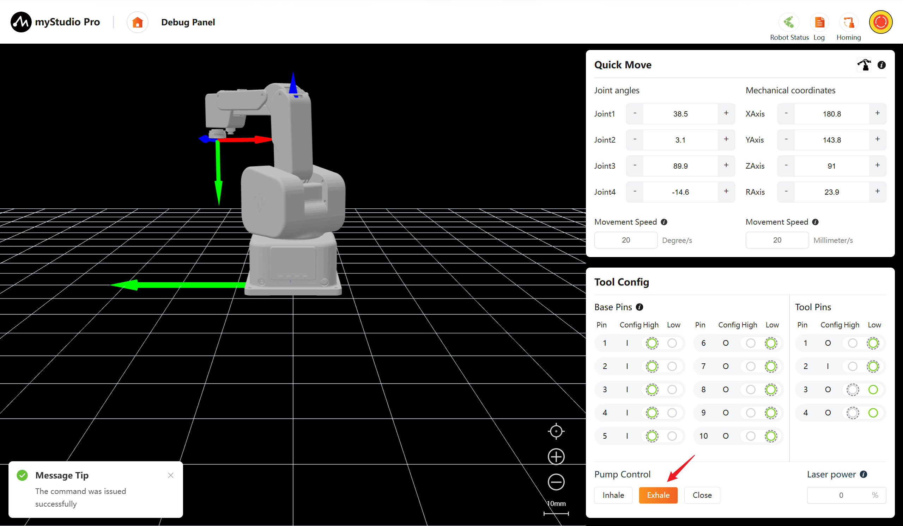

`Close`: Cut off the power supply of the air pump and close all air valves, and the gas path will return to the normal pressure state.

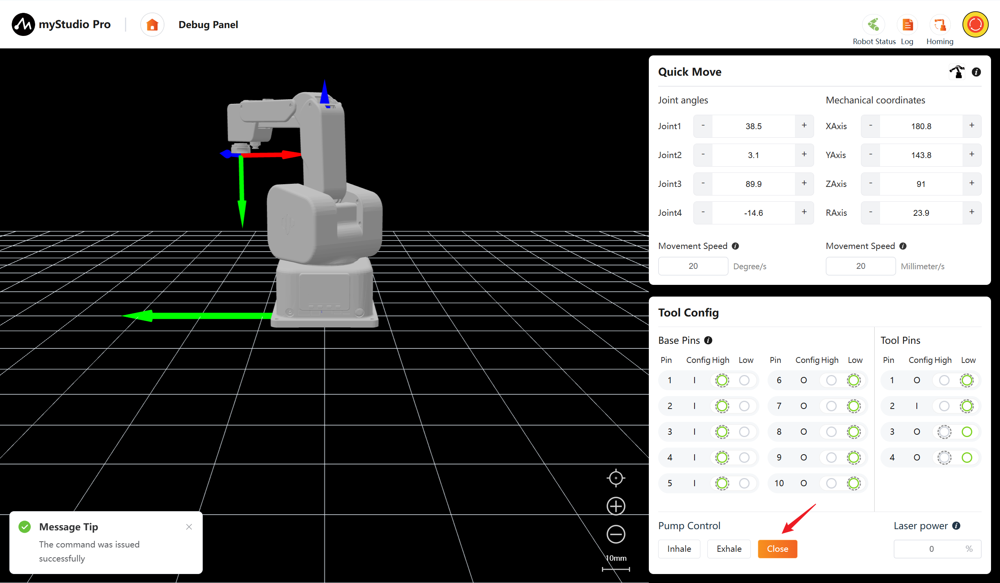

---

## 9 Laser Power Control

> The following introduces the laser power control function. Please ensure that the laser device is properly connected to the machine

Input the numerical value in the text box to adjust the laser power. Press Enter or click on an empty area to submit the modification. 0% indicates the laser is turned off.

**Note: Do not look directly at the laser beam or point it at your eyes.**

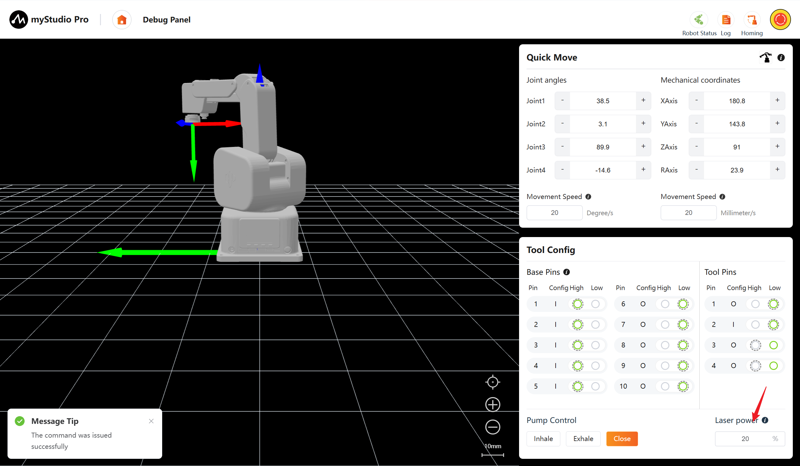

---

[← Previous Chapter](./5.3.3-blockly.md) | [Next Chapter →](./5.3.5-resourceCenter.md)
