# Resource Center

## 1 Interface Introduction

The homepage is as shown in the following picture:

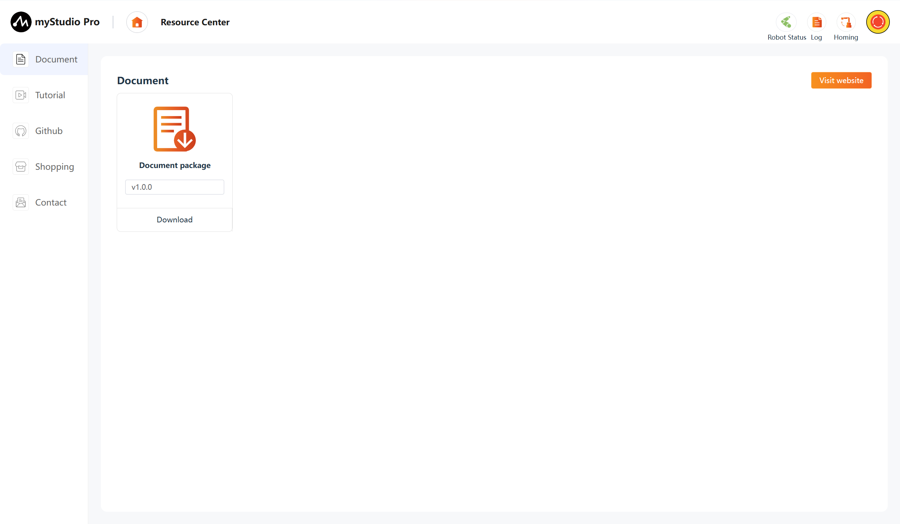

## 2 Document

**Under writing**

## 3 Tutorial

**Under writing**

## 4 Github

This function is a web page jump link. After clicking it, the official Github will be opened in the current browser.

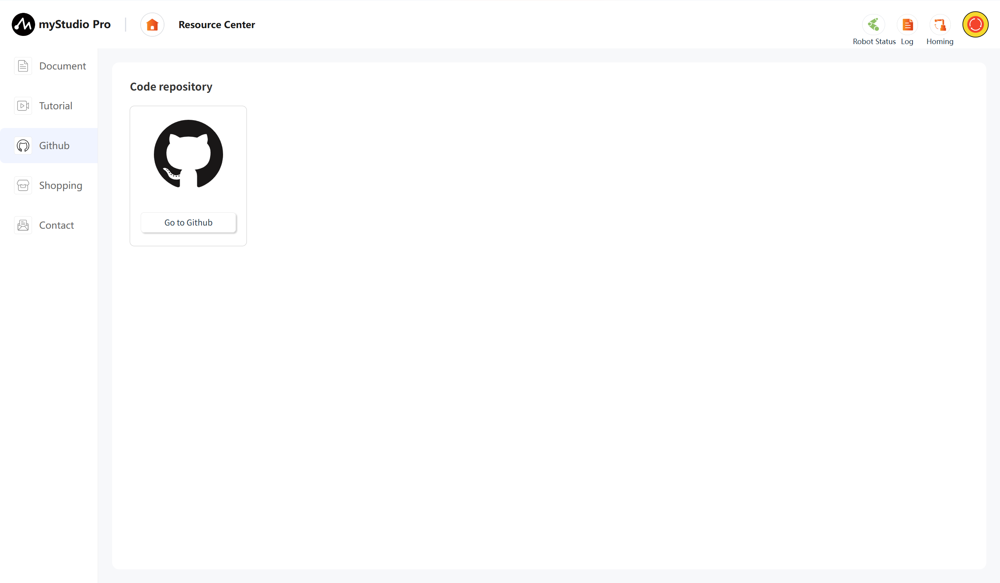

## 5 Shopping

This function is a web page jump link. After clicking it, the corresponding product's purchase interface will be opened in the current browser, and you can go to Shopify.

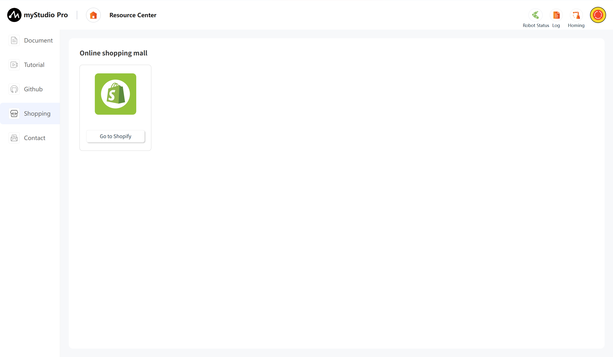

## 6 Contact

If you have any questions or ideas, you can contact us here.

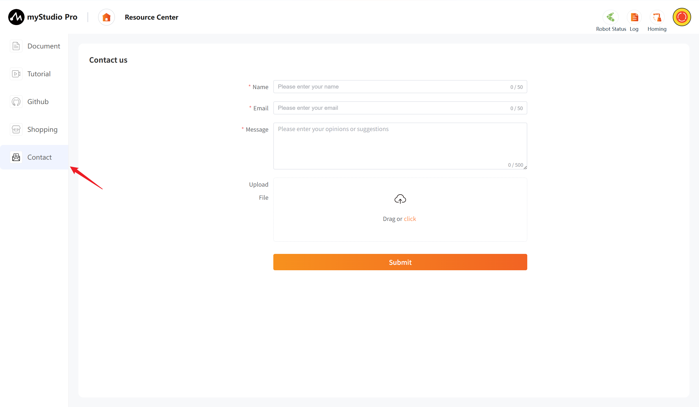

Function Introduction:

#### Name

You can enter your nickname here.

> This is a required field. If you submit without filling it in, you will receive a message indicating that you are not there.

#### Email

You can enter your email address here.

> This is a required field. You can enter your email address here so that our staff can reply to you. If you submit without filling it in, you will receive a message indicating that you are not there.

#### Message

Enter your comments here.

> This is a required field. Enter your questions or thoughts here. If you submit without filling it out, you will receive a prompt.

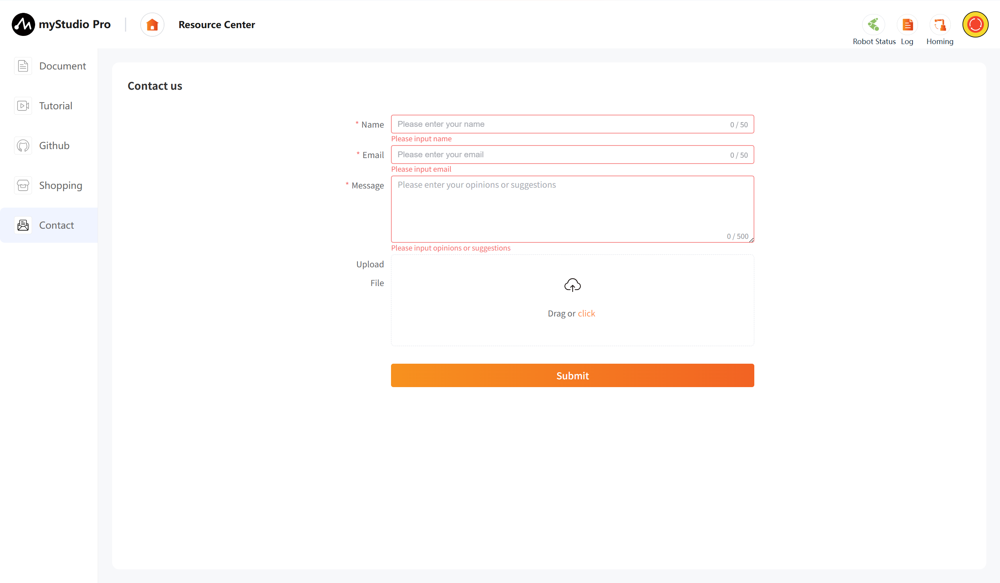

#### Upload

> Click this button and the draggable area to upload files. You can upload a maximum of 3 files, and each file must not exceed 1M in size.

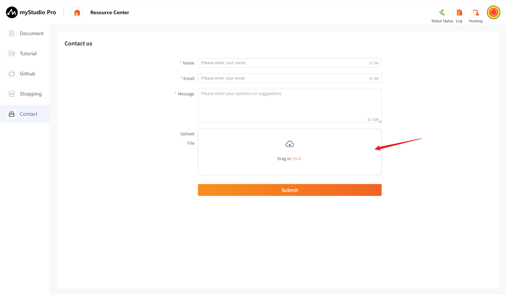

> After clicking, a pop-up window will appear allowing you to select files.

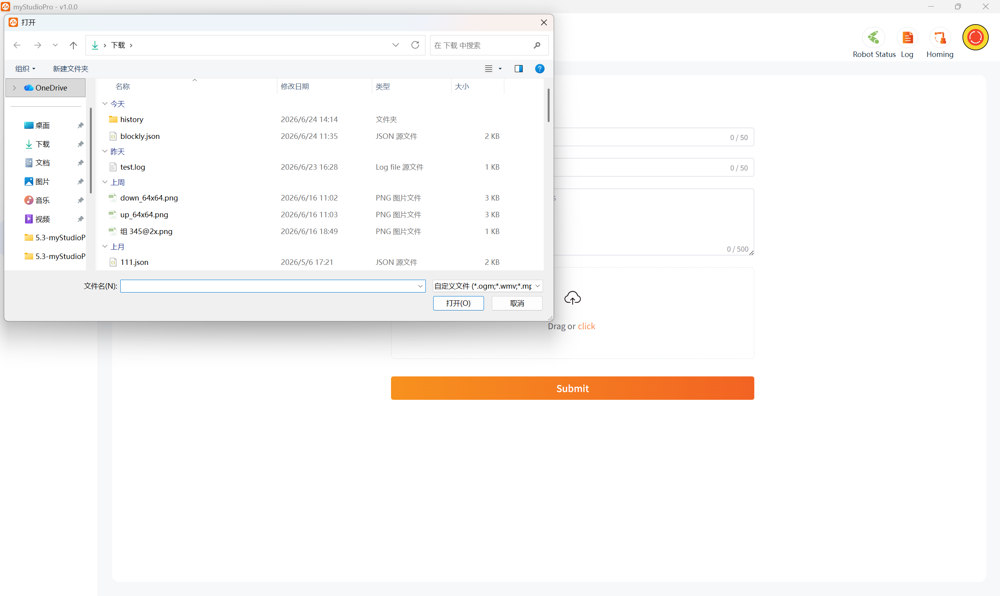

> If the file you select exceeds 1MB, clicking "**Open**" will fail, and a pop-up window will warn you that the file is too large.

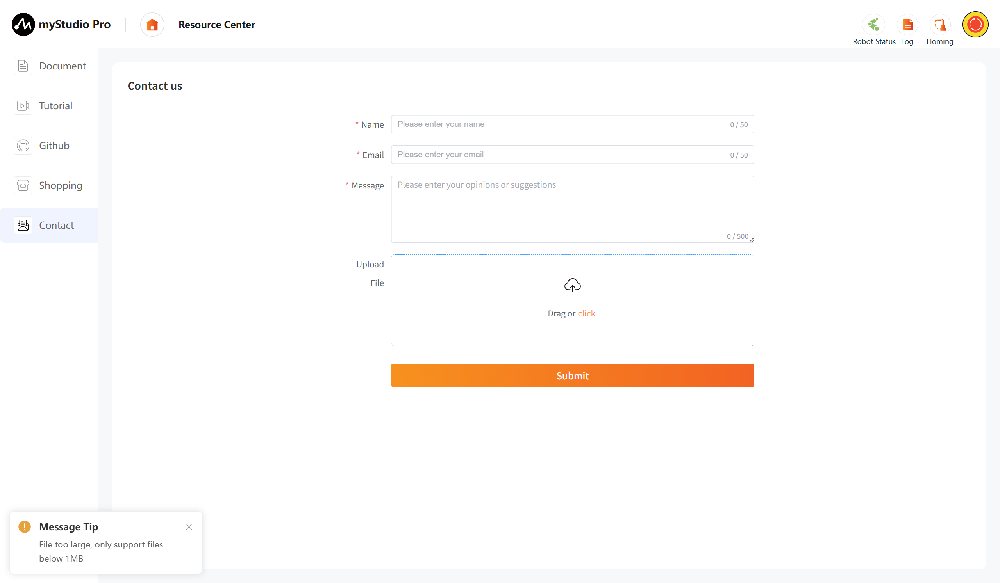

> When you are uploading more than three files, a pop-up window will warn you.

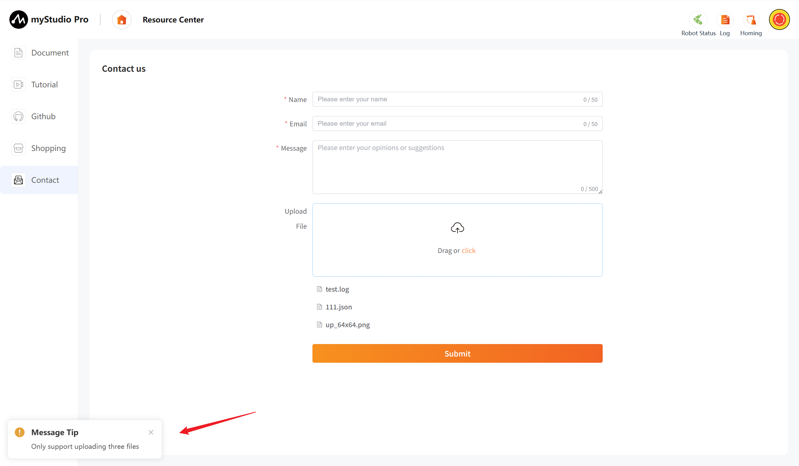

> Note: Only .log, .json, video, and image files are supported for uploading.

#### Submit

> Click the `Submit` button to submit all information. This step may take a long time, please be patient.

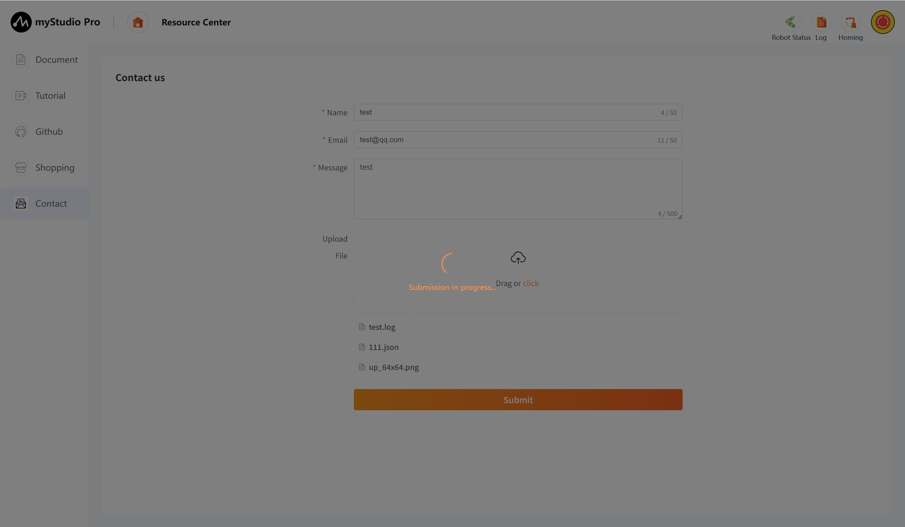

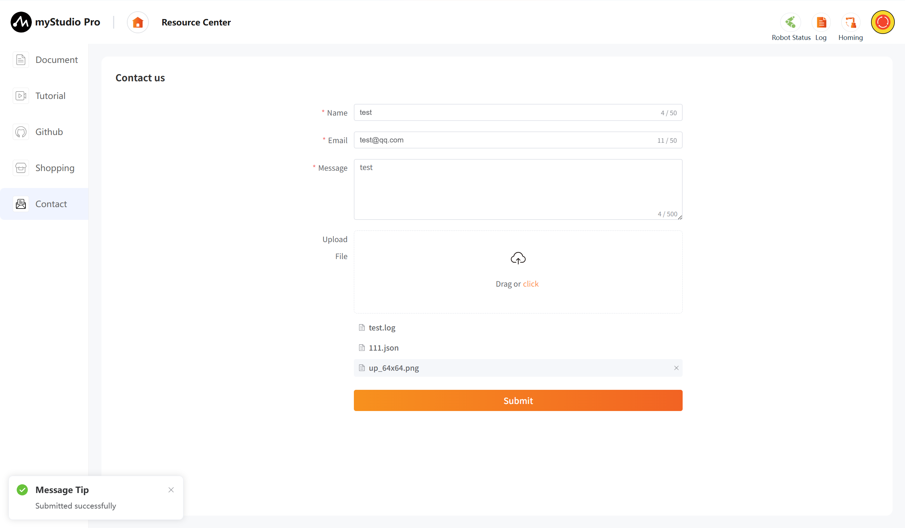

[← Previous Chapter](./5.3.4-debugPlane.md) | [Next Chapter →](./5.3.6-scene.md)