# Resource Center

## 1 Interface Introduction

The homepage is as shown in the following picture:

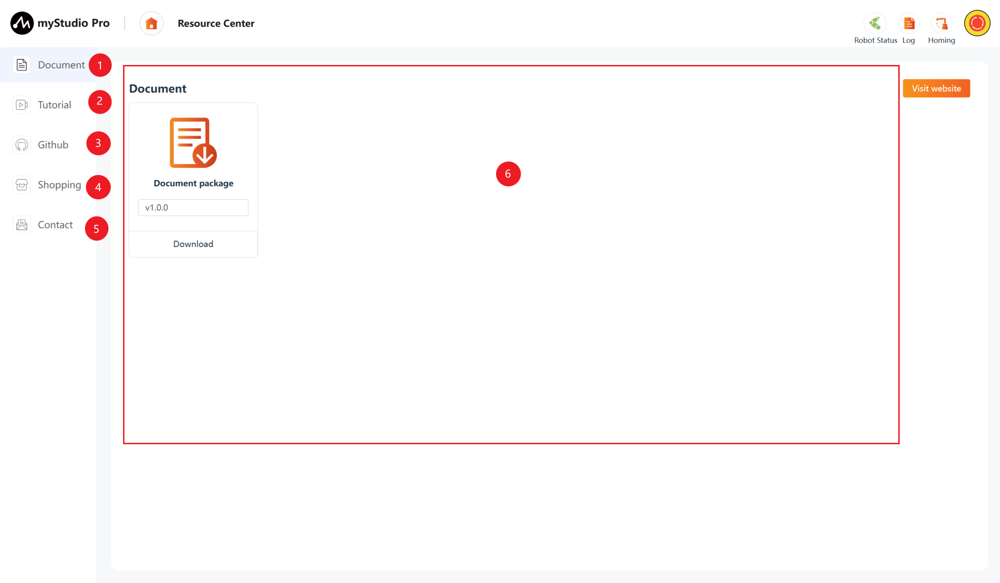

The Resource Center main interface provides five function entries: Document Manual, Video Tutorials, Github open-source resources, Online Store, and Contact Us. Users can quickly access product-related materials, video tutorials, and official open-source code from this page.

| No. | **Description** |
| --- | --------------- |
| 1   | Document Manual: View product user manuals and development guides |
| 2   | Video Tutorials: Watch product operation and programming tutorial videos |
| 3   | Github: Jump to the official Github or Gitee open-source repository |
| 4   | Online Store: Jump to the official Taobao or Shopify purchase page |
| 5   | Contact Us: Submit questions or suggestions, supports file attachments |
| 6   | Module Content Display Area: shows the current module's operation interface |

---

## 2 Document

> The following introduces the Document Manual function

This page is the entry point to the P1 robotic arm user manual included in myStudio Pro. The manual is provided in the form of a resource package.

When entering the page, the software will automatically check if there is a resource package available locally. If not, the page will display the option to download immediately. Click the `Visit website` button on the top right corner, and you can use the system's default browser to open the P1 official user manual page.

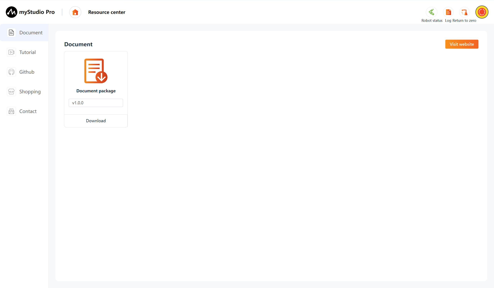

After clicking the `Download` button, the resource package will start downloading. During the download process, the button will display as `Downloading` and the download progress will be shown in real time.

After the download is complete, the software will automatically load and render the manual content.

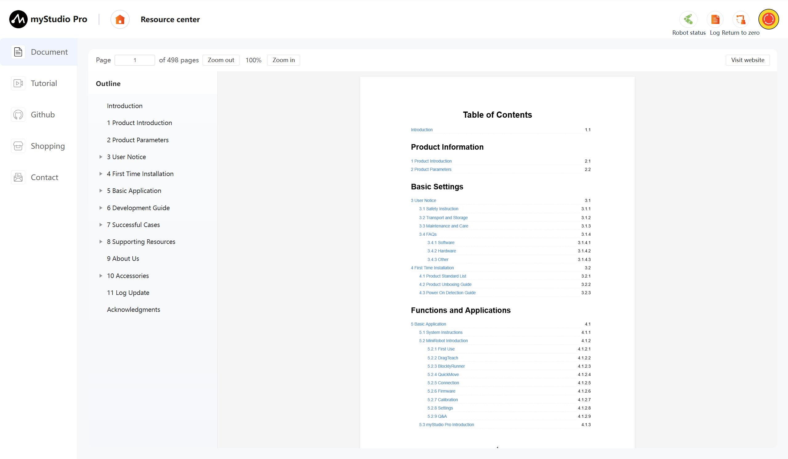

After the document is loaded successfully, the top toolbar provides the following functions:

- Page navigation: Displays the current page number and the total number of pages. It supports manual page number modification, and the document will automatically jump to the corresponding section.
- Zoom control: Clicking on `Zoom out` or `Zoom in` can adjust the display ratio of the document. The current zoom level is displayed in real time.
- Official website entry: Clicking on `Visit website` will open the P1 official user manual page using the system's default browser.

When the current page number is modified, the document will automatically locate and display the corresponding chapter content.

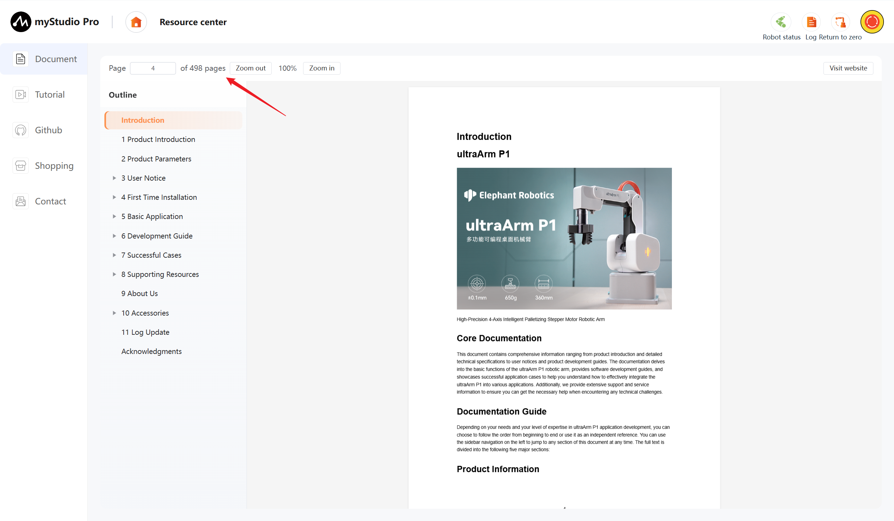

Click the `Zoom out` button, and the document will be scaled down proportionally. On the contrary, click the `Zoom in` button, and the document will be scaled up proportionally. The current scaling level of the document is displayed in real time.

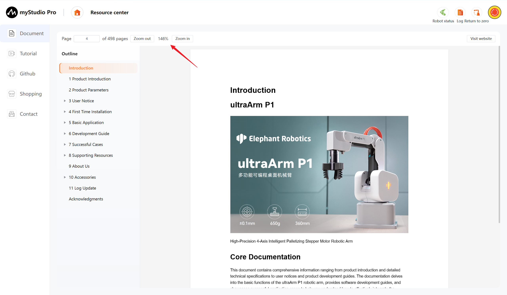

The document table of contents will automatically highlight the corresponding sections based on the current page number; you can also directly click on the entries in the table of contents to quickly jump to the target section.

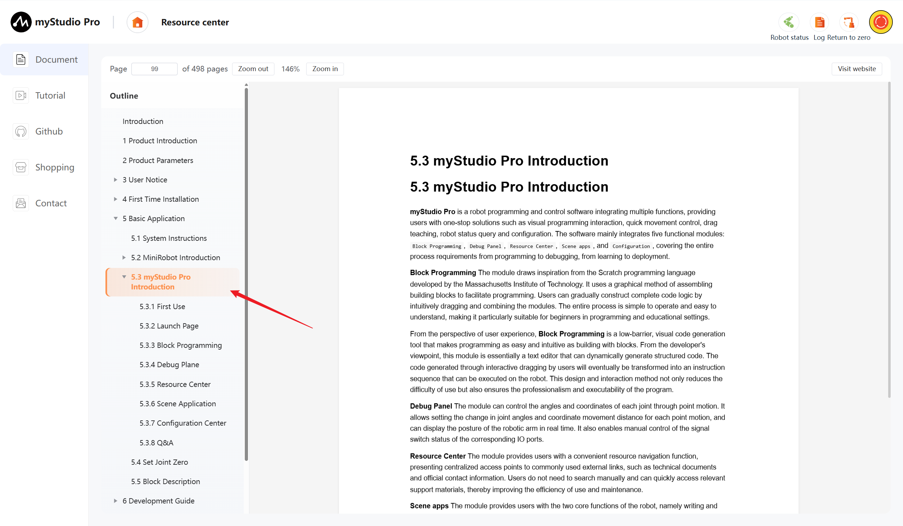

When the software starts, it will automatically check if there is a new version of the document. If a new version is detected, it will silently download in the background. After the download is completed:

- If you are not currently on the manual page, the document will automatically be refreshed to the new version.
- If you are viewing the document, a pop-up window will appear new document version is available.. Clicking `Reload` will load the new version of the document.

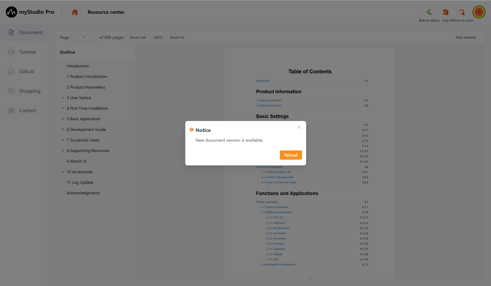

---

## 3 Tutorial

> The following introduces the Video Tutorials function

**Under writing**

---

## 4 Github

> The following introduces the Github function

This function is a web page redirection link. When clicked, it will use the system's default browser to open the official Github or Gitee open-source repository.

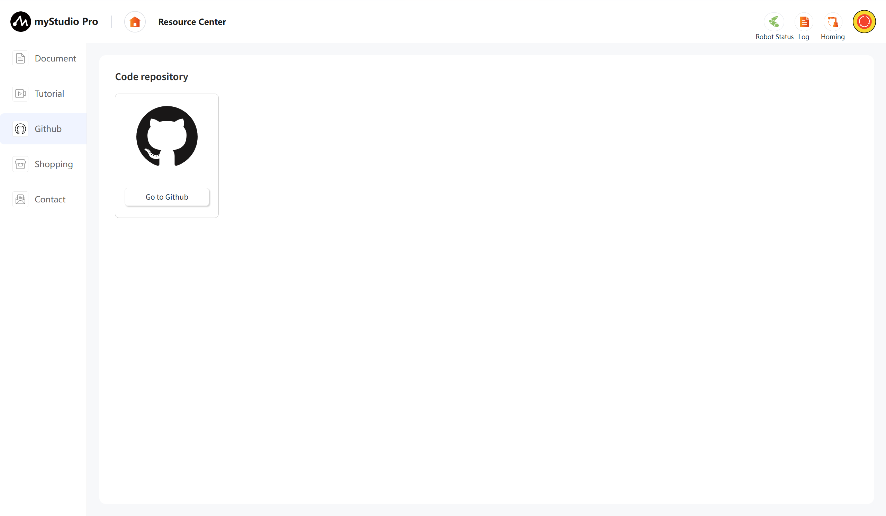

---

## 5 Shopping

> The following introduces the Online Store function

This function is a web page jump link. After clicking it, the official online store of Shopify's Elephant Robot will be opened using the system's default browser.

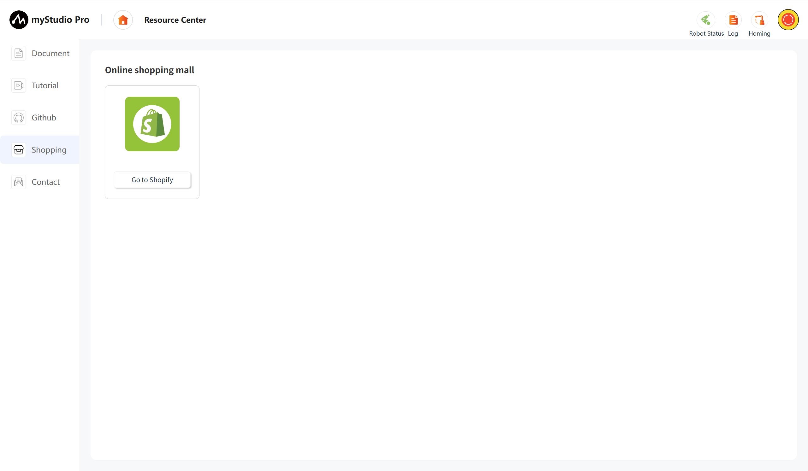

---

## 6 Contact

> The following introduces the Contact Us function

If you have any questions or ideas, you can contact us here.

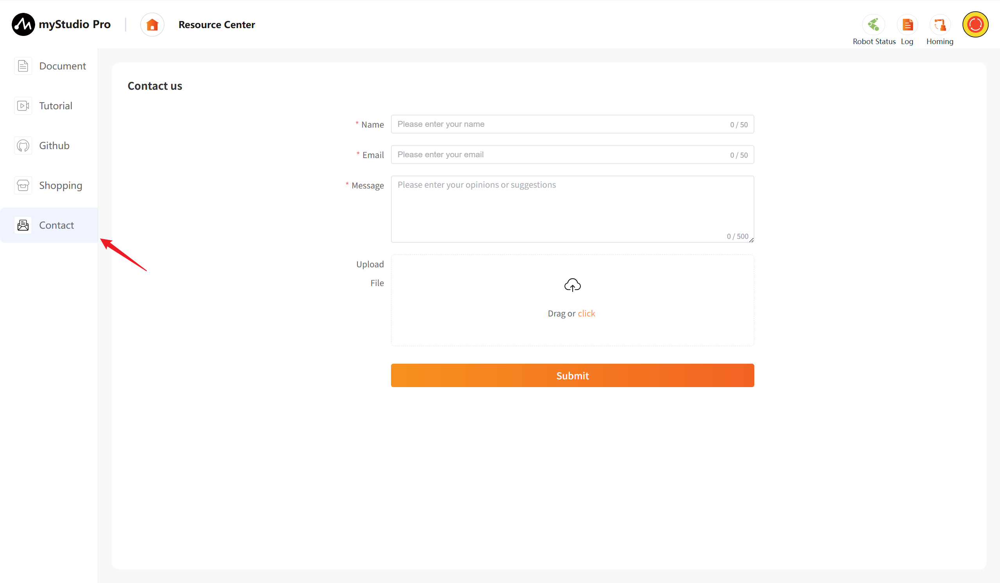

Function Introduction:

#### Name

You can enter your nickname here.

> This is a required field. If you submit without filling it in, a corresponding text prompt will be displayed.

#### Email

You can enter your email address here.

> This is a required field. Enter your email address here so that our staff can reply to you later. If you submit without filling it in, a corresponding text prompt will be displayed.

#### Message

Enter your comments here.

> This is a required field. Enter your questions or thoughts here. If you submit without filling it in, a corresponding text prompt will be displayed.

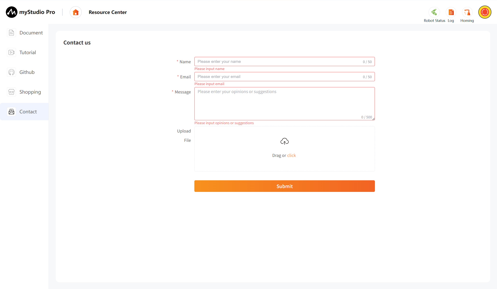

#### Upload

Click this button and the draggable area to upload files. You can upload a maximum of 3 files, and each file must not exceed 1M in size.

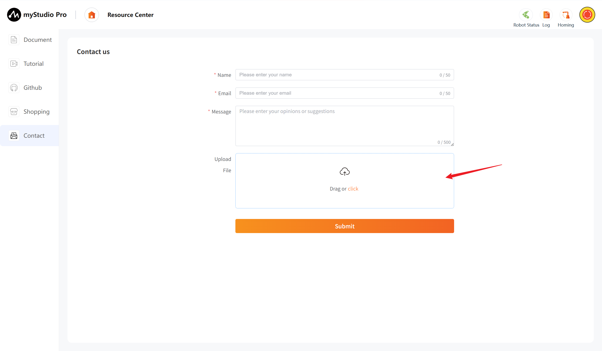

> Note: Only .log, .json, video, and image files are supported for uploading.

#### Submit

Click the `Submit` button to submit all information. This step may take a long time, please be patient.

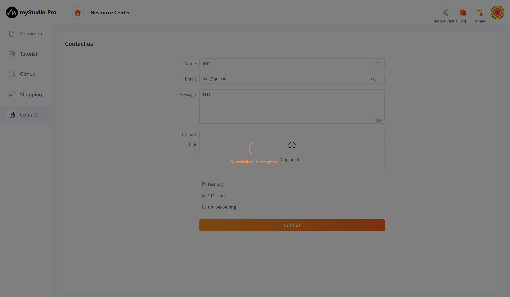

After the information is submitted successfully, the page will display a corresponding prompt message.

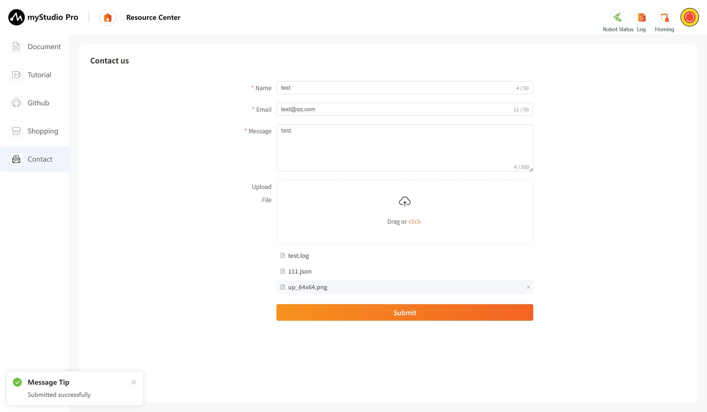

> Note: The submitted information has been sent to the official email of the elephant organization. We may contact you via email or phone in the future.

---

[← Previous Chapter](./5.3.4-debugPlane.md) | [Next Chapter →](./5.3.6-scene.md)
