# myStudio Pro Introduction

**myStudio Pro** is a robot programming and control software integrating multiple functions, providing users with one-stop solutions such as visual programming interaction, quick movement control, drag teaching, robot status query and configuration. The software mainly integrates four functional modules: `Block programming`, `Debug panel`, `Resource Center`, `Scene apps`, and `Configuration`, covering the entire process requirements from programming to debugging, from learning to deployment.

**Block Programming** 

The module draws inspiration from the Scratch programming language developed by the Massachusetts Institute of Technology. It uses a graphical method of assembling building blocks to facilitate programming. Users can gradually construct complete code logic by intuitively dragging and combining the modules. The entire process is simple to operate and easy to understand, making it particularly suitable for beginners in programming and educational settings.

From the perspective of user experience, **Block Programming** is a low-barrier, visual code generation tool that makes programming as easy and intuitive as building with blocks. From the developer's viewpoint, this module is essentially a text editor that can dynamically generate structured code. The code generated through interactive dragging by users will eventually be transformed into an instruction sequence that can be executed on the robot. This design and interaction method not only reduces the difficulty of use but also ensures the professionalism and executability of the program.

**Debug panel**

This module can control the angles and coordinates of each joint through point motion. It allows setting the change in joint angles and coordinate movement distance for each point motion, and can display the posture of the robotic arm in real time. It also enables manual control of the signal switch status of the corresponding IO ports.

**Resource Center**

This module provides users with a convenient resource navigation function, presenting centralized access points to commonly used external links, such as technical documents and official contact information. Users do not need to search manually and can quickly access relevant support materials, thereby improving the efficiency of use and maintenance.

**Scene apps**

This module provides users with the two core functions of the robot, namely writing and drawing, as well as laser engraving. Users can perform graphic editing and preview operations, and convert them into actual control instructions to realize the writing, drawing and laser engraving functions of the robot.

**Configuration**

The module covers the basic configuration options for software and robot systems. Users can perform operations such as language switching, setting joint motion limits, system update detection, and software driver updates here.

## myStudio Pro Interface Display and Basic Function Usage

Log in to the software. The main interface is shown in the following picture.

Interface function introduction: The interface is divided into three areas: 

1. Top safety monitoring area
2. Function realization
3. Information display

> Note: After log in, the software will automatically establish a communication connection with the machine.

## Return to Zero

This button's function is: to control all the joints of the robot to return to the zero position.

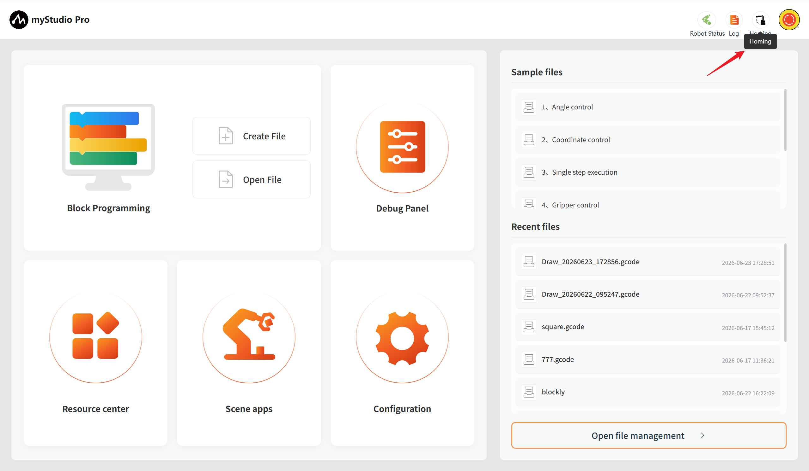

**Note:** The function of this button is activated only when the communication with the robot has been successfully established. After long-pressing and clicking this button with the left mouse button, the robot will start to execute the zero return command. The robotic arm will slowly move to the zero position. Once the long press is released, the zero return command will stop being executed. 

After the zero return is completed, a pop-up window will appear to indicate that the zero return is completed.

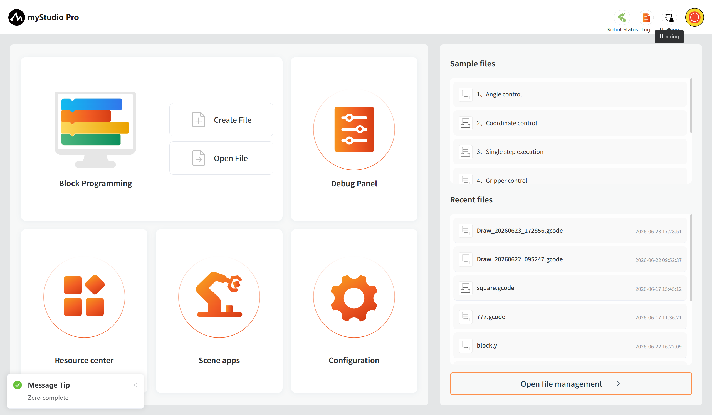

## Emergency Stop

This button's function is: to stop the current movement of the robot.

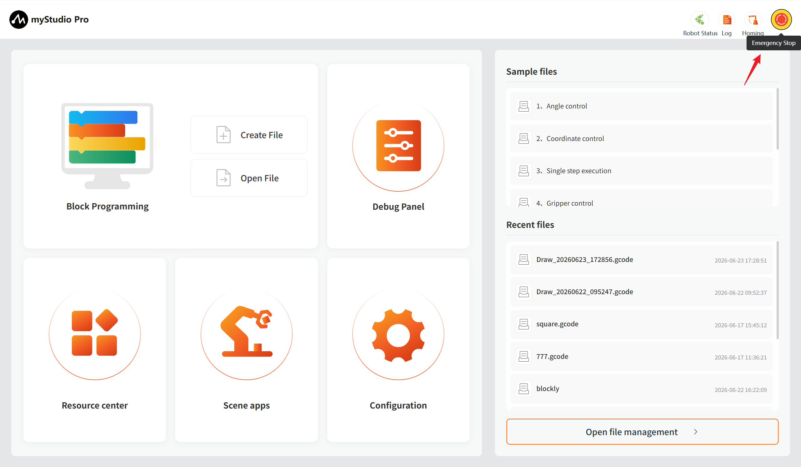

## Function Implementation

Here you can select the functions you wish to use. The functions include the following:

> 1. [Block Programming](./5.3.3-blockly.md)
> 2. [Debug panel](./5.3.4-debugPlane.md)
> 3. [Resource Center](./5.3.5-resourceCenter.md)
> 4. [Scene apps](./5.3.6-scene.md)
> 5. [Configuration](./5.3.7-setting.md)

## Block Programming

`Block Programming` is a fully visual, modular programming interface that belongs to a graphical programming language. It is suitable for beginners to familiarize themselves with programming. Users develop applications by dragging and dropping puzzle pieces, which enables them to create simple and complex functions. It supports functions such as saving, loading, single-step debugging execution, and executing a specified single block.

#### Create File    

This is a clickable button. When you click it with the left mouse button, it will lead you to the building [block programming](./5.3.3-blockly.md) interface.

#### Open File

This is the same function as the clickable button at the "Recent Files" section, which leads to `the file management` button.

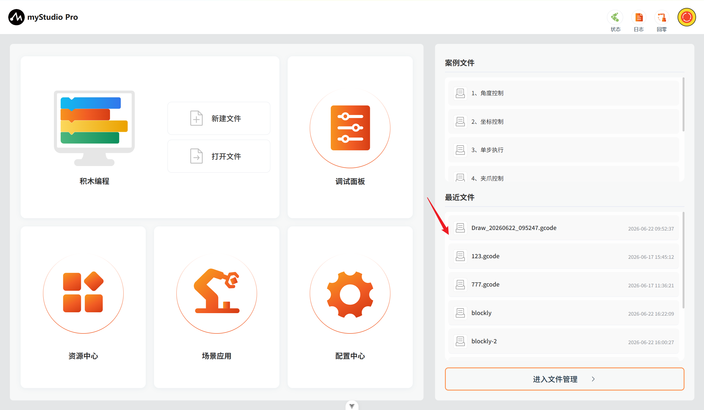

After clicking, it will automatically redirect to the block programming and open the file management list. You can perform related operations on JSON files based on the file list.

**Quickly load the previously saved blockly/gcode files**

When you have used the block programming and have saved a blockly file, as shown in the figure below, the name of the saved file and the save time will be displayed. The maximum number of displayed files is 20. If there are more than 20 files, only the 20 most recently saved files will be shown. Clicking the left mouse button will open the block programming and automatically load the selected blockly file.

## Common Tools 

#### [Debug Panel](./5.3.4-debugPlane.md) 

Function: Provides quick control of robot I/O as well as quick control of joint angles and coordinates.

#### [Resource Center](./5.3.5-resourceCenter.md) 

Function: Provide robot product user manual, official videos, official GitHub, official online store, and feedback function. 

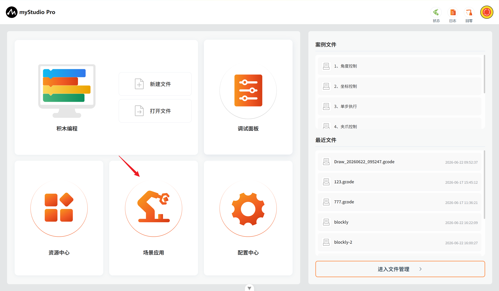

#### [Scene Apps](./5.3.6-scene.md) 

Function: Integrates the following core functions: writing, drawing, and laser engraving. 

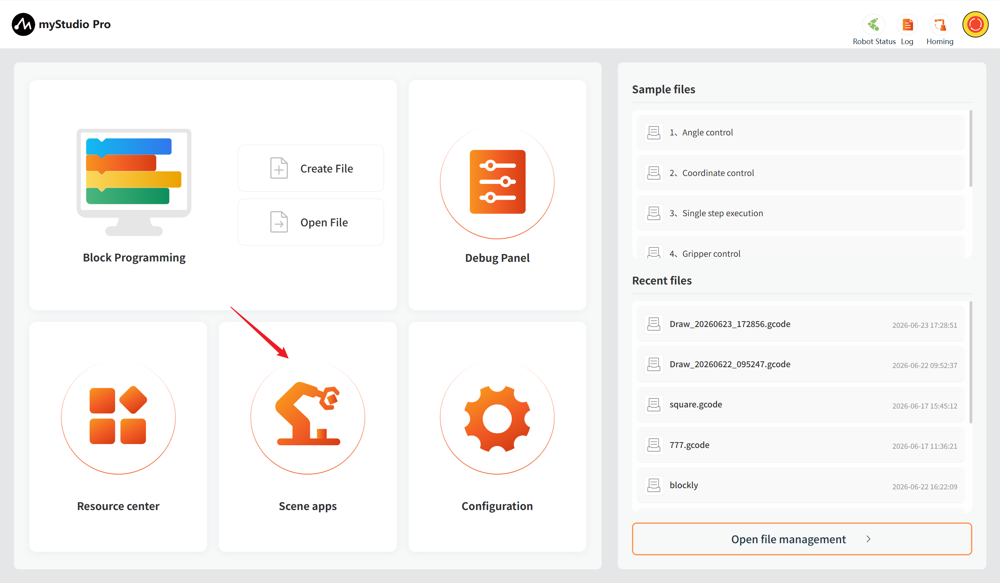

#### [Configuration Center](./5.3.7-setting.md) 

Function: Integrates the following core functions: real-time monitoring of robot status and information, one-click check for updated application versions, personalized settings (language/motion parameters), pin configuration, etc., helping you efficiently manage the robot system. 

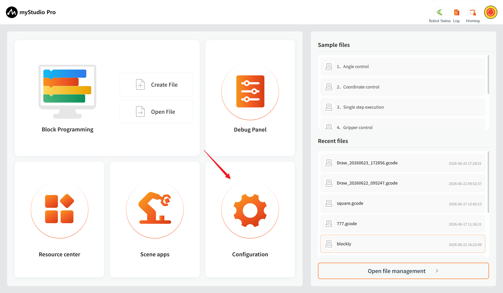

## Information Display

The underlying part of the application, including the alert notifications and the current operating status of the robot.

## Alarm Notification

Function: Displays robot error messages, and left-clicking opens the error log window.

Left-click to open the error log window.

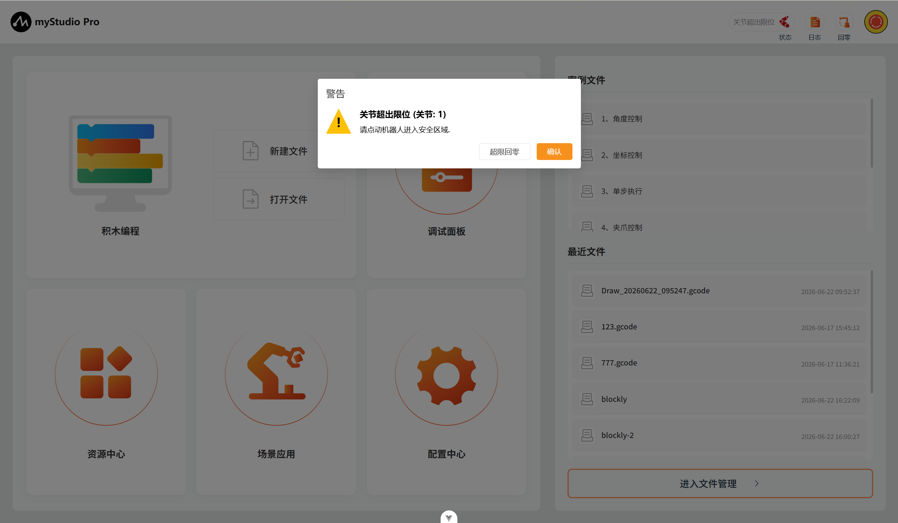

If the robot encounters an error during operation, the application will capture the exception and display it in the error log interface. The meanings in the error log table are as follows:

- number: Error log number

- time: Time when the error occurred

- type: Type of error encountered

- description: Error description

After the application captures an error, it will first display a pop-up prompt and provide a solution. If you do not want to handle the error, you can ignore it. When you disconnect and reconnect the device or enter the error log interface, clicking the "Clear" button will re-enable the pop-up prompt and save it to the error log table.

For example, capturing a joint 1 over-limit error:

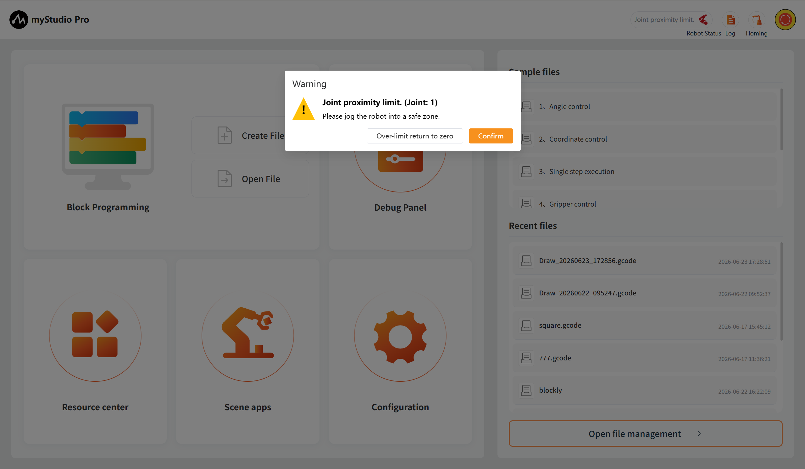

1.When an abnormality occurs with the robotic arm, a specific warning pop-up window will be displayed. This pop-up window consists of four main parts: 1. The detailed content of the current abnormal error; 2. The solution method for the current abnormal error. If the current abnormality can be resolved or recovered, it will be displayed; otherwise, no content will be shown; 3. The 'repair button' for the current abnormal error that can be cleared or recovered. Clicking this button will automatically perform the repair process for the abnormality; otherwise, no button will be displayed; 4. The 'confirm button' for the current abnormality. If you do not want to handle the error, you can click this button to ignore the current abnormality.

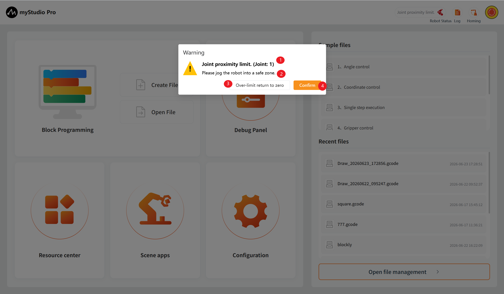

2.The fixed exceptions will be displayed in the historical alarm table of the exception list, while the current existing exceptions will be shown in the current alarm table. At the same time, the duration of the exception occurrence will be automatically recorded.

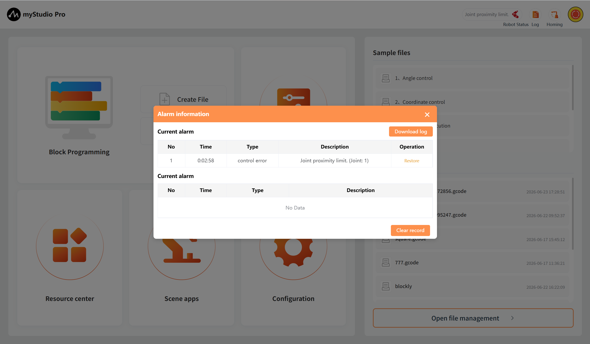

3.If the anomaly is repairable, you can click the "Restore" button (1) to perform the anomaly repair operation. Clicking the "Clear record" button (2) will clear the historical alarm records that have been resolved.

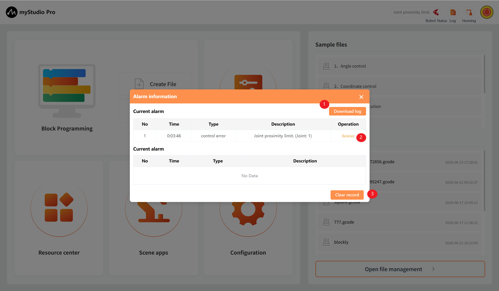

## Robot status

Function: Display the current operating status of the robot

| Color | meaning                                                     |
| ---- | ------------------------------------------------------------ |
| | unconnection |
|     | conection |
|     | running |
|     | error  |

---
[← Previous Chapter](../5.2-minirobot/5.2.9-Q&A.md) | [Next Chapter →](./5.3.1-firstUse.md)
