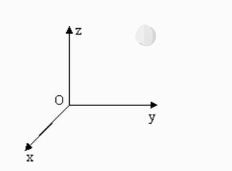

## Preparation before use

Before using the Python API, please make sure that the following hardware and environment are ready:

- **Hardware Equipment** 
  - ultraArm P1 robotic arm 
  - USB-Type-C serial cable (used to connect the robot arm and computer) 
  - Power adapter

- **Software and Environment** 
  - Python 3.6 and above installed 
  - `pymycobot` library installed (installed via `pip install pymycobot` terminal command) 
  - Make sure ultraArm P1 is properly powered on and in standby mode

---

## Coordinate Control

It is mainly used to realize intelligent route planning to let the robot arm move from one position to another specified position. It is divided into `[x, y, z, rx]`, where `[x, y, z]` represents the position of the robot head in space (the coordinate system is the [rectangular coordinate system](https://zhidao.baidu.com/question/2125035227927850747.html)), and `[rx]` represents the posture of the robot head at this point (the coordinate system is the Euler coordinate system). The implementation of the algorithm and the representation of Euler coordinates require certain academic knowledge. We will not explain it too much here. As long as we understand the rectangular coordinate system, we can use this function well.

> **Note:** When setting coordinates, different series of robot arm joint structures are different. For the same set of coordinates, different series of robot arms will show different postures.
>
> 

**Example Use**

```python
import time
from pymycobot import UltraArmP1

ua = UltraArmP1('COM3', 1000000) # Serial port connection communication

print(ua.get_coords_info()) # Read coordinate attitude information

ua.set_angles([-22.98, 38.49, 142.29, 1.23], 50) # Send angular movement to a certain attitude for coordinate control, speed is 50

time.sleep(3)

ua.set_coord('X', 325, 50) # Send single coordinate control, speed is 50, so that the X-axis moves to a position of 200mm

time.sleep(2)

ua.set_coords([325.86, 100, -50.16, -21.83], 50) # Send multi-axis control, speed 50
time.sleep(3)
```

---

[← Previous Chapter](./3_angle.md) | [Next Chapter→](./5_pump.md)