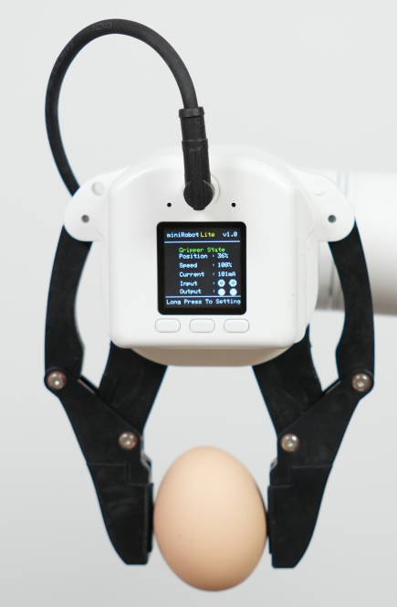

# myGripper F100 Force-controlled Gripper

## 1. Product Image

## 2. Specifications

| **Name** | **myGripper F100 force-controlled gripper** |
| :----------- | :-------------------------------------- |
| Material | PC, PBT |
| Dimensions | 156 x 106 x 61 mm |
| Process technology | Injection molding |
| Gripping range | 0 - 100 mm (default fingertip) |
| Repeatability | 0.5 mm |
| Service life | 300,000 openings and closings |
| Drive mode | Electric drive |
| Transmission mode | Gear + connecting rod |
| Weight | 340 g |
| Rated load | 500 g |
| Working voltage | 24V |
| Fixing method | Screw fixing |
| Environment requirements | Normal temperature and pressure |
| Control interface | RS485 / IO control / button control |
| Applicable equipment | ER ultraArm P1, ER myCobot 320 series, ER Mercury series, ER myCobot Pro 600, ER myCobot Pro 630, and other general robots |

## 3. Working Principle

Driven by the motor, the finger surface of the manipulator makes linear reciprocating motion to achieve opening or closing. By setting the clamping torque, the impact on the workpiece is minimized, the positioning point is controllable, and the clamping is controllable.

## 4. Usage Scenario
